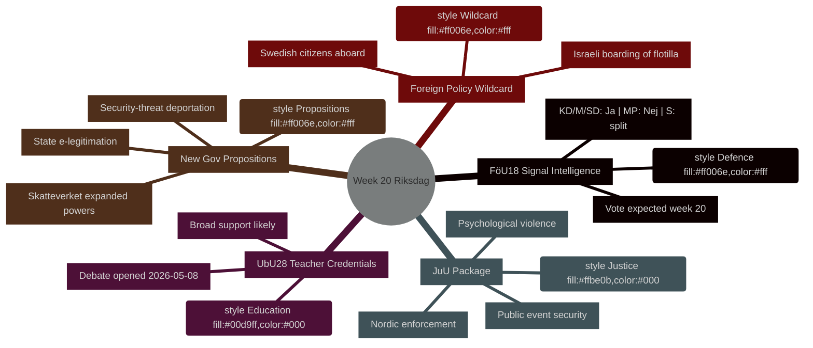

# Ugens program: Riksdag uge 20 (11.–17. maj 2026)

**Forfatter**: James Pether Sörling | **Kørsels-ID**: 25544675528 | **Klassificering**: PUBLIC | **Konfidensgrad**: HIGH [B2]

## BLUF

Sveriges Riksdag indleder uge 20 (11.–17. maj 2026) med en stram lovgivningskalender der dækker modernisering af efterretningslovgivningen på forsvarsområdet, uddannelsesreform, retslovgivning og EU-tilpasset finansiel regulering — alt på vej mod afstemning, mens regeringen samtidig fremsætter tre politisk ladede propositioner (statslig e-legitimation, udvidede overvågningsbeføjelser til Skatteverket og strammet udvisning af sikkerhedstrusler). Kombinationen signalerer et accelererende lovgivningstempo, i takt med at Sverige nærmer sig valget i september 2026. Det enkeltpolitisk mest betydningsfulde punkt er **HD01FöU18** (reform af signalovervågningsloven), der tester koalitionens sammenhæng om afvejningen mellem borgerrettigheder og sikkerhedshensyn. **Ugens joker er den israelske boarding af Gaza-solidaritetsskibet Global Sumud Flotilla med svenske statsborgere om bord** (HD11803), som tvinger udenrigsminister Maria Malmer Stenergard (M) til en offentlig stillingtagen i Gazakonflikten på et kritisk tidspunkt forud for valget.

## Beslutninger dette notat understøtter

1. **Planlægning af lovgivningskalenderen** — Hvilke af de ni betänkanden der når debat/afstemning i uge 20, indebærer den højeste politiske risiko for koalitionsbrud eller modtræk fra oppositionen?
2. **Opdatering af politiksporing** — Har regeringens propositionsburst den 7. maj (HD03261, HD03250, HD03267) ændret den sikkerhedsstatlige reformkurs etableret i marts–april 2026?
3. **Kalibrering af valgscenarier** — Repræsenterer det samtidige pres på lærerkompetencer (UbU28), kriminalisering af psykisk vold (JuU39) og signalovervågning (FöU18) en koordineret koalitionspositionering forud for valget?

## 60-sekunders resumé

- **Forsvarsefterretning**: FöU18 udvalgsrapport moderniserer signalovervågningslovgivningen; afstemning ventes i uge 20. Stærk støtte fra KD/M/SD; MP sandsynligvis Nej; S delt [horisont:uge]
- **Uddannelse**: UbU28 (lærerkompetencer i 10-årig grundskole) — debat åbnedes 2026-05-08; bred tværpartistisk støtte ventes, men SD og V kan afvige på integrationsbestemmelser [horisont:uge]
- **Retspakke**: JuU32 (sikkerhed ved offentlige arrangementer) + JuU39 (psykisk vold som lovovertrædelse) + JuU34 (nordisk strafferetshåndhævelse) — alle klar til afstemning; regeringsflertal intakt for alle tre [horisont:uge]
- **Nye propositioner**: HD03267 (udlændinge som sikkerhedstrusler) + HD03261 (Skatteverkets folkeregistreringsbeføjelser) driver overvågningsstatens dagsorden; ingen lagrådssvar endnu — forfatningsmæssig risiko [horisont:uge]
- **EU-nexus**: EU-Rådets møde om uddannelse/ungdom/kultur 11.–12. maj; FAC-udviklingsmøde 18. maj; EU-nämndsbriefing 13. maj [horisont:uge]
- **Udenrigspolitisk joker**: Israels boarding af Gaza-solidaritetsskib med svenske statsborgere tvinger den svenske regering til en offentlig stillingtagen [horisont:uge]
- **Skattelovgivning**: Interpellation HD10480 (S→finansminister) udfordrer begrebet "fast bopæl" — tester Skatteverkets fortolkningskonsistens [horisont:uge]

## Ledende fremtidig udløser

**Mandag den 11. maj**: Hvis FöU18-debatten åbnes i kammaren, hold øje med afvigelsesstemmer fra MP og V — første synlige prøve på, om koalitionens sprækker om borgerrettigheder holder frem mod valget i september.

## IMF økonomisk kontekst

> ℹ️ **IMF's hjælpetransport forringet** — WEO/FM Datamapper tilgængelig; SDMX-slutpunkt returnerer 404. Fortsætter med kun WEO/FM-data.

Sverige: Real BNP-vækst 2026P: ~2,1 % (WEO apr-2026); Finanspolitisk saldo: ca. +0,2 % af BNP (FM apr-2026); Offentlig gæld: ~39 % af BNP (WEO apr-2026). Sveriges finanspolitiske råderum giver kapacitet til den digitale infrastrukturinvestering, som HD03250 (statslig e-legitimation) forudsætter, uden risiko for gældsmål.



## Økonomisk proveniensdata (IMF forringet tilstand)

```economicProvenance
{
  "provider": "imf",
  "dataflow": "WEO|FM",
  "vintage": "WEO Apr-2026, FM Apr-2026",
  "status": "degraded",
  "retrieved_at": "2026-05-08",
  "indicators_used": ["NGDP_RPCH", "GGXWDG_NGDP", "GGXCNL_NGDP"],
  "country": "SWE",
  "notes": "IFS SDMX endpoint returning 404. Monthly CPI and labour market indicators unavailable."
}
```

## Versionskontrol

- **Pass 1**: 2026-05-08 — Initialt notat
- **Pass 2**: 2026-05-08 — Tilføjede økonomisk proveniens; bekræftede WEP-sprogpræcision

<!-- source-sha: aaf8ef6d6b92d0946a98b667edd70ae3196c5278 -->
