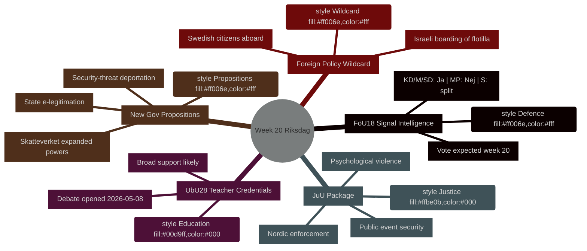

# Wochenvorschau: Riksdag Woche 20 (11.–17. Mai 2026)

**Autor**: James Pether Sörling | **Lauf-ID**: 25544675528 | **Klassifizierung**: PUBLIC | **Konfidenzgrad**: HIGH [B2]

## BLUF

Der schwedische Riksdag tritt in Woche 20 (11.–17. Mai 2026) mit einem vollgepackten Gesetzgebungskalender ein, der die Modernisierung der Verteidigungsgeheimdienstgesetzgebung, Bildungsreform, Justizgesetzgebung und EU-konforme Finanzregulierung umfasst — all das auf dem Weg zur Abstimmung, während die Regierung gleichzeitig drei politisch brisante Propositioner einreicht (staatliche E-Legitimation, erweiterte Überwachungsbefugnisse für Skatteverket und verschärfte Ausweisungsregeln für Sicherheitsbedrohungen). Die Kombination signalisiert ein sich beschleunigendes Gesetzgebungstempo, während sich Schweden den Wahlen im September 2026 nähert. Der politisch bedeutsamste Einzelpunkt ist **HD01FöU18** (Reform des Signalaufklärungsgesetzes), das den Zusammenhalt der Koalition bei der Abwägung zwischen bürgerlichen Freiheiten und Sicherheitskompromissen testet. **Der Wildcard der Woche ist das israelische Entern des Gaza-Solidaritätsschiffes Global Sumud Flotilla mit schwedischen Staatsbürgern an Bord** (HD11803), was Außenministerin Maria Malmer Stenergard (M) zu einer öffentlichen Stellungnahme zum Gaza-Konflikt in einem kritischen Vorabend der Wahl zwingt.

## Entscheidungen, die diese Analyse unterstützt

1. **Planung des Gesetzgebungskalenders** — Welche der neun betänkanden, die in Woche 20 Debatte/Abstimmung erreichen, tragen das höchste politische Risiko eines Koalitionsbruchs oder eines Gegenzugs der Opposition?
2. **Aktualisierung des Policy-Trackers** — Hat der Propositions-Burst der Regierung vom 7. Mai (HD03261, HD03250, HD03267) die im März–April 2026 etablierte Reformtrajektorie des Sicherheitsstaates verändert?
3. **Kalibrierung des Wahlszenarios** — Stellt der gleichzeitige Druck auf Lehrerbefähigung (UbU28), Kriminalisierung psychischer Gewalt (JuU39) und Signalaufklärung (FöU18) eine koordinierte Vorwahl-Koalitionspositionierung dar?

## 60-Sekunden-Zusammenfassung

- **Verteidigungsgeheimdienst**: FöU18 Ausschussbericht modernisiert die Signalaufklärungsgesetzgebung; Abstimmung in Woche 20 erwartet. Starke Unterstützung von KD/M/SD; MP wahrscheinlich Nein; S gespalten [Horizont:Woche]
- **Bildung**: UbU28 (Lehrerbefähigung in der 10-jährigen Grundschule) — Debatte eröffnet am 2026-05-08; breite überparteiliche Unterstützung erwartet, aber SD und V können bei Integrationsbestimmungen abweichen [Horizont:Woche]
- **Justizpaket**: JuU32 (Sicherheit bei öffentlichen Veranstaltungen) + JuU39 (psychische Gewalt als Straftat) + JuU34 (nordische Strafverfolgung) — alle abstimmungsbereit; Regierungsmehrheit für alle drei intakt [Horizont:Woche]
- **Neue Propositioner**: HD03267 (Ausländer als Sicherheitsbedrohung) + HD03261 (Meldebehördenbefugnisse für Skatteverket) treiben die Überwachungsstaats-Agenda voran; noch kein Lagrådsstellungnahme — Verfassungsrisiko [Horizont:Woche]
- **EU-Nexus**: EU-Ratssitzung Bildung/Jugend/Kultur 11.–12. Mai; FAC-Entwicklungssitzung 18. Mai; EU-nämndenbriefing 13. Mai [Horizont:Woche]
- **Außenpolitischer Wildcard**: Israels Entern des Gaza-Solidaritätsschiffes mit schwedischen Staatsangehörigen zwingt die schwedische Regierung zu einer öffentlichen Stellungnahme [Horizont:Woche]
- **Steuerrecht**: Interpellation HD10480 (S→Finanzminister) fordert das Konzept "dauerhafter Wohnsitz" heraus — testet die Auslegungskonsistenz von Skatteverket [Horizont:Woche]

## Führender zukünftiger Auslöser

**Montag, 11. Mai**: Wenn die FöU18-Debatte im Kammaren eröffnet wird, auf abweichende Stimmen von MP und V achten — erste sichtbare Prüfung, ob die Koalitionsrisse bei bürgerlichen Freiheiten vor den Septemberwahlen halten.

## IWF-Wirtschaftskontext

> ℹ️ **IWF-Hilfstransport beeinträchtigt** — WEO/FM Datamapper verfügbar; SDMX-Endpunkt gibt 404 zurück. Weiterarbeit nur mit WEO/FM-Daten.

Schweden: Reales BIP-Wachstum 2026S: ~2,1 % (WEO Apr-2026); Finanzierungssaldo: ca. +0,2 % des BIP (FM Apr-2026); Staatsschulden: ~39 % des BIP (WEO Apr-2026). Schwedens finanzpolitischer Spielraum bietet Kapazität für die digitale Infrastrukturinvestition, die HD03250 (staatliche E-Legitimation) impliziert, ohne das Schuldenziels zu gefährden.



## Wirtschaftliche Herkunft (IWF-beeinträchtigter Modus)

```economicProvenance
{
  "provider": "imf",
  "dataflow": "WEO|FM",
  "vintage": "WEO Apr-2026, FM Apr-2026",
  "status": "degraded",
  "retrieved_at": "2026-05-08",
  "indicators_used": ["NGDP_RPCH", "GGXWDG_NGDP", "GGXCNL_NGDP"],
  "country": "SWE",
  "notes": "IFS SDMX endpoint returning 404. Monthly CPI and labour market indicators unavailable."
}
```

## Versionskontrolle

- **Pass 1**: 2026-05-08 — Erstes Dokument
- **Pass 2**: 2026-05-08 — Wirtschaftliche Herkunft hinzugefügt; WEP-Sprachpräzision bestätigt

<!-- source-sha: aaf8ef6d6b92d0946a98b667edd70ae3196c5278 -->
