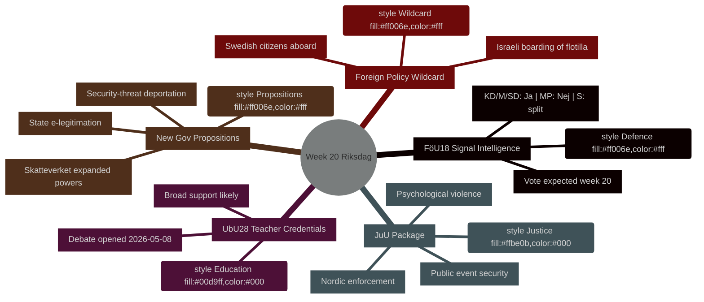

# Semana siguiente: Riksdag semana 20 (11–17 de mayo de 2026)

**Autor**: James Pether Sörling | **ID de ejecución**: 25544675528 | **Clasificación**: PUBLIC | **Nivel de confianza**: HIGH [B2]

## BLUF

El Riksdag sueco entra en la semana 20 (11–17 de mayo de 2026) con un calendario legislativo repleto que abarca la modernización de la legislación sobre inteligencia de defensa, reforma educativa, legislación judicial y regulación financiera alineada con la UE — todo avanzando hacia votaciones mientras el gobierno presenta simultáneamente tres proposiciones políticamente cargadas (e-legitimación estatal, ampliación de poderes de vigilancia de Skatteverket y endurecimiento de las normas de expulsión de amenazas a la seguridad). La combinación señala un ritmo legislativo en aceleración a medida que Suecia se acerca a las elecciones de septiembre de 2026. El punto político más significativo es **HD01FöU18** (reforma de la ley de inteligencia de señales), que pone a prueba la cohesión de la coalición en el equilibrio entre libertades civiles y compromisos de seguridad. **El comodín de la semana es el abordaje israelí del buque de solidaridad con Gaza Global Sumud Flotilla con ciudadanos suecos a bordo** (HD11803), que obliga a la ministra de Asuntos Exteriores Maria Malmer Stenergard (M) a tomar posición pública sobre el conflicto de Gaza en un momento crítico antes de las elecciones.

## Decisiones que apoya este informe

1. **Planificación del calendario legislativo** — ¿Cuáles de los nueve betänkanden que alcanzan debate/votación en la semana 20 presentan el mayor riesgo político de fractura de la coalición o contramaniobra de la oposición?
2. **Actualización del seguimiento de políticas** — ¿Ha cambiado el aluvión de proposiciones del gobierno del 7 de mayo (HD03261, HD03250, HD03267) la trayectoria de reforma del Estado de seguridad establecida en marzo–abril de 2026?
3. **Calibración del escenario electoral** — ¿Representa la presión simultánea sobre las cualificaciones docentes (UbU28), la criminalización de la violencia psicológica (JuU39) y la inteligencia de señales (FöU18) un posicionamiento coordinado de la coalición antes de las elecciones?

## Resumen en 60 segundos

- **Inteligencia de defensa**: el informe del comité FöU18 moderniza la legislación sobre inteligencia de señales; votación esperada en la semana 20. Fuerte apoyo de KD/M/SD; MP probablemente No; S dividido [horizonte:semana]
- **Educación**: UbU28 (cualificaciones docentes en escuela primaria de 10 años) — debate abierto el 2026-05-08; amplio apoyo transpartidista esperado pero SD y V pueden divergir en disposiciones de integración [horizonte:semana]
- **Paquete judicial**: JuU32 (seguridad en eventos públicos) + JuU39 (violencia psicológica como delito) + JuU34 (cumplimiento penal nórdico) — todos listos para votación; mayoría gubernamental intacta para los tres [horizonte:semana]
- **Nuevas proposiciones**: HD03267 (extranjeros como amenaza a la seguridad) + HD03261 (poderes de registro de población de Skatteverket) impulsan la agenda del Estado vigilante; sin opinión del Lagrådet aún — riesgo constitucional [horizonte:semana]
- **Nexo UE**: reunión del Consejo de la UE educación/juventud/cultura 11–12 mayo; reunión FAC desarrollo 18 mayo; briefing EU-nämnden 13 mayo [horizonte:semana]
- **Comodín de política exterior**: el abordaje israelí de un barco de solidaridad con Gaza con ciudadanos suecos obliga al gobierno sueco a pronunciarse públicamente [horizonte:semana]
- **Derecho fiscal**: interpelación HD10480 (S→ministro de finanzas) cuestiona el concepto de «residencia permanente» — pone a prueba la coherencia interpretativa de Skatteverket [horizonte:semana]

## Principal detonante prospectivo

**Lunes 11 de mayo**: si el debate sobre FöU18 se abre en el kammaren, hay que vigilar los votos disidentes de MP y V — primera prueba visible de si las fracturas de la coalición sobre libertades civiles se mantienen antes de las elecciones de septiembre.

## Contexto económico del FMI

> ℹ️ **Transporte auxiliar del FMI degradado** — WEO/FM Datamapper disponible; punto final SDMX devolviendo 404. Continuando solo con datos WEO/FM.

Suecia: Crecimiento del PIB real 2026P: ~2,1 % (WEO abr-2026); Saldo fiscal: aprox. +0,2 % del PIB (FM abr-2026); Deuda pública: ~39 % del PIB (WEO abr-2026). El margen fiscal de Suecia proporciona capacidad para la inversión en infraestructura digital implícita en HD03250 (e-legitimación estatal) sin riesgo para los objetivos de deuda.



## Procedencia económica (FMI en modo degradado)

```economicProvenance
{
  "provider": "imf",
  "dataflow": "WEO|FM",
  "vintage": "WEO Apr-2026, FM Apr-2026",
  "status": "degraded",
  "retrieved_at": "2026-05-08",
  "indicators_used": ["NGDP_RPCH", "GGXWDG_NGDP", "GGXCNL_NGDP"],
  "country": "SWE",
  "notes": "IFS SDMX endpoint returning 404. Monthly CPI and labour market indicators unavailable."
}
```

## Control de versiones

- **Pass 1**: 2026-05-08 — Documento inicial
- **Pass 2**: 2026-05-08 — Procedencia económica añadida; precisión del lenguaje WEP confirmada

<!-- source-sha: aaf8ef6d6b92d0946a98b667edd70ae3196c5278 -->
