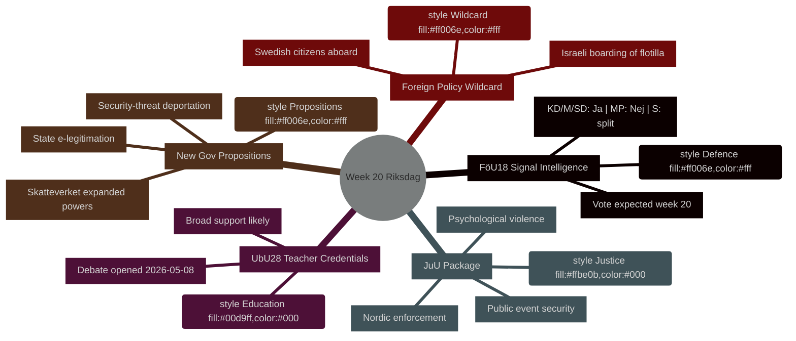

# Viikon ohjelma: Riksdag viikko 20 (11.–17. toukokuuta 2026)

**Kirjoittaja**: James Pether Sörling | **Ajo-ID**: 25544675528 | **Luokittelu**: PUBLIC | **Luotettavuus**: HIGH [B2]

## BLUF

Ruotsin Riksdag aloittaa viikon 20 (11.–17. toukokuuta 2026) täyteen ahdetulla lainsäädäntökalenterilla, joka kattaa puolustustiedustelulainsäädännön uudistamisen, koulutusreformin, oikeuslainsäädännön ja EU:n mukaisen rahoitussääntelyn — kaikki etenemässä äänestykseen samalla kun hallitus jättää samanaikaisesti kolme poliittisesti latautunutta esitystä (valtion sähköinen henkilöllisyystodistus, Skatteverketin laajennetut valvontavaltuudet ja tiukennetut turvallisuusuhkien karkottamissäännöt). Yhdistelmä viestii kiihtyvästä lainsäädäntötahdista Ruotsin lähestyessä syyskuun 2026 vaaleja. Poliittisesti merkittävin yksittäinen asia on **HD01FöU18** (signalitiedustelulainsäädännön uudistus), joka testaa koalition yhtenäisyyttä kansalaisvapauksien ja turvallisuuskompromissien välillä. **Viikon villitkortti on Israelin hyökkäys Global Sumud Flotilla -alukseen, jossa oli ruotsalaisia kansalaisia** (HD11803), mikä pakottaa ulkoministeri Maria Malmer Stenergard (M) ottamaan julkisen kannan Gazan konfliktiin kriittisellä hetkellä ennen vaaleja.

## Päätökset, joita tämä tiedote tukee

1. **Lainsäädäntökalenterin suunnittelu** — Mitkä yhdeksästä viikolla 20 debattiin/äänestykseen etenevistä betänkandeneista kantavat suurimman poliittisen riskin koalition hajoamiselle tai opposition vastatoimille?
2. **Politiikkaseurannan päivitys** — Muuttiko hallituksen 7. toukokuuta tekemä esityspaketti (HD03261, HD03250, HD03267) maalis–huhtikuussa 2026 vakiintunutta turvallisuusvaltion reformisuuntaa?
3. **Vaaliskenaarion kalibrointi** — Edustaako samanaikainen paine opettajapätevyyteen (UbU28), psyykkisen väkivallan kriminalisointiin (JuU39) ja signalitiedusteluun (FöU18) koordinoitua koalition vaalipositionointia?

## 60 sekunnin yhteenveto

- **Puolustustiedustelu**: FöU18 valiokunnan mietintö uudistaa signalitiedustelulainsäädäntöä; äänestys odotetaan viikolla 20. Vahva KD/M/SD-tuki; MP todennäköisesti Ei; S jakautunut [horisontti:viikko]
- **Koulutus**: UbU28 (opettajapätevyys 10-vuotisessa peruskoulussa) — debatti avattiin 2026-05-08; laaja puolueiden välinen tuki odotettavissa, mutta SD ja V saattavat poiketa integrointisäännöissä [horisontti:viikko]
- **Oikeuspaketti**: JuU32 (yleisötapahtumien turvallisuus) + JuU39 (psyykkinen väkivalta rikoksena) + JuU34 (pohjoismainen rikosten täytäntöönpano) — kaikki valmiina äänestykseen; hallitusenemmistö ehjänä kaikissa kolmessa [horisontti:viikko]
- **Uudet esitykset**: HD03267 (ulkomaalaiset turvallisuusuhkina) + HD03261 (Skatteverketin väestörekisteriintoimivaltuudet) ajavat valvontavaltion agendaa; ei vielä lagrådsin vastausta — perustuslaillinen riski [horisontti:viikko]
- **EU-yhteys**: EU:n neuvoston koulutus/nuoriso/kulttuuri-kokous 11.–12. toukokuuta; FAC-kehityskokous 18. toukokuuta; EU-nämndenbriefing 13. toukokuuta [horisontti:viikko]
- **Ulkopoliittinen villikortti**: Israelin hyökkäys Gazan solidaarisuuslaivaan, jossa ruotsalaisia kansalaisia, pakottaa Ruotsin hallituksen julkiseen kannanottoon [horisontti:viikko]
- **Verolainsäädäntö**: Interpellaatio HD10480 (S→valtiovarainministeri) haastaa "vakituinen asuinpaikka" -käsitteen — testaa Skatteverketin tulkintajohdonmukaisuutta [horisontti:viikko]

## Johtava tuleva laukaisija

**Maanantai 11. toukokuuta**: Jos FöU18-debatti avautuu kammarissa, tarkkaile MP:n ja V:n poikkeavia ääniä — ensimmäinen näkyvä testi siitä, pitävätkö koalition kansalaisvapauksiin liittyvät hajoamisriskit ennen syyskuun vaaleja.

## IMF:n taloudellinen konteksti

> ℹ️ **IMF:n apuyhteysliikenne heikentynyt** — WEO/FM Datamapper saatavilla; SDMX-päätepiste palauttaa 404. Jatketaan pelkällä WEO/FM-aineistolla.

Ruotsi: Reaalinen BKT-kasvu 2026E: ~2,1 % (WEO huhti-2026); Rahoitusjäämä: noin +0,2 % BKT:sta (FM huhti-2026); Julkinen velka: ~39 % BKT:sta (WEO huhti-2026). Ruotsin finanssipoliittinen liikkumavara antaa kapasiteettia HD03250:n (valtion sähköinen henkilöllisyystodistus) tarkoittamiin digitaalisiin infrastruktuuri-investointeihin ilman velkatason riskiä.



## Taloudellinen provenienssi (IMF heikentynyt tila)

```economicProvenance
{
  "provider": "imf",
  "dataflow": "WEO|FM",
  "vintage": "WEO Apr-2026, FM Apr-2026",
  "status": "degraded",
  "retrieved_at": "2026-05-08",
  "indicators_used": ["NGDP_RPCH", "GGXWDG_NGDP", "GGXCNL_NGDP"],
  "country": "SWE",
  "notes": "IFS SDMX endpoint returning 404. Monthly CPI and labour market indicators unavailable."
}
```

## Versiohistoria

- **Pass 1**: 2026-05-08 — Alkuperäinen tiedote
- **Pass 2**: 2026-05-08 — Lisättiin taloudellinen provenienssi; vahvistettiin WEP-kielen tarkkuus

<!-- source-sha: aaf8ef6d6b92d0946a98b667edd70ae3196c5278 -->
