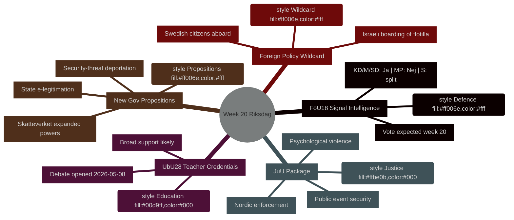

# Semaine à venir : Riksdag semaine 20 (11–17 mai 2026)

**Auteur** : James Pether Sörling | **ID de traitement** : 25544675528 | **Classification** : PUBLIC | **Niveau de confiance** : HIGH [B2]

## BLUF

Le Riksdag suédois entame la semaine 20 (11–17 mai 2026) avec un calendrier législatif chargé couvrant la modernisation du renseignement défense, la réforme éducative, la législation judiciaire et la réglementation financière alignée sur l'UE — le tout progressant vers des votes tandis que le gouvernement soumet simultanément trois propositions politiquement sensibles (e-légitimation d'État, extension des pouvoirs de surveillance du Skatteverket et durcissement des règles d'expulsion des menaces sécuritaires). Cette combinaison signale une accélération du rythme législatif à l'approche des élections de septembre 2026. Le point politiquement le plus significatif est **HD01FöU18** (réforme de la loi sur le renseignement de signal), qui teste la cohésion de la coalition sur l'arbitrage entre libertés civiles et impératifs sécuritaires. **Le joker de la semaine est l'abordage israélien du navire de solidarité avec Gaza, le Global Sumud Flotilla, avec des citoyens suédois à bord** (HD11803), qui force la ministre des Affaires étrangères Maria Malmer Stenergard (M) à prendre position publiquement sur le conflit à Gaza à un moment critique avant les élections.

## Décisions que cette note soutient

1. **Planification du calendrier législatif** — Parmi les neuf betänkanden atteignant le débat ou le vote en semaine 20, lesquels présentent le risque politique le plus élevé de fracture de la coalition ou de contre-manœuvre de l'opposition ?
2. **Mise à jour du suivi des politiques** — L'avalanche de propositions du gouvernement le 7 mai (HD03261, HD03250, HD03267) a-t-elle modifié la trajectoire de réforme de l'État sécuritaire établie en mars–avril 2026 ?
3. **Calibrage du scénario électoral** — La pression simultanée sur les qualifications des enseignants (UbU28), la criminalisation des violences psychologiques (JuU39) et le renseignement de signal (FöU18) représente-t-elle un positionnement coordonné de la coalition avant les élections ?

## Résumé en 60 secondes

- **Renseignement défense** : rapport du comité FöU18 modernise la législation sur le renseignement de signal ; vote attendu en semaine 20. Fort soutien de KD/M/SD ; MP probablement Non ; S divisé [horizon:semaine]
- **Éducation** : UbU28 (qualifications des enseignants en école primaire de 10 ans) — débat ouvert le 2026-05-08 ; large soutien transpartisan attendu mais SD et V peuvent diverger sur les dispositions d'intégration [horizon:semaine]
- **Paquet judiciaire** : JuU32 (sécurité lors des événements publics) + JuU39 (violence psychologique comme crime) + JuU34 (exécution pénale nordique) — tous prêts pour le vote ; majorité gouvernementale intacte pour les trois [horizon:semaine]
- **Nouvelles propositions** : HD03267 (étrangers comme menace sécuritaire) + HD03261 (pouvoirs d'enregistrement de population du Skatteverket) font avancer l'agenda de l'État surveillant ; aucun avis du Lagrådet encore — risque constitutionnel [horizon:semaine]
- **Nexus UE** : réunion du Conseil UE éducation/jeunesse/culture 11–12 mai ; réunion FAC développement 18 mai ; briefing EU-nämnden 13 mai [horizon:semaine]
- **Joker en politique étrangère** : l'abordage israélien d'un navire de solidarité avec Gaza avec des ressortissants suédois à bord force le gouvernement suédois à prendre position publiquement [horizon:semaine]
- **Droit fiscal** : interpellation HD10480 (S→ministre des finances) conteste le concept de « résidence permanente » — teste la cohérence d'interprétation du Skatteverket [horizon:semaine]

## Principal déclencheur prospectif

**Lundi 11 mai** : si le débat sur FöU18 s'ouvre au kammaren, surveiller les votes dissidents de MP et V — premier test visible du maintien des fractures de la coalition sur les libertés civiles avant les élections de septembre.

## Contexte économique du FMI

> ℹ️ **Transport auxiliaire FMI dégradé** — WEO/FM Datamapper disponible ; point de terminaison SDMX retournant 404. Poursuite avec les seules données WEO/FM.

Suède : Croissance du PIB réel 2026P : ~2,1 % (WEO avr-2026) ; Solde budgétaire : env. +0,2 % du PIB (FM avr-2026) ; Dette publique : ~39 % du PIB (WEO avr-2026). La marge de manœuvre budgétaire de la Suède offre la capacité d'investissement dans l'infrastructure numérique impliquée par HD03250 (e-légitimation d'État) sans risque pour les objectifs d'endettement.



## Provenance économique (FMI en mode dégradé)

```economicProvenance
{
  "provider": "imf",
  "dataflow": "WEO|FM",
  "vintage": "WEO Apr-2026, FM Apr-2026",
  "status": "degraded",
  "retrieved_at": "2026-05-08",
  "indicators_used": ["NGDP_RPCH", "GGXWDG_NGDP", "GGXCNL_NGDP"],
  "country": "SWE",
  "notes": "IFS SDMX endpoint returning 404. Monthly CPI and labour market indicators unavailable."
}
```

## Contrôle de version

- **Pass 1** : 2026-05-08 — Document initial
- **Pass 2** : 2026-05-08 — Ajout de la provenance économique ; précision du langage WEP confirmée

<!-- source-sha: aaf8ef6d6b92d0946a98b667edd70ae3196c5278 -->
