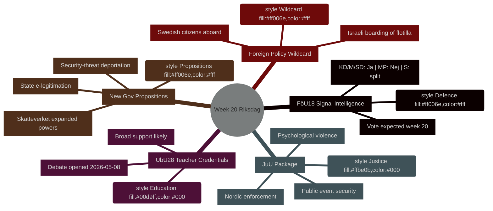

<!-- dir: rtl -->
---
title: "מה לקראת השבוע — הריקסדאג שבוע 20: מודיעין ביטחוני, רפורמה בחינוך, חקיקה משפטית"
date: "2026-05-08"
subfolder: "week-ahead"
article_type: "week-ahead"
author: "James Pether Sörling"
classification: "PUBLIC"
confidence: "HIGH [B2]"
language: "he"
---

# מה לקראת השבוע: הריקסדאג שבוע 20 (11–17 במאי 2026)

**מחבר**: James Pether Sörling | **מזהה ריצה**: 25544675528 | **סיווג**: PUBLIC | **רמת ביטחון**: HIGH [B2]

## BLUF

הריקסדאג השוודי נכנס לשבוע 20 (11–17 במאי 2026) עם לוח שנה חקיקתי עמוס הכולל מודרניזציה של חקיקת מודיעין הביטחון, רפורמה בחינוך, חקיקה משפטית ורגולציה פיננסית מתואמת עם האיחוד האירופי — הכול מתקדם לקראת הצבעות בעוד הממשלה מגישה בו-זמנית שלוש הצעות חוק בעלות מטען פוליטי (זיהוי אלקטרוני ממלכתי, הרחבת סמכויות המעקב של Skatteverket, והחמרת כללי גירוש של איומי ביטחון). השילוב מסמן האצה בקצב החקיקתי ככל שהשוודים מתקרבים לבחירות ספטמבר 2026. הסעיף המשמעותי ביותר מבחינה פוליטית הוא **HD01FöU18** (רפורמה בחוק מודיעין האותות), שבוחן את לכידות הקואליציה בנושא האיזון בין חירויות אזרחיות לפשרות ביטחוניות. **הג'וקר של השבוע הוא עלייה ישראלית על ספינת הסולידריות עם עזה Global Sumud Flotilla עם אזרחים שוודים על סיפונה** (HD11803), שמכריחה את שרת החוץ Maria Malmer Stenergard (M) לנקוט עמדה פומבית בסכסוך עזה בצומת קריטי לפני הבחירות.

## החלטות שתמצית זו תומכת בהן

1. **תכנון לוח החקיקה** — אילו מתוך תשעת ה-betänkanden המגיעים לדיון/הצבעה בשבוע 20 נושאים את הסיכון הפוליטי הגבוה ביותר לשבירת הקואליציה או מהלך נגדי של האופוזיציה?
2. **עדכון מעקב מדיניות** — האם שרשרת ההצעות של הממשלה מ-7 במאי (HD03261, HD03250, HD03267) שינתה את מסלול הרפורמה של מדינת הביטחון שנקבע במרץ–אפריל 2026?
3. **כיול תרחיש בחירות** — האם הלחץ הסימולטני על כישורי מורים (UbU28), הפללת אלימות פסיכולוגית (JuU39) ומודיעין אותות (FöU18) מייצג מיצוב קואליציוני מתואם לפני הבחירות?

## סיכום ב-60 שניות

- **מודיעין ביטחוני**: דוח ועדת FöU18 מחדש את חקיקת מודיעין האותות; הצבעה צפויה בשבוע 20. תמיכה חזקה מ-KD/M/SD; MP כנראה לא; S מפולג [אופק:שבוע]
- **חינוך**: UbU28 (כישורי מורים בבית ספר יסודי של 10 שנים) — דיון נפתח ב-2026-05-08; תמיכה רחבה מרובת מפלגות צפויה אך SD וV עשויים לסטות בסעיפי שילוב [אופק:שבוע]
- **חבילה משפטית**: JuU32 (ביטחון באירועים ציבוריים) + JuU39 (אלימות פסיכולוגית כעבירה) + JuU34 (אכיפת דיני עונשין נורדית) — כולן מוכנות להצבעה; רוב ממשלתי שלם לשלושת הסעיפים [אופק:שבוע]
- **הצעות חדשות**: HD03267 (זרים כאיום ביטחוני) + HD03261 (סמכויות רישום אוכלוסין של Skatteverket) מקדמות אג'נדת מדינת המעקב; עדיין אין חוות דעת Lagrådet — סיכון חוקתי [אופק:שבוע]
- **קשר לאיחוד האירופי**: ישיבת מועצת האיחוד האירופי חינוך/נוער/תרבות 11–12 במאי; ישיבת FAC לפיתוח 18 במאי; תדרוך EU-nämnden 13 במאי [אופק:שבוע]
- **ג'וקר במדיניות חוץ**: העלייה הישראלית על ספינת הסולידריות עם עזה עם אזרחים שוודים מכריחה את הממשלה השוודית להצהיר פומבית [אופק:שבוע]
- **דיני מס**: שאלת הממשלה HD10480 (S→שר האוצר) מטילה ספק בתפיסת "מגורים קבועים" — בוחן את עקביות הפרשנות של Skatteverket [אופק:שבוע]

## הגורם המעורר המוביל לעתיד

**יום שני 11 במאי**: אם דיון FöU18 נפתח בקאמארן, לעקוב אחר קולות מחאה מ-MP ו-V — מבחן ראשון גלוי אם שסעי הקואליציה בנושא חירויות אזרחיות יחזיקו לפני בחירות ספטמבר.

## הקשר כלכלי של קרן המטבע הבינלאומית

> ℹ️ **תעבורת הסיוע של קרן המטבע הבינלאומית מדורדרת** — WEO/FM Datamapper זמין; נקודת הקצה SDMX מחזירה 404. ממשיכים עם נתוני WEO/FM בלבד.

שוודיה: צמיחת תוצר מקומי גולמי ריאלי 2026א: ~2.1% (WEO אפר-2026); יתרת תקציב: כ-+0.2% מהתמ"ג (FM אפר-2026); חוב ציבורי: ~39% מהתמ"ג (WEO אפר-2026). המרחב הפיסקלי של שוודיה מספק קיבולת להשקעה בתשתית דיגיטלית שהמשתמעת מ-HD03250 (זיהוי אלקטרוני ממלכתי) ללא סיכון ליעדי החוב.



## מקור כלכלי (קרן המטבע הבינלאומית במצב מדורדר)

```economicProvenance
{
  "provider": "imf",
  "dataflow": "WEO|FM",
  "vintage": "WEO Apr-2026, FM Apr-2026",
  "status": "degraded",
  "retrieved_at": "2026-05-08",
  "indicators_used": ["NGDP_RPCH", "GGXWDG_NGDP", "GGXCNL_NGDP"],
  "country": "SWE",
  "notes": "IFS SDMX endpoint returning 404. Monthly CPI and labour market indicators unavailable."
}
```

## בקרת גרסאות

- **Pass 1**: 2026-05-08 — מסמך ראשוני
- **Pass 2**: 2026-05-08 — נוסף מקור כלכלי; אושרה דיוק שפת WEP

<!-- source-sha: aaf8ef6d6b92d0946a98b667edd70ae3196c5278 -->
