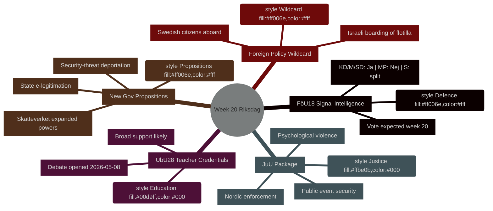

# 週間展望：リクスダーグ第20週（2026年5月11日〜17日）

**著者**：James Pether Sörling ｜ **実行ID**：25544675528 ｜ **分類**：PUBLIC ｜ **信頼度**：HIGH [B2]

## BLUF

スウェーデンのリクスダーグ（Riksdag）は、第20週（2026年5月11〜17日）において、防衛情報法制の近代化、教育改革、司法立法、EU準拠の金融規制にまたがる過密な立法カレンダーとともに臨みます。これらすべてが採決に向けて進む中、政府は同時に政治的に高度に重要な三つの提案（国家電子身分証、Skatteverketの監視権限拡大、安全保障上の脅威への国外退去規則強化）を提出しています。この組み合わせは、スウェーデンが2026年9月選挙に近づくにつれ立法ペースが加速していることを示しています。政治的に最も重要な単一案件は**HD01FöU18**（シグナル情報法改正）であり、市民的自由と安全保障上のトレードオフについて連立政権の結束を試すものです。**今週のワイルドカードは、スウェーデン人市民を乗せたガザ連帯船Global Sumud Flotillaへのイスラエルの乗船**（HD11803）であり、外務大臣Maria Malmer Stenergard（M）が選挙直前の重大局面でガザ紛争について公式な立場表明を迫られます。

## 本ブリーフが支援する意思決定

1. **立法カレンダーの計画策定** — 第20週に討議・採決に達する九つのbetänkandenのうち、連立崩壊または野党の対抗措置という政治的リスクが最も高いのはどれか？
2. **政策追跡の更新** — 5月7日の政府提案ラッシュ（HD03261、HD03250、HD03267）は、2026年3〜4月に確立された安全保障国家改革の軌道を変えたか？
3. **選挙シナリオの較正** — 教員資格（UbU28）、心理的暴力の犯罪化（JuU39）、シグナル情報（FöU18）への同時的な推進は、選挙前の連立による協調的ポジショニングを意味するか？

## 60秒サマリー

- **防衛情報**：FöU18委員会報告書がシグナル情報法制を近代化；第20週に採決予定。KD/M/SDから強い支持；MPはおそらく反対；Sは分裂 [地平:週]
- **教育**：UbU28（10年制小学校における教員資格）— 2026-05-08に討議開始；幅広い超党派支持が見込まれるがSDとVは統合規定で乖離の可能性 [地平:週]
- **司法パッケージ**：JuU32（公共イベントの安全）+ JuU39（心理的暴力の犯罪化）+ JuU34（北欧刑事司法執行）— すべて採決準備完了；三案とも政府過半数は維持 [地平:週]
- **新規提案**：HD03267（安全保障上の脅威としての外国人）+ HD03261（Skatteverketの住民登録権限）が監視国家アジェンダを推進；まだLagrådsの意見なし — 憲法上のリスク [地平:週]
- **EU連携**：EU理事会教育・青少年・文化会合5月11〜12日；FAC開発会合5月18日；EU-nämnden情報提供5月13日 [地平:週]
- **外交政策のワイルドカード**：スウェーデン人市民乗船のガザ連帯船へのイスラエルの乗船がスウェーデン政府に公式表明を迫る [地平:週]
- **税法**：質問HD10480（S→財務大臣）が「恒久的居住」概念に疑義を呈する — Skatteverketの解釈一貫性を試す [地平:週]

## 主要な将来トリガー

**5月11日（月）**：FöU18討議がkammarenで開始された場合、MPとVの異議票に注目 — 市民的自由をめぐる連立亀裂が9月選挙に向けて持ちこたえるかどうかの最初の可視テスト。

## IMF経済コンテキスト

> ℹ️ **IMF補助輸送が低下** — WEO/FM Datamapper利用可能；SDMXエンドポイントが404を返却。WEO/FMデータのみで継続。

スウェーデン：実質GDP成長率2026年予測：約2.1%（WEO 2026年4月）；財政収支：GDP比約+0.2%（FM 2026年4月）；公的債務：GDP比約39%（WEO 2026年4月）。スウェーデンの財政的余裕は、HD03250（国家電子身分証）が示唆するデジタルインフラ投資に対して、債務目標を損なうことなく対応する能力を提供します。



## 経済的出所（IMF低下モード）

```economicProvenance
{
  "provider": "imf",
  "dataflow": "WEO|FM",
  "vintage": "WEO Apr-2026, FM Apr-2026",
  "status": "degraded",
  "retrieved_at": "2026-05-08",
  "indicators_used": ["NGDP_RPCH", "GGXWDG_NGDP", "GGXCNL_NGDP"],
  "country": "SWE",
  "notes": "IFS SDMX endpoint returning 404. Monthly CPI and labour market indicators unavailable."
}
```

## バージョン管理

- **Pass 1**：2026-05-08 — 初期文書
- **Pass 2**：2026-05-08 — 経済的出所を追加；WEP言語精度を確認

<!-- source-sha: aaf8ef6d6b92d0946a98b667edd70ae3196c5278 -->
