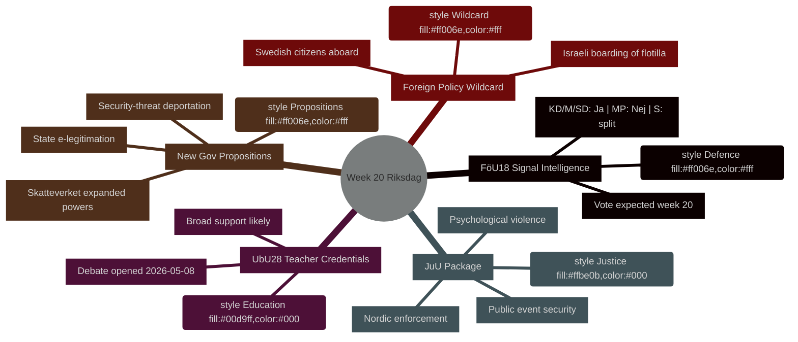

# 주간 전망: 리크스다그 20주차 (2026년 5월 11일~17일)

**저자**: James Pether Sörling | **실행 ID**: 25544675528 | **분류**: PUBLIC | **신뢰도**: HIGH [B2]

## BLUF

스웨덴 리크스다그(Riksdag)는 국방 정보 법제 현대화, 교육 개혁, 사법 입법, EU 정합 금융 규제를 아우르는 빽빽한 입법 일정과 함께 20주차(2026년 5월 11일~17일)에 돌입합니다. 이 모든 사안이 표결로 나아가는 가운데 정부는 세 가지 정치적으로 민감한 제안(국가 전자 신원증, Skatteverket 감시 권한 확대, 안보 위협 추방 규정 강화)을 동시에 제출했습니다. 이 조합은 스웨덴이 2026년 9월 선거에 가까워지면서 입법 속도가 가속되고 있음을 시사합니다. 정치적으로 가장 중요한 단일 사안은 **HD01FöU18**(신호정보법 개혁)으로, 시민 자유와 안보 간 트레이드오프에 관한 연립 결속력을 시험합니다. **이번 주 와일드카드는 스웨덴 국민이 탑승한 가자 연대 선박 Global Sumud Flotilla에 대한 이스라엘의 승선**(HD11803)으로, 외무장관 Maria Malmer Stenergard(M)가 선거 직전 결정적 시점에 가자 분쟁에 관한 공식 입장을 표명하도록 강요받게 됩니다.

## 이 브리핑이 지원하는 의사결정

1. **입법 일정 계획** — 20주차에 토론·표결에 도달하는 아홉 개의 betänkanden 중 연립 붕괴 또는 야당 대항 조치의 정치적 위험이 가장 높은 것은 어느 것인가?
2. **정책 추적 업데이트** — 5월 7일 정부의 제안 폭발(HD03261, HD03250, HD03267)이 2026년 3~4월에 확립된 안보 국가 개혁 궤적을 바꾸었는가?
3. **선거 시나리오 보정** — 교원 자격(UbU28), 심리적 폭력 범죄화(JuU39), 신호정보(FöU18)에 대한 동시 추진이 선거 전 연립의 조율된 포지셔닝을 나타내는가?

## 60초 요약

- **국방 정보**: FöU18 위원회 보고서가 신호정보 법제를 현대화; 20주차 표결 예상. KD/M/SD의 강한 지지; MP 반대 가능성 높음; S 분열 [시야:주]
- **교육**: UbU28(10년제 초등학교 교원 자격) — 2026-05-08 토론 개시; 폭넓은 초당파 지지 예상되나 SD와 V는 통합 조항에서 이탈 가능 [시야:주]
- **사법 패키지**: JuU32(공공 행사 안전) + JuU39(심리적 폭력 범죄화) + JuU34(북유럽 형사 집행) — 모두 표결 준비 완료; 세 안건 모두 정부 과반 유지 [시야:주]
- **신규 제안**: HD03267(안보 위협으로서의 외국인) + HD03261(Skatteverket 주민 등록 권한)이 감시 국가 의제를 추진; 아직 Lagrådet 의견 없음 — 헌법적 위험 [시야:주]
- **EU 연계**: EU 이사회 교육·청소년·문화 회의 5월 11~12일; FAC 개발 회의 5월 18일; EU-nämnden 브리핑 5월 13일 [시야:주]
- **외교 정책 와일드카드**: 스웨덴 국민 탑승 가자 연대 선박에 대한 이스라엘 승선으로 스웨덴 정부가 공식 입장 표명 강요 [시야:주]
- **세법**: 질의 HD10480(S→재무장관)이 "상주 거주" 개념에 이의를 제기 — Skatteverket의 해석 일관성 시험 [시야:주]

## 주요 미래 촉발 요인

**5월 11일(월)**: FöU18 토론이 카마렌(kammaren)에서 개시되면 MP와 V의 반대표를 주목 — 시민 자유에 대한 연립 균열이 9월 선거 전에 유지되는지에 대한 첫 가시적 시험.

## IMF 경제 맥락

> ℹ️ **IMF 보조 전송 저하** — WEO/FM Datamapper 사용 가능; SDMX 엔드포인트 404 반환. WEO/FM 데이터만으로 계속.

스웨덴: 실질 GDP 성장률 2026년 예상: ~2.1%(WEO 2026년 4월); 재정 수지: GDP 대비 약 +0.2%(FM 2026년 4월); 공공 부채: GDP 대비 ~39%(WEO 2026년 4월). 스웨덴의 재정 여력은 HD03250(국가 전자 신원증)이 시사하는 디지털 인프라 투자에 부채 목표를 위험에 빠뜨리지 않고 대응할 능력을 제공합니다.



## 경제적 출처 (IMF 저하 모드)

```economicProvenance
{
  "provider": "imf",
  "dataflow": "WEO|FM",
  "vintage": "WEO Apr-2026, FM Apr-2026",
  "status": "degraded",
  "retrieved_at": "2026-05-08",
  "indicators_used": ["NGDP_RPCH", "GGXWDG_NGDP", "GGXCNL_NGDP"],
  "country": "SWE",
  "notes": "IFS SDMX endpoint returning 404. Monthly CPI and labour market indicators unavailable."
}
```

## 버전 관리

- **Pass 1**: 2026-05-08 — 초기 문서
- **Pass 2**: 2026-05-08 — 경제적 출처 추가; WEP 언어 정확성 확인

<!-- source-sha: aaf8ef6d6b92d0946a98b667edd70ae3196c5278 -->
