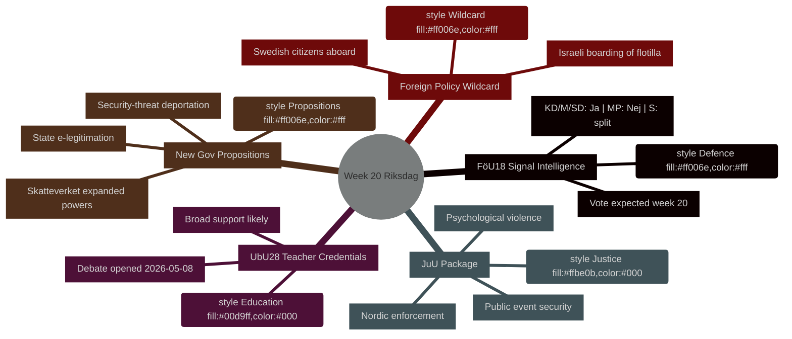

# Weekoverzicht: Riksdag week 20 (11–17 mei 2026)

**Auteur**: James Pether Sörling | **Run-ID**: 25544675528 | **Classificatie**: PUBLIC | **Betrouwbaarheidsniveau**: HIGH [B2]

## BLUF

De Zweedse Riksdag gaat week 20 (11–17 mei 2026) in met een vol wetgevingskalender dat modernisering van de defensie-inlichtingenwetgeving, onderwijshervorming, justitiewetgeving en EU-geconformeerde financiële regelgeving omvat — dit alles op weg naar stemming terwijl de regering tegelijkertijd drie politiek geladen propositioner indient (staatse e-legitimatie, uitgebreide toezichtsbevoegdheden voor Skatteverket en aangescherpte uitwijzingsregels voor veiligheidsbedreigingen). De combinatie signaleert een versnellend wetgevingstempo nu Zweden de verkiezingen van september 2026 nadert. Het politiek meest significante punt is **HD01FöU18** (hervorming van de wet op signalinlichtingen), dat de coalitiecohesie test op de afweging tussen burgerlijke vrijheden en veiligheidscompromissen. **De wildcard van de week is het Israëlische enteren van het Gaza-solidariteitsschip Global Sumud Flotilla met Zweedse staatsburgers aan boord** (HD11803), wat minister van Buitenlandse Zaken Maria Malmer Stenergard (M) dwingt publiekelijk stelling te nemen over het Gaza-conflict op een kritiek moment voor de verkiezingen.

## Beslissingen die dit rapport ondersteunt

1. **Planning van de wetgevingsagenda** — Welke van de negen betänkanden die in week 20 debat/stemming bereiken, dragen het hoogste politieke risico van coalitiebreuk of tegenzet van de oppositie?
2. **Update van de beleidsmonitor** — Heeft de propositionengolf van de regering op 7 mei (HD03261, HD03250, HD03267) de in maart–april 2026 gevestigde hervormingskoers van de veiligheidsstaat gewijzigd?
3. **Kalibratie van het verkiezingsscenario** — Vertegenwoordigt de gelijktijdige druk op leraarsbevoegdheid (UbU28), criminalisering van psychisch geweld (JuU39) en signalinlichtingen (FöU18) een gecoördineerde verkiezingspositionering van de coalitie?

## Samenvatting in 60 seconden

- **Defensie-inlichtingen**: FöU18-commissierapport moderniseert de signalinlichtingenwetgeving; stemming verwacht in week 20. Sterke steun van KD/M/SD; MP waarschijnlijk Nee; S verdeeld [horizon:week]
- **Onderwijs**: UbU28 (leeraarsbevoegdheid in 10-jarig basisonderwijs) — debat geopend op 2026-05-08; brede partijoverschrijdende steun verwacht maar SD en V kunnen afwijken op integratiebepalingen [horizon:week]
- **Justitiepakket**: JuU32 (veiligheid bij publieke evenementen) + JuU39 (psychisch geweld als misdrijf) + JuU34 (Noordse strafrechtshandhaving) — alle klaar voor stemming; regeringsmeerderheid voor alle drie intact [horizon:week]
- **Nieuwe propositioner**: HD03267 (buitenlanders als veiligheidsbedreiging) + HD03261 (bevolkingsregisterbevoegdheden van Skatteverket) drijven de surveillance-staatsagenda; nog geen Lagrådsadvies — constitutioneel risico [horizon:week]
- **EU-nexus**: EU-raadsvergadering onderwijs/jeugd/cultuur 11–12 mei; FAC-ontwikkelingsvergadering 18 mei; EU-nämndenbriefing 13 mei [horizon:week]
- **Buitenlandspolitieke wildcard**: Israëlisch enteren van Gaza-solidariteitsschip met Zweedse staatsburgers dwingt Zweedse regering tot publieke stellingname [horizon:week]
- **Belastingrecht**: interpellatie HD10480 (S→minister van financiën) stelt het begrip "permanente verblijfplaats" ter discussie — test de interpretatieconsistentie van Skatteverket [horizon:week]

## Leidende toekomstige trigger

**Maandag 11 mei**: als het FöU18-debat opent in de kammaren, let op dissidente stemmen van MP en V — eerste zichtbare test of de coalitiebarsten rond burgerlijke vrijheden standhouden voor de Septemberverkiezingen.

## IMF economische context

> ℹ️ **IMF-hulptransport aangetast** — WEO/FM Datamapper beschikbaar; SDMX-eindpunt retourneert 404. Voortgang uitsluitend met WEO/FM-gegevens.

Zweden: Reëel bbp-groei 2026V: ~2,1 % (WEO apr-2026); Begrotingssaldo: ca. +0,2 % van het bbp (FM apr-2026); Overheidsschuld: ~39 % van het bbp (WEO apr-2026). De fiscale ruimte van Zweden biedt capaciteit voor de digitale infrastructuurinvestering die HD03250 (staatse e-legitimatie) impliceert zonder risico voor de schulddoelstellingen.



## Economische herkomst (IMF aangetaste modus)

```economicProvenance
{
  "provider": "imf",
  "dataflow": "WEO|FM",
  "vintage": "WEO Apr-2026, FM Apr-2026",
  "status": "degraded",
  "retrieved_at": "2026-05-08",
  "indicators_used": ["NGDP_RPCH", "GGXWDG_NGDP", "GGXCNL_NGDP"],
  "country": "SWE",
  "notes": "IFS SDMX endpoint returning 404. Monthly CPI and labour market indicators unavailable."
}
```

## Versiebeheer

- **Pass 1**: 2026-05-08 — Initieel document
- **Pass 2**: 2026-05-08 — Economische herkomst toegevoegd; WEP-taalprecisie bevestigd

<!-- source-sha: aaf8ef6d6b92d0946a98b667edd70ae3196c5278 -->
