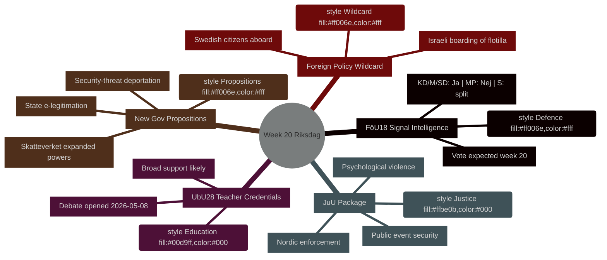

# Ukens program: Riksdag uke 20 (11.–17. mai 2026)

**Forfatter**: James Pether Sörling | **Kjøring-ID**: 25544675528 | **Klassifisering**: PUBLIC | **Konfidensgrad**: HIGH [B2]

## BLUF

Sveriges Riksdag innleder uke 20 (11.–17. mai 2026) med en travel lovgivningskalender som spenner over modernisering av forsvarsettretningslovgivningen, utdanningsreform, justislovgivning og EU-tilpasset finansiell regulering — alt på vei mot avstemning mens regjeringen samtidig legger frem tre politisk ladede proposisjoner (statlig e-legitimasjon, utvidede overvåkningsfullmakter til Skatteverket og innskrempede regler for utvisning av sikkerhets­trusler). Kombinasjonen signaliserer et akselererende lovgivningstempo i takt med at Sverige nærmer seg valget i september 2026. Det enkeltpolitisk mest betydningsfulle punktet er **HD01FöU18** (reform av loven om signalspaning), som tester koalisjonens samhold om avveiningen mellom borgerrettigheter og sikkerhetshensyn. **Ukens joker er den israelske bordingen av Gaza-solidaritetsskipet Global Sumud Flotilla med svenske statsborgere om bord** (HD11803), noe som tvinger utenriksminister Maria Malmer Stenergard (M) til en offentlig stillingtaken i Gazakonflikten på et kritisk tidspunkt før valget.

## Beslutninger dette notatet understøtter

1. **Planlegging av lovgivningskalenderen** — Hvilke av de ni betänkanden som når debatt/avstemning i uke 20, innebærer høyest politisk risiko for koalisjonsbrudd eller mottrekk fra opposisjonen?
2. **Oppdatering av politikksporing** — Har regjeringens proposisjonsburst 7. mai (HD03261, HD03250, HD03267) endret sikkerhetsstatens reformkurs etablert i mars–april 2026?
3. **Kalibrering av valgscenarier** — Representerer det samtidige trykket på lærerkompetanse (UbU28), kriminalisering av psykisk vold (JuU39) og signalspaning (FöU18) en koordinert koalisjonsposisjonering før valget?

## 60-sekunders oppsummering

- **Forsvarsettretning**: FöU18 utvalgsrapport moderniserer signalspaningslovgivningen; avstemning ventes i uke 20. Sterk støtte fra KD/M/SD; MP trolig Nei; S delt [horisont:uke]
- **Utdanning**: UbU28 (lærerkompetanse i 10-årig grunnskole) — debatt åpnet 2026-05-08; bred tverrpartistisk støtte ventes men SD og V kan avvike på integrasjonsbestemmelser [horisont:uke]
- **Justispakke**: JuU32 (sikkerhet ved offentlige arrangementer) + JuU39 (psykisk vold som lovbrudd) + JuU34 (nordisk strafferettshåndhevelse) — alle klare for avstemning; regjeringsflertallet intakt for alle tre [horisont:uke]
- **Nye proposisjoner**: HD03267 (utlendinger som sikkerhetstrusler) + HD03261 (Skatteverkets folkeregistreringsfullmakter) driver overvåkningsstatens agenda; ingen lagrådssvar ennå — konstitusjonell risiko [horisont:uke]
- **EU-nexus**: EU-rådets møte om utdanning/ungdom/kultur 11.–12. mai; FAC-utviklingsmøte 18. mai; EU-nämndsbriefing 13. mai [horisont:uke]
- **Utenrikspolitisk joker**: Israels bording av Gaza-solidaritetsskip med svenske statsborgere tvinger den svenske regjering til offentlig stillingtaken [horisont:uke]
- **Skattelovgivning**: Interpellasjon HD10480 (S→finansminister) utfordrer begrepet "fast bosted" — tester Skatteverkets fortolkningskonsistens [horisont:uke]

## Ledende fremtidig utløser

**Mandag 11. mai**: Hvis FöU18-debatten åpnes i kammaren, observer avvikende stemmer fra MP og V — første synlige prøve på om koalisjonens sprekker rundt borgerrettigheter holder frem mot valget i september.

## IMF økonomisk kontekst

> ℹ️ **IMFs hjelpetransport forringet** — WEO/FM Datamapper tilgjengelig; SDMX-endepunkt returnerer 404. Fortsetter med kun WEO/FM-data.

Sverige: Real BNP-vekst 2026P: ~2,1 % (WEO apr-2026); Finanspolitisk saldo: ca. +0,2 % av BNP (FM apr-2026); Offentlig gjeld: ~39 % av BNP (WEO apr-2026). Sveriges finanspolitiske handlingsrom gir kapasitet til den digitale infrastrukturinvesteringen som HD03250 (statlig e-legitimasjon) forutsetter uten risiko for gjeldsmål.



## Økonomisk proveniens (IMF forringet modus)

```economicProvenance
{
  "provider": "imf",
  "dataflow": "WEO|FM",
  "vintage": "WEO Apr-2026, FM Apr-2026",
  "status": "degraded",
  "retrieved_at": "2026-05-08",
  "indicators_used": ["NGDP_RPCH", "GGXWDG_NGDP", "GGXCNL_NGDP"],
  "country": "SWE",
  "notes": "IFS SDMX endpoint returning 404. Monthly CPI and labour market indicators unavailable."
}
```

## Versjonskontroll

- **Pass 1**: 2026-05-08 — Opprinnelig notat
- **Pass 2**: 2026-05-08 — La til økonomisk proveniens; bekreftet WEP-språkpresisjon

<!-- source-sha: aaf8ef6d6b92d0946a98b667edd70ae3196c5278 -->
