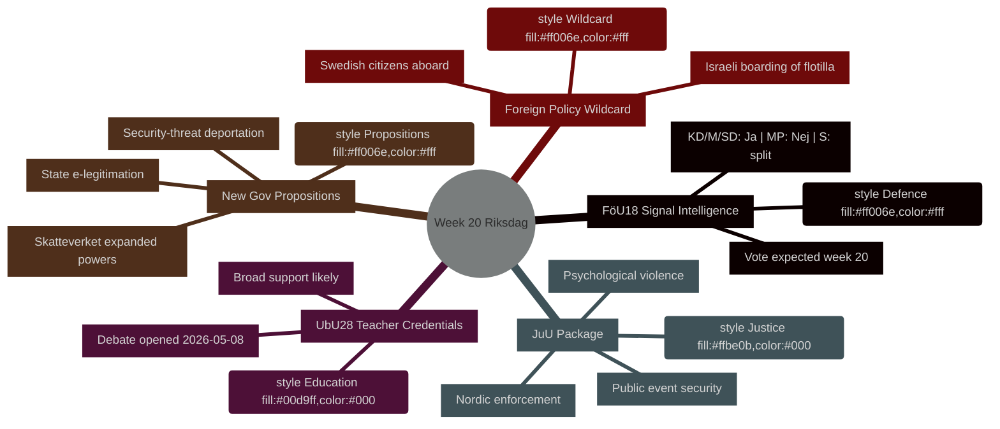

# Veckans agenda: Riksdag vecka 20 (11–17 maj 2026)

**Författare**: James Pether Sörling | **Körnings-ID**: 25544675528 | **Klassificering**: PUBLIC | **Konfidensgrad**: HIGH [B2]

## BLUF

Sveriges riksdag inleder vecka 20 (11–17 maj 2026) med ett fullspäckat lagstiftningskalender som spänner över modernisering av försvarsunderrättelseverksamheten, utbildningsreform, rättslagstiftning och EU-anpassad finansiell reglering — allt på väg mot omröstning medan regeringen samtidigt lämnar in tre politiskt laddade propositioner (statlig e-legitimation, utökade övervakningsbefogenheter för Skatteverket och skärpta regler för utvisning av säkerhetshot). Kombinationen signalerar ett accelererande lagstiftningstempo i takt med att Sverige närmar sig valet i september 2026. Det enskilt politiskt mest betydelsefulla ärendet är **HD01FöU18** (reform av lagen om signalspaning), som testar koalitionens sammanhållning kring avvägningen mellan medborgerliga fri- och rättigheter och säkerhetsintressen. **Veckans jokertecken är Israels bordning av Gaza-solidaritetsfartyget Global Sumud Flotilla med svenska medborgare ombord** (HD11803), vilket tvingar utrikesminister Maria Malmer Stenergard (M) att ta offentlig ställning i Gazakonflikten i ett kritiskt skede inför valet.

## Beslut som detta underlag stödjer

1. **Planering av lagstiftningskalendern** — Vilka av de nio betänkanden som når debatt/omröstning under vecka 20 innebär störst politisk risk för koalitionsbrott eller motdrag från oppositionen?
2. **Uppdatering av policyspårning** — Har regeringens propositionsburst den 7 maj (HD03261, HD03250, HD03267) förändrat den säkerhetsstatliga reformkurs som etablerades under mars–april 2026?
3. **Kalibrering av valscenarier** — Representerar det simultana trycket på lärarbehörighet (UbU28), kriminalisering av psykiskt våld (JuU39) och signalspaning (FöU18) en samordnad koalitionspositionering inför valet?

## 60-sekunders sammanfattning

- **Försvarsunderrättelser**: FöU18 utskottsbetänkande moderniserar lagstiftningen om signalspaning; omröstning väntas under vecka 20. Starkt stöd från KD/M/SD; MP troligen Nej; S delat [horisont:vecka]
- **Utbildning**: UbU28 (lärarbehörighet i 10-årig grundskola) — debatt öppnades 2026-05-08; brett tvärpartistiskt stöd väntas men SD och V kan avvika vad gäller integrationsparagrafer [horisont:vecka]
- **Rättspaket**: JuU32 (säkerhet vid allmänna sammankomster) + JuU39 (psykiskt våld som brott) + JuU34 (nordisk brottsbekämpning) — alla redo för omröstning; regeringsmajoriteten intakt för samtliga tre [horisont:vecka]
- **Nya propositioner**: HD03267 (utlänningar som säkerhetshot) + HD03261 (folkbokföringsbefogenheter för Skatteverket) driver övervakningsstatens agenda; inget lagrådssvar ännu — konstitutionell risk [horisont:vecka]
- **EU-nexus**: EU-rådets möte om utbildning/ungdom/kultur 11–12 maj; FAC-möte om utveckling 18 maj; EU-nämndsbriefing 13 maj [horisont:vecka]
- **Utrikespolitiskt jokertecken**: Israels bordning av Gaza-solidaritetsfartyg med svenska medborgare tvingar svenska regeringen till ett offentligt ställningstagande [horisont:vecka]
- **Skattelagstiftning**: Interpellation HD10480 (S→finansminister) utmanar begreppet "stadigvarande bosättning" — testar Skatteverkets tolkningskonsistens [horisont:vecka]

## Ledande framtida utlösare

**Måndag 11 maj**: Om debatten om FöU18 öppnas i kammaren, bevaka avvikande röster från MP och V — första synliga prövning av om koalitionsspricker kring medborgerliga fri- och rättigheter håller inför valet i september.

## IMF ekonomisk kontext

> ℹ️ **IMF:s hjälptransport degraderad** — WEO/FM Datamapper tillgänglig; SDMX-slutpunkten returnerar 404. Fortsätter med enbart WEO/FM-underlag.

Sverige: Real BNP-tillväxt 2026P: ~2,1 % (WEO apr-2026); Finansiellt saldo: ca +0,2 % av BNP (FM apr-2026); Offentlig skuld: ~39 % av BNP (WEO apr-2026). Sveriges finanspolitiska manöverutrymme ger kapacitet för de digitala infrastrukturinvesteringar som HD03250 (statlig e-legitimation) förutsätter utan risk för skuldmål.



## Ekonomisk proveniens (IMF degraderat läge)

```economicProvenance
{
  "provider": "imf",
  "dataflow": "WEO|FM",
  "vintage": "WEO Apr-2026, FM Apr-2026",
  "status": "degraded",
  "retrieved_at": "2026-05-08",
  "indicators_used": ["NGDP_RPCH", "GGXWDG_NGDP", "GGXCNL_NGDP"],
  "country": "SWE",
  "notes": "IFS SDMX endpoint returning 404. Monthly CPI and labour market indicators unavailable."
}
```

## Versionskontroll

- **Pass 1**: 2026-05-08 — Initialt underlag
- **Pass 2**: 2026-05-08 — Lade till ekonomisk proveniens; bekräftade WEP-språkprecision

<!-- source-sha: aaf8ef6d6b92d0946a98b667edd70ae3196c5278 -->
