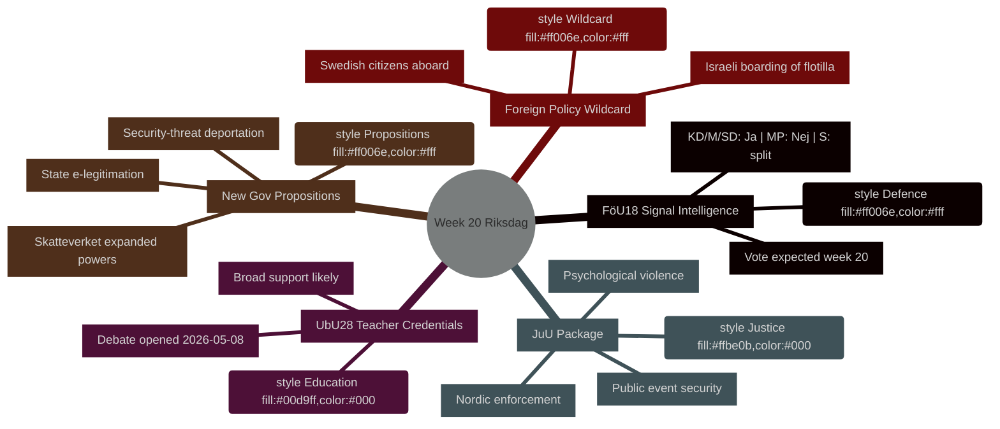

# 本周展望：瑞典议会第20周（2026年5月11日至17日）

**作者**：James Pether Sörling | **运行ID**：25544675528 | **分类**：PUBLIC | **置信度**：HIGH [B2]

## BLUF

瑞典议会（Riksdag）以涵盖国防情报立法现代化、教育改革、司法立法和符合欧盟要求的金融监管的密集立法日程进入第20周（2026年5月11日至17日）——所有这些都在向表决推进，与此同时，政府同步提交三项政治敏感性高的提案（国家电子身份证、扩大Skatteverket监控权限、收紧安全威胁驱逐规则）。这一组合表明，随着瑞典接近2026年9月大选，立法节奏正在加快。政治上最具重要性的单项议题是**HD01FöU18**（信号情报法改革），该议题考验联合政府在公民自由与安全权衡上的凝聚力。**本周的意外变量是以色列登上载有瑞典公民的加沙声援船Global Sumud Flotilla**（HD11803），这迫使外交部长Maria Malmer Stenergard（M）在选举前关键节点公开表态加沙冲突立场。

## 本简报支持的决策

1. **立法日程规划** — 第20周进入辩论/表决的九项betänkanden中，哪项承担联合政府破裂或反对派反制的最高政治风险？
2. **政策跟踪更新** — 政府5月7日的提案集中出台（HD03261、HD03250、HD03267）是否改变了2026年3至4月确立的安全国家改革轨迹？
3. **选举情景校准** — 教师资质（UbU28）、心理暴力入罪（JuU39）和信号情报（FöU18）上的同步推进，是否代表联合政府在选举前的协调定位？

## 60秒要点

- **国防情报**：FöU18委员会报告现代化信号情报立法；预计第20周表决。KD/M/SD强力支持；MP可能投反对票；S内部分裂 [视野:周]
- **教育**：UbU28（10年制小学教师资质）——2026-05-08辩论开启；预计获得广泛跨党派支持，但SD和V可能在融合条款上存在分歧 [视野:周]
- **司法一揽子**：JuU32（公共活动安全）+ JuU39（心理暴力入罪）+ JuU34（北欧刑事执行）——均已准备就绪进行表决；政府过半数对三项均完整 [视野:周]
- **新提案**：HD03267（外国人作为安全威胁）+ HD03261（Skatteverket户籍权限）推进监控国家议程；尚无Lagrådet意见——宪法风险 [视野:周]
- **欧盟关联**：欧盟理事会教育/青年/文化会议5月11至12日；FAC发展会议5月18日；EU-nämnden简报5月13日 [视野:周]
- **外交政策意外变量**：以色列登上载有瑞典公民的加沙声援船，迫使瑞典政府公开表态 [视野:周]
- **税法**：质询HD10480（S→财政部长）挑战"永久居住"概念——检验Skatteverket解释一致性 [视野:周]

## 主要未来触发因素

**5月11日（周一）**：若FöU18辩论在kammareni开启，密切关注MP和V的异议票——这是市民自由联合裂痕能否在9月选举前维持的首次可见检验。

## IMF经济背景

> ℹ️ **IMF辅助传输降级** — WEO/FM Datamapper可用；SDMX端点返回404。仅凭WEO/FM数据继续。

瑞典：2026年实际GDP增长率预测：约2.1%（WEO 2026年4月）；财政收支：占GDP约+0.2%（FM 2026年4月）；公共债务：占GDP约39%（WEO 2026年4月）。瑞典的财政空间为HD03250（国家电子身份证）所隐含的数字基础设施投资提供了能力，同时不危及债务目标。



## 经济出处（IMF降级模式）

```economicProvenance
{
  "provider": "imf",
  "dataflow": "WEO|FM",
  "vintage": "WEO Apr-2026, FM Apr-2026",
  "status": "degraded",
  "retrieved_at": "2026-05-08",
  "indicators_used": ["NGDP_RPCH", "GGXWDG_NGDP", "GGXCNL_NGDP"],
  "country": "SWE",
  "notes": "IFS SDMX endpoint returning 404. Monthly CPI and labour market indicators unavailable."
}
```

## 版本控制

- **Pass 1**：2026-05-08 — 初始文档
- **Pass 2**：2026-05-08 — 添加经济出处；确认WEP语言精确性

<!-- source-sha: aaf8ef6d6b92d0946a98b667edd70ae3196c5278 -->
