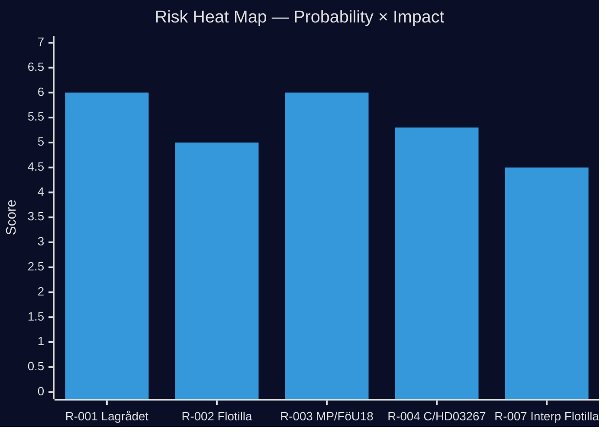

# Risk Assessment

## Risk Register

| Risk ID | Description | Probability | Impact | Score | Confidence | Timeline |
|---------|-------------|-------------|--------|-------|------------|---------|
| R-001 | Lagrådet rejects HD03267 post-remiss | MEDIUM (40%) | HIGH | 6.0 | [B2] | T+14d |
| R-002 | Israeli-flotilla crisis escalates to consular emergency | LOW (20%) | VERY HIGH | 5.0 | [B3] | T+7d |
| R-003 | MP tables formal protest on FöU18 → parliamentary theatre | HIGH (75%) | MEDIUM | 6.0 | [B2] | T+3d |
| R-004 | C withdraws support from HD03267 pending Lagrådet | MEDIUM (35%) | HIGH | 5.3 | [B2] | T+21d |
| R-005 | HD11801 lighting escalates → rural voter defection KD/C | LOW (20%) | MEDIUM | 2.0 | [C2] | T+60d |
| R-006 | IMF data degradation prevents economic claims | ALREADY MATERIALISED | LOW | — | [A1] | NOW |
| R-007 | Opposition calls emergency interpellation on flotilla | MEDIUM (45%) | MEDIUM | 4.5 | [B2] | T+7d |
| R-008 | FöU18 passed but immediately challenged in Constitutional Court | LOW (15%) | HIGH | 3.0 | [C2] | T+90d |

## Top Risk: R-001 — Lagrådet Rejection of HD03267

**Probability**: 40% [B2]
**Rationale**: Proportionality review under ECHR Art.8 + Art.6 for security-threat deportation without full criminal procedure safeguards is genuinely contested constitutional territory. Sweden's Lagrådet has previously rejected government proposals on similar grounds (see 2015 terrorism legislation remiss). The absence of a Lagrådet yttrande at proposition submission date is itself a warning signal — it suggests the government anticipates revision requests.
**Mitigation**: Government should pre-negotiate with C on rule-of-law safeguards (independent court review of "security threat" determinations) to have an amendment ready before Lagrådet opinion arrives.

## Top Risk: R-002 — Consular Emergency on Flotilla

**Probability**: 20% [B3]
**Rationale**: Global Sumud Flotilla status unclear as of 2026-05-08. If Israeli Navy detains Swedish nationals on international waters, Sweden's consular obligation under Vienna Convention Art.36 triggers. FM Malmer Stenergard has limited diplomatic leverage — Sweden lacks bilateral security agreement with Israel, and the EU is not in a joint position.
**Mitigation**: Emergency protocol: immediate protest note via Israeli ambassador in Stockholm; coordinate with EEAS for EU-level statement; brief party leaders in security committee (säkerhetsutskott).

## R-003 — MP Parliamentary Theatre on FöU18

**Probability**: 75% [B2]
**Rationale**: MP has consistently opposed expanded signal intelligence authorities since the 2008 FRA debate. MP's committee member (FöU) will request extended debate time and likely file a reservation (reservation) in the committee report. This is expected and manageable — the government majority can proceed to vote.
**Impact**: MEDIUM — vote proceeds but opposition framing lands in media.

## Systemic Risk: Security-State Concentration

**Unique risk**: The temporal concentration of FöU18 + HD03267 + HD03261 in a single week creates a systemic political risk that exceeds the sum of individual items. Even if all three advance constitutionally, the narrative they create accelerates opposition "surveillance-state" branding, which polling suggests resonates with soft-S and swing voters. [B2]

