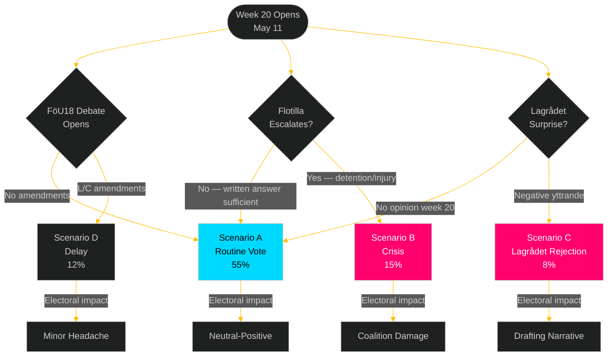

# Scenario Analysis — Week Ahead

## Horizon: T+7d (May 11-17, 2026)

### Scenario A: Routine Legislative Week (Base Case)
**WEP**: *It is likely that week 20 proceeds as a standard high-volume legislative week with all major committee reports voted through.* [B2]
**Probability**: 55%
**Description**: FöU18 passes with M/SD/KD/L majority. HD03267, HD03250, HD03261 enter committee review. UbU28 and justice package pass with broad majorities. Flotilla issue handled via FM written answer. No Lagrådet yttrande issued in week 20. Government enters week 21 in stable position.
**Key indicators**: FöU18 vote count ≥175 Ja (above 175-seat government-adjacent majority); no emergency interpellations on flotilla by Tuesday; IMY issues no public statement on HD03261.
**Electoral outcome**: Neutral-positive for government. Security agenda advances on schedule.

### Scenario B: Flotilla Crisis Escalation (Tail Risk)
**WEP**: *It is possible that the flotilla situation escalates to a consular emergency requiring extraordinary government measures.* [B3]
**Probability**: 15%
**Description**: Swedish citizens detained or injured by Israeli Navy triggers consular emergency protocol. FM Malmer Stenergard forced to issue formal protest note. S/V/MP table emergency interpellation. Government response splits coalition — SD resists condemnatory language, M/C/L/KD more sympathetic to international law framing. Week 20 legislative calendar partially disrupted.
**Key indicators**: Swedish MFA activating emergency consular response team; Israeli Embassy called to Utrikesdepartementet for formal consultation; S party leader Johan Blix making emergency statement.
**Electoral outcome**: Government coalition coherence damage visible; S gains on "who is Sweden?" branding.

### Scenario C: Lagrådet Surprise on New Propositions (Low Probability)
**WEP**: *It is unlikely but possible that Lagrådet issues a rapid negative opinion on HD03267 or HD03261 within week 20, forcing government revision.* [C2]
**Probability**: 8%
**Description**: Under normal timeline, Lagrådet opinions on May 7 propositions would not come until late May or June. However, if the government requested expedited review (which formal records would indicate), a week-20 rejection is possible. This would force immediate government revision and signal poor legislative preparation.
**Key indicators**: Lagrådet website updating with new yttrande entries for HD03267 or HD03261 before May 15.
**Electoral outcome**: Narrative of incompetent drafting; C and L have cover to distance from security package.

### Scenario D: FöU18 Amendment Forces Delay
**WEP**: *It is possible that a significant minority of L or C legislators tables last-minute amendments to FöU18 requiring committee referral.* [C2]
**Probability**: 12%
**Description**: L's civil-liberties faction (led by Johan Pehrson) or C's rule-of-law contingent tables amendment requiring mandatory sunset clause and/or enhanced IMY oversight. If amendment attracts 8+ votes beyond Nej-bloc, committee must reconvene, delaying final vote to week 21.
**Key indicators**: L party group protocol (partigruppsmöte) outcome Monday May 11 before plenary debate; any L/C press statements releasing "we will demand amendments" Monday morning.
**Electoral outcome**: Moderate positive for L/C — demonstrates independence; minor headache for government.

## Long-Horizon Scenario Extensions (T+90d horizon)

### Defence Intelligence Trajectory (T+90d)
*It is likely that FöU18, if passed in week 20, enables SÄPO/MUST capability upgrades that will be publicly confirmed in the 2026 SÄPO Annual Report (October 2026, post-election).* [C2] The timing creates an interesting dynamic: the government passes the enabling legislation before the election but the capability benefits materialise in the post-election period — a legacy-building play. [horizon:quarter]

### Migration Security Trajectory (T+90d)
*If HD03267 clears Lagrådet review (likely June-July 2026), it will be enacted before the election, giving SD/M a concrete "we delivered" claim on security deportations.* [C2] The first deportations under the new law would likely not occur until Q4 2026 regardless of election outcome. [horizon:quarter]
