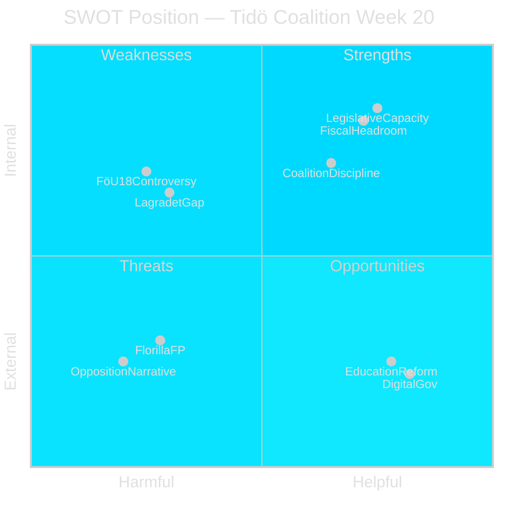

# SWOT Analysis — Swedish Political Week 20

## Strengths (Internal-Helpful)

**S1: Legislative Capacity — Tight Pipeline Management** [A1]
The government demonstrates sophisticated legislative pipeline discipline: FöU18, UbU28, JuU32/39/34, and FiU31/37/38/43 are all simultaneously ready for vote in week 20. This is not accidental — it reflects advance committee coordination. The ability to "batch" votes reduces opposition filibuster opportunities.

**S2: Fiscal Headroom for Digital Investment** [B2]
IMF WEO Apr-2026 projects Sweden's fiscal balance at approximately +0.2% of GDP and public debt at ~39% of GDP. This provides credible financing space for HD03250 (state e-legitimation) — the government can fund the infrastructure without immediate debt risk. WEO vintage Apr-2026.

**S3: Coalition Discipline on Security Package** [B2]
M+SD+KD form a 157-seat bloc that, combined with L's normal support, provides comfortable majorities for both FöU18 and HD03267. The KD-L tension on civil liberties issues is present but manageable — neither party will defect on a national security item four months before an election.

## Weaknesses (Internal-Harmful)

**W1: No Lagrådet Opinions on Key Propositions** [A1]
HD03267, HD03261, and HD03250 were all submitted May 7 without accompanying Lagrådet yttranden. This means the constitutional review has not yet occurred. For security-related legislation with ECHR Art.8 exposure, this gap is a parliamentary liability — C and S will use this to delay or amend.

**W2: FöU18 Civil Liberties Profile** [B2]
FöU18's modernisation of signal intelligence law extends collection authority in ways that MP (Miljöpartiet) and V (Vänsterpartiet) characterise as disproportionate surveillance. MP has parliamentary platform to air dissent; even if outvoted, the media coverage reinforces the "surveillance state" opposition frame that S uses in campaign material.

**W3: Coalition FP Incoherence on Israel/Flotilla** [B2]
SD will resist any language critical of Israeli actions; M, C, and L face different international coalition partners (EPP/ALDE) with stronger pro-Palestinian electorates; KD maintains Christian-solidarity positioning. FM Malmer Stenergard has no clean coalition-consistent position — any written answer creates a internal split.

## Opportunities (External-Helpful)

**O1: Education Reform Builds Pre-Election Credibility** [B3]
UbU28, if passed with supermajority-adjacent support, allows M/KD to claim "we delivered teacher reform" in campaign messaging — a welfare-state deliverable that neutralises S's traditional advantage on education quality.

**O2: EU Digital Governance Alignment** [B3]
HD03250 (state e-legitimation) positions Sweden as leader in EU digital identity space. The EU eIDAS Regulation 2.0 framework makes Sweden's national e-ID infrastructure directly relevant to EU Council benchmarking. Education Minister's May 11-12 EU Council attendance provides a positive soft-power backdrop.

**O3: Economic Stability as Campaign Asset** [B2]
With IMF WEO projecting Sweden's 2026 growth at ~2.1% and unemployment declining, the government enters the election campaign with defensible macroeconomic record. Finance Minister Elisabeth Svantesson (M) can point to responsible fiscal management even as opposition presses on public service quality.

## Threats (External-Harmful)

**T1: Flotilla Foreign Policy Escalation** [B2]
If the Israeli boarding of Global Sumud becomes a diplomatic incident (Swedish citizens detained or injured), pressure for government response escalates from "fråga" to emergency interpellation territory. The government has no comfortable diplomatic tool — recall of ambassador, protest note, or silence each carry coalition costs.

**T2: HD03267 Rule-of-Law Backlash** [B2]
Security-threat deportation without adequate Lagrådet review may trigger a Lagrådet rejection post-remiss, which would force a resubmission timeline that extends past the election. If Lagrådet concludes RF Ch.8/ECHR Art.6 violation, C (whose support the government sometimes courts) has cover to oppose.

**T3: Opposition "Security-State" Narrative** [B2]
The simultaneous advance of FöU18 + HD03267 + HD03261 enables S+MP+V to construct a coherent "surveillance-state acceleration" campaign narrative. The temporal concentration of all three items in week 20 gifts the opposition a single news cycle to land this frame. S leadership will make this a Monday press conference item.

**T4: Rural Infrastructure Discontent** [C2]
HD11800/11801 (Trafikverket lighting removal) feeds a latent rural voters grievance. The 25,000 poles in question are concentrated in C/SD heartland districts. If Infrastructure Minister Carlson (KD) cannot offer a credible mitigation, C could use the issue to demonstrate rural-facing independence.
