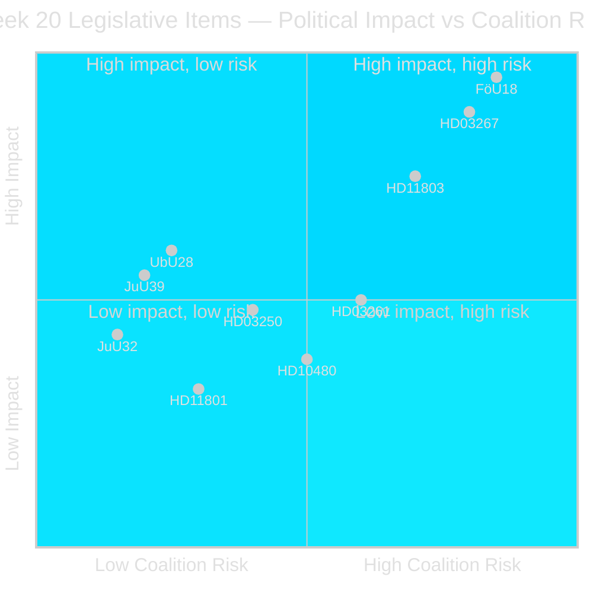
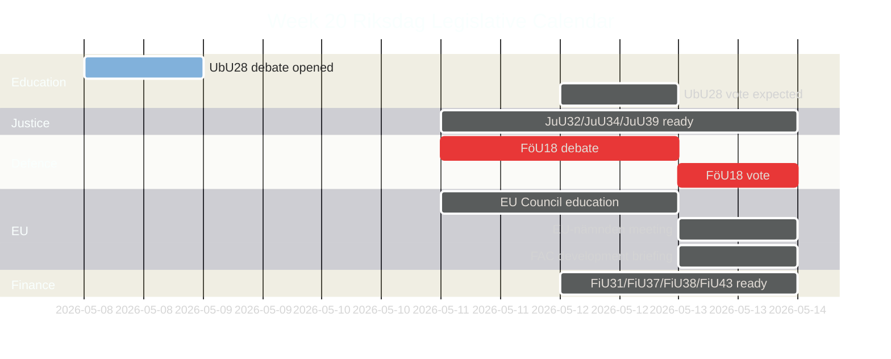

# Synthesis Summary — Week 20, 2026

## Lead Story Decision

**FöU18 (Signal Intelligence Reform) is the politically determinative item of week 20.** Its vote tests whether the Tidö coalition's civil-liberties-versus-security calculus holds, and its outcome sets the baseline for how Sweden's defence intelligence architecture will function through the election period and beyond. The simultaneous submission of HD03267 (foreigners security threats), HD03261 (Skatteverket surveillance powers), and HD03250 (state e-legitimation) creates a "security-state week" narrative that opposition parties will exploit in the election campaign.

## DIW-Weighted Significance Ranking

| Rank | dok_id | Title | DIW | Election Multiplier | Adjusted |
|------|--------|-------|-----|---------------------|---------|
| 1 | HD01FöU18 | Signalspaning — modern lagstiftning | 7.2 | ×1.5 (election ≤6 mo) | **10.8** [B2] |
| 2 | HD03267 | Stärkt skydd mot säkerhetshot (foreigners) | 6.5 | ×1.5 | **9.8** [B2] |
| 3 | HD01UbU28 | Legitimation och behörighet i 10-årig grundskola | 5.8 | ×1.0 | **5.8** [B3] |
| 4 | HD01JuU39 | Psykiskt våld — straffbestämmelse | 5.5 | ×1.0 | **5.5** [B3] |
| 5 | HD11803 | Israelboarding/flotilla — SWE citizens | 5.2 | ×1.5 | **7.8** [B2] |
| 6 | HD03261 | Skatteverket folkbokföring expanded powers | 4.9 | ×1.0 | **4.9** [B3] |
| 7 | HD03250 | Statlig e-legitimation | 4.7 | ×1.0 | **4.7** [C1] |
| 8 | HD01JuU32 | Allmänna sammankomster — stärkt säkerhet | 4.3 | ×1.0 | **4.3** [C1] |
| 9 | HD10480 | Stadigvarande vistelse interpellation (S→FiMin) | 3.8 | ×1.0 | **3.8** [C2] |
| 10 | HD11801 | Trafikverket lighting removal rural areas | 3.2 | ×1.0 | **3.2** [C2] |

*Election proximity multiplier (1.5×) applied: next election ≤ 6 months (September 2026 cutoff 2026-03-13 to 2026-09-13).*

## Integrated Intelligence Picture

**Security/Defence cluster (FöU18, HD03267, HD03261)**: The government is using week 20 to consolidate a security-state legislative push that simultaneously modernises signals intelligence collection, tightens deportation authority for security threats, and expands Skatteverket's powers over population registration. All three carry civil liberties risk profiles (RF Ch.2, ECHR) and none has yet received a Lagrådet yttrande — constitutional risk is elevated. The Tidö coalition (M+SD+KD+L with C confidence agreement) is expected to hold on FöU18 and HD03267; S will criticise but abstain on FöU18 if past patterns hold. MP will vote Nej on FöU18. [A3] [horizon:week]

**Education/welfare cluster (UbU28, JuU39)**: Teacher credentialing and psychological violence criminalisation both represent government priorities with genuine cross-party support. UbU28 extends the recently implemented 10-year primary school structure by clarifying teacher licensing pathways. JuU39 fills a legislative gap by creating a specific criminal statute for psychological violence (complementing the 2021 stalking reforms). Both are likely to pass with supermajority-adjacent support. [B3] [horizon:week]

**Foreign policy tension (HD11803)**: The Israeli boarding of the Global Sumud Flotilla carrying Swedish citizens on international waters near Greece is an acute diplomatic challenge. Sweden's Foreign Minister must balance the bilateral relationship context (Israel-Sweden diplomatic cooling since 2023) with the legal principle of freedom of navigation. Opposition parties (S, V, MP) will press for stronger condemnation. SD will resist any position that appears to criticise Israel. The government faces a coalition management problem in parliamentary debate. [B2] [horizon:week]

**Rural infrastructure grievance (HD11801)**: Trafikverket's plan to remove 25,000 street lighting poles affects rural/glesbygd communities disproportionately. V's Birger Lahti has already filed a written question. This feeds the S/V/MP electoral narrative about "two-speed Sweden." Infrastructure minister Andreas Carlson (KD) faces a politically uncomfortable defence of cost-saving measures. [C2] [horizon:week]

