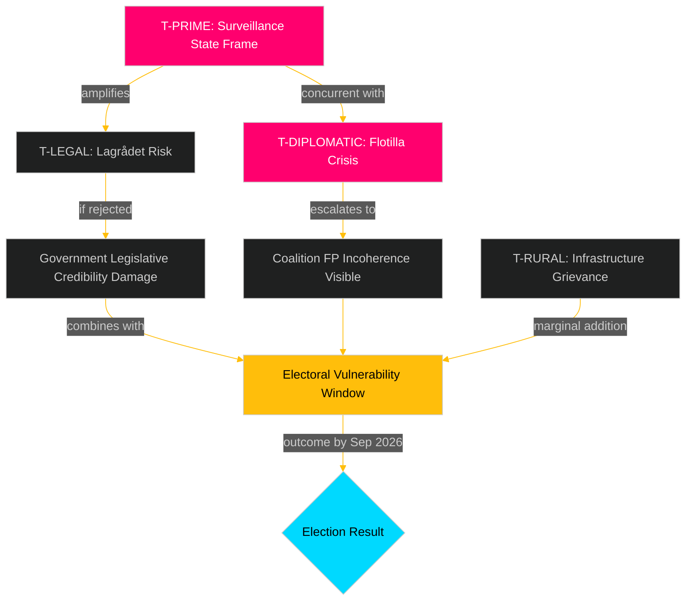

# Threat Analysis

## Threat Taxonomy

This analysis applies STRIDE-adjacent political threat modelling to the legislative agenda for week 20. Political threats are categorised by actor, vector, target, and electoral consequence.

## Primary Threats

### T-PRIME: Opposition "Security-State" Frame
**Actor**: S (Socialdemokraterna) + V + MP combined press conference strategy
**Vector**: Simultaneous submission of FöU18 (signal intelligence), HD03267 (security deportation), HD03261 (Skatteverket) creates single-week target
**Target**: Government's credibility as proportionate, rule-of-law-respecting administration
**WEP**: *The opposition is almost certainly planning to coordinate a "surveillance state" counter-narrative during week 20.* [B2]
**Electoral consequence**: Reinforces S positioning as defender of civil liberties vs M/SD security-maximalism frame. May erode C/L soft support for government.

### T-LEGAL: Lagrådet Rejection Risk
**Actor**: Lagrådet (constitutionally independent review body)
**Vector**: Absence of yttranden for HD03267, HD03261, HD03250 means constitutional review is outstanding
**Target**: Government's ability to pass security legislation on desired timeline
**WEP**: *It is likely that Lagrådet will require substantive revisions to at least one of the three May 7 propositions, most probably HD03267.* [B2]
**Electoral consequence**: If rejection comes before election, government faces either (a) delay past election day or (b) rushed amendment that signals incompetent drafting.

### T-DIPLOMATIC: Israeli Flotilla Crisis
**Actor**: Israeli Navy, Swedish citizens on Global Sumud, international media
**Vector**: Naval boarding of civilian vessel with Swedish nationals in international waters
**Target**: FM Malmer Stenergard's diplomatic positioning; coalition coherence on foreign policy
**WEP**: *It is likely that at least one parliamentary party will call for a stronger Swedish government response than currently being offered, creating public pressure dynamics before the election.* [B2]
**Electoral consequence**: M-SD tension on Israel policy becomes visible; V/MP energised; potential damage to government's foreign policy credibility.

### T-RURAL: Infrastructure Grievance Activation
**Actor**: Trafikverket (executing government cost-saving directive)
**Vector**: 25,000 street lighting pole removals in rural areas
**Target**: C and KD rural vote base
**WEP**: *It is possible that rural politicians in C/KD will publicly distance themselves from the Trafikverket decision, creating government-backbench tension.* [C2]
**Electoral consequence**: Feeds S/V narrative about underfunded rural public services. Limited but real cost in specific constituencies.

## Threat Interdependencies

## Mitigation Recommendations (Government Perspective)

1. **Decouple legislative narrative**: Announce FöU18 + HD03267 on separate press days rather than combined "security week" framing.
2. **Fast-track Lagrådet consultation**: Seek expedited yttranden on HD03250 and HD03261 to demonstrate rule-of-law compliance.
3. **Flotilla response protocol**: FM issues factual briefing on consular status before written parliamentary answer — pre-empts "government hiding information" frame.
4. **Rural light compromise**: Infrastructure minister offers partial rollback or community fund to soften political optics.
