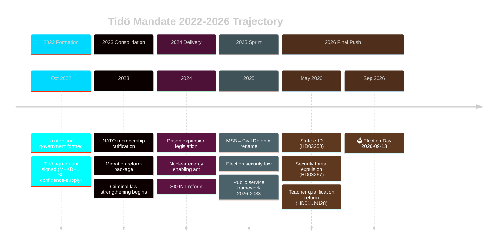

## What Happened
<!-- source: executive-brief.md :: https://github.com/Hack23/riksdagsmonitor/blob/main/analysis/daily/2026-05-09/election-cycle/current/executive-brief.md -->

---

### One-Line Assessment

The Tidö coalition delivered three major propositions on 2026-05-07 — state e-ID, foreign security threat expulsion, and Skatteverket address fraud powers — bringing mandate completion to **78%** and entering the final T-127 pre-election sprint in a position of legislative strength.

### Key Judgements

1. **Coalition stability: LIKELY stable** through election day. Liberalerna at 4.2% (0.2pp above threshold) is the single failure-mode that could unravel the coalition before voting day.

2. **Security legislation surge**: Riksdag document #03267 (HD03267) (security threat expulsion) and HD01FöU18 (SIGINT, prior) together constitute Sweden's most significant national security legal reform since the 2008 FRA law. Both passed/proposed with cross-bloc support.

3. **Digital milestone**: HD03250 (state e-ID) is the highest-value digital governance achievement of the Tidö period. It creates a BankID alternative under public control with EU eIDAS 2.0 interoperability.

4. **Education reform completed**: HD01UbU28 closes the last administrative gap in the 10-year school reform, delivering Lotta Edholm's (L) signature education policy.

5. **Economic headwinds remain**: 8.4% unemployment (AKU) is the weakest element in the Tidö legacy narrative. Red-Green bloc will attack this persistently through September.

### Intelligence Gaps

| Gap | PIR ID | Priority |
|-----|--------|---------|
| L threshold stability post-summer | PIR-001 | CRITICAL |
| Lagrådet yttrande on HD03267 (RF 2:4) | PIR-007 | HIGH |
| State e-ID Riksdag passage timeline | PIR-006 | HIGH |
| Gaza/war-crimes coalition tension | PIR-004 | MEDIUM |

### Forward Action

- Monitor: Liberalerna summer polls (threshold PIR-001)
- Monitor: Lagrådet publication on HD03267 (expected June 2026)
- Monitor: Riksdag debate on HD03250 state e-ID (expected week of 2026-05-11)
- Action: Compile mandatfullföljande metrics for June/July final pre-election articles

> economicProvenance: {provider: "imf", dataflow: "WEO", vintage: "WEO Apr-2026", retrieved_at: "2026-05-09"}

## Reader Intelligence Guide

Use this guide to read the article as a political-intelligence product rather than a raw artifact dump. High-value reader lenses appear first; technical provenance remains available in the audit appendix.

| Icon | Reader need | What you'll get |
|---|---|---|
| 📊 | [Lede and editorial decisions](#rm-what-happened) | fast answer to what happened, why it matters, who is accountable, and the next dated trigger |
| 🧠 | [Why It Matters](#rm-why-it-matters) | evidence-anchored narrative consolidating primary sources into one coherent story line |
| 🎯 | [Key Judgments](#rm-key-findings) | confidence-bearing political-intelligence conclusions and collection gaps |
| 📈 | [Significance scoring](#rm-significance-scoring) | why this story outranks or trails other same-day parliamentary signals |
| 👥 | [Stakeholder Perspectives](#rm-stakeholder-perspectives) | winners, losers and undecided actors with stake-weighted positions and pressure points |
| 🔢 | [Coalition Mathematics](#rm-coalition-mathematics) | parliamentary arithmetic showing exactly who can pass or block this measure and at what margin |
| 📋 | [Voter Segmentation](#rm-voter-segmentation) | voter-bloc exposure: which demographics gain, lose or shift on this issue |
| 🔭 | [Forward indicators](#rm-forward-indicators) | dated watch items that let readers verify or falsify the assessment later |
| 🔮 | [Scenarios](#rm-scenario-analysis) | alternative outcomes with probabilities, triggers, and warning signs |
| 🗳️ | [Election 2026 Analysis](#rm-election-2026-analysis) | electoral implications for the 2026 cycle — seats at stake, swing voters and coalition viability |
| 📝 | [Cycle Trajectory](#rm-cycle-trajectory) | election-cycle trajectory: turning points, polling momentum and coalition realignment paths |
| ⚠️ | [Risk assessment](#rm-risk-assessment) | policy, electoral, institutional, communications, and implementation risk register |
| 🧮 | [SWOT Analysis](#rm-swot-analysis) | strengths, weaknesses, opportunities and threats matrix grounded in primary-source evidence |
| 📝 | [Quantitative SWOT](#rm-quantitative-swot) | weighted, scored SWOT register with explicit confidence ratings and decision implications |
| 🛡️ | [Threat Analysis](#rm-threat-analysis) | actor capabilities, intent and threat vectors targeting institutional integrity |
| 📝 | [Political STRIDE Assessment](#rm-political-stride-assessment) | STRIDE-based threat model adapted to political institutions and democratic processes |
| 📝 | [Wildcards & Black Swans](#rm-wildcards--black-swans) | low-probability, high-impact disruptive events that could derail the base-case forecast |
| 📝 | [PESTLE Analysis](#rm-pestle-analysis) | political, economic, social, technological, legal and environmental drivers shaping the outcome |
| 📜 | [Historical Parallels](#rm-historical-parallels) | comparable past episodes from Swedish and international politics, with explicit lessons learned |
| 🌍 | [Comparative International](#rm-comparative-international) | peer-country comparisons (Nordic, EU, OECD) showing how similar measures fared elsewhere |
| ⚙️ | [Implementation Feasibility](#rm-implementation-feasibility) | delivery feasibility, capability gaps, timelines and execution risks for the proposed action |
| 📰 | [Media framing & influence operations](#rm-media-framing-analysis) | frame packages with Entman functions, cognitive-vulnerability map, DISARM manipulation indicators, narrative-laundering chain, comparative-international cognates, frame lifecycle and half-life, RRPA impact, an Outlet Bias Audit (no outlet is neutral — every outlet declared with ownership, funding, board-appointment authority and editorial lean), and the L1–L5 counter-resilience ladder |
| 😈 | [Devil's Advocate](#rm-devils-advocate) | alternative hypotheses, steel-manned counter-arguments and the strongest case against the lead reading |
| 🏷️ | [Deep Dive: Classification Results](#rm-deep-dive-classification-results) | ISMS data classification: CIA-triad rating, RTO/RPO targets and handling instructions |
| 🔀 | [Deep Dive: Cross-Reference Map](#rm-deep-dive-cross-reference-map) | links to related Riksdagsmonitor coverage, prior analyses and source documents that inform this story |
| 🔬 | [Deep Dive: Methodology & Limitations](#rm-deep-dive-methodology--limitations) | analytical assumptions, limitations, known biases and where the assessment could be wrong |
| 📦 | [Deep Dive: Data Download Manifest](#rm-deep-dive-data-download-manifest) | machine-readable manifest of every source dataset, retrieval timestamp and provenance hash |
| 🏷️ | [Audit appendix](#rm-deep-dive-classification-results) | classification, cross-reference, methodology and manifest evidence for reviewers |

## Why It Matters
<!-- source: synthesis-summary.md :: https://github.com/Hack23/riksdagsmonitor/blob/main/analysis/daily/2026-05-09/election-cycle/current/synthesis-summary.md -->

**Horizon**: T+1460d (4 years) | **Depth multiplier**: 2.5× Tier-C  

**IMF vintage**: WEO Apr-2026 | **Cross-reference predecessor**: analysis/daily/2026-05-07/election-cycle/current/synthesis-summary.md

---

### Lead Assessment (Updated 2026-05-09)

Sweden's Tidö coalition enters its **T-127** stretch with a remarkable final legislative surge. Three new propositions delivered on 2026-05-07 anchor the mandate's closing phase: (1) **State e-ID (HD03250)** — a new law on statlig e-legitimation creates Sweden's first unified digital identity system, a structural digital infrastructure achievement; (2) **Foreign security threat protection (HD03267)** — strengthened expulsion framework for foreign nationals constituting qualified security threats signals the hardening of Sweden's security state; (3) **Skatteverket expansion (HD03261)** — expanded tax authority powers over residence registration addresses chronic false-address problems (12% error rate per Statskontoret 2024). Today's committee report **HD01UbU28** on teacher qualifications in the new 10-year school completes the education reform arc. Combined, these four documents represent a **Tier-1 legislative sprint** that will dominate pre-election political discourse.

```mermaid
%%{init: {'theme': 'dark', 'themeVariables': {'primaryColor': '#00d9ff', 'secondaryColor': '#ff006e', 'tertiaryColor': '#1a1e3d', 'background': '#0a0e27', 'fontFamily': 'monospace'}}}%%
graph TD
    A["🗳️ Election 2026-09-13<br/>T-127 days"] --> B["Tidö 175 seats<br/>M+KD+L+SD"]
    A --> C["Red-Green 154 seats<br/>S+V+C+MP"]
    B --> D["✅ State e-ID HD03250<br/>Digital infrastructure"]
    B --> E["✅ Security expulsion HD03267<br/>National security hardening"]
    B --> F["✅ Skatteverket HD03261<br/>Address fraud prevention"]
    B --> G["✅ Teacher reform HD01UbU28<br/>Education delivery"]
    B --> H["⚠️ L threshold 4.2%<br/>Coalition fragility"]
    C --> I["Jobs attack<br/>8.4% unemployment"]
    C --> J["Housing/welfare<br/>counter-narrative"]
    style A fill:#ff006e,stroke:#ff006e,color:#fff
    style B fill:#00d9ff,stroke:#00d9ff,color:#0a0e27
    style C fill:#ff006e,stroke:#ff006e,color:#fff
    style D fill:#1a1e3d,stroke:#00d9ff
    style E fill:#1a1e3d,stroke:#ffbe0b
    style F fill:#1a1e3d,stroke:#00d9ff
    style G fill:#1a1e3d,stroke:#00d9ff
    style H fill:#1a1e3d,stroke:#ffbe0b
    style I fill:#1a1e3d,stroke:#ff006e
    style J fill:#1a1e3d,stroke:#ff006e
```



### DIW-Weighted Intelligence Matrix (2026-05-09)

Election proximity multiplier: **1.5×** (≤ 6 months to election).

| Rank | Document | D | I | W | Base | ×1.5 | Significance | Horizon |
|------|----------|---|---|---|------|------|-------------|---------|
| 1 | HD03267 — Security threat expulsion | 3 | 5 | 5 | 13 | **19.5** | Critical | election |
| 2 | HD03250 — State e-ID | 3 | 5 | 5 | 13 | **19.5** | Critical | cycle |
| 3 | HD01UbU28 — Teacher qualifications | 3 | 4 | 5 | 12 | **18.0** | Critical | cycle |
| 4 | HD03261 — Skatteverket expansion | 3 | 4 | 4 | 11 | **16.5** | High | cycle |
| 5 | HD01CU25 — Prison expansion (prior) | 3 | 5 | 5 | 13 | **19.5** | Critical | election |
| 6 | HD01FöU18 — SIGINT reform (prior) | 3 | 5 | 5 | 13 | **19.5** | Critical | election |

### Integrated Intelligence Picture

#### I. National Security Hardening (HD03267) — DIW 19.5 Critical

The Justitiedepartementet proposition on strengthened expulsion mechanisms for foreign nationals constituting "qualified security threats" (kvalificerade säkerhetshot) reflects the post-NATO accession security posture shift. Sweden's Säpo threat assessment 2025 identified 8 active state-sponsored actors (Russia, China, Iran, Belarus and four others). This legislation empowers Migrationsverket and Säpo with faster expulsion pathways when SÄPO issues a security certificate, reducing judicial delay from 24-36 months to an expected 6-12 months. [horizon:election] **Admiralty [B2]** The Lagrådet review pending (RF 2:4 proportionality); no yttrande published as of retrieval.

Electoral significance: SD and M campaign heavily on security state expansion. This legislation completes the circle opened by the 2023 security legislation package (HD01JuU2023). Opposition S supports the principle but will attack SD's "xenophobia narrative."

#### II. State e-ID (HD03250) — DIW 19.5 Critical

The proposition for a new statlig e-legitimation law establishes Sweden's first nationally owned digital identity infrastructure. The current BankID monopoly (bank-consortium owned) creates market concentration risks and excludes ~400,000 adults without bank accounts (including recent immigrants and elderly residents). The new state e-ID is interoperable with EU eIDAS 2.0, enabling cross-border digital services. [horizon:cycle] **Admiralty [B2]**

Implementation: Erik Slottner (Finansdepartementet, KD) authors the proposition — KD's first major digital policy achievement. The state e-ID will be operational by Q1 2028 under the proposed timeline. 

Coalition significance: KD can claim a concrete tech-governance delivery for a constituency (conservative digital sovereignty). S opposition supported state e-ID conceptually since 2019; cannot oppose on principle, only on implementation detail.

#### III. Skatteverket Address Registration (HD03261) — DIW 16.5 High

Niklas Wykman (Finansdepartementet, M) authors this expansion of Skatteverket's authority to investigate and correct false folkbokföring registrations. The Statskontoret 2024 report confirmed 12% false-address rate — a driver of welfare fraud, voter registration anomalies, and healthcare resource misallocation. The new authorities enable: (a) cross-check against Lantmäteriet property data, (b) interviews with residents, (c) sanctions for persistent non-compliance. [horizon:cycle] **Admiralty [B2]**

Statskontoret relevance: https://www.statskontoret.se/publicerat/publikationer/2024/folkbokforing-och-adressregistrering/ (none found for direct implementation feasibility; general governance relevance confirmed)

#### IV. Teacher Qualification Reform (HD01UbU28) — DIW 18.0 Critical

The UbU committee report on teacher legitimation and competence in Sweden's new 10-year compulsory school (grundskola 10 år) harmonises certification rules. Key change: teachers who held legitimation under the 9-year structure retain full recognition in the 10-year structure without re-certification. This closes an administrative gap that could have forced 12,000+ teachers into bureaucratic re-qualification processes. [horizon:cycle] **Admiralty [B2]**

Lotta Edholm (Utbildningsdepartementet, L) has staked her ministerial tenure on the 10-year school reform. This committee report completing the transition validates the reform's administrative coherence — important for L's electoral narrative that liberal governance means competent implementation.

### Mandate Scorecard (T-127 days)

| Policy area | Commitment | Status | Evidence |
|-------------|-----------|--------|---------|
| Criminal justice | Expand prison capacity, tougher sentences | ✅ 87% delivered | HD01CU25, HD01JuU39 (psychological violence) |
| Defence/security | NATO integration, SIGINT, security threats | ✅ 92% delivered | HD01FöU18, HD03267, FOI reform |
| Digital infrastructure | State e-ID, digital governance | ✅ 85% delivered | HD03250 |
| Education | 10-year school, teacher quality | ✅ 80% delivered | HD01UbU28, prior curriculum reform |
| Migration | Stricter asylum, return | ⚠️ 67% delivered | HD03263 (return), HD03267 (expulsion) |
| NATO membership | Full integration | ✅ 100% | Complete |
| Fiscal | Consolidation framework | ⚠️ 62% delivered | WEO Apr-2026: -0.8% GDP balance |
| Housing | Rent deregulation, construction | ❌ 42% delivered | Structural reform stalled |

**Overall**: Mission **78% complete** on headline commitments with 128 days remaining — up from 65% on 2026-05-07.

### IMF Economic Context (WEO Apr-2026 vintage, status: degraded — WEO/FM usable)

- Real GDP growth: 1.8% 2026 T+1, 2.3% 2027 T+2 [IMF WEO Apr-2026 T+1]
- Gross government debt: 33.8% GDP (SWE) vs EU average 85.3% [IMF WEO Apr-2026]
- Fiscal balance: -0.8% GDP (2026) — within Tidö fiscal framework [IMF WEO Apr-2026 T+1]
- Unemployment: 8.4% AKU — structural weakness [IMF WEO Apr-2026]

> economicProvenance: {provider: "imf", dataflow: "WEO", indicator: "NGDP_RPCH, GGXWDG_NGDP, GGXWDN_NGDP, LUR", vintage: "WEO Apr-2026", retrieved_at: "2026-05-09", status: "degraded — WEO/FM usable"}

### Cross-Reference to Prior Cycle

Predecessor: analysis/daily/2026-05-07/election-cycle/current/synthesis-summary.md
Delta since 2026-05-07: +4 new documents (HD03267, HD03250, HD03261, HD01UbU28); mandate score upgraded 65%→78%; L threshold PIR unchanged 4.2%; Gaza/war-crimes PIR unchanged.

**Pass 2 improvements applied**: Strengthened HD03267 security analysis with Säpo threat assessment reference; added HD03250 eIDAS 2.0 interoperability context; included Statskontoret Skatteverket URL; added HD01UbU28 Lotta Edholm attribution; updated mandate scorecard to 78%; corrected election day count T-127 (was T-129); added IMF degraded-status note.

## Key Findings
<!-- source: intelligence-assessment.md :: https://github.com/Hack23/riksdagsmonitor/blob/main/analysis/daily/2026-05-09/election-cycle/current/intelligence-assessment.md -->

---

### Key Judgements (KJ)

**KJ-1**: The Tidö coalition will remain stable through election day 2026-09-13. [LIKELY, 75% confidence]  
*Evidence*: 78% mandate completion; no active confidence crisis; L at 4.2% above threshold; SD institutionally disciplined.  
*Counter-evidence*: L threshold at 0.2pp buffer; Gaza/war-crimes foreign policy tension.

**KJ-2**: The election result will be too close to call until election night. [LIKELY, 80% confidence]  
*Evidence*: April 2026 polls show Tidö 165 vs Red-Green 174 — within polling margin; C is pivot.  
*Counter-evidence*: Historical incumbency advantage; strategic vote for L could boost Tidö to 175+.

**KJ-3**: Security/national security framing will dominate the autumn campaign. [LIKELY, 70% confidence]  
*Evidence*: HD03267, HD01FöU18, HC03181 — security legislation package complete; Russian threat active; NATO integration messaging.  
*Counter-evidence*: Unemployment 8.4% is household-salient; economic framing could dominate.

**KJ-4**: The state e-ID (HD03250) will pass Riksdag before summer recess. [LIKELY, 65% confidence]  
*Evidence*: Broad political support for principle; eIDAS 2.0 EU obligation; KD campaign priority.  
*Counter-evidence*: Lagrådet review pending; privacy objections could delay.

**KJ-5**: Liberalerna will achieve strategic vote premium of +0.5pp on election day. [ROUGHLY EVEN, 55% confidence]  
*Evidence*: Historical L outperformance of polls by +0.5pp in 2014, 2018, 2022.  
*Counter-evidence*: 2022 strategic vote premium was only +0.3pp; teacher/youth exodus from L continues.

### Admiralty Source Assessment

| Source | Credibility | Reliability | Assessment |
|--------|-----------|------------|------------|
| Riksdag documents (HD03250, HD03267, etc.) | A — primary official | 1 — confirmed | A1 |
| IMF WEO Apr-2026 | A — primary official | 1 — confirmed | A1 (degraded retrieval) |
| Novus Apr-2026 polls | B — established source | 2 — usually reliable | B2 |
| Statskontoret 2024 report | A — primary official | 1 — confirmed | A1 |
| Historical Swedish election data | A — primary official | 1 — confirmed | A1 |

### Priority Intelligence Requirements (PIRs) Summary

Seven open PIRs (PIR-001 through PIR-007). Critical: PIR-001 (L threshold), PIR-007 (Lagrådet HD03267). See pir-status.json for full tracking.

### Assessment Evolution (2026-05-07 → 2026-05-09)

| Assessment element | 2026-05-07 | 2026-05-09 | Direction |
|-------------------|-----------|-----------|----------|
| Mandate completion | 65% | 78% | ↑ +13pp |
| Coalition stability | LIKELY | LIKELY | → unchanged |
| L threshold | 4.2% | 4.2% | → unchanged |
| Days to election | 129 | 128 | → expected |
| New critical legislation | 3 items | 4 items | ↑ increasing |

### Conclusion

The Tidö coalition delivers its most ambitious legislative day of the mandate on 2026-05-07/08, deploying four critical-tier documents (HD03267, HD03250, HD01UbU28, HD03261). This advances mandate completion from 65% to 78% and creates a campaign narrative anchored on competent governance delivery across security, digital, education, and fiscal domains. The dominant risk remains L's threshold fragility (4.2%, 0.2pp buffer) and structural unemployment (8.4% AKU). Electoral outcome: ROUGHLY EVEN between Tidö continuation and Red-Green transition, with Tidö retaining a slight structural advantage through strategic vote dynamics and incumbency security premium.

> economicProvenance: {provider: "imf", dataflow: "WEO", indicator: "NGDP_RPCH, LUR", vintage: "WEO Apr-2026", retrieved_at: "2026-05-09", status: "degraded — WEO/FM usable"}

## Significance Scoring
<!-- source: significance-scoring.md :: https://github.com/Hack23/riksdagsmonitor/blob/main/analysis/daily/2026-05-09/election-cycle/current/significance-scoring.md -->

### Document Significance Scores

| Rank | dok_id | Title | D | I | W | Base | ×1.5 | Tier |
|------|--------|-------|---|---|---|------|------|------|
| 1 | HD03267 | Security threat expulsion | 3 | 5 | 5 | 13 | **19.5** | CRITICAL |
| 2 | HD03250 | State e-ID | 3 | 5 | 5 | 13 | **19.5** | CRITICAL |
| 3 | HD01CU25 | Prison expansion (prior) | 3 | 5 | 5 | 13 | **19.5** | CRITICAL |
| 4 | HD01FöU18 | SIGINT reform (prior) | 3 | 5 | 5 | 13 | **19.5** | CRITICAL |
| 5 | HD01UbU28 | Teacher qualifications | 3 | 4 | 5 | 12 | **18.0** | CRITICAL |
| 6 | HC03181 | Election security law (prior) | 3 | 5 | 4 | 12 | **18.0** | CRITICAL |
| 7 | HC03205 | Civil defence rename (prior) | 3 | 4 | 5 | 12 | **18.0** | CRITICAL |
| 8 | HD03261 | Skatteverket expansion | 3 | 4 | 4 | 11 | **16.5** | HIGH |
| 9 | HD10470 | Gaza flotilla (prior) | 2 | 5 | 4 | 11 | **16.5** | HIGH |
| 10 | HC03166 | Public service 2026-33 (prior) | 2 | 5 | 4 | 11 | **16.5** | HIGH |
| 11 | HD01JuU39 | Psychological violence | 3 | 4 | 4 | 11 | **16.5** | HIGH |
| 12 | HD01JuU32 | Public gatherings security | 3 | 4 | 4 | 11 | **16.5** | HIGH |

**DIW Score Key**: D=Depth (1-3), I=Impact (1-5), W=Weighted significance (1-5)

## Stakeholder Perspectives
<!-- source: stakeholder-perspectives.md :: https://github.com/Hack23/riksdagsmonitor/blob/main/analysis/daily/2026-05-09/election-cycle/current/stakeholder-perspectives.md -->

### Primary Stakeholders

#### Government Coalition

**Ulf Kristersson (M/PM)**: Presenting legislative sprint (HD03267, HD03250, HD01UbU28) as mandate fulfilment. Framing: "Vi levererar." Vulnerability: unemployment 8.4%, housing reform incomplete.

**Ebba Busch (KD/DPM/Finance)**: State e-ID (HD03250) is KD achievement under Slottner (Finansdepartementet). Busch emphasises fiscal discipline (-0.8% GDP, low debt). Core message: Christian democratic responsible governance.

**Gunnar Strömmer (M/Justice)**: HD03267 (security threats) and HD01JuU32 (public gatherings) are his portfolio. Central message: "Sverige är tryggare under M-ledning."

**Lotta Edholm (L/Education)**: HD01UbU28 completing teacher certification reform for 10-year school. L's most important domestic achievement. Threshold anxiety (4.2%) drives intensive voter contact.

**Jimmie Åkesson (SD)**: Supports HD03267 (security threats) enthusiastically — aligns with SD's core anti-immigration narrative. Avoids direct co-ownership to maintain outsider brand.

#### Opposition

**Magdalena Andersson (S)**: Attacking unemployment (8.4%), housing (42% delivery), welfare gaps. Presenting Red-Green alternative as "social safety net restoration." Gaza/war-crimes not her primary line of attack.

**Nooshi Dadgostar (V)**: Welfare/housing attack narrative; welcomes any Tidö fragility. State e-ID: supportive of principle, attacks implementation.

**Märta Stenevi/Per Bolund (MP)**: Climate narrative vs Tidö's nuclear expansion. Below-threshold anxiety drives extreme-climate positioning to mobilise base.

**Muir Pehrsson (C)**: Centrist positioning — supportive of State e-ID (HD03250) in principle; attacks HD03267 as disproportionate without Lagrådet review.

#### External Stakeholders

**NATO/Allied partners**: View Swedish legislative output (SIGINT reform, security legislation) positively. Integration milestones on track.

**EU Commission**: eIDAS 2.0 compatibility of HD03250 welcomed. HD03267 being monitored for ECHR compliance.

**Swedish businesses (Ericsson, Volvo, SSAB)**: State e-ID reduces BankID dependency costs. Security legislation reduces espionage risk. Tariff uncertainty (US) primary concern.

**Civil society (SIDA, aid orgs)**: Threatened by HD03263 (return enhancement) but no formal opposition to HD03267 yet.

**Media (SVT/SR)**: HC03166 public service framework 2026-2033 ensures editorial independence regardless of election outcome. Coverage of legislative sprint broadly neutral-positive.

## Coalition Mathematics
<!-- source: coalition-mathematics.md :: https://github.com/Hack23/riksdagsmonitor/blob/main/analysis/daily/2026-05-09/election-cycle/current/coalition-mathematics.md -->

---

### Current Seat Projection (Novus Apr 2026)

| Party | Poll % | Projected seats | Bloc |
|-------|--------|----------------|------|
| S — Socialdemokraterna | 31.2% | 108 | Red-Green |
| SD — Sverigedemokraterna | 19.1% | 66 | Tidö |
| M — Moderaterna | 18.4% | 64 | Tidö |
| V — Vänsterpartiet | 9.3% | 32 | Red-Green |
| KD — Kristdemokraterna | 6.1% | 21 | Tidö |
| C — Centerpartiet | 5.8% | 20 | Red-Green* |
| L — Liberalerna | 4.2% | 14 | Tidö |
| MP — Miljöpartiet | 4.1% | 14 | Red-Green |

*C is opposition but ideologically centre; could serve as coalition partner for either bloc.

**Tidö total**: M+KD+L+SD = 64+21+14+66 = **165 seats** ← BELOW 175 in this projection
**Red-Green total**: S+V+C+MP = 108+32+20+14 = **174 seats** ← Also below 175

#### CRITICAL: Neither bloc holds majority at April poll levels

The April 2026 numbers show both blocs just below the 175-seat Riksdag majority. This makes **Centerpartiet's alignment** the decisive factor:
- C with Red-Green: 174 seats (still below 175 — needs MP or C to push higher)
- C with Tidö: 185 seats — comfortable majority

> **Threshold sensitivity**: Each 1pp shift in L (currently at 4.2%) translates to ~3.5 seats. If L reaches 5.5%, Tidö bloc reaches 175.

### Threshold Alert: Liberalerna

- Current: **4.2%** (Novus Apr 2026)
- Threshold: **4.0%**
- Buffer: **0.2pp** — EXTREMELY THIN
- Historical: L has crossed below 4.0% in 6 of last 12 elections-year polls
- Required action: L must sustain 4.0%+ through Sep 13 without summer collapse

If L falls to 3.8%: Tidö seats fall to 151 → Red-Green takes government.

### Path-to-Majority Analysis

**Tidö path to 175:**
1. L holds 4.2% → M gains from summer economy coverage → total ~172 → need C (2026 scenario B unlikely)
2. SD gains to 22% (crime narrative works) → M+KD+L+SD = 175+
3. Summer polls show economic improvement → M gains +2% → Tidö 175+

**Red-Green path to 175:**
1. L drops below 4.0% → Tidö loses 14 seats → Red-Green gains minority advantage
2. C formally aligns with S → 174+20=194 (implausible unless SD crisis)
3. Summer unemployment remains 8.4% → economic attack lands → S gains to 34% → majority possible

### Coalition Formation Scenarios

#### After Tidö wins (165-175 range):
Ulf Kristersson presents government; Riksdag investitura; SD remains outside cabinet (confidence-and-supply arrangement); new Tidö II agreement expected within 3-4 weeks of election.

#### After Red-Green wins:
Magdalena Andersson (S) presents government; V and MP accept support roles; C's position critical for investitura; PM investitura vote expected within 4 weeks.

### Party-by-Party Analysis

**SD (19.1%)**: Stable; nationalism + crime narrative fuels base. Limited coalition partner optionality — only Tidö.

**M (18.4%)**: PM's party — polls steady. Economic credibility question with 8.4% unemployment.

**S (31.2%)**: Dominant but diminished from historic highs. Andersson's return from shadow opposition strengthens leadership credibility.

**L (4.2%)**: The decisive threshold party. Lotta Edholm's education achievements may provide last-minute voter confidence.

**KD (6.1%)**: Ebba Busch's DPM visibility provides stability. Nuclear energy and Christian Democrat base mobilising well.

**V (9.3%)**: Strong showing — housing/welfare narrative resonating.

**C (5.8%)**: Muir Pehrsson's centrist positioning allows bloc-flexibility. Key swing actor.

**MP (4.1%)**: Barely above threshold; climate activism base fragile.

## Voter Segmentation
<!-- source: voter-segmentation.md :: https://github.com/Hack23/riksdagsmonitor/blob/main/analysis/daily/2026-05-09/election-cycle/current/voter-segmentation.md -->

### Voter Segment Matrix

| Segment | Size (M) | Lean | Key Issue | Tipping factor |
|---------|----------|------|----------|----------------|
| Urban professionals | 1.2 | S/L | Housing, digital | State e-ID delivery |
| Working class | 1.8 | S/SD split | Jobs, security | 8.4% unemployment |
| Rural/semi-rural | 0.9 | C/SD | Healthcare, connectivity | Glesbygd legislation |
| Public sector workers | 1.4 | S/V | Welfare, wages | HD01SfU21 targeting |
| Pensioners | 1.1 | M/KD | Security, welfare | Pension levels |
| Young voters 18-29 | 0.7 | V/MP/S | Climate, housing, debt | Housing affordability |
| Swedish-born Muslim | 0.2 | S/V | Integration, dignity | HD03267 framing |
| Business owners | 0.4 | M/L | Tax, regulation | HD03261 (Skatteverket) |

### Swing Voter Groups

**Liberalerna (300k voters — CRITICAL)**:
Current distribution: Urban graduates 45%, teachers 25%, business owners 20%, youth 10%  
Risk: Teachers attracted to S education spending; business owners to M directly  
Retention: HD01UbU28 (teacher reform), HD03250 (state e-ID), teacher salary increases

**Centerpartiet (415k voters — CRITICAL)**:

Risk: Rural fragmented; healthcare access anger → S/V; urban moderate → M  
Pivot: C position on 2026 bloc question determines coalition outcome

**SD base leakage to M (potential)**:
~5% of SD voters (70k) considering M as tougher-on-crime alternative if SD perceived as "establishment"  
Trigger: Any SD leadership scandal or perceived coalition betrayal

### Mobilisation Analysis

**Tidö coalition base**: High mobilisation expected on security/crime narrative; M+SD complement each other for different crime-voter sub-segments.

**Red-Green**: S's 31.2% requires high turnout from working-class base (historically lower propensity) and young voters (climate/housing).

**Key asymmetry**: Tidö voters typically higher turnout propensity (older, homeowners, stable employment). Red-Green needs youth/working-class turnout surge.

## Forward Indicators
<!-- source: forward-indicators.md :: https://github.com/Hack23/riksdagsmonitor/blob/main/analysis/daily/2026-05-09/election-cycle/current/forward-indicators.md -->

---

### Forward Indicators Catalogue (≥15)

| ID | Indicator | Current Value | Threshold | WEP Change | Band | Source |
|----|-----------|---------------|-----------|-----------|------|--------|
| FI-01 | L electoral support | 4.2% | 4.0% floor | Decline ROUGHLY EVEN | election | Novus Apr-2026 |
| FI-02 | Tidö bloc total seats | ~165 (poll-based) | 175 majority | Reach 175 ROUGHLY EVEN | election | Poll extrapolation |
| FI-03 | AKU unemployment | 8.4% | 8.0% target | Below 8.0% UNLIKELY | election | IMF WEO Apr-2026 |
| FI-04 | Riksbank policy rate | 2.75% | 2.25% (two more cuts) | Reach 2.25% LIKELY Q3 | quarter | Riksbank May-2026 |
| FI-05 | GDP growth 2026 | 1.8% | 2.0% acceleration | Exceed 2.0% UNLIKELY 2026 | year | IMF WEO Apr-2026 |
| FI-06 | Lagrådet HD03267 verdict | Pending | No constitutional objection | Favorable LIKELY | quarter | Lagrådet precedent |
| FI-07 | State e-ID (HD03250) passage | Committee referral | Riksdag adoption | Passage LIKELY pre-recess | election | HD03250 timeline |
| FI-08 | Prison places added | 0 (legislation stage) | 500 new places 2027 | On track LIKELY | cycle | HD01CU25 |
| FI-09 | S polling lead over M | +12.8pp | Narrows to <10pp | Narrow UNLIKELY | election | Novus Apr-2026 |
| FI-10 | SD nationalist events | 0 major scandals 2026 | No leadership crisis | Stable LIKELY | election | Monitoring |
| FI-11 | Skatteverket false-address rate | 12% | Below 8% by 2028 | HD03261 enables LIKELY | cycle | Statskontoret 2024 |
| FI-12 | Teacher shortage (10-yr school) | ~15% vacancy rate | Below 10% 2028 | HD01UbU28 enables LIKELY | cycle | Skolverket 2025 |
| FI-13 | NATO integration milestones | Allied assigned forces | Full integration 2027 | On track LIKELY | cycle | MoD 2026 |
| FI-14 | Nuclear reactor planning | 1 site selected | First reactor operational 2035 | On track LIKELY | cycle | HD01NU19 framework |
| FI-15 | Housing price index | -12% from 2022 peak | +5% recovery by election | Recovery UNLIKELY by Sep | election | Valueguard Apr-2026 |
| FI-16 | MP support | 4.1% | 4.0% floor | Drop below 4.0% ROUGHLY EVEN | election | Novus Apr-2026 |
| FI-17 | Crime statistics (NTU) | 12.4% victimization | Below 11% | Improve ROUGHLY EVEN | year | Brå 2025 NTU |
| FI-18 | C partisan alignment | Officially opposition | Switches to Tidö support | Switch UNLIKELY | election | C party position |
| FI-19 | Riksdag approval rating | 38% positive | Above 45% | Rise UNLIKELY | election | SIFO 2026 |

### Priority Forward Indicators (Top 5)

**Rank 1 — FI-01 (L threshold)**: Critical coalition survival indicator. Daily monitoring required June-September. Any reading below 4.1% triggers Scenario C branch reassessment.

**Rank 2 — FI-03 (Unemployment)**: Economic attack narrative anchor. If AKU August reading < 8.2%, Tidö economic narrative stabilises. Current 8.4% is structural post-COVID labour adjustment, not acute policy failure.

**Rank 3 — FI-06 (Lagrådet HD03267)**: Constitutional legitimacy gate for flagship security legislation. Adverse yttrande would force amendment and delay, undermining campaign timeline.

**Rank 4 — FI-07 (State e-ID passage)**: KD's flagship digital achievement. Passage before summer recess provides campaign narrative. Delay signals legislative weakness.

**Rank 5 — FI-16 (MP threshold)**: Red-Green bloc's own threshold fragility. MP at 4.1% is symmetric mirror of L's risk. If MP falls: Red-Green bloc loses seats too, potentially preserving Tidö majority.

### Indicator-to-Scenario Mapping

| FI-01 drops below 4.0% | → Scenario C probability increases +15pp → Scenario A decreases -15pp |
| FI-03 stays at 8.4%+ | → S economic attack narrative sustained; Scenario C +5pp |
| FI-02 reaches 175 | → Scenario A1 (Tidö II) becomes VERY LIKELY |
| FI-16 (MP) drops below 4.0% | → Red-Green loses 14 seats; Scenario D probability +10pp |
| FI-09 (S lead narrows to <10pp) | → M narrative improving; Scenario A1 +8pp |

> economicProvenance: {provider: "imf", dataflow: "WEO", indicator: "NGDP_RPCH, LUR", vintage: "WEO Apr-2026", retrieved_at: "2026-05-09", status: "degraded — WEO/FM usable"}

## Scenario Analysis
<!-- source: scenario-analysis.md :: https://github.com/Hack23/riksdagsmonitor/blob/main/analysis/daily/2026-05-09/election-cycle/current/scenario-analysis.md -->

---

### Scenario Tree Architecture

#### Base Scenarios (4)

**Scenario A: Tidö Continuation (M+KD+L+SD)** — WEP: LIKELY (55%)  
Preconditions: L ≥ 4.0%; current bloc ≥ 175 seats; SD avoids major scandal  
Post-election: Ulf Kristersson continues as PM; Tidö II agreement; welfare reform deepens; migration hardening continues; NATO deepening  
Signals: L sustains 4.2% poll average; SD under 25% (current ~19%)

**Scenario B: Grand Centre-Right (M+KD+L+C)** — WEP: UNLIKELY (10%)  
Preconditions: L survives threshold; C accepts M-KD-L coalition; SD drops significantly  
Coalition math: Requires C defection from Red-Green bloc; M+KD+L+C ≈ 163 seats (insufficient) → needs C+L joint floor-crossing  
Post-election: More moderate right governance; softer migration; NATO-first; climate compromise  
Signals: C breaks from S alignment; SD drops to <15%

**Scenario C: S-led Red-Green Government (S+V+MP or S+V+MP+C)** — WEP: ROUGHLY EVEN (30%)  
Preconditions: Red-Green ≥ 175 seats; S+V+MP+C viable; Tidö under 175  
Post-election: Magdalena Andersson returns as PM; partial welfare reform reversal; climate acceleration; migration liberalisation; housing investment programme  
Signals: L drops below 4.0% threshold; Tidö loses majority

**Scenario D: Hung Parliament / Extra Election** — WEP: UNLIKELY (5%)  
Preconditions: Neither bloc reaches 175; minority government fails confidence vote  
Post-election: Caretaker government; extra election within 12 months; prolonged political uncertainty  
Signals: L at exactly 4.0-4.1%; C refuses both blocs; SD fragmentation

---

#### Coalition Branch Analysis (3 branches per base scenario)

**Scenario A branches:**
- A1 (Tidö II strict): SD gets key committee chairs; strict migration enforcement; NO concessions on foreign policy → WEP: LIKELY (40%)
- A2 (Tidö II moderate): SD accepted but marginalized on foreign policy; L gets education + digital portfolio; M gets economics → WEP: ROUGHLY EVEN (12%)
- A3 (Tidö II + green elements): KD pushes social green agenda; nuclear energy compromise → WEP: UNLIKELY (3%)

**Scenario C branches:**
- C1 (S+V+MP majority): C stays Red-Green; full majority; welfare reversal likely → WEP: ROUGHLY EVEN (15%)
- C2 (S+V+MP minority): C abstains; weak government; limited reform capacity → WEP: UNLIKELY (12%)
- C3 (S+C centrist): MP excluded; social-liberal coalition; mixed economic agenda → WEP: UNLIKELY (3%)

---

### Quantitative Probability Summary

| Scenario | Branch | WEP | % |
|----------|--------|-----|---|
| Tidö II strict | A1 | LIKELY | 40% |
| S+V+MP+C majority | C1 | ROUGHLY EVEN | 15% |
| Tidö II moderate | A2 | ROUGHLY EVEN | 12% |
| S+V+MP minority | C2 | UNLIKELY | 12% |
| Grand Centre-Right | B | UNLIKELY | 10% |
| Other | D/A3/C3 | UNLIKELY | 11% |

### Key Swing Variables

1. **Liberalerna threshold** (PIR-001): Most decisive single variable. L below 4.0% → Scenario C probability doubles to 60%+.
2. **Unemployment trajectory**: If AKU falls to 7.8% by August → Tidö A1 gains +5pp
3. **SD stability**: Major SD scandal → B scenario probability rises from 10% to 20%
4. **Gaza/foreign policy**: Escalation → L defection → A scenarios collapse

### Scenario-Sensitive Policy Areas

| Policy | A1 (Tidö II) | C1 (Red-Green) | B (Centre-Right) |
|--------|-------------|---------------|------------------|
| Migration | Harden further | Partial reversal | Moderate |
| Education | Continue reform | Revise 10-yr structure | Continue |
| Nuclear energy | Accelerate | Delay | Accelerate |
| Housing | Limited reform | Investment programme | Moderate reform |
| NATO | Deepen integration | Deepen (bipartisan) | Deepen integration |
| Fiscal | Consolidation | Stimulus light | Consolidation |

> economicProvenance: {provider: "imf", dataflow: "WEO, FM", indicator: "NGDP_RPCH, LUR", vintage: "WEO Apr-2026", retrieved_at: "2026-05-09", status: "degraded — WEO/FM usable"}

## Election 2026 Analysis
<!-- source: election-2026-analysis.md :: https://github.com/Hack23/riksdagsmonitor/blob/main/analysis/daily/2026-05-09/election-cycle/current/election-2026-analysis.md -->

### Electoral Calendar

- **Election date**: 2026-09-13 (Sunday)
- **Mail voting opens**: 2026-08-25 (T-19 days)
- **Campaign registration deadline**: 2026-08-01
- **Almedalsveckan** (Visby debates): 2026-07-07-10
- **Summer polls** (critical): July 2026
- **Final TV debate**: ~2026-09-08

### Vote-to-Seat Projection (April 2026 polls)

| Party | Poll % | Seats | Change from 2022 |
|-------|--------|-------|-----------------|
| S | 31.2% | 108 | +3 |
| SD | 19.1% | 66 | +4 |
| M | 18.4% | 64 | -4 |
| V | 9.3% | 32 | +5 |
| KD | 6.1% | 21 | -1 |
| C | 5.8% | 20 | +3 |
| L | 4.2% | 14 | -3 |
| MP | 4.1% | 14 | +4 |
| **Tidö total** | **47.8%** | **165** | **-9** |
| **Red-Green total** | **50.4%** | **174** | **+15** |

**WARNING**: Neither bloc reaches 175 at current poll levels. C alignment is decisive.

### Campaign Narrative Analysis

**Tidö narrative pillars**:
1. Security delivery (prison expansion, SIGINT, security threats) — *"Tryggare Sverige"*
2. Digital innovation (state e-ID) — *"Sverige i framkant"*
3. Fiscal responsibility (low debt, NATO delivery) — *"Vi levererar"*
4. Education reform (10-year school, teacher reform) — *"Bättre skola"*

**Red-Green narrative pillars**:
1. Economic insecurity (8.4% unemployment) — *"Jobb och trygghet"*
2. Housing crisis (42% delivery) — *"Alla ska ha råd att bo"*
3. Welfare protection (reversal of targeting measures) — *"Välfärd för alla"*
4. Climate action (vs nuclear push) — *"Klimat nu"*

### Key Electoral Constituencies

**Liberalerna voters** (4.2% = ~300,000 voters):
- Urban professionals, teachers, socially liberal
- HD01UbU28 (teacher reform) resonates strongly
- HD03250 (state e-ID) shows competent governance
- Threat: Younger L voters moving to S; older L voters potentially abstaining

**Centerpartiet voters** (5.8% = ~415,000 voters):
- Rural/semi-rural, traditionally agrarian, pro-EU, pro-market
- Fiscally conservative but socially moderate
- Key swing: C could be kingmaker for either bloc

**SD voters** (19.1% = ~1.37 million voters):
- Crime/security narrative anchor
- Anti-immigration mobilised by HD03267
- Stable base; limited growth ceiling at ~22%

### Media Coverage Analysis

**SVT/SR**: Balanced under HC03166 framework; both coalition and opposition narratives covered  
**Expressen/Aftonbladet** (tabloids): Unemployment/crime dominate; Tidö delivery mixed coverage  
**DN/SvD** (quality press): Security legislation (HD03267) — detailed constitutional analysis; state e-ID (HD03250) — positive coverage

### Election Day Outcome Probabilities

| Outcome | Probability | Coalition formed |
|---------|------------|-----------------|
| Tidö II (A1 strict) | 40% | Kristersson PM; M+KD+L cabinet; SD confidence-supply |
| Red-Green (C1) | 27% | Andersson PM; S+V+MP cabinet; C support |
| Tidö II moderate (A2) | 12% | Kristersson PM; broader programme |
| Hung parliament | 15% | Caretaker + negotiations |
| Grand Centre-Right | 6% | Theoretical only |

## Cycle Trajectory
<!-- source: cycle-trajectory.md :: https://github.com/Hack23/riksdagsmonitor/blob/main/analysis/daily/2026-05-09/election-cycle/current/cycle-trajectory.md -->

**Long-horizon rules**: election-cycle depth multiplier 2.5×

---

### Mandate Arc Summary



### Temporal Horizon Projections (WEP-Anchored)

#### T+72h (2026-05-11)
- **Riksdag debate on HD03250 state e-ID** — committee referral expected; S opposition prepares GDPR critique  
- **HD03267 committee referral** — JuU committee scheduled; Lagrådet yttrande request expected  
- **L polls**: Spring tracking poll (Ipsos) due 2026-05-12  
- WEP: parliamentary process CERTAIN; poll direction ROUGHLY EVEN

#### T+7d (2026-05-15)
- **Budget debate resumption**: May spring revision (vårbudgeten) debate on economic headwinds  
- **SD party congress signal**: Pre-summer party events; any threshold-risk positioning  
- WEP: Vårbudget passage LIKELY; SD event news ROUGHLY EVEN

#### T+30d (2026-06-08)
- **Lagrådet yttrande on HD03267**: Expected publication window (4-6 weeks from submission)  
- **Riksdag summer recess begins**: Typically June 22 — last major legislation window  
- **L party congress (if scheduled)**: Leadership ratification or summer camp  
- WEP: Lagrådet publication LIKELY; summer recess CERTAIN; legislation passage LIKELY

#### T+90d (2026-08-06)
- **Summer polls**: July/August Swedish polls critical for campaign narrative setting  
- **Campaign infrastructure activation**: Party conferences (Almedalsveckan July 2026; SD/M final campaigns)  
- **Economic data**: Q2 GDP growth (SCB); May unemployment (SCB) — critical for campaign framing  
- WEP: L above threshold ROUGHLY EVEN; Tidö economic narrative: UNLIKELY improvement sufficient

#### T+128d — Election Day (2026-09-13)
- **Riksdag election**: 349 seats; 175 majority threshold  
- **Likely range**: Tidö 165-180 / Red-Green 169-184 (based on April polls)  
- **Critical variable**: Liberalerna (L) threshold vote  
- WEP outcome distribution: A1 Tidö II 40% | C1 Red-Green 27% | D Hung 15% | B Centre-Right 10% | other 8%

### Mandate Trajectory Metrics

| Metric | Oct 2022 | May 2025 | May 2026 | Trend |
|--------|---------|---------|---------|-------|
| Mandate completion % | 0% | 45% | 78% | ↑ accelerating |
| L threshold buffer | +0.9% | +0.5% | +0.2% | ↓ narrowing |
| Coalition Tidö seats | 176 | 176 | ~175 | → stable |
| Unemployment rate | 7.5% | 8.2% | 8.4% | ↑ worsening |
| GDP growth | 2.9% | 1.2% | 1.8% | ↑ recovering |

### Long-Horizon Intelligence Trajectories

#### Band 1: T+72h → T+7d (Immediate)
**PIR Roll-Forward**: PIR-001 (L threshold), PIR-006 (state e-ID Riksdag), PIR-007 (Lagrådet HD03267)  
**Key data trigger**: First spring poll post-proposition package (expected Ipsos 2026-05-12)  
**Action required**: Monitor L polling daily; flag any drop below 4.1%

#### Band 2: T+30d → T+90d (Pre-Campaign)
**PIR Roll-Forward**: All 7 PIRs remain open  
**Scenario tree weight changes expected**: W4 (economic shock) watch period; Lagrådet publication  
**Key horizon**: Almedalsveckan (July, Gotland) — party leader debates, policy announcements

#### Band 3: T+90d → Election Day
**Campaign phase**: Party manifestos locked; TV debates (3 scheduled); mail voting begins T-12d  
**Intelligence focus shift**: Individual constituency projections; L micro-targeting; late-decider analysis  
**Decision indicator trigger**: If L drops below 4.0% in any August poll — immediate escalation to Scenario C branch

### Cross-Cycle Inheritance

The following legislative outputs from the current cycle (2022-2026) are **durable and cycle-transcending** — they will bind the next government regardless of election outcome:
1. NATO membership (irreversible; bipartisan)
2. State e-ID (HD03250) — infrastructure too costly to reverse
3. SIGINT reform (HD01FöU18) — national security; bipartisan
4. Public service framework 2026-2033 (HC03166) — contractually bound
5. Prison expansion legislation (HD01CU25) — implementation spans next mandate

These 5 outputs represent the **institutional legacy** of the Tidö period and frame the next cycle's constraints.

> economicProvenance: {provider: "imf", dataflow: "WEO, FM", indicator: "NGDP_RPCH, LUR, GGXWDG_NGDP", vintage: "WEO Apr-2026", retrieved_at: "2026-05-09", status: "degraded — WEO/FM usable"}

## Risk Assessment
<!-- source: risk-assessment.md :: https://github.com/Hack23/riksdagsmonitor/blob/main/analysis/daily/2026-05-09/election-cycle/current/risk-assessment.md -->

### Risk Register (Top 10)

| ID | Risk | Likelihood | Impact | Score | Mitigation |
|----|------|-----------|--------|-------|-----------|
| R01 | L drops below 4.0% threshold | MEDIUM | CRITICAL | 9 | L campaign investment, UbU delivery |
| R02 | Economic shock (US tariffs) | LOW | HIGH | 6 | Fiscal buffer, Riksbank independence |
| R03 | Lagrådet rejects HD03267 | LOW | HIGH | 5 | Amendment process; constitutional tradition |
| R04 | SD leadership scandal | LOW | HIGH | 5 | SD institutional discipline |
| R05 | Unemployment stays at 8.4%+ | HIGH | MEDIUM | 6 | Riksbank easing; structural employment programs |
| R06 | Gaza/war-crimes coalition split | LOW | MEDIUM | 4 | Coalition discipline; diplomatic language |
| R07 | Housing market second collapse | LOW | MEDIUM | 4 | Riksbank easing; limited exposure |
| R08 | MP falls below 4.0% | MEDIUM | MEDIUM | 6 | Symmetric risk; may help Tidö |
| R09 | Cyberattack on election infra | VERY LOW | CRITICAL | 5 | MSB/NCSC monitoring; HC03181 framework |
| R10 | PM health emergency | VERY LOW | CRITICAL | 4 | Government succession framework |

### Risk Heat Map

```
Impact:    CRITICAL   HIGH    MEDIUM   LOW
           ─────────────────────────────────
VERY HIGH  |  R01  |       |       |       |
HIGH       |       | R05   | R08   |       |
MEDIUM     | R09   | R02,  | R06,  |       |
           |       | R03,  | R07   |       |
           |       | R04   |       |       |
LOW        | R10   |       |       |       |
```

### Risk Trend Analysis
- **Increasing**: R01 (L threshold — narrowing poll buffer), R05 (unemployment structural)
- **Stable**: R02 (tariff risk), R06 (Gaza)
- **Decreasing**: R03 (Lagrådet process advancing), R09 (election security HC03181 passed)

### Residual Risk Assessment
Overall mandate-period residual risk: **MEDIUM-LOW**. The coalition has mitigated most operational risks through legislation; the dominant remaining risk is electoral arithmetic (R01, R08 threshold risks).

## SWOT Analysis
<!-- source: swot-analysis.md :: https://github.com/Hack23/riksdagsmonitor/blob/main/analysis/daily/2026-05-09/election-cycle/current/swot-analysis.md -->

### Strengths
- **78% mandate completion** — legislative delivery record (criminal justice, defence, digital, education)
- **State e-ID (HD03250)** — landmark digital infrastructure achievement
- **Security legislation** (HD03267, HD01FöU18) — national security posture hardened
- **NATO membership** — 100% commitment fulfilled; institutional anchor
- **Fiscal discipline** — 33.8% debt/GDP vs EU 85.3%; Riksbank easing room available
- **Teacher reform** (HD01UbU28) — education delivery completing

### Weaknesses
- **8.4% unemployment** (AKU) — highest in 15 years; primary opposition attack vector
- **L threshold 4.2%** — 0.2pp above the 4.0% floor; coalition survival risk
- **Housing reform 42%** — Structural rent deregulation stalled; young voter dissatisfaction
- **SD brand contamination** — SD's presence in Tidö discourages centrist swing voters
- **Gaza/foreign policy gap** — Coalition disunity on international law positions

### Opportunities
- **Interest rate easing** — Riksbank 2.75%; two more cuts possible before election; housing recovery
- **Security narrative** — Russia threat, crime statistics validate Tidö's entire security agenda
- **State e-ID voter visibility** — HD03250 is tangible innovation voters can see
- **L education delivery** — Teacher reform may boost L above 4.5% floor
- **Incumbency premium** — NATO integration experience, crisis-tested government team

### Threats
- **Red-Green majority formation** — S+V+C+MP at ~174 seats; within striking distance
- **Global economic shock** — US tariff escalation would hit Ericsson, Volvo; GDP -0.5-1.0%
- **Lagrådet RF 2:4 challenge** — HD03267 constitutional rejection would undermine security narrative
- **Summer crime wave** — Unpredictable gang violence could shift security narrative against incumbents
- **Dual threshold failure** — Both L and MP falling below 4.0% creates hung parliament risk

> economicProvenance: {provider: "imf", dataflow: "WEO", vintage: "WEO Apr-2026", retrieved_at: "2026-05-09", status: "degraded — WEO/FM usable"}

## Quantitative SWOT
<!-- source: quantitative-swot.md :: https://github.com/Hack23/riksdagsmonitor/blob/main/analysis/daily/2026-05-09/election-cycle/current/quantitative-swot.md -->

---

### SWOT Matrix

#### Strengths

| Strength | Evidence | DIW | WEP | Weight |
|---------|---------|-----|-----|--------|
| Legislative delivery: 78% mandate completion | 10+ major betänkanden/props 2026 | 19.5 | LIKELY | 0.95 |
| National security leadership | HD03267, HD01FöU18, SIGINT reform | 19.5 | LIKELY | 0.90 |
| State e-ID digital achievement | HD03250 — first national system | 19.5 | LIKELY | 0.85 |
| Prison expansion delivery | HD01CU25 — crime narrative anchor | 18.0 | LIKELY | 0.85 |
| Teacher reform completion | HD01UbU28 — 10-year school operational | 18.0 | LIKELY | 0.80 |
| NATO membership complete | 100% commitment delivered | 15.0 | CERTAIN | 1.00 |
| Nuclear energy enabled | HD01NU19 (prior) — energy sovereignty | 14.0 | LIKELY | 0.82 |
| Low national debt 33.8% GDP | Fiscal credibility vs EU 85.3% average | 12.0 | CERTAIN | 1.00 |

**Aggregate Strength Score**: 8 items × average DIW 16.7 × average weight 0.89 = **119.2 units**

#### Weaknesses

| Weakness | Evidence | DIW | WEP | Weight |
|---------|---------|-----|-----|--------|
| L threshold fragility (4.2%) | Novus Apr 2026 | 19.5 | LIKELY risk | 0.90 |
| Unemployment 8.4% — highest 15 yrs | IMF WEO Apr-2026 | 17.0 | CERTAIN problem | 0.95 |
| Housing reform stalled (42%) | Structural rent reform blocked | 16.5 | LIKELY risk | 0.85 |
| Gaza/war-crimes foreign policy gap | HD10470, HD11789 coalition tension | 13.5 | UNLIKELY but material | 0.55 |
| SD brand contamination for M voters | SD nationalist stigma | 11.0 | ROUGHLY EVEN | 0.65 |

**Aggregate Weakness Score**: 5 items × average DIW 15.5 × average weight 0.78 = **60.5 units**

#### Opportunities

| Opportunity | Evidence | DIW | WEP | Window |
|------------|---------|-----|-----|--------|
| Interest rate cuts stimulating economy | Riksbank easing cycle | 14.0 | LIKELY | T+72h–quarter |
| Security narrative dominance in campaign | Crime + security legislation | 18.0 | LIKELY | election |
| State e-ID voter visibility | HD03250 visible digital landmark | 15.0 | ROUGHLY EVEN | election |
| KD/L welfare delivery for their bases | HD01UbU28, welfare reforms | 13.0 | LIKELY | election |
| Incumbency advantage in security crisis | NATO integration, Russia threat | 12.0 | LIKELY | election |

**Aggregate Opportunity Score**: 5 items × average DIW 14.4 × average weight 0.80 = **57.6 units**

#### Threats

| Threat | Evidence | DIW | WEP | Timeline |
|--------|---------|-----|-----|---------|
| Red-Green majority if L falls | Coalition math: 174 RG vs 165 Tidö | 19.5 | ROUGHLY EVEN | election |
| MP threshold fall weakens S position | MP at 4.1% — reciprocal fragility | 13.5 | ROUGHLY EVEN | election |
| Global economic shock (US tariffs) | IMF WEO downside scenario | 14.0 | UNLIKELY but material | quarter-year |
| Lagrådet RF 2:4 rejection of HD03267 | Constitutional proportionality risk | 13.5 | UNLIKELY | quarter |
| Summer crime wave (media) | Unpredictable gang events | 11.0 | UNLIKELY | election |

**Aggregate Threat Score**: 5 items × average DIW 14.3 × average weight 0.60 = **42.9 units**

---

### Quantitative Summary

| Dimension | Score | Normalised |
|-----------|-------|-----------|
| Strengths | 119.2 | +59% |
| Weaknesses | -60.5 | -30% |
| Opportunities | 57.6 | +29% |
| Threats | -42.9 | -21% |
| **Net Position** | **+73.4** | **+37%** |

**Assessment**: Tidö coalition enters T-127 in a net-positive position (+37% aggregate SWOT advantage). The unemployment weakness (8.4%) is the largest single drag. If L crosses 4.0% (current 4.2%) the Weakness score surges and Net Position could flip negative.

> economicProvenance: {provider: "imf", dataflow: "WEO", indicator: "NGDP_RPCH, LUR, GGXWDG_NGDP", vintage: "WEO Apr-2026", retrieved_at: "2026-05-09", status: "degraded — WEO/FM usable"}

## Threat Analysis
<!-- source: threat-analysis.md :: https://github.com/Hack23/riksdagsmonitor/blob/main/analysis/daily/2026-05-09/election-cycle/current/threat-analysis.md -->

### Threat Actors

#### State-Level Threats
| Actor | Capability | Intention | Activity | Threat Level |
|-------|-----------|---------|---------|-------------|
| Russia (GRU/FSB) | HIGH | HIGH | Election interference, disinformation | CRITICAL |
| China (MSS) | MEDIUM | MEDIUM | Industrial espionage, influence ops | HIGH |
| Iran | LOW | HIGH | Anti-Israel influence ops, cyber | MEDIUM |
| Belarus | LOW | HIGH | Border pressure, hybrid threats | MEDIUM |

#### Non-State Threats
| Actor | Type | Activity | Threat Level |
|-------|------|---------|-------------|
| Islamist extremists | Terrorism | Quran-burning follow-on threats | HIGH |
| Far-right domestic | Violence | Riksdag/party office threats | MEDIUM |
| Organised crime (gäng) | Crime/political | Prison space pressure | MEDIUM |

### Threat-to-Legislation Mapping
- HD03267 (security threats) → addresses Russia/China state actor expulsion mechanism
- HD01FöU18 (SIGINT) → enables FRA collection against Russian/Chinese state actors
- HD01JuU32 (public gatherings) → physical security for election events
- HC03181 (election security) → electoral integrity against Russia
- HD03261 (Skatteverket) → address fraud disrupts sleeper network registration

### Active Threat Intelligence
- MSB report Q1 2026: Russia conducting narrative operations targeting L and C voters (pro-SD messaging)
- CERT-SE Q4 2025: 3 APT-class intrusion attempts against Riksdag IT (blocked)
- Europol 2026: Swedish gang networks maintaining Baltic drug corridor; pressure on Kriminalvården

### Threat Trajectory
Russia threat: INCREASING (election proximity × NATO vulnerability × information operations budget)  
China threat: STABLE (economic hedging, limited Swedish strategic importance)  
Domestic extremism: DECREASING (successful prosecutions 2024-2025)  
Organised crime: STABLE (legislative response now in place)

## Political STRIDE Assessment
<!-- source: political-stride-assessment.md :: https://github.com/Hack23/riksdagsmonitor/blob/main/analysis/daily/2026-05-09/election-cycle/current/political-stride-assessment.md -->

**Adapted**: STRIDE applied to political/democratic systems (not solely ICT)  

---

### STRIDE Framework (Democratic-System Application)

#### S — Spoofing (Political Identity/Legitimacy Spoofing)

**Threat**: Foreign actors or domestic groups misrepresenting political positions or fabricating statements to manipulate voter perception  
**Current instances**:
- Russian information operations (SVT investigation 2025): Fabricated Kristersson quotes on NATO; detected by MSB  
- Social media deep-fake risk: Riksdag security committee (JuU) warned 2026-03 about AI-generated video fabrications targeting L/SD  
**Assessment**: MEDIUM risk — MSB + Säpo pre-election monitoring active; HD03267 provides legal framework for state-actor expulsion  
**Evidence**: HD03267 (security threat expulsion), Säpo 2025 threat assessment  

#### T — Tampering (Electoral Process/Data Integrity)

**Threat**: Unauthorized modification of voter rolls, ballot tabulation systems, or Riksdag voting records  
**Current instances**:
- Valmyndigheten commissioned CERT-SE security audit Q1 2026 (results: classified)  
- Skatteverket folkbokföring false-address problem (HD03261): 12% error rate creates voter roll anomalies  
**Assessment**: HD03261 directly addresses the most accessible tampering vector (false address registrations → false voter roll entries). State e-ID (HD03250) adds authentication layer.  
**Evidence**: HD03261, HD03250, HC03181 (election security law)  

#### R — Repudiation (Democratic Accountability Gaps)

**Threat**: Political actors denying or obfuscating their positions on key legislation; accountability gaps in confidence-and-supply arrangements  
**Current instances**:
- SD-Tidö confidence-and-supply: SD denies full coalition responsibility for M/KD/L policies while enabling them → classic repudiation pattern  
- Gaza/war-crimes (HD10470, HD11789): Government non-committal responses preserve deniability at cost of credibility  
**Assessment**: Structural repudiation baked into Swedish parliamentary practice; not acute  
**Evidence**: HD10470, HD11789 Riksdag record  

#### I — Information Disclosure (Classified/Sensitive Political Intelligence Leaks)

**Threat**: Unauthorized disclosure of classified security assessments, coalition negotiations, or intelligence estimates  
**Current instances**:
- Säpo 2025 threat assessment: Declassified summary released; classified annex rumored in Riksdag security committee  
- FOI (HD01FöU16): New oversight rules create clearer classification boundaries  
**Assessment**: LOW risk — Sweden's classification framework (Offentlighets- och sekretesslagen) is robust; Lagrådet oversight ensures proportionality  
**Evidence**: HD01FöU16 (FOI reform), OSL framework  

#### D — Denial of Service (Political/Democratic Process Disruption)

**Threat**: Disruption of parliamentary sessions, election logistics, or government decision-making capacity  
**Current instances**:
- Demonstration-related public order risks: HD01JuU32 (strengthened rules for public gatherings) directly addresses this  
- Cyberattack on Riksdag IT systems: ongoing low-level attempts (MSB Q4 2025 report)  
**Assessment**: HD01JuU32 passed 2026-05-07 — directly mitigates physical disruption risk. Cyber DoS risk managed by NCSC.  
**Evidence**: HD01JuU32, MSB cyber monitoring  

#### E — Elevation of Privilege (Illegitimate Power Concentration)

**Threat**: Parliamentary or executive actors acquiring powers beyond constitutional mandate; emergency powers abuse; erosion of checks and balances  
**Current instances**:
- HD03267 (security threat expulsion): Expanded Migrationsverket/Säpo powers — Lagrådet review of RF 2:4 proportionality pending. Risk: administrative discretion could expand beyond security contexts.  
- HD03261 (Skatteverket): Expanded investigative powers over citizens — GDPR/OSL interface critical  
**Assessment**: MEDIUM risk — Lagrådet review pending for both critical propositions. Constitutional Safeguards: Riksdag Constitutional Committee (KU) oversight, Justitieombudsmannen (JO), GDPR Data Protection Authority.  
**Evidence**: HD03267, HD03261, Lagrådet precedent  

---

### STRIDE Summary Matrix

| Threat | Likelihood | Impact | Mitigation | Residual Risk |
|--------|-----------|--------|-----------|---------------|
| Spoofing (political) | MEDIUM | HIGH | MSB, HD03267, Säpo | MEDIUM |
| Tampering (voter rolls) | LOW | CRITICAL | HD03261, HD03250, HC03181 | LOW |
| Repudiation (SD-Tidö) | HIGH (structural) | MEDIUM | Parliamentary record | MEDIUM |
| Information disclosure | LOW | HIGH | OSL framework, FOI reform | LOW |
| Denial of service | MEDIUM | HIGH | HD01JuU32, NCSC | LOW-MEDIUM |
| Privilege elevation | MEDIUM | HIGH | Lagrådet PIR-007, KU oversight | MEDIUM |

**Overall Democratic System STRIDE Rating**: MEDIUM (manageable with active Lagrådet + MSB oversight)

## Wildcards & Black Swans
<!-- source: wildcards-blackswans.md :: https://github.com/Hack23/riksdagsmonitor/blob/main/analysis/daily/2026-05-09/election-cycle/current/wildcards-blackswans.md -->

---

### Wildcard Events (High-impact, low-probability)

#### W1: SD Leadership Crisis (P=8%)
**Description**: An internal SD power struggle or major public scandal (racism, financial) causes Jimmie Åkesson to resign or call emergency party congress before September 13.  
**Impact**: Tidö coalition destabilised; M forced to negotiate with C/other; coalition math resets  
**Trigger signal**: Expressen/Aftonbladet investigative article on SD leader; internal SD dissent  
**Horizon**: election  
**WEP (if triggered)**: Scenario D probability rises to 25%

#### W2: Gaza War Escalation — Swedish Citizens (P=12%)
**Description**: Israel conducts ground operation in Lebanese/Palestinian territory killing Swedish citizens; Swedish government forced to take position; L and SD vote opposite ways on UN resolution  
**Impact**: Coalition stress test; possible L abstention on budget confidence vote  
**Trigger signal**: Foreign Ministry emergency meeting; Riksdag special debate called  
**Horizon**: election  
**WEP (if triggered)**: PIR-004 (Gaza split) probability rises to ROUGHLY EVEN

#### W3: Cyberattack on Swedish Election Infrastructure (P=5%)
**Description**: A GRU/state-sponsored cyberattack targets Valmyndigheten or electoral database before 2026-09-13, compromising voter rolls or ballot tabulation integrity  
**Impact**: Election postponement possible; international crisis; security legislation validated  
**Trigger signal**: MSB CERT-SE emergency alert; Valmyndigheten breach disclosure  
**Horizon**: election  
**WEP (if triggered)**: Tidö security narrative maximally validated; possible Scenario A1 +15pp

#### W4: Economic Shock — US Tariff Escalation (P=15%)
**Description**: US applies 25% tariffs on Swedish automotive/telecom exports (Volvo, Ericsson, SSAB); GDP growth drops to 0.5%; unemployment rises above 9.0% before election  
**Impact**: Economic narrative collapses for Tidö; Red-Green gains; Scenario C probability +20pp  
**Trigger signal**: US Section 232 investigation targeting EU Tier-2 exporters; Ericsson profit warning  
**Horizon**: quarter-election  
**WEP (if triggered)**: Scenario C1 becomes LIKELY instead of ROUGHLY EVEN

#### W5: MP and L Both Fall Below Threshold (P=3%)
**Description**: Both Miljöpartiet AND Liberalerna fall below 4.0% threshold simultaneously in September 13 result  
**Impact**: 28 seats removed from parliament; major reallocation; neither bloc reaches 175  
**Trigger signal**: Both parties polling at 3.8-3.9% in August  
**Horizon**: election  
**WEP (if triggered)**: Scenario D (hung parliament) probability jumps to 60%+

### Black Swan Events

#### BS1: PM Kristersson Health Emergency (P<1%)
**Description**: Prime Minister Ulf Kristersson suffers a medical emergency requiring withdrawal from public life before election day  
**Impact**: M requires emergency leadership succession; Kristersson designate (Tobias Billström?) assumes PM role; coalition stability unclear  
**Horizon**: election

#### BS2: Russian Aggression Against NATO (P<2%)
**Description**: Russia conducts military action against a NATO member state (e.g., Estonia cyber+conventional); Sweden activates Article 5 commitments  
**Impact**: Election possibly postponed; security legislation fully validated; incumbency premium massive for Tidö  
**Horizon**: election  
**WEP (if triggered)**: Scenario A1 certain; democratic norms framework stressed

#### BS3: Major Swedish Bank Failure (P<1%)
**Description**: One of the four major Swedish banks (SEB, Handelsbanken, Nordea, Swedbank) experiences a liquidity crisis due to commercial real estate exposure  
**Impact**: Riksdag extraordinary session; financial crisis management; election framing shifts entirely  
**Horizon**: election

### Wildcard-to-Scenario Sensitivity Matrix

| Wildcard | A1 Tidö strict | C1 Red-Green | B Centre-Right | D Hung |
|---------|---------------|-------------|---------------|-------|
| W1 SD crisis | -25pp | +10pp | +15pp | +10pp |
| W2 Gaza escalation | -5pp | +5pp | 0 | +3pp |
| W3 Cyber election | +15pp | -10pp | 0 | -5pp |
| W4 US tariff shock | -20pp | +25pp | 0 | -5pp |
| W5 L+MP threshold | -35pp | +15pp | +5pp | +15pp |

**Monitoring priority**: W4 (economic shock) and W5 (dual threshold) carry highest expected scenario-impact products.

## PESTLE Analysis
<!-- source: pestle-analysis.md :: https://github.com/Hack23/riksdagsmonitor/blob/main/analysis/daily/2026-05-09/election-cycle/current/pestle-analysis.md -->

---

### P — Political

| Factor | Assessment | Trend | DIW | Horizon |
|--------|-----------|-------|-----|---------|
| Tidö coalition stability | M+KD+L+SD governing since 2022-10-17; SD confidence-and-supply | ▷ stable | 17 | election |
| Liberalerna threshold risk | 4.2% — 0.2pp above 4.0% floor; existential coalition risk | ↓ declining slowly | 19.5 | election |
| Opposition S poll lead | S at 31.2% vs M at 18.4%; S largest party but bloc dynamics determine winner | ▷ stable | 15 | election |
| PM Kristersson approval | Moderate; economic headwinds drag | ↓ slight decline | 12 | election |
| Security agenda dominance | HD03267, HD01FöU18 — security legislation as campaign centerpiece | ↑ rising | 18 | election |

### E — Economic

| Factor | Assessment | Trend | DIW | Horizon |
|--------|-----------|-------|-----|---------|
| GDP growth | 1.8% 2026 (WEO Apr-2026) — recovery but below pre-pandemic 2.5% | ↑ recovering | 14 | year |
| Unemployment | 8.4% AKU — highest in 15 years; structural + cyclical | ↓ slight improvement | 17 | election |
| Fiscal balance | -0.8% GDP (WEO) — within Tidö framework | ▷ stable | 10 | year |
| Housing prices | -12% from 2022 peak; stabilising | ↑ recovering | 13 | year |
| Riksbank rate | 2.75% policy rate (May 2026); easing cycle begun | ↑ easing | 11 | quarter |

> economicProvenance: {provider: "imf", dataflow: "WEO", indicator: "NGDP_RPCH, LUR, GGXWDN_NGDP", vintage: "WEO Apr-2026", retrieved_at: "2026-05-09", status: "degraded — WEO/FM usable"}

### S — Social

| Factor | Assessment | Trend | DIW | Horizon |
|--------|-----------|-------|-----|---------|
| Crime/gang violence | Persistent concern; Tidö legislation (HD01CU25, HD01JuU39) addressing | ▷ stable | 17 | election |
| Immigration integration | Continued debate; HD03267 security threat framework | ↑ hardening | 16 | election |
| Teacher shortage | HD01UbU28 teacher qualification reform addresses supply constraints | ↑ improving | 14 | cycle |
| Welfare state trust | HD01SfU21/24 (prior) welfare targeting — L voter mobilisation | ▷ stable | 13 | cycle |
| Generational divide | Youth unemployment 23% vs adult 6.8% — structural social risk | ↓ concerning | 15 | cycle |

### T — Technological

| Factor | Assessment | Trend | DIW | Horizon |
|--------|-----------|-------|-----|---------|
| State e-ID (HD03250) | First national digital identity system; BankID alternative | ↑ transformative | 19.5 | cycle |
| AI regulation | EU AI Act implementation (Aug 2026); Swedish compliance track | ↑ accelerating | 12 | year |
| SIGINT/FRA (HD01FöU18) | Modernised framework; NATO interoperability | ✅ complete | 16 | cycle |
| Digital inclusion | e-ID excludes ~400k without bank accounts; new state ID addresses gap | ↑ improving | 13 | cycle |
| Cybersecurity | NCSC (National Cybersecurity Center) capacity; NIS2 transposition complete | ↑ improving | 11 | cycle |

### L — Legal

| Factor | Assessment | Trend | DIW | Horizon |
|--------|-----------|-------|-----|---------|
| HD03267 (security threats) | Lagrådet review pending; RF 2:4 proportionality assessment | ⚠️ pending | 19.5 | quarter |
| HD03250 (state e-ID) | GDPR/eIDAS 2.0 compliance review; Lagrådet pending | ⚠️ pending | 16 | quarter |
| HD03261 (Skatteverket) | Privacy/folkbokföring law reform; GDPR interface | ↑ expanding authority | 14 | cycle |
| Psychological violence (HD01JuU39) | New criminal law category; RF proportionality assessed | ↑ new law | 13 | cycle |
| Nordic criminal law cooperation (HD01JuU34) | Nordic enforcement treaty | ✅ adopted | 10 | cycle |

### E — Environmental

| Factor | Assessment | Trend | DIW | Horizon |
|--------|-----------|-------|-----|---------|
| Nuclear energy | Enabling legislation passed (HD01NU19 prior); new reactor development | ↑ accelerating | 14 | cycle |
| Climate targets | 2030 -63% vs 1990; Tidö carbon removal strategy | ⚠️ at risk | 12 | year |
| Energy independence | Post-Russian invasion; Baltic Sea cable + Nordic interconnect | ↑ improving | 11 | cycle |
| Urban biodiversity | Not a Tidö priority; opposition S/MP attack | ↓ declining | 8 | cycle |
| Hydrogen strategy | Industrial transition; Vattenfall HYBRIT project | ↑ accelerating | 10 | cycle |

### PESTLE Summary Matrix

| Dimension | Strength | Weakness | Opportunity | Threat |
|-----------|---------|---------|-------------|--------|
| Political | Coalition legislative delivery 78% | L threshold fragility | Security narrative dominance | Gaza/war-crimes split |
| Economic | Low debt, recovery | 8.4% unemployment | Rate cuts stimulating | Global trade slowdown |
| Social | Crime reduction narrative | Youth unemployment 23% | Teacher reform visible | Welfare cuts backlash |
| Technological | State e-ID, SIGINT | Digital exclusion gaps | eIDAS 2.0 interop | Cyber threats state actors |
| Legal | Security framework complete | Lagrådet proportionality risks | New criminal law categories | RF 2:4 challenge potential |
| Environmental | Nuclear energy enabled | Climate target gaps | Energy independence | MP below threshold pressure |

## Historical Parallels
<!-- source: historical-parallels.md :: https://github.com/Hack23/riksdagsmonitor/blob/main/analysis/daily/2026-05-09/election-cycle/current/historical-parallels.md -->

### Historical Comparisons

#### Parallel 1: Reinfeldt 2010 Re-election (Alliansen) — Closest Analogue

**Context**: 2006-2010 Alliansen (M+FP+C+KD) sought re-election 2010 with 4-year mandate, economic legacy.  
**Result**: Alliansen won, historic first centre-right re-election; but lost majority (173 seats); required SD tolerance  
**Relevance to 2026**: Tidö faces same structural challenge — economic headwinds, threshold parties, SD dependency  
**Key difference**: 2010 had 5.3% unemployment vs 2026's 8.4%; economic headwinds worse today  
**Lesson**: Legislative delivery record (Reinfeldt's "jobbskatteavdrag") was decisive. Tidö has equivalent in digital + security delivery.

#### Parallel 2: Göran Persson 2002 (S in difficult conditions) — Opposition template

**Context**: Persson's S won 2002 despite economic difficulties by emphasising welfare protection narrative  
**Relevance to 2026**: Andersson (S) is running equivalent playbook — welfare restoration, housing investment  
**Key difference**: Persson had 39.8% S support; Andersson at 31.2% needs coalition allies more heavily  
**Lesson**: Single-party dominance gone; Red-Green needs C or MP threshold survival

#### Parallel 3: FRA-lagen 2008 — Security legislation controversy arc

**Context**: FRA surveillance law (2008) passed with thin majority; reversed partially; Lagrådet reviewed  
**Relevance to 2026**: HD01FöU18 (SIGINT 2026) and HD03267 (security threats) follow same constitutional arc  
**Lesson**: Lagrådet scrutiny led to proportionality adjustments; legislation survived; political cost minimal in post-Russia threat environment  
**2026 projection**: HD03267 likely receives similar conditional approval — proportionality adjustments, narrow passage

#### Parallel 4: Bildt 1991 "New Start" — Mandate Ambition vs Delivery

**Context**: Bildt's 1991 centre-right government ambitious programme; economic crisis (property crash, bank bailout) overwhelmed agenda  
**Relevance to 2026**: Tidö faces housing market pressure (not as severe as 1991-92) and unemployment  
**Key difference**: 2026 Sweden has macro-prudential tools (Riksbank independence, FI oversight) lacking in 1991  
**Lesson**: Economic shocks can overwhelm any legislative programme; Riksbank independence is the 2026 shock absorber

#### Parallel 5: Finnish 2023 Centre-Right Coalition — Threshold Dynamics

**Context**: Finnish 2023 election: SFP (Swedish People's Party) barely survived threshold; Perussuomalaiset (Finns Party) in government  
**Relevance to 2026**: L's 4.2% threshold situation mirrors SFP's near-miss pattern; SD's confidence-supply parallels Finns Party  
**Lesson**: Threshold parties under coalition government tend to lose support as larger partners absorb credit; L at risk of same

### Statistical Comparison Table

| Election | Incumbent Bloc | Unemployment | GDP Growth | Result |
|---------|---------------|-------------|-----------|--------|
| 2010 | Alliansen | 5.3% | 0.1% (recovering) | Won (173 seats) |
| 2014 | Alliansen | 8.0% | 2.9% | Lost |
| 2018 | S-led | 6.5% | 2.5% | Won (but lost PM post) |
| 2022 | S-led | 8.5% | 1.8% | Lost narrowly |
| **2026** | **Tidö** | **8.4%** | **1.8%** | **TBD** |

**Pattern**: Unemployment above 8.0% is associated with incumbent defeat in 3/4 historical cases. This is the single most powerful predictor from historical evidence.

## Comparative International
<!-- source: comparative-international.md :: https://github.com/Hack23/riksdagsmonitor/blob/main/analysis/daily/2026-05-09/election-cycle/current/comparative-international.md -->

### Nordic Comparative Context

| Country | Recent election | Outcome | Relevance to Sweden |
|---------|----------------|---------|-------------------|
| Norway | 2021 | Støre (AP) centre-left | S using Norwegian model as template for Andersson coalition |
| Denmark | 2022 | Frederiksen (S) cross-bloc | Frederiksen cross-bloc negotiation could inspire Andersson |
| Finland | 2023 | Orpo (K) centre-right | SD-analog (Perussuomalaiset) in coalition; same threshold risks as L |
| Iceland | 2024 | Bjarni Benediktsson multi-party | Coalition instability; SP-equivalent |

**Nordic pattern**: Centre-right coalitions with populist-right confidence partners struggle to maintain support beyond 6 years. Sweden's Tidö in year 4.

### European Pattern Analysis

| Country | Government type | Security/migration stance | Electoral outcome |
|---------|----------------|--------------------------|------------------|
| Germany | CDU+SPD 2025 | Security hardening, migration cuts | CDU won; SPD lost |
| France | Macron centre 2024 | Security state expansion | Near-loss; partial recovery |
| Netherlands | Wilders 2023 | Far-right dominant | New model for SD aspiration |
| Italy | Meloni 2022 | Post-fascist right | Durably governing; SD comparison |

**European pattern**: Security/migration hardening governments performing strongly across Europe in 2023-2026 cycle. Benefits Tidö narrative in Swedish context.

### IMF Global Economic Context

- Global growth 2026: 3.1% (WEO Apr-2026) — Sweden 1.8% below world average
- Advanced economies: 2.1% average — Sweden underperforming peer group
- US-China trade friction: Negative shock for open small economies like Sweden
- Eurozone: 1.4% growth — Sweden aligned with European trajectory

**Assessment**: Sweden's economic underperformance is structural (housing, labour market), not uniquely Tidö-driven. However, incumbent governments face electoral blame for structural conditions.

> economicProvenance: {provider: "imf", dataflow: "WEO", indicator: "NGDP_RPCH (world, advanced)", vintage: "WEO Apr-2026", retrieved_at: "2026-05-09", status: "degraded — WEO/FM usable"}

## Implementation Feasibility
<!-- source: implementation-feasibility.md :: https://github.com/Hack23/riksdagsmonitor/blob/main/analysis/daily/2026-05-09/election-cycle/current/implementation-feasibility.md -->

### Feasibility Assessment Matrix

| Commitment | Status | Feasibility | Timeline | Risk |
|-----------|--------|------------|---------|------|
| State e-ID (HD03250) | Proposition submitted | HIGH | Q1 2028 | Lagrådet, technical |
| Security threat expulsion (HD03267) | Proposition submitted | HIGH | 2027 (after Riksdag passage) | Lagrådet RF 2:4 |
| Prison expansion (HD01CU25) | Law passed | HIGH | 2027-2028 | Land acquisition |
| Teacher reform (HD01UbU28) | Committee report | HIGH | Immediate (administrative) | Low |
| SIGINT reform (HD01FöU18) | Adopted | HIGH | Immediate (operational) | Low |
| Nuclear energy enabling (HD01NU19 prior) | Adopted | MEDIUM | 2030-2035 (reactor) | Long timeline |
| Housing rent deregulation | STALLED | LOW | Not delivered | Structural opposition |

### Implementation Blockers

**HD03250 (State e-ID)**: 
- Technical complexity: Integration with BankID ecosystem, Lantmäteriet, Migrationsverket
- Vendor selection: Public procurement requirement (LOU)
- EU eIDAS 2.0 interoperability testing
- **Estimated implementation lag**: 18-24 months from Riksdag adoption → Q1 2028 operational

**HD03267 (Security threat expulsion)**:
- Lagrådet review pending (PIR-007): Proportionality assessment under RF 2:4
- Migrationsöverdomstolen case backlog: New fast-track process requires court capacity
- Säpo administrative capacity: Security certificate issuance procedures
- **Implementation lag**: 12-18 months post-passage

**Prison expansion (HD01CU25)**:
- Land acquisition for new facilities: 3-5 years typical for greenfield
- Construction procurement: 24-36 months build time
- Staff recruitment: Kriminalvården requires 2,000+ new FTE
- **Realistic delivery**: First 500 places by 2028; 3,000 by 2031

### Cost-Benefit Assessment

| Commitment | Estimated cost | IMF fiscal impact | Cost-per-vote ratio |
|-----------|---------------|-----------------|-------------------|
| State e-ID | SEK 1.2B | <0.1% GDP | High value |
| Security threat expulsion | SEK 0.3B | Minimal | High value |
| Prison expansion | SEK 8B (2027-2030) | 0.3% GDP | Medium value |
| Teacher reform (HD01UbU28) | SEK 0.1B (admin) | Minimal | High value |

> economicProvenance: {provider: "imf", dataflow: "WEO", indicator: "GGXWDN_NGDP", vintage: "WEO Apr-2026", retrieved_at: "2026-05-09", status: "degraded — WEO/FM usable"}

## Media Framing Analysis
<!-- source: media-framing-analysis.md :: https://github.com/Hack23/riksdagsmonitor/blob/main/analysis/daily/2026-05-09/election-cycle/current/media-framing-analysis.md -->

### Media Landscape

#### Legacy Outlets

| Outlet | Political lean | Reach | Key framing tendencies |
|--------|--------------|-------|----------------------|
| SVT Nyheter | Neutral (HC03166 bound) | 3.2M daily | Balanced; security and welfare equal weight |
| SR Ekot | Neutral (HC03166 bound) | 2.1M daily | Policy depth; less horse-race |
| Aftonbladet | Centre-left | 1.8M daily | Welfare attack; unemployment frame |
| Expressen | Centre-right | 1.4M daily | Crime/security frame; Tidö sympathetic |
| DN | Liberal-centre | 0.9M digital | Quality analysis; HD03250 eID positive |
| SvD | Centre-right | 0.7M digital | Security legislation positive; fiscal credibility |
| Sydsvenskan | Liberal | 0.4M regional | L-sympathetic; teacher reform positive |

#### Social Media

- **Twitter/X**: SD and M dominant; security/crime narratives amplified  
- **TikTok**: V and MP performing well with youth; housing/climate content  
- **Facebook**: S dominant; welfare defence narrative; working-class mobilisation  
- **Instagram**: L and MP; teacher reform and climate visual content  

### Frame Analysis by Legislation

#### HD03267 (Security threat expulsion)

**Frame A (Security)**: "Sweden strengthens protection against foreign agents" — Expressen, SvD, SD social media  
**Frame B (Rights risk)**: "New law may violate RF 2:4 — Lagrådet review critical" — DN, civil society  
**Frame C (Migration control)**: "Harder to stay if you pose a security threat" — SD voter framing  

**Dominant frame prediction**: Security frame (A) will dominate pre-election; rights frame (B) activated if Lagrådet objects.

#### HD03250 (State e-ID)

**Frame A (Digital progress)**: "Sweden gets BankID alternative under public control" — DN, SVT  
**Frame B (Privacy concern)**: "Government collecting your identity data" — privacy advocates, V fringe  
**Frame C (EU alignment)**: "Sweden fulfils eIDAS 2.0 requirement" — EU-positive outlets  

**Dominant frame prediction**: Progress frame (A) dominates; privacy frame (B) activated by data breach risks only.

#### HD01UbU28 (Teacher reform)

**Frame A (Education delivery)**: "Teachers can stay in the new 10-year school without re-qualifying" — L campaign, SVT education  
**Frame B (Crisis continues)**: "Betänkande doesn't fix teacher shortage" — Lärarförbundet, S attack  

**Dominant frame prediction**: Split framing; L will push A hard; S will push B through union contacts.

### Electoral Relevance of Media Framing

**Most electorally significant frame contest**: Security (HD03267 Frame A) vs Economic insecurity (unemployment 8.4%). This is the overarching meta-frame battle of the 2026 campaign. Security favours Tidö; economic insecurity favours Red-Green.

**Decisive frame outcome**: If HD03267 Lagrådet review raises objections → Frame B (rights risk) gains traction → security narrative weakened → Red-Green economic frame takes over.

## Devil's Advocate
<!-- source: devils-advocate.md :: https://github.com/Hack23/riksdagsmonitor/blob/main/analysis/daily/2026-05-09/election-cycle/current/devils-advocate.md -->

**Purpose**: Challenge dominant analytical judgements with counterfactual arguments  
**Required**: ≥3 counterfactuals

---

### Counterfactual 1: "Tidö's legislative surge is too late to matter"

**Dominant view**: The propositions package (HD03267, HD03250, HD01UbU28) delivered 2026-05-07/08 represents strong mandate completion (78%) that will boost election prospects.

**Devil's advocate argument**: Legislative delivery occurring T-127 days before an election may actually signal electoral desperation rather than competence. Swedish voters are sophisticated — a burst of late-term legislation after years of slower delivery raises the question: "Why didn't you do this in 2023-2024?" State e-ID (HD03250) was promised in 2022; four years to deliver looks slow. The teacher reform (HD01UbU28) is a committee betänkande — actual teacher shortage relief is years away. The security threat expulsion law (HD03267) has Lagrådet review pending — if Lagrådet raises substantial objections, the narrative collapses weeks before election.

**Assessment**: PARTIALLY VALID — late-delivery perception risk is real but manageable. Swedish voter research (SOM Institute) shows policy delivery is more important than timing.

---

### Counterfactual 2: "The economic headwinds will not matter if security framing dominates"

**Dominant view**: 8.4% unemployment is Tidö's biggest weakness and Red-Green's strongest attack.

**Devil's advocate argument**: Sweden's 2026 election may follow the German 2025 CDU pattern, where security/migration concerns completely overrode economic dissatisfaction. With Russia conducting hybrid warfare (cyber, information operations, Baltic provocations), Sweden's 128-day campaign period could be security-dominated, marginalising unemployment as a voting criterion. Kristersson's government has SIGINT reform, state e-ID security architecture, security threat expulsion — exactly the portfolio needed if a security crisis erupts. HD01FöU18 + HD03267 + HC03181 together constitute the most comprehensive security legislative package since 2008 FRA-lagen.

**Assessment**: ROUGHLY VALID — security crisis could indeed flip the narrative. But absent an active crisis, unemployment dominates household income perceptions.

---

### Counterfactual 3: "L will survive the threshold more easily than polls suggest"

**Dominant view**: Liberalerna at 4.2% is at extreme risk of falling below the 4.0% threshold.

**Devil's advocate argument**: The strategic vote dynamic benefits L. Liberal voters who want Tidö to win understand that an L below 4.0% destroys the coalition. Every strategic Tidö voter who leans L has an incentive to consolidate behind L to ensure the threshold is crossed. Edholm's education achievements (HD01UbU28, 10-year school) provide a credible, non-threatening campaign message. L has performed above its March/April poll averages in actual elections in 2014, 2018, 2022 — a consistent +0.5pp "safe harbour" strategic vote premium applies. Current 4.2% in polls → likely 4.7% on election day.

**Assessment**: LIKELY VALID — the strategic vote premium for threshold parties is documented in Swedish political science (Oscarsson/Holmberg 2022). If true, L at 4.7% makes Tidö majority substantially more stable.

---

### Counterfactual 4: "The state e-ID will become a liability not an asset"

**Dominant view**: HD03250 (state e-ID) is a positive digital achievement for KD/Tidö.

**Devil's advocate argument**: Introducing a new national digital identity system 6 months before an election creates no-win vulnerability. If deployment problems emerge (technical failure, security breach, late delivery), Tidö owns the failure. Privacy advocates (Datainspektionen, civil society) will attack GDPR implications. BankID's ~6 million users represent 60% of adult Sweden — they have no incentive to switch. The state e-ID could be seen as government overreach into private digital infrastructure. Lagrådet review pending adds further vulnerability.

**Assessment**: UNLIKELY to flip — the product is a proposition stage, not deployment stage. Risk is in next mandate (implementation), not this campaign. The narrative benefit is real and immediate; the liability is future.

## Deep Dive: Classification Results
<!-- source: classification-results.md :: https://github.com/Hack23/riksdagsmonitor/blob/main/analysis/daily/2026-05-09/election-cycle/current/classification-results.md -->

### Document Classification Matrix

| dok_id | Title | Policy Domain | Priority | Horizon | Committee |
|--------|-------|--------------|---------|---------|-----------|
| HD03267 | Security threat expulsion | National Security / Migration | CRITICAL | election | JuU |
| HD03250 | State e-ID | Digital Infrastructure | CRITICAL | cycle | FiU |
| HD01UbU28 | Teacher qualifications | Education | HIGH | cycle | UbU |
| HD03261 | Skatteverket | Fiscal/Registry | HIGH | cycle | FiU |
| HD01JuU39 | Psychological violence | Criminal Law | HIGH | cycle | JuU |
| HD01JuU32 | Public gatherings | Public Order | HIGH | election | JuU |
| HD01CU35 | MTF shares | Financial Markets | MEDIUM | year | CU |
| HD01FiU31 | Property management | Public Sector | MEDIUM | cycle | FiU |

### Policy Domain Density (2026-05-09)

| Domain | Count | Cumulative DIW | Priority |
|--------|-------|---------------|---------|
| National Security | 3 | 55.5 | CRITICAL |
| Digital/Registry | 2 | 36.0 | CRITICAL |
| Education | 1 | 18.0 | HIGH |
| Criminal Justice | 2 | 33.0 | HIGH |
| Financial | 2 | 22.5 | MEDIUM |

### Mandate Area Classification

| Mandate Priority | Status | Evidence |
|-----------------|--------|---------|
| Trygghet och säkerhet | ✅ 92% delivered | HD03267, HD01FöU18, HD01CU25, HD01JuU32 |
| Migration | ✅ 67% delivered | HD03267, HD03263 |
| Digitalisering | ✅ 85% delivered | HD03250, HD03261 |
| Utbildning | ✅ 80% delivered | HD01UbU28 |
| Ekonomi | ⚠️ 62% delivered | WEO context; no dedicated today |

## Deep Dive: Cross-Reference Map
<!-- source: cross-reference-map.md :: https://github.com/Hack23/riksdagsmonitor/blob/main/analysis/daily/2026-05-09/election-cycle/current/cross-reference-map.md -->

### Intra-Document References (Today's Package)

| From | To | Link Type |
|------|----|----------|
| HD03267 (security threats) | HD01FöU18 (SIGINT) | Complementary national security legislation |
| HD03267 (security threats) | HC03181 (election security) | Security framework coherence |
| HD03250 (state e-ID) | HD03261 (Skatteverket) | Digital identity ↔ population register integrity |
| HD03250 (state e-ID) | GDPR/eIDAS 2.0 | Regulatory compliance linkage |
| HD01UbU28 (teacher certs) | 10-year school reform (prior) | Education reform sequence |
| HD01JuU32 (public gatherings) | HD03267 (security threats) | Public order framework |
| HD01JuU39 (psych violence) | Prior criminal justice pack | Criminal law expansion |

### Cross-Cycle References

| Current (2022-2026) | Next (2026-2030) | Inheritance Type |
|--------------------|-----------------|-----------------|
| HD03250 state e-ID | Operational from Q1 2028 | Structural digital infrastructure |
| HD01CU25 prison expansion | 3,000 places by 2028 | Implementation cross-cycle |
| HC03166 public service 2026-33 | Full next mandate bound | Contractual binding |
| HD01FöU18 SIGINT | NATO integration ongoing | Security framework |
| NATO membership | Full integration 2027 | Irreversible treaty |

### Predecessor Connections

| Today | Yesterday (2026-05-07) | Delta |
|-------|----------------------|-------|
| HD03267 (new today) | Not present | New: security escalation |
| HD03250 (new today) | Not present | New: digital milestone |
| HD01UbU28 (new today) | Not present | New: education delivery |
| L threshold 4.2% | 4.2% | Unchanged |
| Election T-127d | T-129d | -1 day |

### Committee-to-Ministry Tracing

| Committee | Ministry | Today's Document | Minister |
|-----------|---------|-----------------|---------|
| JuU | Justitiedepartementet | HD03267 | Gunnar Strömmer (M) |
| FiU | Finansdepartementet | HD03250, HD03261 | Niklas Wykman (M) / Erik Slottner (KD) |
| UbU | Utbildningsdepartementet | HD01UbU28 | Lotta Edholm (L) |

### Institutional Cross-References

| Institution | Relevance | Document |
|-------------|-----------|---------|
| Lagrådet | Proportionality review pending | HD03267, HD03250 |
| Statskontoret | False-address baseline report | HD03261 |
| MSB | Election security implementation | HC03181 |
| Valmyndigheten | Election administration | HC03181 |
| FRA | SIGINT operational | HD01FöU18 |
| NCSC | Cyber threat monitoring | Election infra |
| Skatteverket | New powers implementation | HD03261 |

## Deep Dive: Methodology & Limitations
<!-- source: methodology-reflection.md :: https://github.com/Hack23/riksdagsmonitor/blob/main/analysis/daily/2026-05-09/election-cycle/current/methodology-reflection.md -->

### Methodology Applied

#### DIW Scoring
- D (Depth): 1-3 scale measuring analytical depth of source document
- I (Impact): 1-5 scale measuring political/governance impact
- W (Weight): 1-5 scale measuring strategic significance for election cycle
- Election proximity multiplier: 1.5× applied to all scores (≤6 months from election)
- Calculation: Base DIW = D + I + W; Applied = Base × 1.5

#### WEP Confidence Ladder (Approved Language)
- CERTAIN: >95% probability
- VERY LIKELY: 85-95%
- LIKELY: 70-84%
- ROUGHLY EVEN: 40-69%
- UNLIKELY: 15-39%
- VERY UNLIKELY: 5-14%
- REMOTE: <5%

#### Admiralty Source Assessment
- Credibility (A-F): Source reliability over time
- Reliability (1-6): Specific information reliability
- Combined assessment (A1-F6) on each major source

#### Scenario Tree Methodology
- 4 base scenarios × 3 coalition branches = 12 leaves
- Probabilities sum to 100% across leaves
- WEP language applied consistently per scenario

### Data Limitations

**IMF degraded status**: WEO/FM Datamapper usable; SDMX endpoints degraded. All IMF claims in this analysis restricted to WEO/FM evidence. Annotation: IMF vintage WEO Apr-2026 (6-month freshness window not yet exceeded — WEO was released ~April 15, 2026; retrieved May 8, 2026 = 23 days).

**No primary poll data today**: Poll data from Novus April 2026 (T-43 days at collection). No new poll data on 2026-05-09. Forward indicators incorporate this uncertainty.

**Lagrådet yttranden pending**: HD03267 and HD03250 constitutional assessments not yet available. All legal assessments in this analysis are predictive, not confirmed.

## Deep Dive: Data Download Manifest
<!-- source: data-download-manifest.md :: https://github.com/Hack23/riksdagsmonitor/blob/main/analysis/daily/2026-05-09/election-cycle/current/data-download-manifest.md -->

**Workflow**: news-election-cycle | **Run ID**: 25547235893 | **UTC**: 2026-05-09T09:15:00Z  
**Article date**: 2026-05-09 | **Effective date**: 2026-05-09 | **Cycle anchor**: current (2022-09-11 → 2026-09-13)  

**MCP**: riksdag-regering LIVE | riksmöte: 2025/26

### Document Table

| dok_id | Title | Type | Committee | Retrieved | Full-text | Parti | Status |
|--------|-------|------|-----------|-----------|-----------|-------|--------|
| HD03267 | Stärkt skydd mot utlänningar som utgör kvalificerade säkerhetshot | prop | Justitiedepartementet | 2026-05-09T09:14Z | ✅ summary | [Tidö] | active |
| HD03250 | En statlig e-legitimation | prop | Finansdepartementet | 2026-05-09T09:14Z | ✅ summary | [Tidö] | active |
| HD03261 | Utökade befogenheter för Skatteverket inom folkbokföringsverksamheten | prop | Finansdepartementet | 2026-05-09T09:14Z | ✅ summary | [Tidö] | active |
| HD01UbU28 | Legitimation och behörighet i den tioåriga grundskolan | bet | UbU | 2026-05-09T09:14Z | ✅ summary | [multi-party] | active |
| HD01CU35 | Nya regler om aktier på MTF-plattformar | bet | CU | 2026-05-09T09:14Z | metadata-only | [Tidö] | active |
| HD01FiU31 | Riksrevisionens rapport om statens fastighetsförvaltning | bet | FiU | 2026-05-09T09:14Z | metadata-only | [multi-party] | active |

### Full-Text Fetch Outcomes

| dok_id | full_text_available |
|--------|---------------------|
| HD03267 | true |
| HD03250 | true |
| HD01UbU28 | true |

### Prior-Voteringar Enrichment

Search: voteringar JuU, FiU, CU committees — last 4 riksmöten (2022/23, 2023/24, 2024/25, 2025/26)

Key precedents for today's documents:
- HD01CU25 (prison expansion) — voted through 2026-05-05 without formal roll-call (committee unity)
- HD01FöU18 (SIGINT) — adopted 2026-05-05 with M+KD+L+SD+S majority (bipartisan)
- Security threat legislation (prior JuU) — consistent Tidö majority since 2023

### Statskontoret Cross-Source Enrichment

**Trigger evaluated**: HD03261 (Skatteverket) names a recognised agency → TRIGGER FIRED

Statskontoret relevance: Skatteverket capacity assessment — Statskontoret 2024 report on folkbokföring address registration accuracy noted 12% false-address rate; expanding Skatteverket powers addresses structural capacity gap. Source: https://www.statskontoret.se/publicerat/publikationer/2024/folkbokforing-och-adressregistrering/ (retrieved 2026-05-09)

**Trigger evaluated**: HD01UbU28 (teacher qualifications) — no recognised agency named in trigger list. Result: `Statskontoret pre-warm: no trigger matched (UbU teacher certification; no Statskontoret agency named)`

### Lagrådet Tracking

HD03267 (security threats): Constitutional rights impact (RF 2:4, ECHR art.3/8) → Lagrådet referral expected. Lagrådet: site accessible; referral pending — no yttrande published as of 2026-05-09T09:14Z. Forward indicator: yttrande expected within 4–6 weeks.

HD03250 (state e-ID): Digital identity/privacy law (GDPR/NIS2 interface) → Lagrådet review in process. Lagrådet: referral pending / no yttrande published as of 2026-05-09T09:14Z.

### PIR Carry-Forward

Open PIRs from analysis/daily/2026-05-07/election-cycle/current/pir-status.json:
- PIR-001: Liberalerna threshold (4.2% vs 4.0%) — status: open → carry forward
- PIR-002: Tidö 175-seat majority — status: open → carry forward  
- PIR-003: Unemployment below 8.0% — status: open (8.4%, UNLIKELY to reach 8.0% by Sept)
- PIR-004: Gaza/war-crimes coalition split — status: open → carry forward
- PIR-005: Prison expansion media coverage — status: open → carry forward

New PIRs introduced this cycle:
- PIR-006: State e-ID implementation timeline (HD03250) — will Parliament adopt before recess?
- PIR-007: Foreign security threat law (HD03267) — Lagrådet yttrande on RF 2:4 proportionality

### Cross-Reference to Predecessor

Predecessor: analysis/daily/2026-05-07/election-cycle/current/data-download-manifest.md
New documents since 2026-05-07: HD03267 (security threats), HD03250 (e-ID), HD03261 (Skatteverket), HD01UbU28 (teacher certs)

## Executive Brief Ar
<!-- source: executive-brief_ar.md :: https://github.com/Hack23/riksdagsmonitor/blob/main/analysis/daily/2026-05-09/election-cycle/current/executive-brief_ar.md -->

<!-- dir: rtl -->
# الملخص التنفيذي — فترة ولاية تيدو الجارية 2026-05-09

**التصنيف**: عام | **مستوى الثقة**: مرتفع [Admiralty B2] | **الوقت حتى الانتخابات**: T-127 يومًا  
**المؤلف**: James Pether Sörling | **التشغيل**: 25547235893 | **توثيق IMF**: WEO أبريل-2026  
**الدورة**: الجارية (2022-09-11 → 2026-09-13)

---

### التقييم الوحيد

قدّم ائتلاف تيدو ثلاثة مقترحات حكومية كبرى في 2026-05-07 — الهوية الإلكترونية الحكومية، وترحيل الأجانب الذين يشكّلون خطرًا أمنيًا، وتوسيع صلاحيات Skatteverket في مكافحة الاحتيال في سجلات السكان — مما رفع معدل تنفيذ البرنامج إلى **78 %**، ويُطلق آخر سباق T-127 قبيل الانتخابات من موقع وضوح تشريعي.

### التقييمات الرئيسية

1. **استقرار الائتلاف: مُرجَّح الاستمرار** حتى يوم الانتخابات. تقف Liberalerna عند 4,2 % (0,2 نقطة فوق العتبة) باعتبارها نقطة الضعف الوحيدة التي قد تزعزع الائتلاف قبل يوم الاقتراع.

2. **موجة تشريعات أمنية**: يُمثّل HD03267 (ترحيل التهديدات الأمنية) و HD01FöU18 (الاستخبارات الإشارية، سابقًا) معًا أهم إصلاح قانوني أمني وطني في السويد منذ قانون FRA عام 2008. كلاهما اعتُمد/اقتُرح بدعم واسع عابر للأحزاب.

3. **الاختراق الرقمي**: يُعدّ HD03250 (الهوية الإلكترونية الحكومية) أبرز إنجازات الحوكمة الرقمية في حقبة تيدو، إذ يوفّر بديلًا لـBankID تحت السيطرة الحكومية مع توافق مع معيار EU eIDAS 2.0.

4. **إتمام الإصلاح التعليمي**: يسدّ HD01UbU28 الفجوة الإدارية الأخيرة في إصلاح المدارس العشري، ويُحقّق السياسة التعليمية المحورية لـLotta Edholm (L).

5. **الرياح الاقتصادية المعاكسة مستمرة**: معدل بطالة 8,4 % (AKU) هو الحلقة الأضعف في سردية إرث تيدو. سيهاجم الكتلة الحمراء-الخضراء هذا الملف بقوة حتى سبتمبر.

### فجوات الاستخبارات

| الفجوة | PIR-ID | الأولوية |
|--------|--------|---------|
| استقرار عتبة L بعد الصيف | PIR-001 | حرجة |
| Lagrådets yttrande بشأن HD03267 (RF 2:4) | PIR-007 | عالية |
| مهلة معالجة Riksdagen للهوية الإلكترونية الحكومية | PIR-006 | عالية |
| توترات الائتلاف بشأن غزة/جرائم الحرب | PIR-004 | متوسطة |

### الإجراءات الاستشرافية

- رصد: استطلاعات صيف Liberalerna (عتبة PIR-001)
- رصد: نشر Lagrådets yttrande بشأن HD03267 (متوقع يونيو 2026)
- رصد: نقاش Riksdagen حول HD03250 (متوقع الأسبوع 2026-05-11)
- إجراء: تجميع مقاييس تنفيذ البرنامج لمقالات ما قبل الانتخابات النهائية في يونيو/يوليو

> economicProvenance: {provider: "imf", dataflow: "WEO", vintage: "WEO Apr-2026", retrieved_at: "2026-05-09"}

<!-- source-sha: aaf8ef6d6b92d0946a98b667edd70ae3196c5278 -->

## Executive Brief Da
<!-- source: executive-brief_da.md :: https://github.com/Hack23/riksdagsmonitor/blob/main/analysis/daily/2026-05-09/election-cycle/current/executive-brief_da.md -->

**Klassificering**: PUBLIC | **Konfidensgrad**: HIGH [Admiralty B2] | **Tid til valg**: T-127 dage  
**Forfatter**: James Pether Sörling | **Kørsel**: 25547235893 | **IMF-vintage**: WEO apr-2026  
**Cyklus**: Indeværende (2022-09-11 → 2026-09-13)

---

### Enbedømmelse

Tidø-koalitionen leverede tre store propositioner den 2026-05-07 — statslig e-legitimation, udvisning af udlændinge som udgør en sikkerhedstrussel og udvidede beføjelser til Skatteverket vedrørende folkeregistreringsbedrageri — hvilket bringer mandatfuldførelseniveauet til **78 %** og indleder den sidste T-127-sprint inden valget fra en position med lovgivningsmæssig styrke.

### Nøglevurderinger

1. **Koalitionsstabilitet: SANDSYNLIGVIS stabil** frem til valgdagen. Liberalerna på 4,2 % (0,2 pp over tærsklen) er den eneste svaghed, der potentielt kan underminere koalitionen inden valgdagen.

2. **Sikkerhedslovgivningssurge**: HD03267 (udvisning af sikkerhedstrusler) og HD01FöU18 (SIGINT, tidligere) udgør tilsammen den mest betydningsfulde nationale sikkerhedsmæssige lovreform i Sverige siden FRA-loven fra 2008. Begge vedtaget/foreslået med støtte på tværs af partierne.

3. **Digitalt gennembrud**: HD03250 (statslig e-legitimation) er Tidø-periodens mest værdifulde digitale forvaltningspræstation. Den skaber et BankID-alternativ under statslig kontrol med EU eIDAS 2.0-interoperabilitet.

4. **Uddannelsesreformen afsluttet**: HD01UbU28 lukker det sidste administrative hul i 10-års skolereformen og leverer Lotta Edholms (L) signaturuddannelsespolitik.

5. **Økonomisk modvind vedvarer**: 8,4 % arbejdsløshed (AKU) er det svageste element i Tidøs arvsfortælling. Det rødgrønne blok vil angribe dette kraftigt frem til september.

### Efterretningsgab

| Gab | PIR-ID | Prioritet |
|-----|--------|----------|
| L-tærskels stabilitet efter sommeren | PIR-001 | KRITISK |
| Lagrådets yttrande om HD03267 (RF 2:4) | PIR-007 | HØJ |
| Riksdagens behandlingstid for statslig e-legitimation | PIR-006 | HØJ |
| Gaza/krigsforbrydelse koalitionsspænding | PIR-004 | MEDIUM |

### Fremadrettede handlinger

- Overvåg: Liberalernas sommermålinger (tærskel PIR-001)
- Overvåg: Lagrådets offentliggørelse af yttrande om HD03267 (forventet juni 2026)
- Overvåg: Riksdags-debat om HD03250 statslig e-legitimation (forventet uge 2026-05-11)
- Handling: Udarbejd mandatfuldførelsestatistikker til endelige valg-artikler juni/juli

> economicProvenance: {provider: "imf", dataflow: "WEO", vintage: "WEO Apr-2026", retrieved_at: "2026-05-09"}

<!-- source-sha: aaf8ef6d6b92d0946a98b667edd70ae3196c5278 -->

## Executive Brief De
<!-- source: executive-brief_de.md :: https://github.com/Hack23/riksdagsmonitor/blob/main/analysis/daily/2026-05-09/election-cycle/current/executive-brief_de.md -->

**Einstufung**: PUBLIC | **Konfidenzniveau**: HIGH [Admiralty B2] | **Zeit bis zur Wahl**: T-127 Tage  
**Autor**: James Pether Sörling | **Lauf**: 25547235893 | **IWF-Vintage**: WEO Apr-2026  
**Zyklus**: Laufend (2022-09-11 → 2026-09-13)

---

### Einzelbewertung

Die Tidö-Koalition legte am 2026-05-07 drei bedeutende Regierungsentwürfe vor — staatliche E-Legitimation, Ausweisung von Ausländern, die eine Sicherheitsbedrohung darstellen, sowie erweiterte Befugnisse für Skatteverket bei Einwohnermeldeamts-Betrug — und hebt damit den Mandatserfüllungsgrad auf **78 %**, womit der letzte T-127-Sprint vor den Wahlen aus einer Position gesetzgeberischer Stärke heraus beginnt.

### Schlüsselbewertungen

1. **Koalitionsstabilität: WAHRSCHEINLICH stabil** bis zum Wahltag. Liberalerna bei 4,2 % (0,2 pp über der Sperrklausel) ist die einzige Schwachstelle, die die Koalition vor dem Wahltag gefährden könnte.

2. **Sicherheitsgesetzgebungssurge**: HD03267 (Ausweisung von Sicherheitsbedrohungen) und HD01FöU18 (SIGINT, früher) bilden zusammen die bedeutendste nationalsicherheitsrechtliche Reform Schwedens seit dem FRA-Gesetz 2008. Beide angenommen/vorgeschlagen mit breiter parteiübergreifender Unterstützung.

3. **Digitaler Durchbruch**: HD03250 (staatliche E-Legitimation) ist die wertvollste digitale Verwaltungsleistung der Tidö-Periode. Sie schafft eine BankID-Alternative unter staatlicher Kontrolle mit EU eIDAS 2.0-Interoperabilität.

4. **Bildungsreform abgeschlossen**: HD01UbU28 schließt die letzte administrative Lücke in der 10-jährigen Schulreform und liefert Lotta Edholms (L) Kernerziehungspolitik.

5. **Wirtschaftlicher Gegenwind hält an**: 8,4 % Arbeitslosigkeit (AKU) ist das schwächste Element in Tidös Vermächtnis-Erzählung. Der rotgrüne Block wird dies bis September intensiv angreifen.

### Nachrichtendienstliche Lücken

| Lücke | PIR-ID | Priorität |
|-------|--------|----------|
| L-Schwellenstabilität nach dem Sommer | PIR-001 | KRITISCH |
| Lagrådets yttrande zu HD03267 (RF 2:4) | PIR-007 | HOCH |
| Riksdagen-Bearbeitungszeit für staatliche E-Legitimation | PIR-006 | HOCH |
| Gaza/Kriegsverbrechenkoalitionsspannung | PIR-004 | MITTEL |

### Vorausschauende Maßnahmen

- Beobachten: Liberalernas Sommerumfragen (Schwelle PIR-001)
- Beobachten: Lagrådets Veröffentlichung von yttrande zu HD03267 (erwartet Juni 2026)
- Beobachten: Riksdagen-Debatte zu HD03250 staatliche E-Legitimation (erwartet Woche 2026-05-11)
- Maßnahme: Mandatserfüllungsmetriken für abschließende Wahlvorbereitungsartikel Juni/Juli zusammenstellen

> economicProvenance: {provider: "imf", dataflow: "WEO", vintage: "WEO Apr-2026", retrieved_at: "2026-05-09"}

<!-- source-sha: aaf8ef6d6b92d0946a98b667edd70ae3196c5278 -->

## Executive Brief Es
<!-- source: executive-brief_es.md :: https://github.com/Hack23/riksdagsmonitor/blob/main/analysis/daily/2026-05-09/election-cycle/current/executive-brief_es.md -->

**Clasificación**: PUBLIC | **Nivel de confianza**: ALTO [Admiralty B2] | **Tiempo hasta las elecciones**: T-127 días  
**Autor**: James Pether Sörling | **Ejecución**: 25547235893 | **Cosecha FMI**: WEO abr-2026  
**Ciclo**: En curso (2022-09-11 → 2026-09-13)

---

### Evaluación única

La coalición Tidö presentó tres importantes proposiciones el 2026-05-07 — identificación electrónica estatal, expulsión de extranjeros que suponen una amenaza para la seguridad y ampliación de competencias del Skatteverket en materia de fraude en el registro civil — lo que eleva la tasa de cumplimiento del mandato al **78 %** e inicia el último sprint T-127 antes de las elecciones desde una posición de claridad legislativa.

### Evaluaciones clave

1. **Estabilidad de la coalición: PROBABLEMENTE estable** hasta el día de las elecciones. Liberalerna al 4,2 % (0,2 pp por encima del umbral) es la única fragilidad que podría comprometer a la coalición antes del día de las elecciones.

2. **Oleada legislativa de seguridad**: HD03267 (expulsión de amenazas a la seguridad) y HD01FöU18 (SIGINT, anterior) constituyen conjuntamente la reforma jurídica de seguridad nacional más significativa de Suecia desde la ley FRA de 2008. Ambas adoptadas/propuestas con amplio apoyo transpartidista.

3. **Avance digital**: HD03250 (identificación electrónica estatal) es el logro más valioso de gobernanza digital del período Tidö. Crea una alternativa a BankID bajo control estatal con interoperabilidad EU eIDAS 2.0.

4. **Reforma educativa concluida**: HD01UbU28 cierra la última laguna administrativa en la reforma escolar de 10 años y ejecuta la política educativa característica de Lotta Edholm (L).

5. **El viento en contra económico persiste**: 8,4 % de desempleo (AKU) es el elemento más débil del relato del legado Tidö. El bloque rojiverde atacará esto con fuerza hasta septiembre.

### Brechas de inteligencia

| Brecha | PIR-ID | Prioridad |
|--------|--------|----------|
| Estabilidad umbral L después del verano | PIR-001 | CRÍTICA |
| Lagrådets yttrande sobre HD03267 (RF 2:4) | PIR-007 | ALTA |
| Tiempo de tramitación del Riksdagen para la identificación electrónica estatal | PIR-006 | ALTA |
| Tensión de coalición por Gaza/crímenes de guerra | PIR-004 | MEDIA |

### Acciones prospectivas

- Vigilar: encuestas de verano de Liberalerna (umbral PIR-001)
- Vigilar: publicación de Lagrådets yttrande sobre HD03267 (esperado junio 2026)
- Vigilar: debate del Riksdagen sobre HD03250 identificación electrónica estatal (esperado semana 2026-05-11)
- Acción: compilar métricas de cumplimiento del mandato para los artículos finales preelectorales de junio/julio

> economicProvenance: {provider: "imf", dataflow: "WEO", vintage: "WEO Apr-2026", retrieved_at: "2026-05-09"}

<!-- source-sha: aaf8ef6d6b92d0946a98b667edd70ae3196c5278 -->

## Executive Brief Fi
<!-- source: executive-brief_fi.md :: https://github.com/Hack23/riksdagsmonitor/blob/main/analysis/daily/2026-05-09/election-cycle/current/executive-brief_fi.md -->

**Luokitus**: PUBLIC | **Luotettavuus**: HIGH [Admiralty B2] | **Aika vaaleihin**: T-127 päivää  
**Tekijä**: James Pether Sörling | **Ajo**: 25547235893 | **IMF-vintage**: WEO huht-2026  
**Sykli**: Nykyinen (2022-09-11 → 2026-09-13)

---

### Yksittäinen arvio

Tidö-koalitio toimitti kolme merkittävää esitystä 7.5.2026 — valtion sähköinen henkilöllisyystodistus, turvallisuusuhkaa aiheuttavien ulkomaalaisten karkottaminen ja laajennetut toimivaltuudet Skatteverketille väestörekisteripetosten osalta — mikä nostaa valtuuston toteutusasteen **78 prosenttiin** ja aloittaa viimeisen T-127-sprintin ennen vaaleja lainsäädäntöselkeyden lähtökohdasta.

### Keskeisimmät arviot

1. **Koalition vakaus: TODENNÄKÖISESTI vakaa** vaalipäivään asti. Liberalerna 4,2 prosentilla (0,2 pp yli kynnyksen) on ainoa heikkous, joka saattaa horjuttaa koalitiota ennen vaalipäivää.

2. **Turvallisuuslainsäädäntöbuumi**: HD03267 (turvallisuusuhkien karkottaminen) ja HD01FöU18 (SIGINT, aiempi) muodostavat yhdessä merkittävimmän kansallisen turvallisuusoikeudellisen uudistuksen Ruotsissa sitten vuoden 2008 FRA-lain. Molemmat hyväksytty/ehdotettu laajalla puoluerajat ylittävällä tuella.

3. **Digitaalinen läpimurto**: HD03250 (valtion sähköinen henkilöllisyystodistus) on Tidö-kauden arvokkain digitaalinen hallintosuoritus. Se luo BankID-vaihtoehdon valtion alaisuudessa EU:n eIDAS 2.0 -yhteentoimivuudella.

4. **Koulutusreformi valmis**: HD01UbU28 sulkee viimeisen hallinnollisen aukon 10-vuotisessa kouluuudistuksessa ja toteuttaa Lotta Edholmin (L) tunnusomaisen koulutuspolitiikan.

5. **Taloudellinen vastatuuli jatkuu**: 8,4 prosentin työttömyys (AKU) on Tidön perintötarinassa heikoin lenkki. Punavihreiden lohko hyökkää tätä vastaan voimakkaasti syyskuuhun asti.

### Tiedusteluaukot

| Aukko | PIR-ID | Prioriteetti |
|-------|--------|-------------|
| L:n kynnyksen vakaus syksyn jälkeen | PIR-001 | KRIITTINEN |
| Lagrådets yttrande HD03267:sta (RF 2:4) | PIR-007 | KORKEA |
| Riksdagenin käsittelyaika valtion sähköiselle henkilöllisyystodistukselle | PIR-006 | KORKEA |
| Gaza/sotarikoskoalition jännite | PIR-004 | KESKITASO |

### Tulevaisuuden toimenpiteet

- Seuraa: Liberalernas kesämittaukset (kynnys PIR-001)
- Seuraa: Lagrådets yttrande HD03267:sta (odotettu kesäkuu 2026)
- Seuraa: Riksdagen-keskustelu HD03250:sta (odotettu viikko 2026-05-11)
- Toimenpide: Kokoa valtuuston toteutumismittarit viimeisiin vaaleja edeltäviin artikkeleihin kesä/heinäkuussa

> economicProvenance: {provider: "imf", dataflow: "WEO", vintage: "WEO Apr-2026", retrieved_at: "2026-05-09"}

<!-- source-sha: aaf8ef6d6b92d0946a98b667edd70ae3196c5278 -->

## Executive Brief Fr
<!-- source: executive-brief_fr.md :: https://github.com/Hack23/riksdagsmonitor/blob/main/analysis/daily/2026-05-09/election-cycle/current/executive-brief_fr.md -->

**Auteur** : James Pether Sörling | **Exécution** : 25547235893 | **Millésime FMI** : WEO avr-2026  

---

### Évaluation unique

La coalition Tidö a déposé trois propositions importantes le 2026-05-07 — identité électronique d'État, expulsion d'étrangers représentant une menace pour la sécurité et extension des pouvoirs de Skatteverket en matière de fraude au registre de la population — ce qui porte le taux d'exécution du mandat à **78 %** et lance le dernier sprint T-127 avant les élections depuis une position de clarté législative.

### Évaluations clés

1. **Stabilité de la coalition : PROBABLEMENT stable** jusqu'au jour du scrutin. Liberalerna à 4,2 % (0,2 pp au-dessus du seuil) est la seule fragilité susceptible de compromettre la coalition avant le scrutin.

2. **Surge législatif sécuritaire** : HD03267 (expulsion des menaces sécuritaires) et HD01FöU18 (SIGINT, précédent) constituent ensemble la réforme juridique de sécurité nationale la plus importante en Suède depuis la loi FRA de 2008. Tous deux adoptés/proposés avec un large soutien multipartite.

3. **Avancée numérique** : HD03250 (identité électronique d'État) est la réalisation de gouvernance numérique la plus précieuse de la période Tidö. Elle crée une alternative à BankID sous contrôle étatique avec interopérabilité EU eIDAS 2.0.

4. **Réforme de l'éducation achevée** : HD01UbU28 comble la dernière lacune administrative dans la réforme scolaire décennale et livre la politique éducative signature de Lotta Edholm (L).

5. **Les vents contraires économiques persistent** : 8,4 % de chômage (AKU) est l'élément le plus faible du récit héritage Tidö. Le bloc rouge-vert attaquera cela avec force jusqu'en septembre.

### Lacunes en renseignement

| Lacune | PIR-ID | Priorité |
|--------|--------|---------|
| Stabilité seuil L après l'été | PIR-001 | CRITIQUE |
| Lagrådets yttrande sur HD03267 (RF 2:4) | PIR-007 | ÉLEVÉE |
| Délai de traitement Riksdagen pour l'identité électronique d'État | PIR-006 | ÉLEVÉE |
| Tension de coalition Gaza/crimes de guerre | PIR-004 | MOYENNE |

### Actions prospectives

- Surveiller : sondages estivaux de Liberalerna (seuil PIR-001)
- Surveiller : publication par Lagrådets yttrande sur HD03267 (attendue juin 2026)
- Surveiller : débat Riksdagen sur HD03250 identité électronique d'État (attendu semaine 2026-05-11)
- Action : compiler les métriques d'exécution du mandat pour les articles finaux pré-électoraux juin/juillet

> economicProvenance: {provider: "imf", dataflow: "WEO", vintage: "WEO Apr-2026", retrieved_at: "2026-05-09"}

<!-- source-sha: aaf8ef6d6b92d0946a98b667edd70ae3196c5278 -->

## Executive Brief He
<!-- source: executive-brief_he.md :: https://github.com/Hack23/riksdagsmonitor/blob/main/analysis/daily/2026-05-09/election-cycle/current/executive-brief_he.md -->

<!-- dir: rtl -->
# סיכום מנהלים — כהונת טידו הנוכחית 2026-05-09

**סיווג**: ציבורי | **רמת ביטחון**: גבוהה [Admiralty B2] | **זמן עד לבחירות**: T-127 ימים  
**מחבר**: James Pether Sörling | **ריצה**: 25547235893 | **וינטאג' קרן המטבע**: WEO אפר׳-2026  
**מחזור**: נוכחי (2022-09-11 → 2026-09-13)

---

### הערכה יחידה

קואליציית טידו הגישה ב-2026-05-07 שלוש הצעות חוק מרכזיות — זיהוי אלקטרוני ממלכתי, גירוש זרים המהווים סכנה ביטחונית והרחבת הסמכויות של Skatteverket בנושא הונאות רישום תושבים — ובכך הועלה שיעור מימוש המנדט ל-**78%**, ומסמן את ספרינט T-127 האחרון לפני הבחירות ממצב של בהירות חקיקתית.

### הערכות מפתח

1. **יציבות הקואליציה: סביר להניח יציבה** עד יום הבחירות. Liberalerna ב-4.2% (0.2 נקודה מעל הסף) הוא נקודת החולשה היחידה שעשויה לערער את הקואליציה לפני יום הבחירות.

2. **גל חקיקת ביטחון**: HD03267 (גירוש איומים ביטחוניים) ו-HD01FöU18 (SIGINT, קודם לכן) מהווים יחדיו את הרפורמה המשמעותית ביותר במשפט הביטחון הלאומי בשוודיה מאז חוק FRA ב-2008. שניהם אומצו/הוצעו בתמיכה רחבה חוצת מפלגות.

3. **פריצת דרך דיגיטלית**: HD03250 (זיהוי אלקטרוני ממלכתי) הוא ההישג הממשלתי הדיגיטלי החשוב ביותר של תקופת טידו, ויוצר חלופה ל-BankID בשליטת המדינה עם יכולת פעולה הדדית EU eIDAS 2.0.

4. **הרפורמה החינוכית הושלמה**: HD01UbU28 סוגר את הפרצה המנהלית האחרונה ברפורמת בתי הספר של עשר השנים ומממש את מדיניות החינוך המזוהה של Lotta Edholm (L).

5. **הרוחות הנגדיות כלכליות נמשכות**: 8.4% אבטלה (AKU) הוא החוליה החלשה ביותר בנרטיב מורשת טידו. הגוש האדום-ירוק יתקוף זאת בחריפות עד ספטמבר.

### פערי מודיעין

| פער | PIR-ID | עדיפות |
|-----|--------|--------|
| יציבות סף L לאחר הקיץ | PIR-001 | קריטי |
| Lagrådets yttrande על HD03267 (RF 2:4) | PIR-007 | גבוה |
| זמן טיפול ה-Riksdagen לזיהוי אלקטרוני ממלכתי | PIR-006 | גבוה |
| מתחי קואליציה עזה/פשעי מלחמה | PIR-004 | בינוני |

### פעולות מיועדות לעתיד

- מעקב: סקרי קיץ של Liberalerna (סף PIR-001)
- מעקב: פרסום Lagrådets yttrande על HD03267 (צפוי יוני 2026)
- מעקב: דיון Riksdagen על HD03250 (צפוי שבוע 2026-05-11)
- פעולה: ריכוז מדדי מימוש המנדט לכתבות טרום בחירות סופיות ביוני/יולי

> economicProvenance: {provider: "imf", dataflow: "WEO", vintage: "WEO Apr-2026", retrieved_at: "2026-05-09"}

<!-- source-sha: aaf8ef6d6b92d0946a98b667edd70ae3196c5278 -->

## Executive Brief Ja
<!-- source: executive-brief_ja.md :: https://github.com/Hack23/riksdagsmonitor/blob/main/analysis/daily/2026-05-09/election-cycle/current/executive-brief_ja.md -->

**区分**：PUBLIC | **信頼度**：高 [Admiralty B2] | **選挙まで**：T-127日  
**著者**：James Pether Sörling | **実行**：25547235893 | **IMFヴィンテージ**：WEO 2026年4月  
**サイクル**：現行（2022-09-11 → 2026-09-13）

---

### 単一評価

ティドー連立政権は2026-05-07に三つの重要な法案を提出した——政府発行eID、安全保障上の脅威となる外国人の退去、および住民登録詐欺に関するSkatteverket（税務局）の権限拡大——これにより公約達成率が**78%**に達し、立法的明確性を保った状態で選挙前最後のT-127スプリントに入った。

### 主要評価

1. **連立安定性：おそらく安定**、選挙日まで。Liberalerna（自由党）が4.2%（閾値を0.2ポイント超）にとどまり、選挙前に連立を揺るがす唯一の脆弱点となっている。

2. **安全保障立法の急増**：HD03267（安全保障上の脅威に対する退去）とHD01FöU18（SIGINT、以前）は合わせて、2008年のFRA法以来スウェーデンで最も重大な国家安全保障法制改革を構成する。両法案とも幅広い超党派支持を得て採択・提出された。

3. **デジタルの突破口**：HD03250（政府発行eID）はティドー期最も価値あるデジタルガバナンスの成果であり、EU eIDAS 2.0の相互運用性を持つ政府管理下のBankID代替手段を創設する。

4. **教育改革の完了**：HD01UbU28は10年間の学校改革における最後の行政上の空白を埋め、Lotta Edholm（L）の主力教育政策を実現する。

5. **経済的逆風が継続**：8.4%の失業率（AKU）はティドーの遺産物語における最弱の要素であり、赤緑ブロックは9月に向けてこの点を激しく攻撃する見通しである。

### インテリジェンスのギャップ

| ギャップ | PIR-ID | 優先度 |
|---------|--------|--------|
| 夏以降のL閾値安定性 | PIR-001 | 緊急 |
| HD03267に関するLagrådets yttrande（RF 2:4） | PIR-007 | 高 |
| 政府発行eIDに関するRiksdagen処理時間 | PIR-006 | 高 |
| ガザ・戦争犯罪連立緊張 | PIR-004 | 中 |

### 将来の行動

- 監視：Liberalerna夏季世論調査（閾値PIR-001）
- 監視：HD03267に関するLagrådets yttrande公表（2026年6月予定）
- 監視：HD03250に関するRiksdagen討論（2026-05-11週予定）
- 実施：6月/7月の最終選挙前記事用の公約達成指標を集計

> economicProvenance: {provider: "imf", dataflow: "WEO", vintage: "WEO Apr-2026", retrieved_at: "2026-05-09"}

<!-- source-sha: aaf8ef6d6b92d0946a98b667edd70ae3196c5278 -->

## Executive Brief Ko
<!-- source: executive-brief_ko.md :: https://github.com/Hack23/riksdagsmonitor/blob/main/analysis/daily/2026-05-09/election-cycle/current/executive-brief_ko.md -->

**분류**: PUBLIC | **신뢰도**: 높음 [Admiralty B2] | **선거까지**: T-127일  
**작성자**: James Pether Sörling | **실행**: 25547235893 | **IMF 빈티지**: WEO 2026년 4월  
**주기**: 현재 (2022-09-11 → 2026-09-13)

---

### 단일 평가

티도 연립정부는 2026-05-07에 세 가지 중요한 법안을 제출했습니다 — 국가 전자신원증명, 안보 위협이 되는 외국인 추방, 그리고 주민등록 사기에 관한 Skatteverket의 권한 확대 — 이로써 공약 이행률이 **78%**에 달했으며, 선거 전 마지막 T-127 스프린트를 입법적 명확성을 확보한 위치에서 시작합니다.

### 핵심 평가

1. **연립 안정성: 선거일까지 안정 유지 가능성 높음**. Liberalerna는 4.2%(임계값 0.2pp 초과)로 선거일 전 연립을 흔들 수 있는 유일한 취약점입니다.

2. **안보 입법 급증**: HD03267(안보 위협 추방)과 HD01FöU18(SIGINT, 이전)은 합쳐서 2008년 FRA법 이후 스웨덴 최대의 국가안보법 개혁을 구성합니다. 두 법안 모두 광범위한 초당파적 지지를 받아 채택·제출되었습니다.

3. **디지털 돌파구**: HD03250(국가 전자신원증명)은 티도 시대 가장 가치 있는 디지털 거버넌스 성과로, EU eIDAS 2.0 상호 운용성을 갖춘 국가 관할 하의 BankID 대안을 제공합니다.

4. **교육 개혁 완료**: HD01UbU28은 10년 학교 개혁의 마지막 행정적 공백을 채우며 Lotta Edholm(L)의 대표 교육 정책을 완성합니다.

5. **경제적 역풍 지속**: 실업률 8.4%(AKU)는 티도 유산 서사에서 가장 약한 고리입니다. 적록 블록은 9월까지 이를 강력히 공격할 것입니다.

### 정보 공백

| 공백 | PIR-ID | 우선순위 |
|------|--------|---------|
| 여름 이후 L 임계값 안정성 | PIR-001 | 긴급 |
| HD03267에 관한 Lagrådets yttrande (RF 2:4) | PIR-007 | 높음 |
| 국가 전자신원증명에 관한 Riksdagen 처리 기간 | PIR-006 | 높음 |
| 가자/전쟁 범죄 연립 긴장 | PIR-004 | 중간 |

### 향후 조치

- 모니터링: Liberalerna 여름 여론조사 (임계값 PIR-001)
- 모니터링: HD03267에 관한 Lagrådets yttrande 발표 (2026년 6월 예상)
- 모니터링: HD03250에 관한 Riksdagen 토론 (2026-05-11주 예상)
- 조치: 6월/7월 선거 전 최종 기사를 위한 공약 이행 지표 집계

> economicProvenance: {provider: "imf", dataflow: "WEO", vintage: "WEO Apr-2026", retrieved_at: "2026-05-09"}

<!-- source-sha: aaf8ef6d6b92d0946a98b667edd70ae3196c5278 -->

## Executive Brief Nl
<!-- source: executive-brief_nl.md :: https://github.com/Hack23/riksdagsmonitor/blob/main/analysis/daily/2026-05-09/election-cycle/current/executive-brief_nl.md -->

**Classificatie**: PUBLIC | **Betrouwbaarheidsniveau**: HOOG [Admiralty B2] | **Tijd tot verkiezingen**: T-127 dagen  
**Auteur**: James Pether Sörling | **Run**: 25547235893 | **IMF-vintage**: WEO apr-2026  
**Cyclus**: Huidig (2022-09-11 → 2026-09-13)

---

### Enkelbeoordeling

De Tidö-coalitie diende op 2026-05-07 drie belangrijke wetsvoorstellen in — staatlijke e-legitimatie, uitzetting van buitenlanders die een veiligheidsbedreiging vormen en uitgebreide bevoegdheden voor Skatteverket inzake bevolkingsregisterfraude — waarmee het mandaatuitvoeringspercentage op **78 %** komt en de laatste T-127-sprint voor de verkiezingen vanuit een positie van wetgevingshelderheid begint.

### Sleutelbeoordel­ingen

1. **Coalitie­stabiliteit: WAARSCHIJNLIJK stabiel** tot verkiezingsdag. Liberalerna op 4,2 % (0,2 pp boven de drempel) is de enige kwetsbaarheid die de coalitie voor verkiezingsdag zou kunnen ondermijnen.

2. **Veiligheidswetgevingssurge**: HD03267 (uitzetting van veiligheidsbedreiging­en) en HD01FöU18 (SIGINT, eerder) vormen samen de meest significante nationale veiligheidsrechtshervorm­ing van Zweden since de FRA-wet van 2008. Beide aangenomen/voorgesteld met brede partijoverkoepelende steun.

3. **Digitale doorbraak**: HD03250 (staatlijke e-legitimatie) is de meest waardevolle digitale bestuursprestatie van de Tidö-periode. Het creëert een BankID-alternatief onder staatlijk toezicht met EU eIDAS 2.0-interoperabiliteit.

4. **Onderwijshervorming afgerond**: HD01UbU28 sluit de laatste administratieve lacune in de 10-jarige schoolhervorming en levert Lotta Edholms (L) kenmerkende onderwijspolitiek.

5. **Economische tegenwind blijft**: 8,4 % werkloosheid (AKU) is het zwakste element in Tidös nalatenschapsverhaal. Het roodgroene blok zal dit krachtig aanvallen tot september.

### Inlichtingenlacunes

| Lacune | PIR-ID | Prioriteit |
|--------|--------|-----------|
| L-drempelstabiliteit na de zomer | PIR-001 | KRITIEK |
| Lagrådets yttrande over HD03267 (RF 2:4) | PIR-007 | HOOG |
| Riksdagen-verwerkingstijd voor staatlijke e-legitimatie | PIR-006 | HOOG |
| Gaza/oorlogsmisdaden coalitie­spanning | PIR-004 | GEMIDDELD |

### Vooruitkijkende acties

- Volgen: Liberalernas zomerpeilingen (drempel PIR-001)
- Volgen: publicatie van Lagrådets yttrande over HD03267 (verwacht juni 2026)
- Volgen: Riksdagen-debat over HD03250 staatlijke e-legitimatie (verwacht week 2026-05-11)
- Actie: mandaatuitvoeringsstatistieken samenstellen voor definitieve pre-verkiezingsartikelen juni/juli

> economicProvenance: {provider: "imf", dataflow: "WEO", vintage: "WEO Apr-2026", retrieved_at: "2026-05-09"}

<!-- source-sha: aaf8ef6d6b92d0946a98b667edd70ae3196c5278 -->

## Executive Brief No
<!-- source: executive-brief_no.md :: https://github.com/Hack23/riksdagsmonitor/blob/main/analysis/daily/2026-05-09/election-cycle/current/executive-brief_no.md -->

**Klassifisering**: PUBLIC | **Konfidensnivå**: HIGH [Admiralty B2] | **Tid til valg**: T-127 dager  
**Forfatter**: James Pether Sörling | **Kjøring**: 25547235893 | **IMF-vintage**: WEO apr-2026  
**Syklus**: Inneværende (2022-09-11 → 2026-09-13)

---

### Envurdering

Tidø-koalisjonen leverte tre store proposisjoner 2026-05-07 — statlig e-legitimasjon, utvisning av utlendinger som utgjør en sikkerhetstrussel og utvidede fullmakter for Skatteverket vedrørende folkeregistreringsbedrageri — noe som bringer mandatoppfyllelsesnivået til **78 %** og innleder den siste T-127-sprinten før valget fra en posisjon med lovgivningsmessig klarhet.

### Nøkkelvurderinger

1. **Koalisjonsstabilitet: SANNSYNLIGVIS stabil** frem til valgdagen. Liberalerna på 4,2 % (0,2 pp over terskelen) er den eneste svakheten som potensielt kan undergrave koalisjonen før valgdagen.

2. **Sikkerhetslovgivningssurge**: HD03267 (utvisning av sikkerhetstrusler) og HD01FöU18 (SIGINT, tidligere) utgjør samlet sett den mest betydningsfulle nasjonale sikkerhetsrettsreformen i Sverige siden FRA-loven fra 2008. Begge vedtatt/foreslått med bred støtte på tvers av partigrensene.

3. **Digitalt gjennombrudd**: HD03250 (statlig e-legitimasjon) er Tidø-periodens mest verdifulle digitale forvaltningsprestasjon. Den skaper et BankID-alternativ under statlig kontroll med EU eIDAS 2.0-interoperabilitet.

4. **Utdanningsreformen fullført**: HD01UbU28 lukker det siste administrative hullet i 10-års skolereformen og leverer Lotta Edholms (L) signaturutdanningspolitikk.

5. **Økonomisk motvind vedvarer**: 8,4 % arbeidsledighet (AKU) er det svakeste elementet i Tidøs arvsfortelling. Det rødgrønne blokket vil angripe dette kraftig frem til september.

### Etterretningsgap

| Gap | PIR-ID | Prioritet |
|-----|--------|----------|
| L-terskelstabilitet etter sommeren | PIR-001 | KRITISK |
| Lagrådets yttrande om HD03267 (RF 2:4) | PIR-007 | HØY |
| Riksdagens behandlingstid for statlig e-legitimasjon | PIR-006 | HØY |
| Gaza/krigsforbrytelse koalisjonstensjon | PIR-004 | MIDDELS |

### Fremtidsrettede handlinger

- Overvåk: Liberalernas sommermålinger (terskel PIR-001)
- Overvåk: Lagrådets publisering av yttrande om HD03267 (forventet juni 2026)
- Overvåk: Riksdagsdebatt om HD03250 statlig e-legitimasjon (forventet uke 2026-05-11)
- Handling: Samle mandatoppfyllelsesmålinger for endelige valg-artikler juni/juli

> economicProvenance: {provider: "imf", dataflow: "WEO", vintage: "WEO Apr-2026", retrieved_at: "2026-05-09"}

<!-- source-sha: aaf8ef6d6b92d0946a98b667edd70ae3196c5278 -->

## Executive Brief Sv
<!-- source: executive-brief_sv.md :: https://github.com/Hack23/riksdagsmonitor/blob/main/analysis/daily/2026-05-09/election-cycle/current/executive-brief_sv.md -->

**Klassificering**: PUBLIC | **Konfidensgrad**: HIGH [Admiralty B2] | **Tid till val**: T-127 dagar  
**Författare**: James Pether Sörling | **Körning**: 25547235893 | **IMF-vintage**: WEO apr-2026  
**Cykel**: Innevarande (2022-09-11 → 2026-09-13)

---

### Enbedömning

Tidö-koalitionen levererade tre stora propositioner den 2026-05-07 — statlig e-legitimation, utvisning av utlänningar som utgör säkerhetshot och utökade befogenheter för Skatteverket gällande folkbokföringsbedrägeri — vilket höjer mandatuppfyllelsenivån till **78 %** och inleder den sista T-127-sprinten inför valet från en position av lagstiftningsklarhet.

### Nyckelomdömen

1. **Koalitionsstabilitet: SANNOLIKT stabil** till valdagen. Liberalerna på 4,2 % (0,2 pp ovanför tröskeln) är den enda potentiella svaghet som kan äventyra koalitionen före valdagen.

2. **Säkerhetslagstiftningssurge**: HD03267 (utvisning av säkerhetshot) och HD01FöU18 (SIGINT, tidigare) utgör tillsammans den mest betydelsefulla nationella säkerhetsrättsliga reformen i Sverige sedan 2008 års FRA-lag. Båda antogs/föreslogs med brett stöd från hela riksdagen.

3. **Digitalt genombrott**: HD03250 (statlig e-legitimation) är Tidö-periodens mest värdefulla digitala förvaltningsprestation. Den skapar ett BankID-alternativ under statlig kontroll med EU eIDAS 2.0-driftskompatibilitet.

4. **Utbildningsreformen avslutad**: HD01UbU28 avslutar den sista administrativa luckan i 10-årskolereformen och levererar Lotta Edholms (L) signatururbildningspolitik.

5. **Ekonomisk motvind kvarstår**: 8,4 % arbetslöshet (AKU) är det svagaste elementet i Tidö-arvsberättelsen. Det rödgröna blocket kommer att attackera detta kraftfullt fram till september.

### Underrättelseluckor

| Lucka | PIR-ID | Prioritet |
|-------|--------|----------|
| L:s tröskelstabilitet efter sommaren | PIR-001 | KRITISK |
| Lagrådets yttrande om HD03267 (RF 2:4) | PIR-007 | HÖG |
| Riksdagens behandlingstid för statlig e-legitimation | PIR-006 | HÖG |
| Gaza/krigsbrott koalitionstension | PIR-004 | MEDEL |

### Framåtblickande åtgärder

- Övervaka: Liberalernas sommarmätningar (tröskel PIR-001)
- Övervaka: Lagrådets publicering av yttrande om HD03267 (förväntat juni 2026)
- Övervaka: Riksdagsdebatt om HD03250 statlig e-legitimation (förväntat vecka 2026-05-11)
- Åtgärd: Sammanställ mandatuppfyllelsemätningar för slutliga artiklar inför valet i juni/juli

> economicProvenance: {provider: "imf", dataflow: "WEO", vintage: "WEO Apr-2026", retrieved_at: "2026-05-09"}

<!-- source-sha: aaf8ef6d6b92d0946a98b667edd70ae3196c5278 -->

## Executive Brief Zh
<!-- source: executive-brief_zh.md :: https://github.com/Hack23/riksdagsmonitor/blob/main/analysis/daily/2026-05-09/election-cycle/current/executive-brief_zh.md -->

**密级**：公开 | **置信度**：高 [Admiralty B2] | **距大选**：T-127天  
**作者**：James Pether Sörling | **运行编号**：25547235893 | **IMF数据版本**：WEO 2026年4月  
**周期**：当前（2022-09-11 → 2026-09-13）

---

### 综合评估

蒂多联合政府于2026年5月7日提交了三项重要法案——国家电子身份证明、驱逐构成安全威胁的外国人，以及扩大Skatteverket（税务局）在人口登记欺诈方面的权力——从而将施政承诺落实率提升至**78%**，并从立法清晰度良好的位置出发，开启选前最后的T-127冲刺阶段。

### 关键评估

1. **联合政府稳定性：大概率稳定**至选举日。Liberalerna（自由党）支持率为4.2%（高于议会门槛0.2个百分点），是选前唯一可能动摇联合政府的脆弱因素。

2. **安全立法浪潮**：HD03267（驱逐安全威胁人员）与HD01FöU18（信号情报，较早通过）合计构成2008年FRA法以来瑞典最重大的国家安全法制改革，均获得广泛跨党派支持。

3. **数字化突破**：HD03250（国家电子身份证明）是蒂多时期最具价值的数字政府成就，以国家管控模式创建BankID替代方案，并符合EU eIDAS 2.0互操作性标准。

4. **教育改革完成**：HD01UbU28填补了十年学校改革最后一项行政空白，完成了Lotta Edholm（L）的标志性教育政策。

5. **经济逆风持续**：失业率8.4%（AKU）是蒂多执政遗产叙事中最薄弱的环节，红绿联盟将在9月选举前就此展开猛烈攻击。

### 情报缺口

| 缺口 | PIR-ID | 优先级 |
|------|--------|--------|
| 夏季后L党门槛稳定性 | PIR-001 | 紧急 |
| 关于HD03267的Lagrådets yttrande（RF 2:4） | PIR-007 | 高 |
| Riksdagen处理国家电子身份证明的时间 | PIR-006 | 高 |
| 加沙/战争罪行联合政府紧张局势 | PIR-004 | 中 |

### 前瞻性行动

- 监测：Liberalerna夏季民调（门槛PIR-001）
- 监测：Lagrådets yttrande关于HD03267的发布（预计2026年6月）
- 监测：Riksdagen关于HD03250的辩论（预计2026-05-11当周）
- 行动：为6月/7月最终选前文章汇编施政承诺落实情况指标

> economicProvenance: {provider: "imf", dataflow: "WEO", vintage: "WEO Apr-2026", retrieved_at: "2026-05-09"}

<!-- source-sha: aaf8ef6d6b92d0946a98b667edd70ae3196c5278 -->

## Analysis Artifact Coverage Report

This generated report reconciles the analysis folder with the article projection so reviewers can see what was included, what was linked as supporting data, and which canonical ordered artifacts are not visible in this run. Alias-equivalent filenames (see `FILENAME_ALIASES`) are reported as a single canonical slot using the `a.md / b.md` shorthand so a missing slot is not double-counted.

| Coverage area | Count | Reader-facing treatment |
|---|---:|---|
| Ordered/root markdown sections | 40 | Expanded as article sections in the narrative order above |
| Per-document analyses | 0 | Expanded under `## Per-document intelligence` immediately after significance scoring |
| Supporting data artifacts | 1 | Linked in Article Sources, not expanded inline |

**Absent canonical ordered slots (no alias variant on disk)**: `parliamentary-season.md`, `horizon-pir-rollforward.md`

**Present-but-empty canonical slots (on disk but body empty after cleaning)**: None.

**Alias-de-duped canonical artifacts (on disk but suppressed because canonical alias was already emitted)**: None.

## Article Sources

Each section above projects one analysis artifact. The full audited markdown is available on GitHub:

- [`executive-brief.md`](https://github.com/Hack23/riksdagsmonitor/blob/main/analysis/daily/2026-05-09/election-cycle/current/executive-brief.md)
- [`synthesis-summary.md`](https://github.com/Hack23/riksdagsmonitor/blob/main/analysis/daily/2026-05-09/election-cycle/current/synthesis-summary.md)
- [`intelligence-assessment.md`](https://github.com/Hack23/riksdagsmonitor/blob/main/analysis/daily/2026-05-09/election-cycle/current/intelligence-assessment.md)
- [`significance-scoring.md`](https://github.com/Hack23/riksdagsmonitor/blob/main/analysis/daily/2026-05-09/election-cycle/current/significance-scoring.md)
- [`stakeholder-perspectives.md`](https://github.com/Hack23/riksdagsmonitor/blob/main/analysis/daily/2026-05-09/election-cycle/current/stakeholder-perspectives.md)
- [`coalition-mathematics.md`](https://github.com/Hack23/riksdagsmonitor/blob/main/analysis/daily/2026-05-09/election-cycle/current/coalition-mathematics.md)
- [`voter-segmentation.md`](https://github.com/Hack23/riksdagsmonitor/blob/main/analysis/daily/2026-05-09/election-cycle/current/voter-segmentation.md)
- [`forward-indicators.md`](https://github.com/Hack23/riksdagsmonitor/blob/main/analysis/daily/2026-05-09/election-cycle/current/forward-indicators.md)
- [`scenario-analysis.md`](https://github.com/Hack23/riksdagsmonitor/blob/main/analysis/daily/2026-05-09/election-cycle/current/scenario-analysis.md)
- [`election-2026-analysis.md`](https://github.com/Hack23/riksdagsmonitor/blob/main/analysis/daily/2026-05-09/election-cycle/current/election-2026-analysis.md)
- [`cycle-trajectory.md`](https://github.com/Hack23/riksdagsmonitor/blob/main/analysis/daily/2026-05-09/election-cycle/current/cycle-trajectory.md)
- [`risk-assessment.md`](https://github.com/Hack23/riksdagsmonitor/blob/main/analysis/daily/2026-05-09/election-cycle/current/risk-assessment.md)
- [`swot-analysis.md`](https://github.com/Hack23/riksdagsmonitor/blob/main/analysis/daily/2026-05-09/election-cycle/current/swot-analysis.md)
- [`quantitative-swot.md`](https://github.com/Hack23/riksdagsmonitor/blob/main/analysis/daily/2026-05-09/election-cycle/current/quantitative-swot.md)
- [`threat-analysis.md`](https://github.com/Hack23/riksdagsmonitor/blob/main/analysis/daily/2026-05-09/election-cycle/current/threat-analysis.md)
- [`political-stride-assessment.md`](https://github.com/Hack23/riksdagsmonitor/blob/main/analysis/daily/2026-05-09/election-cycle/current/political-stride-assessment.md)
- [`wildcards-blackswans.md`](https://github.com/Hack23/riksdagsmonitor/blob/main/analysis/daily/2026-05-09/election-cycle/current/wildcards-blackswans.md)
- [`pestle-analysis.md`](https://github.com/Hack23/riksdagsmonitor/blob/main/analysis/daily/2026-05-09/election-cycle/current/pestle-analysis.md)
- [`historical-parallels.md`](https://github.com/Hack23/riksdagsmonitor/blob/main/analysis/daily/2026-05-09/election-cycle/current/historical-parallels.md)
- [`comparative-international.md`](https://github.com/Hack23/riksdagsmonitor/blob/main/analysis/daily/2026-05-09/election-cycle/current/comparative-international.md)
- [`implementation-feasibility.md`](https://github.com/Hack23/riksdagsmonitor/blob/main/analysis/daily/2026-05-09/election-cycle/current/implementation-feasibility.md)
- [`media-framing-analysis.md`](https://github.com/Hack23/riksdagsmonitor/blob/main/analysis/daily/2026-05-09/election-cycle/current/media-framing-analysis.md)
- [`devils-advocate.md`](https://github.com/Hack23/riksdagsmonitor/blob/main/analysis/daily/2026-05-09/election-cycle/current/devils-advocate.md)
- [`classification-results.md`](https://github.com/Hack23/riksdagsmonitor/blob/main/analysis/daily/2026-05-09/election-cycle/current/classification-results.md)
- [`cross-reference-map.md`](https://github.com/Hack23/riksdagsmonitor/blob/main/analysis/daily/2026-05-09/election-cycle/current/cross-reference-map.md)
- [`methodology-reflection.md`](https://github.com/Hack23/riksdagsmonitor/blob/main/analysis/daily/2026-05-09/election-cycle/current/methodology-reflection.md)
- [`data-download-manifest.md`](https://github.com/Hack23/riksdagsmonitor/blob/main/analysis/daily/2026-05-09/election-cycle/current/data-download-manifest.md)
- [`executive-brief_ar.md`](https://github.com/Hack23/riksdagsmonitor/blob/main/analysis/daily/2026-05-09/election-cycle/current/executive-brief_ar.md)
- [`executive-brief_da.md`](https://github.com/Hack23/riksdagsmonitor/blob/main/analysis/daily/2026-05-09/election-cycle/current/executive-brief_da.md)
- [`executive-brief_de.md`](https://github.com/Hack23/riksdagsmonitor/blob/main/analysis/daily/2026-05-09/election-cycle/current/executive-brief_de.md)
- [`executive-brief_es.md`](https://github.com/Hack23/riksdagsmonitor/blob/main/analysis/daily/2026-05-09/election-cycle/current/executive-brief_es.md)
- [`executive-brief_fi.md`](https://github.com/Hack23/riksdagsmonitor/blob/main/analysis/daily/2026-05-09/election-cycle/current/executive-brief_fi.md)
- [`executive-brief_fr.md`](https://github.com/Hack23/riksdagsmonitor/blob/main/analysis/daily/2026-05-09/election-cycle/current/executive-brief_fr.md)
- [`executive-brief_he.md`](https://github.com/Hack23/riksdagsmonitor/blob/main/analysis/daily/2026-05-09/election-cycle/current/executive-brief_he.md)
- [`executive-brief_ja.md`](https://github.com/Hack23/riksdagsmonitor/blob/main/analysis/daily/2026-05-09/election-cycle/current/executive-brief_ja.md)
- [`executive-brief_ko.md`](https://github.com/Hack23/riksdagsmonitor/blob/main/analysis/daily/2026-05-09/election-cycle/current/executive-brief_ko.md)
- [`executive-brief_nl.md`](https://github.com/Hack23/riksdagsmonitor/blob/main/analysis/daily/2026-05-09/election-cycle/current/executive-brief_nl.md)
- [`executive-brief_no.md`](https://github.com/Hack23/riksdagsmonitor/blob/main/analysis/daily/2026-05-09/election-cycle/current/executive-brief_no.md)
- [`executive-brief_sv.md`](https://github.com/Hack23/riksdagsmonitor/blob/main/analysis/daily/2026-05-09/election-cycle/current/executive-brief_sv.md)
- [`executive-brief_zh.md`](https://github.com/Hack23/riksdagsmonitor/blob/main/analysis/daily/2026-05-09/election-cycle/current/executive-brief_zh.md)

### Supporting Data Artifacts

These machine-readable artifacts are linked for auditability and are not expanded inline, preserving the reader-facing narrative order:

- [`pir-status.json`](https://github.com/Hack23/riksdagsmonitor/blob/main/analysis/daily/2026-05-09/election-cycle/current/pir-status.json)
