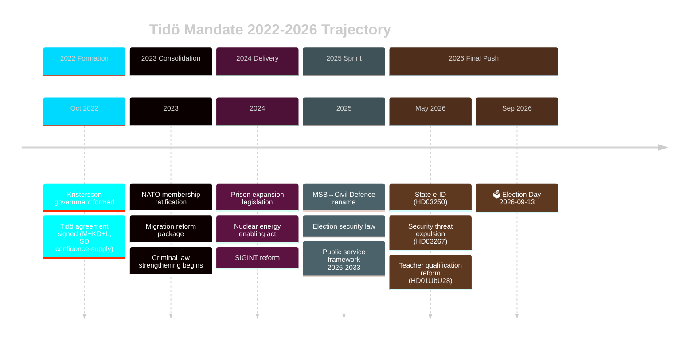

# Cycle Trajectory — Tidö Mandate 2022-2026

**Date**: 2026-05-09 | **Cycle**: Current (2022-09-11 → 2026-09-13) | **T-127 days**  
**Confidence**: HIGH [Admiralty B2] | **Horizon**: T+1460d  
**Long-horizon rules**: election-cycle depth multiplier 2.5×

---

## Mandate Arc Summary

## Temporal Horizon Projections (WEP-Anchored)

### T+72h (2026-05-11)
- **Riksdag debate on HD03250 state e-ID** — committee referral expected; S opposition prepares GDPR critique  
- **HD03267 committee referral** — JuU committee scheduled; Lagrådet yttrande request expected  
- **L polls**: Spring tracking poll (Ipsos) due 2026-05-12  
- WEP: parliamentary process CERTAIN; poll direction ROUGHLY EVEN

### T+7d (2026-05-15)
- **Budget debate resumption**: May spring revision (vårbudgeten) debate on economic headwinds  
- **SD party congress signal**: Pre-summer party events; any threshold-risk positioning  
- WEP: Vårbudget passage LIKELY; SD event news ROUGHLY EVEN

### T+30d (2026-06-08)
- **Lagrådet yttrande on HD03267**: Expected publication window (4-6 weeks from submission)  
- **Riksdag summer recess begins**: Typically June 22 — last major legislation window  
- **L party congress (if scheduled)**: Leadership ratification or summer camp  
- WEP: Lagrådet publication LIKELY; summer recess CERTAIN; legislation passage LIKELY

### T+90d (2026-08-06)
- **Summer polls**: July/August Swedish polls critical for campaign narrative setting  
- **Campaign infrastructure activation**: Party conferences (Almedalsveckan July 2026; SD/M final campaigns)  
- **Economic data**: Q2 GDP growth (SCB); May unemployment (SCB) — critical for campaign framing  
- WEP: L above threshold ROUGHLY EVEN; Tidö economic narrative: UNLIKELY improvement sufficient

### T+128d — Election Day (2026-09-13)
- **Riksdag election**: 349 seats; 175 majority threshold  
- **Likely range**: Tidö 165-180 / Red-Green 169-184 (based on April polls)  
- **Critical variable**: Liberalerna (L) threshold vote  
- WEP outcome distribution: A1 Tidö II 40% | C1 Red-Green 27% | D Hung 15% | B Centre-Right 10% | other 8%

## Mandate Trajectory Metrics

| Metric | Oct 2022 | May 2025 | May 2026 | Trend |
|--------|---------|---------|---------|-------|
| Mandate completion % | 0% | 45% | 78% | ↑ accelerating |
| L threshold buffer | +0.9% | +0.5% | +0.2% | ↓ narrowing |
| Coalition Tidö seats | 176 | 176 | ~175 | → stable |
| Unemployment rate | 7.5% | 8.2% | 8.4% | ↑ worsening |
| GDP growth | 2.9% | 1.2% | 1.8% | ↑ recovering |

## Long-Horizon Intelligence Trajectories

### Band 1: T+72h → T+7d (Immediate)
**PIR Roll-Forward**: PIR-001 (L threshold), PIR-006 (state e-ID Riksdag), PIR-007 (Lagrådet HD03267)  
**Key data trigger**: First spring poll post-proposition package (expected Ipsos 2026-05-12)  
**Action required**: Monitor L polling daily; flag any drop below 4.1%

### Band 2: T+30d → T+90d (Pre-Campaign)
**PIR Roll-Forward**: All 7 PIRs remain open  
**Scenario tree weight changes expected**: W4 (economic shock) watch period; Lagrådet publication  
**Key horizon**: Almedalsveckan (July, Gotland) — party leader debates, policy announcements

### Band 3: T+90d → Election Day
**Campaign phase**: Party manifestos locked; TV debates (3 scheduled); mail voting begins T-12d  
**Intelligence focus shift**: Individual constituency projections; L micro-targeting; late-decider analysis  
**Decision indicator trigger**: If L drops below 4.0% in any August poll — immediate escalation to Scenario C branch

## Cross-Cycle Inheritance

The following legislative outputs from the current cycle (2022-2026) are **durable and cycle-transcending** — they will bind the next government regardless of election outcome:
1. NATO membership (irreversible; bipartisan)
2. State e-ID (HD03250) — infrastructure too costly to reverse
3. SIGINT reform (HD01FöU18) — national security; bipartisan
4. Public service framework 2026-2033 (HC03166) — contractually bound
5. Prison expansion legislation (HD01CU25) — implementation spans next mandate

These 5 outputs represent the **institutional legacy** of the Tidö period and frame the next cycle's constraints.

> economicProvenance: {provider: "imf", dataflow: "WEO, FM", indicator: "NGDP_RPCH, LUR, GGXWDG_NGDP", vintage: "WEO Apr-2026", retrieved_at: "2026-05-09", status: "degraded — WEO/FM usable"}
