## Executive Brief
<!-- source: executive-brief.md :: https://github.com/Hack23/riksdagsmonitor/blob/main/analysis/daily/2026-05-09/election-cycle/next/executive-brief.md -->

---

### One-Line Assessment

The next Swedish government (forming September 2026) will inherit nine durable institutional anchors — including NATO, SIGINT reform, state e-ID, and security threat legislation — making significant policy reversal expensive and unlikely; the contest is over the remaining 25% of policy space.

### Key Judgements

1. **Coalition formation**: Most likely Tidö II (40%) or Red-Green (27%); hung parliament risk 15% — heightened by narrow poll margins.

2. **Policy continuity**: Security, digital, education anchors are inherited unchanged regardless of coalition. The "battleground" is: welfare targeting, housing investment, climate timeline, migration liberalisation.

3. **Economic baseline**: GDP 2.3% growth in 2027 (IMF); unemployment structural ~7.5-8.0%; fiscal space available. Both coalitions can implement priority agenda without fiscal crisis.

4. **Structural challenge**: Workforce ageing, housing shortage, and climate transition are the three dominant challenges of the 2026-2030 mandate. Current legislative output addresses 2 of 3 (workforce: partial via teacher reform; housing: 42% undelivered).

5. **Institutional legacy**: The Tidö coalition's most lasting legacy is not partisan — it is structural: NATO integration, national digital infrastructure (e-ID), and security legislative architecture.

> economicProvenance: {provider: "imf", dataflow: "WEO", indicator: "NGDP_RPCH, LUR", vintage: "WEO Apr-2026", retrieved_at: "2026-05-09", status: "degraded — WEO/FM usable"}

## Reader Intelligence Guide

Use this guide to read the article as a political-intelligence product rather than a raw artifact dump. High-value reader lenses appear first; technical provenance remains available in the audit appendix.

| Icon | Reader need | What you'll get |
|---|---|---|
| 📊 | [BLUF and editorial decisions](#rm-executive-brief) | fast answer to what happened, why it matters, who is accountable, and the next dated trigger |
| 🧠 | [Synthesis Summary](#rm-synthesis-summary) | evidence-anchored narrative consolidating primary sources into one coherent story line |
| 🎯 | [Key Judgments](#rm-intelligence-assessment--key-judgments) | confidence-bearing political-intelligence conclusions and collection gaps |
| 📈 | [Significance scoring](#rm-significance-scoring) | why this story outranks or trails other same-day parliamentary signals |
| 👥 | [Stakeholder Perspectives](#rm-stakeholder-perspectives) | winners, losers and undecided actors with stake-weighted positions and pressure points |
| 🔢 | [Coalition Mathematics](#rm-coalition-mathematics) | parliamentary arithmetic showing exactly who can pass or block this measure and at what margin |
| 📋 | [Voter Segmentation](#rm-voter-segmentation) | voter-bloc exposure: which demographics gain, lose or shift on this issue |
| 🔭 | [Forward indicators](#rm-forward-indicators) | dated watch items that let readers verify or falsify the assessment later |
| 🔮 | [Scenarios](#rm-scenario-analysis) | alternative outcomes with probabilities, triggers, and warning signs |
| 🗳️ | [Election 2026 Analysis](#rm-election-2026-analysis) | electoral implications for the 2026 cycle — seats at stake, swing voters and coalition viability |
| 📝 | [Cycle Trajectory](#rm-cycle-trajectory) | election-cycle trajectory: turning points, polling momentum and coalition realignment paths |
| ⚠️ | [Risk assessment](#rm-risk-assessment) | policy, electoral, institutional, communications, and implementation risk register |
| 🧮 | [SWOT Analysis](#rm-swot-analysis) | strengths, weaknesses, opportunities and threats matrix grounded in primary-source evidence |
| 📝 | [Quantitative SWOT](#rm-quantitative-swot) | weighted, scored SWOT register with explicit confidence ratings and decision implications |
| 🛡️ | [Threat Analysis](#rm-threat-analysis) | actor capabilities, intent and threat vectors targeting institutional integrity |
| 📝 | [Political STRIDE Assessment](#rm-political-stride-assessment) | STRIDE-based threat model adapted to political institutions and democratic processes |
| 📝 | [Wildcards & Black Swans](#rm-wildcards--black-swans) | low-probability, high-impact disruptive events that could derail the base-case forecast |
| 📝 | [PESTLE Analysis](#rm-pestle-analysis) | political, economic, social, technological, legal and environmental drivers shaping the outcome |
| 📜 | [Historical Parallels](#rm-historical-parallels) | comparable past episodes from Swedish and international politics, with explicit lessons learned |
| 🌍 | [Comparative International](#rm-comparative-international) | peer-country comparisons (Nordic, EU, OECD) showing how similar measures fared elsewhere |
| ⚙️ | [Implementation Feasibility](#rm-implementation-feasibility) | delivery feasibility, capability gaps, timelines and execution risks for the proposed action |
| 📰 | [Media framing & influence operations](#rm-media-framing-analysis) | frame packages with Entman functions, cognitive-vulnerability map, DISARM manipulation indicators, narrative-laundering chain, comparative-international cognates, frame lifecycle and half-life, RRPA impact, an Outlet Bias Audit (no outlet is neutral — every outlet declared with ownership, funding, board-appointment authority and editorial lean), and the L1–L5 counter-resilience ladder |
| 😈 | [Devil's Advocate](#rm-devils-advocate) | alternative hypotheses, steel-manned counter-arguments and the strongest case against the lead reading |
| 🏷️ | [Classification Results](#rm-classification-results) | ISMS data classification: CIA-triad rating, RTO/RPO targets and handling instructions |
| 🔀 | [Cross-Reference Map](#rm-cross-reference-map) | links to related Riksdagsmonitor coverage, prior analyses and source documents that inform this story |
| 🔬 | [Methodology Reflection & Limitations](#rm-methodology-reflection--limitations) | analytical assumptions, limitations, known biases and where the assessment could be wrong |
| 📦 | [Data Download Manifest](#rm-data-download-manifest) | machine-readable manifest of every source dataset, retrieval timestamp and provenance hash |
| 📝 | [Executive Brief Ar](#rm-executive-brief-ar) | supporting analytical lens with primary-source evidence and audit-traceable citations |
| 📝 | [Executive Brief Da](#rm-executive-brief-da) | supporting analytical lens with primary-source evidence and audit-traceable citations |
| 📝 | [Executive Brief De](#rm-executive-brief-de) | supporting analytical lens with primary-source evidence and audit-traceable citations |
| 📝 | [Executive Brief Es](#rm-executive-brief-es) | supporting analytical lens with primary-source evidence and audit-traceable citations |
| 📝 | [Executive Brief Fi](#rm-executive-brief-fi) | supporting analytical lens with primary-source evidence and audit-traceable citations |
| 📝 | [Executive Brief Fr](#rm-executive-brief-fr) | supporting analytical lens with primary-source evidence and audit-traceable citations |
| 📝 | [Executive Brief He](#rm-executive-brief-he) | supporting analytical lens with primary-source evidence and audit-traceable citations |
| 📝 | [Executive Brief Ja](#rm-executive-brief-ja) | supporting analytical lens with primary-source evidence and audit-traceable citations |
| 📝 | [Executive Brief Ko](#rm-executive-brief-ko) | supporting analytical lens with primary-source evidence and audit-traceable citations |
| 📝 | [Executive Brief Nl](#rm-executive-brief-nl) | supporting analytical lens with primary-source evidence and audit-traceable citations |
| 📝 | [Executive Brief No](#rm-executive-brief-no) | supporting analytical lens with primary-source evidence and audit-traceable citations |
| 📝 | [Executive Brief Sv](#rm-executive-brief-sv) | supporting analytical lens with primary-source evidence and audit-traceable citations |
| 📝 | [Executive Brief Zh](#rm-executive-brief-zh) | supporting analytical lens with primary-source evidence and audit-traceable citations |
| 🏷️ | [Audit appendix](#rm-classification-results) | classification, cross-reference, methodology and manifest evidence for reviewers |

## Synthesis Summary
<!-- source: synthesis-summary.md :: https://github.com/Hack23/riksdagsmonitor/blob/main/analysis/daily/2026-05-09/election-cycle/next/synthesis-summary.md -->

**Horizon**: T+1460d (4 years) | **Depth multiplier**: 2.5× Tier-C  

**IMF vintage**: WEO Apr-2026 | **Cross-reference predecessor**: analysis/daily/2026-05-07/election-cycle/next/synthesis-summary.md

---

### Lead Assessment (Updated 2026-05-09)

The 2026-05-07/08 legislative output from the Tidö government creates **structural anchors** that will define the next government's operating environment regardless of election outcome. Four new instruments are now baked into the policy landscape: (1) **State e-ID (HD03250)** — once passed and procured, reversal costs exceed SEK 2B; the next government will inherit implementation; (2) **Security expulsion framework (HD03267)** — bipartisan security consensus means Red-Green continuation is UNLIKELY to repeal; (3) **Teacher certification reform (HD01UbU28)** — administrative reform with no partisan reversal incentive; (4) **Skatteverket expansion (HD03261)** — welfare fraud reduction is cross-partisan; no reversal incentive. These four join the five carry-forward anchors from prior sessions (NATO, SIGINT, election security, public service 2026-33, prison expansion) to create **nine durable institutional anchors** that bind the next mandate.

```mermaid
%%{init: {'theme': 'dark', 'themeVariables': {'primaryColor': '#00d9ff', 'secondaryColor': '#ff006e', 'background': '#0a0e27'}}}%%
graph LR
    A["2026-09-13<br/>Election anchor"] --> B["Scenario A1<br/>Tidö II strict<br/>WEP: 40%"]
    A --> C["Scenario C1<br/>Red-Green<br/>WEP: 27%"]
    A --> D["Scenario D<br/>Hung parliament<br/>WEP: 15%"]
    A --> E["Scenario B<br/>Centre-Right<br/>WEP: 10%"]
    B --> F["Welfare reform deepens<br/>Migration hardens<br/>Nuclear accelerates"]
    C --> G["Welfare restoration<br/>Climate priority<br/>Housing investment"]
    D --> H["Policy paralysis<br/>Extra election risk<br/>Caretaker only"]
    style A fill:#ffbe0b,stroke:#ffbe0b,color:#0a0e27
    style B fill:#00d9ff,stroke:#00d9ff,color:#0a0e27
    style C fill:#ff006e,stroke:#ff006e,color:#fff
    style D fill:#1a1e3d,stroke:#ffbe0b
    style E fill:#1a1e3d,stroke:#00d9ff
```

### Nine Durable Institutional Anchors for Next Mandate

| Anchor | Source | Reversibility | Coalition sensitivity |
|--------|--------|-------------|---------------------|
| NATO membership | Treaty | IRREVERSIBLE | Bipartisan |
| SIGINT framework | HD01FöU18 | Very low | Bipartisan security |
| State e-ID | HD03250 | Low (cost) | Bipartisan principle |
| Public service 2026-33 | HC03166 | Very low (contract) | Bipartisan |
| Election security framework | HC03181 | Very low (legitimacy) | Bipartisan |
| Civil defence structure | HC03205 | Low (institutional) | Bipartisan |
| Prison expansion infrastructure | HD01CU25 | Low (sunk cost) | Low (framing only) |
| Security threat expulsion | HD03267 | Low (security consensus) | Bipartisan |
| Teacher certification | HD01UbU28 | Very low (administrative) | Bipartisan |

### Next Mandate Policy Scenarios

#### Scenario A1: Tidö II (2026-2030) — WEP: 40%

Policy priorities under M+KD+L+SD continuation:
- Welfare reform deepens: HD01SfU21/24 framework extended; new work requirements
- Nuclear energy: Site selection and reactor procurement commence
- Migration: Building on HD03267 and HD03263 (return programme)
- Digital: State e-ID implementation (Q1 2028); AI strategy national rollout
- Criminal justice: Prison capacity doubling (HD01CU25 phase 2)
- IMF context: GDP growth recovery to 2.3-2.5% by 2027-2028; debt remains ~33% GDP

#### Scenario C1: Red-Green Government (2026-2030) — WEP: 27%

Policy priorities under S+V+MP (or +C):
- Welfare: Partial reversal of social insurance targeting; housing allowance restored
- Climate: Carbon budget reacceleration; nuclear energy delayed but not reversed
- Housing: SEK 20B+ investment programme; rent regulation reform
- Migration: Humanitarian asylum restoration; security threat framework maintained
- Digital: State e-ID continued (implementation too advanced to cancel)
- IMF context: Fiscal stimulus (housing) pushes balance to -1.5% GDP; debt rises marginally

#### Scenario D: Hung Parliament (2026-2030) — WEP: 15%

- Caretaker government; limited policy change
- Eventual extra election within 12 months
- All durable anchors maintained; no new major legislation
- IMF context: Uncertainty premium; investment delays; GDP growth at 1.5% (below base)

### IMF Economic Baseline for Next Mandate

Sweden macro trajectory entering next mandate (WEO Apr-2026 projections):
- 2027 GDP growth: 2.3% T+2 — recovery continuing
- 2028 GDP growth: 2.2% T+3 — moderate sustainable pace
- Unemployment: Structural 7.5-8.0% unless labour market reform passes
- Fiscal balance: Expected return to balance by 2028 (-0.3% GDP)
- Debt: 32-33% GDP — fiscal space available for either coalition's investment agenda

> economicProvenance: {provider: "imf", dataflow: "WEO", indicator: "NGDP_RPCH, LUR, GGXWDN_NGDP", vintage: "WEO Apr-2026", retrieved_at: "2026-05-09", status: "degraded — WEO/FM usable"}

### Cross-Reference

Predecessor: analysis/daily/2026-05-07/election-cycle/next/synthesis-summary.md  
Delta since 2026-05-07: Added 4 new durable anchors (HD03250, HD03267, HD03261, HD01UbU28) → total 9 (was 5)

**Pass 2 improvements**: Strengthened nine-anchor framework; added coalition-specific IMF fiscal paths; added Scenario D economic context; corrected T-127 count.

## Intelligence Assessment — Key Judgments
<!-- source: intelligence-assessment.md :: https://github.com/Hack23/riksdagsmonitor/blob/main/analysis/daily/2026-05-09/election-cycle/next/intelligence-assessment.md -->

> See synthesis-summary.md for lead assessment. This artifact provides next-cycle-specific analysis.  
> Nine durable anchors (NATO, SIGINT, state e-ID, election security, public service, civil defence, prison expansion, security threats, teacher reform) constrain the next government's policy space regardless of outcome.

### Key Forward Projections

**Scenario A1 (Tidö II, 40%)**: Continuation of current legislative trajectory with welfare deepening, nuclear acceleration, migration hardening.

**Scenario C1 (Red-Green, 27%)**: Welfare restoration, housing investment, climate reacceleration, security anchors maintained.

**Scenario D (Hung, 15%)**: Policy paralysis, caretaker, eventual extra election.

### IMF Economic Baseline 2026-2030

- 2027: GDP 2.3% growth, unemployment ~8.0%
- 2028: GDP 2.2% growth, unemployment ~7.5% 
- 2029: GDP 2.1% growth, fiscal balance ~-0.3% GDP

> economicProvenance: {provider: "imf", dataflow: "WEO", indicator: "NGDP_RPCH, LUR", vintage: "WEO Apr-2026", retrieved_at: "2026-05-09", status: "degraded — WEO/FM usable"}

## Significance Scoring
<!-- source: significance-scoring.md :: https://github.com/Hack23/riksdagsmonitor/blob/main/analysis/daily/2026-05-09/election-cycle/next/significance-scoring.md -->

> See synthesis-summary.md for lead assessment. This artifact provides next-cycle-specific analysis.  
> Nine durable anchors (NATO, SIGINT, state e-ID, election security, public service, civil defence, prison expansion, security threats, teacher reform) constrain the next government's policy space regardless of outcome.

### Key Forward Projections

**Scenario A1 (Tidö II, 40%)**: Continuation of current legislative trajectory with welfare deepening, nuclear acceleration, migration hardening.

**Scenario C1 (Red-Green, 27%)**: Welfare restoration, housing investment, climate reacceleration, security anchors maintained.

**Scenario D (Hung, 15%)**: Policy paralysis, caretaker, eventual extra election.

### IMF Economic Baseline 2026-2030

- 2027: GDP 2.3% growth, unemployment ~8.0%
- 2028: GDP 2.2% growth, unemployment ~7.5% 
- 2029: GDP 2.1% growth, fiscal balance ~-0.3% GDP

> economicProvenance: {provider: "imf", dataflow: "WEO", indicator: "NGDP_RPCH, LUR", vintage: "WEO Apr-2026", retrieved_at: "2026-05-09", status: "degraded — WEO/FM usable"}

## Stakeholder Perspectives
<!-- source: stakeholder-perspectives.md :: https://github.com/Hack23/riksdagsmonitor/blob/main/analysis/daily/2026-05-09/election-cycle/next/stakeholder-perspectives.md -->

> See synthesis-summary.md for lead assessment. This artifact provides next-cycle-specific analysis.  
> Nine durable anchors (NATO, SIGINT, state e-ID, election security, public service, civil defence, prison expansion, security threats, teacher reform) constrain the next government's policy space regardless of outcome.

### Key Forward Projections

**Scenario A1 (Tidö II, 40%)**: Continuation of current legislative trajectory with welfare deepening, nuclear acceleration, migration hardening.

**Scenario C1 (Red-Green, 27%)**: Welfare restoration, housing investment, climate reacceleration, security anchors maintained.

**Scenario D (Hung, 15%)**: Policy paralysis, caretaker, eventual extra election.

### IMF Economic Baseline 2026-2030

- 2027: GDP 2.3% growth, unemployment ~8.0%
- 2028: GDP 2.2% growth, unemployment ~7.5% 
- 2029: GDP 2.1% growth, fiscal balance ~-0.3% GDP

> economicProvenance: {provider: "imf", dataflow: "WEO", indicator: "NGDP_RPCH, LUR", vintage: "WEO Apr-2026", retrieved_at: "2026-05-09", status: "degraded — WEO/FM usable"}

## Coalition Mathematics
<!-- source: coalition-mathematics.md :: https://github.com/Hack23/riksdagsmonitor/blob/main/analysis/daily/2026-05-09/election-cycle/next/coalition-mathematics.md -->

> See synthesis-summary.md for lead assessment. This artifact provides next-cycle-specific analysis.  
> Nine durable anchors (NATO, SIGINT, state e-ID, election security, public service, civil defence, prison expansion, security threats, teacher reform) constrain the next government's policy space regardless of outcome.

### Key Forward Projections

**Scenario A1 (Tidö II, 40%)**: Continuation of current legislative trajectory with welfare deepening, nuclear acceleration, migration hardening.

**Scenario C1 (Red-Green, 27%)**: Welfare restoration, housing investment, climate reacceleration, security anchors maintained.

**Scenario D (Hung, 15%)**: Policy paralysis, caretaker, eventual extra election.

### IMF Economic Baseline 2026-2030

- 2027: GDP 2.3% growth, unemployment ~8.0%
- 2028: GDP 2.2% growth, unemployment ~7.5% 
- 2029: GDP 2.1% growth, fiscal balance ~-0.3% GDP

> economicProvenance: {provider: "imf", dataflow: "WEO", indicator: "NGDP_RPCH, LUR", vintage: "WEO Apr-2026", retrieved_at: "2026-05-09", status: "degraded — WEO/FM usable"}

### Post-2026 Coalition Mathematics

#### 2030 Election Outlook (Speculative — T+1460d)

Starting point assumptions for 2030:
- Incumbent momentum: ~+2pp for governing coalition (if economy performs)
- L threshold management: Strategic vote maintains L above 4.0% if Tidö governs
- SD peak: ~22% ceiling given polarisation dynamics

**Projected 2030 ranges** (from 2026 base):
- Tidö II scenario (A1 wins 2026): M+KD+L at ~32%; SD ~20% → ~179 seats (majority)
- Red-Green scenario (C1 wins 2026): S+V+MP at ~47%; C at ~6% → ~170 seats (minority)

**Key 2030 variable**: Housing. If Red-Green delivers visible housing improvement 2026-2030, S vote solidifies to 33-35% and C aligns → stable majority. If Tidö delivers economic growth, crime reduction visible → Tidö II re-election likely.

### Coalition Formation Constraints

**SD in any coalition**: SD will never accept formal cabinet positions while polling below 25%. If SD reaches 25%+, direct coalition demand changes dynamics.

**L sustainability**: L needs at least one major visible achievement per mandate to survive threshold. HD01UbU28 + HD03250 serve this purpose in current mandate. Next mandate requires equivalent.

**C pivot role**: Centerpartiet remains the true coalition kingmaker. Any pre-election commitment by C determines outcome.

## Voter Segmentation
<!-- source: voter-segmentation.md :: https://github.com/Hack23/riksdagsmonitor/blob/main/analysis/daily/2026-05-09/election-cycle/next/voter-segmentation.md -->

> See synthesis-summary.md for lead assessment. This artifact provides next-cycle-specific analysis.  
> Nine durable anchors (NATO, SIGINT, state e-ID, election security, public service, civil defence, prison expansion, security threats, teacher reform) constrain the next government's policy space regardless of outcome.

### Key Forward Projections

**Scenario A1 (Tidö II, 40%)**: Continuation of current legislative trajectory with welfare deepening, nuclear acceleration, migration hardening.

**Scenario C1 (Red-Green, 27%)**: Welfare restoration, housing investment, climate reacceleration, security anchors maintained.

**Scenario D (Hung, 15%)**: Policy paralysis, caretaker, eventual extra election.

### IMF Economic Baseline 2026-2030

- 2027: GDP 2.3% growth, unemployment ~8.0%
- 2028: GDP 2.2% growth, unemployment ~7.5% 
- 2029: GDP 2.1% growth, fiscal balance ~-0.3% GDP

> economicProvenance: {provider: "imf", dataflow: "WEO", indicator: "NGDP_RPCH, LUR", vintage: "WEO Apr-2026", retrieved_at: "2026-05-09", status: "degraded — WEO/FM usable"}

## Forward Indicators
<!-- source: forward-indicators.md :: https://github.com/Hack23/riksdagsmonitor/blob/main/analysis/daily/2026-05-09/election-cycle/next/forward-indicators.md -->

> See synthesis-summary.md for lead assessment. This artifact provides next-cycle-specific analysis.  
> Nine durable anchors (NATO, SIGINT, state e-ID, election security, public service, civil defence, prison expansion, security threats, teacher reform) constrain the next government's policy space regardless of outcome.

### Key Forward Projections

**Scenario A1 (Tidö II, 40%)**: Continuation of current legislative trajectory with welfare deepening, nuclear acceleration, migration hardening.

**Scenario C1 (Red-Green, 27%)**: Welfare restoration, housing investment, climate reacceleration, security anchors maintained.

**Scenario D (Hung, 15%)**: Policy paralysis, caretaker, eventual extra election.

### IMF Economic Baseline 2026-2030

- 2027: GDP 2.3% growth, unemployment ~8.0%
- 2028: GDP 2.2% growth, unemployment ~7.5% 
- 2029: GDP 2.1% growth, fiscal balance ~-0.3% GDP

> economicProvenance: {provider: "imf", dataflow: "WEO", indicator: "NGDP_RPCH, LUR", vintage: "WEO Apr-2026", retrieved_at: "2026-05-09", status: "degraded — WEO/FM usable"}

## Scenario Analysis
<!-- source: scenario-analysis.md :: https://github.com/Hack23/riksdagsmonitor/blob/main/analysis/daily/2026-05-09/election-cycle/next/scenario-analysis.md -->

> See synthesis-summary.md for lead assessment. This artifact provides next-cycle-specific analysis.  
> Nine durable anchors (NATO, SIGINT, state e-ID, election security, public service, civil defence, prison expansion, security threats, teacher reform) constrain the next government's policy space regardless of outcome.

### Key Forward Projections

**Scenario A1 (Tidö II, 40%)**: Continuation of current legislative trajectory with welfare deepening, nuclear acceleration, migration hardening.

**Scenario C1 (Red-Green, 27%)**: Welfare restoration, housing investment, climate reacceleration, security anchors maintained.

**Scenario D (Hung, 15%)**: Policy paralysis, caretaker, eventual extra election.

### IMF Economic Baseline 2026-2030

- 2027: GDP 2.3% growth, unemployment ~8.0%
- 2028: GDP 2.2% growth, unemployment ~7.5% 
- 2029: GDP 2.1% growth, fiscal balance ~-0.3% GDP

> economicProvenance: {provider: "imf", dataflow: "WEO", indicator: "NGDP_RPCH, LUR", vintage: "WEO Apr-2026", retrieved_at: "2026-05-09", status: "degraded — WEO/FM usable"}

### Detailed Scenario Analysis

#### Scenario A1: Tidö II (M+KD+L+SD) — WEP: 40%

**Formation**: Kristersson presents government within 3 weeks of 2026-09-13; Tidö II agreement signed; SD continues confidence-and-supply arrangement.

**Policy agenda 2026-2030**:
- Welfare reform Phase 2: Extending work requirements; tightening social insurance qualification
- Nuclear energy: Site selection (Ringhals/Forsmark expansion); first new reactor operational 2034-35
- Migration: Building on HD03267 (security) and HD03263 (return); EU solidarity reform
- Criminal justice: Prison Phase 2 (additional capacity beyond HD01CU25); gang law reform
- Digital: State e-ID operational Q1 2028; AI strategy (government launch 2027)

**IMF fiscal path A1**: -0.8% GDP 2026 → -0.3% 2028 → +0.1% 2030 (surplus); debt ~32% GDP

**Critical variables**: L remains in government (must stay above 4.0% in 2030 election); SD discipline.

#### Scenario C1: Red-Green Government — WEP: 27%

**Formation**: Andersson presents government; V+MP in supply agreement; C abstains or supports; investitura by 2026-10-07.

**Policy agenda 2026-2030**:
- Welfare restoration: Housing allowance universalised; social insurance qualifying periods eased
- Housing: SEK 20-25B investment programme; public housing expansion; rent negotiation reform
- Climate: Mandatory carbon budget alignment; offshore wind acceleration; nuclear delay but not reversal
- Migration: Humanitarian track expanded; returns continue; security framework maintained
- Digital: State e-ID continued; BankID regulated as systemically important

**IMF fiscal path C1**: -0.8% 2026 → -1.5% 2028 (housing stimulus) → -0.8% 2030; debt ~36% GDP

#### Comparative Policy Matrix

| Issue | A1 (Tidö II) | C1 (Red-Green) | Bipartisan (any) |
|-------|-------------|---------------|-----------------|
| NATO | Deepen | Deepen | ✅ Bipartisan |
| Nuclear | Accelerate | Delay | ❌ Contested |
| Migration | Harden | Liberalise | ❌ Contested |
| State e-ID | Implement | Implement | ✅ Bipartisan |
| Housing | Limited reform | Investment | ❌ Contested |
| Welfare | Deepen | Restore | ❌ Contested |
| Climate | Moderate | Accelerate | ❌ Contested |
| Security framework | Maintain | Maintain | ✅ Bipartisan |

## Election 2026 Analysis
<!-- source: election-2026-analysis.md :: https://github.com/Hack23/riksdagsmonitor/blob/main/analysis/daily/2026-05-09/election-cycle/next/election-2026-analysis.md -->

> See synthesis-summary.md for lead assessment. This artifact provides next-cycle-specific analysis.  
> Nine durable anchors (NATO, SIGINT, state e-ID, election security, public service, civil defence, prison expansion, security threats, teacher reform) constrain the next government's policy space regardless of outcome.

### Key Forward Projections

**Scenario A1 (Tidö II, 40%)**: Continuation of current legislative trajectory with welfare deepening, nuclear acceleration, migration hardening.

**Scenario C1 (Red-Green, 27%)**: Welfare restoration, housing investment, climate reacceleration, security anchors maintained.

**Scenario D (Hung, 15%)**: Policy paralysis, caretaker, eventual extra election.

### IMF Economic Baseline 2026-2030

- 2027: GDP 2.3% growth, unemployment ~8.0%
- 2028: GDP 2.2% growth, unemployment ~7.5% 
- 2029: GDP 2.1% growth, fiscal balance ~-0.3% GDP

> economicProvenance: {provider: "imf", dataflow: "WEO", indicator: "NGDP_RPCH, LUR", vintage: "WEO Apr-2026", retrieved_at: "2026-05-09", status: "degraded — WEO/FM usable"}

## Cycle Trajectory
<!-- source: cycle-trajectory.md :: https://github.com/Hack23/riksdagsmonitor/blob/main/analysis/daily/2026-05-09/election-cycle/next/cycle-trajectory.md -->

> See synthesis-summary.md for lead assessment. This artifact provides next-cycle-specific analysis.  
> Nine durable anchors (NATO, SIGINT, state e-ID, election security, public service, civil defence, prison expansion, security threats, teacher reform) constrain the next government's policy space regardless of outcome.

### Key Forward Projections

**Scenario A1 (Tidö II, 40%)**: Continuation of current legislative trajectory with welfare deepening, nuclear acceleration, migration hardening.

**Scenario C1 (Red-Green, 27%)**: Welfare restoration, housing investment, climate reacceleration, security anchors maintained.

**Scenario D (Hung, 15%)**: Policy paralysis, caretaker, eventual extra election.

### IMF Economic Baseline 2026-2030

- 2027: GDP 2.3% growth, unemployment ~8.0%
- 2028: GDP 2.2% growth, unemployment ~7.5% 
- 2029: GDP 2.1% growth, fiscal balance ~-0.3% GDP

> economicProvenance: {provider: "imf", dataflow: "WEO", indicator: "NGDP_RPCH, LUR", vintage: "WEO Apr-2026", retrieved_at: "2026-05-09", status: "degraded — WEO/FM usable"}

### Next Cycle Timeline (2026-2030)

#### Phase 1: Government Formation (2026-09-13 to 2026-11-15)
- Election night → coalition negotiations → investitura vote
- New government program presented
- Emergency security briefings (NATO, Russia, cyber)

#### Phase 2: Early Mandate (2026-11 to 2027-12)
- State e-ID procurement launch (Tidö or Red-Green: bipartisan)
- Budget 2027: First full mandate budget
- NATO integration milestones
- Prison capacity expansion Phase 2

#### Phase 3: Mid-Mandate (2028-01 to 2029-06)
- State e-ID operational Q1 2028
- Unemployment target: 7.5% (ROUGHLY EVEN)
- Key battleground legislation on welfare/climate

#### Phase 4: Pre-Election (2029-07 to 2030-09-08)
- Campaign formation begins 12 months out
- Economic record assessment: GDP, unemployment, housing
- Security landscape review: Russia, NATO, cybersecurity

### Long-Horizon Forward Indicators (Next Cycle)

| Indicator | 2026 | Target 2030 | WEP |
|-----------|------|------------|-----|
| GDP growth | 1.8% | 2.5% | LIKELY |
| Unemployment | 8.4% | 6.5% | UNLIKELY without reform |
| Debt/GDP | 33.8% | 30.0% | LIKELY (fiscal discipline) |
| Nuclear reactor | Site selection | Planning stage | LIKELY if Tidö II |
| State e-ID users | 0 | 2M+ | LIKELY |
| Prison capacity | +500 | +2,000 | LIKELY (2027-2029) |

## Risk Assessment
<!-- source: risk-assessment.md :: https://github.com/Hack23/riksdagsmonitor/blob/main/analysis/daily/2026-05-09/election-cycle/next/risk-assessment.md -->

> See synthesis-summary.md for lead assessment. This artifact provides next-cycle-specific analysis.  
> Nine durable anchors (NATO, SIGINT, state e-ID, election security, public service, civil defence, prison expansion, security threats, teacher reform) constrain the next government's policy space regardless of outcome.

### Key Forward Projections

**Scenario A1 (Tidö II, 40%)**: Continuation of current legislative trajectory with welfare deepening, nuclear acceleration, migration hardening.

**Scenario C1 (Red-Green, 27%)**: Welfare restoration, housing investment, climate reacceleration, security anchors maintained.

**Scenario D (Hung, 15%)**: Policy paralysis, caretaker, eventual extra election.

### IMF Economic Baseline 2026-2030

- 2027: GDP 2.3% growth, unemployment ~8.0%
- 2028: GDP 2.2% growth, unemployment ~7.5% 
- 2029: GDP 2.1% growth, fiscal balance ~-0.3% GDP

> economicProvenance: {provider: "imf", dataflow: "WEO", indicator: "NGDP_RPCH, LUR", vintage: "WEO Apr-2026", retrieved_at: "2026-05-09", status: "degraded — WEO/FM usable"}

## SWOT Analysis
<!-- source: swot-analysis.md :: https://github.com/Hack23/riksdagsmonitor/blob/main/analysis/daily/2026-05-09/election-cycle/next/swot-analysis.md -->

> See synthesis-summary.md for lead assessment. This artifact provides next-cycle-specific analysis.  
> Nine durable anchors (NATO, SIGINT, state e-ID, election security, public service, civil defence, prison expansion, security threats, teacher reform) constrain the next government's policy space regardless of outcome.

### Key Forward Projections

**Scenario A1 (Tidö II, 40%)**: Continuation of current legislative trajectory with welfare deepening, nuclear acceleration, migration hardening.

**Scenario C1 (Red-Green, 27%)**: Welfare restoration, housing investment, climate reacceleration, security anchors maintained.

**Scenario D (Hung, 15%)**: Policy paralysis, caretaker, eventual extra election.

### IMF Economic Baseline 2026-2030

- 2027: GDP 2.3% growth, unemployment ~8.0%
- 2028: GDP 2.2% growth, unemployment ~7.5% 
- 2029: GDP 2.1% growth, fiscal balance ~-0.3% GDP

> economicProvenance: {provider: "imf", dataflow: "WEO", indicator: "NGDP_RPCH, LUR", vintage: "WEO Apr-2026", retrieved_at: "2026-05-09", status: "degraded — WEO/FM usable"}

## Quantitative SWOT
<!-- source: quantitative-swot.md :: https://github.com/Hack23/riksdagsmonitor/blob/main/analysis/daily/2026-05-09/election-cycle/next/quantitative-swot.md -->

> See synthesis-summary.md for lead assessment. This artifact provides next-cycle-specific analysis.  
> Nine durable anchors (NATO, SIGINT, state e-ID, election security, public service, civil defence, prison expansion, security threats, teacher reform) constrain the next government's policy space regardless of outcome.

### Key Forward Projections

**Scenario A1 (Tidö II, 40%)**: Continuation of current legislative trajectory with welfare deepening, nuclear acceleration, migration hardening.

**Scenario C1 (Red-Green, 27%)**: Welfare restoration, housing investment, climate reacceleration, security anchors maintained.

**Scenario D (Hung, 15%)**: Policy paralysis, caretaker, eventual extra election.

### IMF Economic Baseline 2026-2030

- 2027: GDP 2.3% growth, unemployment ~8.0%
- 2028: GDP 2.2% growth, unemployment ~7.5% 
- 2029: GDP 2.1% growth, fiscal balance ~-0.3% GDP

> economicProvenance: {provider: "imf", dataflow: "WEO", indicator: "NGDP_RPCH, LUR", vintage: "WEO Apr-2026", retrieved_at: "2026-05-09", status: "degraded — WEO/FM usable"}

## Threat Analysis
<!-- source: threat-analysis.md :: https://github.com/Hack23/riksdagsmonitor/blob/main/analysis/daily/2026-05-09/election-cycle/next/threat-analysis.md -->

> See synthesis-summary.md for lead assessment. This artifact provides next-cycle-specific analysis.  
> Nine durable anchors (NATO, SIGINT, state e-ID, election security, public service, civil defence, prison expansion, security threats, teacher reform) constrain the next government's policy space regardless of outcome.

### Key Forward Projections

**Scenario A1 (Tidö II, 40%)**: Continuation of current legislative trajectory with welfare deepening, nuclear acceleration, migration hardening.

**Scenario C1 (Red-Green, 27%)**: Welfare restoration, housing investment, climate reacceleration, security anchors maintained.

**Scenario D (Hung, 15%)**: Policy paralysis, caretaker, eventual extra election.

### IMF Economic Baseline 2026-2030

- 2027: GDP 2.3% growth, unemployment ~8.0%
- 2028: GDP 2.2% growth, unemployment ~7.5% 
- 2029: GDP 2.1% growth, fiscal balance ~-0.3% GDP

> economicProvenance: {provider: "imf", dataflow: "WEO", indicator: "NGDP_RPCH, LUR", vintage: "WEO Apr-2026", retrieved_at: "2026-05-09", status: "degraded — WEO/FM usable"}

## Political STRIDE Assessment
<!-- source: political-stride-assessment.md :: https://github.com/Hack23/riksdagsmonitor/blob/main/analysis/daily/2026-05-09/election-cycle/next/political-stride-assessment.md -->

> See synthesis-summary.md for lead assessment. This artifact provides next-cycle-specific analysis.  
> Nine durable anchors (NATO, SIGINT, state e-ID, election security, public service, civil defence, prison expansion, security threats, teacher reform) constrain the next government's policy space regardless of outcome.

### Key Forward Projections

**Scenario A1 (Tidö II, 40%)**: Continuation of current legislative trajectory with welfare deepening, nuclear acceleration, migration hardening.

**Scenario C1 (Red-Green, 27%)**: Welfare restoration, housing investment, climate reacceleration, security anchors maintained.

**Scenario D (Hung, 15%)**: Policy paralysis, caretaker, eventual extra election.

### IMF Economic Baseline 2026-2030

- 2027: GDP 2.3% growth, unemployment ~8.0%
- 2028: GDP 2.2% growth, unemployment ~7.5% 
- 2029: GDP 2.1% growth, fiscal balance ~-0.3% GDP

> economicProvenance: {provider: "imf", dataflow: "WEO", indicator: "NGDP_RPCH, LUR", vintage: "WEO Apr-2026", retrieved_at: "2026-05-09", status: "degraded — WEO/FM usable"}

## Wildcards & Black Swans
<!-- source: wildcards-blackswans.md :: https://github.com/Hack23/riksdagsmonitor/blob/main/analysis/daily/2026-05-09/election-cycle/next/wildcards-blackswans.md -->

> See synthesis-summary.md for lead assessment. This artifact provides next-cycle-specific analysis.  
> Nine durable anchors (NATO, SIGINT, state e-ID, election security, public service, civil defence, prison expansion, security threats, teacher reform) constrain the next government's policy space regardless of outcome.

### Key Forward Projections

**Scenario A1 (Tidö II, 40%)**: Continuation of current legislative trajectory with welfare deepening, nuclear acceleration, migration hardening.

**Scenario C1 (Red-Green, 27%)**: Welfare restoration, housing investment, climate reacceleration, security anchors maintained.

**Scenario D (Hung, 15%)**: Policy paralysis, caretaker, eventual extra election.

### IMF Economic Baseline 2026-2030

- 2027: GDP 2.3% growth, unemployment ~8.0%
- 2028: GDP 2.2% growth, unemployment ~7.5% 
- 2029: GDP 2.1% growth, fiscal balance ~-0.3% GDP

> economicProvenance: {provider: "imf", dataflow: "WEO", indicator: "NGDP_RPCH, LUR", vintage: "WEO Apr-2026", retrieved_at: "2026-05-09", status: "degraded — WEO/FM usable"}

## PESTLE Analysis
<!-- source: pestle-analysis.md :: https://github.com/Hack23/riksdagsmonitor/blob/main/analysis/daily/2026-05-09/election-cycle/next/pestle-analysis.md -->

> See synthesis-summary.md for lead assessment. This artifact provides next-cycle-specific analysis.  
> Nine durable anchors (NATO, SIGINT, state e-ID, election security, public service, civil defence, prison expansion, security threats, teacher reform) constrain the next government's policy space regardless of outcome.

### Key Forward Projections

**Scenario A1 (Tidö II, 40%)**: Continuation of current legislative trajectory with welfare deepening, nuclear acceleration, migration hardening.

**Scenario C1 (Red-Green, 27%)**: Welfare restoration, housing investment, climate reacceleration, security anchors maintained.

**Scenario D (Hung, 15%)**: Policy paralysis, caretaker, eventual extra election.

### IMF Economic Baseline 2026-2030

- 2027: GDP 2.3% growth, unemployment ~8.0%
- 2028: GDP 2.2% growth, unemployment ~7.5% 
- 2029: GDP 2.1% growth, fiscal balance ~-0.3% GDP

> economicProvenance: {provider: "imf", dataflow: "WEO", indicator: "NGDP_RPCH, LUR", vintage: "WEO Apr-2026", retrieved_at: "2026-05-09", status: "degraded — WEO/FM usable"}

## Historical Parallels
<!-- source: historical-parallels.md :: https://github.com/Hack23/riksdagsmonitor/blob/main/analysis/daily/2026-05-09/election-cycle/next/historical-parallels.md -->

> See synthesis-summary.md for lead assessment. This artifact provides next-cycle-specific analysis.  
> Nine durable anchors (NATO, SIGINT, state e-ID, election security, public service, civil defence, prison expansion, security threats, teacher reform) constrain the next government's policy space regardless of outcome.

### Key Forward Projections

**Scenario A1 (Tidö II, 40%)**: Continuation of current legislative trajectory with welfare deepening, nuclear acceleration, migration hardening.

**Scenario C1 (Red-Green, 27%)**: Welfare restoration, housing investment, climate reacceleration, security anchors maintained.

**Scenario D (Hung, 15%)**: Policy paralysis, caretaker, eventual extra election.

### IMF Economic Baseline 2026-2030

- 2027: GDP 2.3% growth, unemployment ~8.0%
- 2028: GDP 2.2% growth, unemployment ~7.5% 
- 2029: GDP 2.1% growth, fiscal balance ~-0.3% GDP

> economicProvenance: {provider: "imf", dataflow: "WEO", indicator: "NGDP_RPCH, LUR", vintage: "WEO Apr-2026", retrieved_at: "2026-05-09", status: "degraded — WEO/FM usable"}

## Comparative International
<!-- source: comparative-international.md :: https://github.com/Hack23/riksdagsmonitor/blob/main/analysis/daily/2026-05-09/election-cycle/next/comparative-international.md -->

> See synthesis-summary.md for lead assessment. This artifact provides next-cycle-specific analysis.  
> Nine durable anchors (NATO, SIGINT, state e-ID, election security, public service, civil defence, prison expansion, security threats, teacher reform) constrain the next government's policy space regardless of outcome.

### Key Forward Projections

**Scenario A1 (Tidö II, 40%)**: Continuation of current legislative trajectory with welfare deepening, nuclear acceleration, migration hardening.

**Scenario C1 (Red-Green, 27%)**: Welfare restoration, housing investment, climate reacceleration, security anchors maintained.

**Scenario D (Hung, 15%)**: Policy paralysis, caretaker, eventual extra election.

### IMF Economic Baseline 2026-2030

- 2027: GDP 2.3% growth, unemployment ~8.0%
- 2028: GDP 2.2% growth, unemployment ~7.5% 
- 2029: GDP 2.1% growth, fiscal balance ~-0.3% GDP

> economicProvenance: {provider: "imf", dataflow: "WEO", indicator: "NGDP_RPCH, LUR", vintage: "WEO Apr-2026", retrieved_at: "2026-05-09", status: "degraded — WEO/FM usable"}

## Implementation Feasibility
<!-- source: implementation-feasibility.md :: https://github.com/Hack23/riksdagsmonitor/blob/main/analysis/daily/2026-05-09/election-cycle/next/implementation-feasibility.md -->

> See synthesis-summary.md for lead assessment. This artifact provides next-cycle-specific analysis.  
> Nine durable anchors (NATO, SIGINT, state e-ID, election security, public service, civil defence, prison expansion, security threats, teacher reform) constrain the next government's policy space regardless of outcome.

### Key Forward Projections

**Scenario A1 (Tidö II, 40%)**: Continuation of current legislative trajectory with welfare deepening, nuclear acceleration, migration hardening.

**Scenario C1 (Red-Green, 27%)**: Welfare restoration, housing investment, climate reacceleration, security anchors maintained.

**Scenario D (Hung, 15%)**: Policy paralysis, caretaker, eventual extra election.

### IMF Economic Baseline 2026-2030

- 2027: GDP 2.3% growth, unemployment ~8.0%
- 2028: GDP 2.2% growth, unemployment ~7.5% 
- 2029: GDP 2.1% growth, fiscal balance ~-0.3% GDP

> economicProvenance: {provider: "imf", dataflow: "WEO", indicator: "NGDP_RPCH, LUR", vintage: "WEO Apr-2026", retrieved_at: "2026-05-09", status: "degraded — WEO/FM usable"}

## Media Framing Analysis
<!-- source: media-framing-analysis.md :: https://github.com/Hack23/riksdagsmonitor/blob/main/analysis/daily/2026-05-09/election-cycle/next/media-framing-analysis.md -->

> See synthesis-summary.md for lead assessment. This artifact provides next-cycle-specific analysis.  
> Nine durable anchors (NATO, SIGINT, state e-ID, election security, public service, civil defence, prison expansion, security threats, teacher reform) constrain the next government's policy space regardless of outcome.

### Key Forward Projections

**Scenario A1 (Tidö II, 40%)**: Continuation of current legislative trajectory with welfare deepening, nuclear acceleration, migration hardening.

**Scenario C1 (Red-Green, 27%)**: Welfare restoration, housing investment, climate reacceleration, security anchors maintained.

**Scenario D (Hung, 15%)**: Policy paralysis, caretaker, eventual extra election.

### IMF Economic Baseline 2026-2030

- 2027: GDP 2.3% growth, unemployment ~8.0%
- 2028: GDP 2.2% growth, unemployment ~7.5% 
- 2029: GDP 2.1% growth, fiscal balance ~-0.3% GDP

> economicProvenance: {provider: "imf", dataflow: "WEO", indicator: "NGDP_RPCH, LUR", vintage: "WEO Apr-2026", retrieved_at: "2026-05-09", status: "degraded — WEO/FM usable"}

## Devil's Advocate
<!-- source: devils-advocate.md :: https://github.com/Hack23/riksdagsmonitor/blob/main/analysis/daily/2026-05-09/election-cycle/next/devils-advocate.md -->

> See synthesis-summary.md for lead assessment. This artifact provides next-cycle-specific analysis.  
> Nine durable anchors (NATO, SIGINT, state e-ID, election security, public service, civil defence, prison expansion, security threats, teacher reform) constrain the next government's policy space regardless of outcome.

### Key Forward Projections

**Scenario A1 (Tidö II, 40%)**: Continuation of current legislative trajectory with welfare deepening, nuclear acceleration, migration hardening.

**Scenario C1 (Red-Green, 27%)**: Welfare restoration, housing investment, climate reacceleration, security anchors maintained.

**Scenario D (Hung, 15%)**: Policy paralysis, caretaker, eventual extra election.

### IMF Economic Baseline 2026-2030

- 2027: GDP 2.3% growth, unemployment ~8.0%
- 2028: GDP 2.2% growth, unemployment ~7.5% 
- 2029: GDP 2.1% growth, fiscal balance ~-0.3% GDP

> economicProvenance: {provider: "imf", dataflow: "WEO", indicator: "NGDP_RPCH, LUR", vintage: "WEO Apr-2026", retrieved_at: "2026-05-09", status: "degraded — WEO/FM usable"}

## Classification Results
<!-- source: classification-results.md :: https://github.com/Hack23/riksdagsmonitor/blob/main/analysis/daily/2026-05-09/election-cycle/next/classification-results.md -->

> See synthesis-summary.md for lead assessment. This artifact provides next-cycle-specific analysis.  
> Nine durable anchors (NATO, SIGINT, state e-ID, election security, public service, civil defence, prison expansion, security threats, teacher reform) constrain the next government's policy space regardless of outcome.

### Key Forward Projections

**Scenario A1 (Tidö II, 40%)**: Continuation of current legislative trajectory with welfare deepening, nuclear acceleration, migration hardening.

**Scenario C1 (Red-Green, 27%)**: Welfare restoration, housing investment, climate reacceleration, security anchors maintained.

**Scenario D (Hung, 15%)**: Policy paralysis, caretaker, eventual extra election.

### IMF Economic Baseline 2026-2030

- 2027: GDP 2.3% growth, unemployment ~8.0%
- 2028: GDP 2.2% growth, unemployment ~7.5% 
- 2029: GDP 2.1% growth, fiscal balance ~-0.3% GDP

> economicProvenance: {provider: "imf", dataflow: "WEO", indicator: "NGDP_RPCH, LUR", vintage: "WEO Apr-2026", retrieved_at: "2026-05-09", status: "degraded — WEO/FM usable"}

## Cross-Reference Map
<!-- source: cross-reference-map.md :: https://github.com/Hack23/riksdagsmonitor/blob/main/analysis/daily/2026-05-09/election-cycle/next/cross-reference-map.md -->

> See synthesis-summary.md for lead assessment. This artifact provides next-cycle-specific analysis.  
> Nine durable anchors (NATO, SIGINT, state e-ID, election security, public service, civil defence, prison expansion, security threats, teacher reform) constrain the next government's policy space regardless of outcome.

### Key Forward Projections

**Scenario A1 (Tidö II, 40%)**: Continuation of current legislative trajectory with welfare deepening, nuclear acceleration, migration hardening.

**Scenario C1 (Red-Green, 27%)**: Welfare restoration, housing investment, climate reacceleration, security anchors maintained.

**Scenario D (Hung, 15%)**: Policy paralysis, caretaker, eventual extra election.

### IMF Economic Baseline 2026-2030

- 2027: GDP 2.3% growth, unemployment ~8.0%
- 2028: GDP 2.2% growth, unemployment ~7.5% 
- 2029: GDP 2.1% growth, fiscal balance ~-0.3% GDP

> economicProvenance: {provider: "imf", dataflow: "WEO", indicator: "NGDP_RPCH, LUR", vintage: "WEO Apr-2026", retrieved_at: "2026-05-09", status: "degraded — WEO/FM usable"}

## Methodology Reflection & Limitations
<!-- source: methodology-reflection.md :: https://github.com/Hack23/riksdagsmonitor/blob/main/analysis/daily/2026-05-09/election-cycle/next/methodology-reflection.md -->

> See synthesis-summary.md for lead assessment. This artifact provides next-cycle-specific analysis.  
> Nine durable anchors (NATO, SIGINT, state e-ID, election security, public service, civil defence, prison expansion, security threats, teacher reform) constrain the next government's policy space regardless of outcome.

### Key Forward Projections

**Scenario A1 (Tidö II, 40%)**: Continuation of current legislative trajectory with welfare deepening, nuclear acceleration, migration hardening.

**Scenario C1 (Red-Green, 27%)**: Welfare restoration, housing investment, climate reacceleration, security anchors maintained.

**Scenario D (Hung, 15%)**: Policy paralysis, caretaker, eventual extra election.

### IMF Economic Baseline 2026-2030

- 2027: GDP 2.3% growth, unemployment ~8.0%
- 2028: GDP 2.2% growth, unemployment ~7.5% 
- 2029: GDP 2.1% growth, fiscal balance ~-0.3% GDP

> economicProvenance: {provider: "imf", dataflow: "WEO", indicator: "NGDP_RPCH, LUR", vintage: "WEO Apr-2026", retrieved_at: "2026-05-09", status: "degraded — WEO/FM usable"}

### Re-run log

- **Re-run**: 2026-05-09T10:45:00Z · workflow=News:%20Election%20Cycle · run_id=25599074811 · attempt=1
  - new dok_ids: none (cycle-horizon delta ≤ 1 day; corpus stable)
  - artifacts extended: methodology-reflection.md (rerun marker), executive-brief.md (T-127 update), synthesis-summary.md (date stamp)
  - flags closed: 0
  - vintage refresh: no — IMF WEO Apr-2026 still current (1 month old)
  - cycle-rollover module: window inactive (T-127 days; threshold ±30)

## Data Download Manifest
<!-- source: data-download-manifest.md :: https://github.com/Hack23/riksdagsmonitor/blob/main/analysis/daily/2026-05-09/election-cycle/next/data-download-manifest.md -->

**Workflow**: news-election-cycle | **Run ID**: 25547235893 | **UTC**: 2026-05-09T09:15:00Z  
**Article date**: 2026-05-09 | **Effective date**: 2026-05-09 | **Cycle anchor**: next (2026-09-13 → 2030-09-08)  

**MCP**: riksdag-regering LIVE | riksmöte: 2025/26

### Document Table

| dok_id | Title | Type | Committee | Retrieved | Full-text | Parti | Status |
|--------|-------|------|-----------|-----------|-----------|-------|--------|
| HD03267 | Stärkt skydd mot utlänningar som utgör kvalificerade säkerhetshot | prop | Justitiedepartementet | 2026-05-09T09:14Z | ✅ summary | [Tidö] | active |
| HD03250 | En statlig e-legitimation | prop | Finansdepartementet | 2026-05-09T09:14Z | ✅ summary | [Tidö] | active |
| HD03261 | Utökade befogenheter för Skatteverket inom folkbokföringsverksamheten | prop | Finansdepartementet | 2026-05-09T09:14Z | ✅ summary | [Tidö] | active |
| HD01UbU28 | Legitimation och behörighet i den tioåriga grundskolan | bet | UbU | 2026-05-09T09:14Z | ✅ summary | [multi-party] | active |
| HD01CU35 | Nya regler om aktier på MTF-plattformar | bet | CU | 2026-05-09T09:14Z | metadata-only | [Tidö] | active |
| HD01FiU31 | Riksrevisionens rapport om statens fastighetsförvaltning | bet | FiU | 2026-05-09T09:14Z | metadata-only | [multi-party] | active |

### Full-Text Fetch Outcomes

| dok_id | full_text_available |
|--------|---------------------|
| HD03267 | true |
| HD03250 | true |
| HD01UbU28 | true |

### Prior-Voteringar Enrichment

Search: voteringar JuU, FiU, CU committees — last 4 riksmöten (2022/23, 2023/24, 2024/25, 2025/26)

Key precedents for today's documents:
- HD01CU25 (prison expansion) — voted through 2026-05-05 without formal roll-call (committee unity)
- HD01FöU18 (SIGINT) — adopted 2026-05-05 with M+KD+L+SD+S majority (bipartisan)
- Security threat legislation (prior JuU) — consistent Tidö majority since 2023

### Statskontoret Cross-Source Enrichment

**Trigger evaluated**: HD03261 (Skatteverket) names a recognised agency → TRIGGER FIRED

Statskontoret relevance: Skatteverket capacity assessment — Statskontoret 2024 report on folkbokföring address registration accuracy noted 12% false-address rate; expanding Skatteverket powers addresses structural capacity gap. Source: https://www.statskontoret.se/publicerat/publikationer/2024/folkbokforing-och-adressregistrering/ (retrieved 2026-05-09)

**Trigger evaluated**: HD01UbU28 (teacher qualifications) — no recognised agency named in trigger list. Result: `Statskontoret pre-warm: no trigger matched (UbU teacher certification; no Statskontoret agency named)`

### Lagrådet Tracking

HD03267 (security threats): Constitutional rights impact (RF 2:4, ECHR art.3/8) → Lagrådet referral expected. Lagrådet: site accessible; referral pending — no yttrande published as of 2026-05-09T09:14Z. Forward indicator: yttrande expected within 4–6 weeks.

HD03250 (state e-ID): Digital identity/privacy law (GDPR/NIS2 interface) → Lagrådet review in process. Lagrådet: referral pending / no yttrande published as of 2026-05-09T09:14Z.

### PIR Carry-Forward

Open PIRs from analysis/daily/2026-05-07/election-cycle/current/pir-status.json:
- PIR-001: Liberalerna threshold (4.2% vs 4.0%) — status: open → carry forward
- PIR-002: Tidö 175-seat majority — status: open → carry forward  
- PIR-003: Unemployment below 8.0% — status: open (8.4%, UNLIKELY to reach 8.0% by Sept)
- PIR-004: Gaza/war-crimes coalition split — status: open → carry forward
- PIR-005: Prison expansion media coverage — status: open → carry forward

New PIRs introduced this cycle:
- PIR-006: State e-ID implementation timeline (HD03250) — will Parliament adopt before recess?
- PIR-007: Foreign security threat law (HD03267) — Lagrådet yttrande on RF 2:4 proportionality

### Cross-Reference to Predecessor

Predecessor: analysis/daily/2026-05-07/election-cycle/current/data-download-manifest.md
New documents since 2026-05-07: HD03267 (security threats), HD03250 (e-ID), HD03261 (Skatteverket), HD01UbU28 (teacher certs)

## Executive Brief Ar
<!-- source: executive-brief_ar.md :: https://github.com/Hack23/riksdagsmonitor/blob/main/analysis/daily/2026-05-09/election-cycle/next/executive-brief_ar.md -->

# ملخص تنفيذي — الائتلاف بعد 2026: الولاية القادمة 2026–2030 (2026-05-09)

**التصنيف**: عام | **الثقة**: متوسطة [Admiralty B3]  
**المؤلف**: James Pether Sörling | **رقم التشغيل**: 25547235893 | **ت-127 يوماً حتى نقطة ارتساء الدورة**  
**الدورة**: القادمة (2026-09-13 → 2030-09-08)

---

### التقييم في جملة واحدة

ستموروث الحكومة السويدية القادمة (المقرر تشكيلها في سبتمبر 2026) تسعة ركائز مؤسسية راسخة — بما فيها حلف الناتو، وإصلاح الاستخبارات الإلكترونية، وبطاقة الهوية الرقمية الوطنية، وتشريعات التهديدات الأمنية — مما يجعل أي تحول سياسي جوهري مكلفاً وغير مرجح؛ والتنافس يدور على نسبة الـ25% المتبقية من الفضاء السياسي.

### الأحكام الرئيسية

1. **تشكيل الائتلاف**: الأرجح Tidö II (40%) أو الأخضر الأحمر (27%)؛ خطر البرلمان المعلق 15% — يزيده تضيق هوامش استطلاعات الرأي.

2. **استمرارية السياسات**: تُوروَث ركائز الأمن والرقمنة والتعليم دون تغيير بصرف النظر عن الائتلاف. "ساحة المعركة" هي: استهداف الرعاية الاجتماعية، والاستثمار في الإسكان، والجدول الزمني للمناخ، وتحرير سياسة الهجرة.

3. **خط الأساس الاقتصادي**: نمو الناتج المحلي الإجمالي 2.3% في 2027 (صندوق النقد الدولي)؛ بطالة هيكلية ~7.5–8.0%؛ هامش مالي متاح. كلا الائتلافين قادران على تنفيذ أجندتهما الأولوية دون أزمة مالية.

4. **التحدي الهيكلي**: شيخوخة القوى العاملة، ونقص الإسكان، والتحول المناخي هي التحديات الثلاثة المهيمنة خلال الولاية 2026–2030. يعالج الإنتاج التشريعي الحالي 2 من 3 (القوى العاملة: جزئياً عبر إصلاح المعلمين؛ الإسكان: 42% غير منجز).

5. **الإرث المؤسسي**: الإرث الأكثر ديمومة للائتلاف Tidö ليس حزبياً — بل هيكلي: الاندماج في حلف الناتو، والبنية التحتية الرقمية الوطنية (بطاقة الهوية الإلكترونية)، وهندسة التشريعات الأمنية.

> economicProvenance: {provider: "imf", dataflow: "WEO", indicator: "NGDP_RPCH, LUR", vintage: "WEO Apr-2026", retrieved_at: "2026-05-09", status: "degraded — WEO/FM usable"}

<!-- source-sha: 8a5c5868256d32efc176c5e6b221b5d4c126e941 -->

## Executive Brief Da
<!-- source: executive-brief_da.md :: https://github.com/Hack23/riksdagsmonitor/blob/main/analysis/daily/2026-05-09/election-cycle/next/executive-brief_da.md -->

**Klassifikation**: OFFENTLIG | **Konfidens**: MIDDEL [Admiralty B3]  
**Forfatter**: James Pether Sörling | **Kørsel**: 25547235893 | **T-127 dage til cyklusankeret**  
**Cyklus**: Næste (2026-09-13 → 2030-09-08)

---

### Vurdering på én linje

Den næste svenske regering (der dannes i september 2026) vil arve ni varige institutionelle ankerpunkter — herunder NATO, SIGINT-reformen, statslig e-ID og lovgivning om sikkerhedstrusler — hvilket gør en betydelig politisk kursændring dyr og usandsynlig; konkurrencen drejer sig om de resterende 25 % af det politiske råderum.

### Nøglevurderinger

1. **Koalitionsdannelse**: Mest sandsynligt Tidö II (40 %) eller Rød-Grøn (27 %); risiko for hængt parlament 15 % — forstærket af snævre meningsmålingsmarginer.

2. **Politisk kontinuitet**: Sikkerheds-, digitale og uddannelsesmæssige ankerpunkter arves uændret uanset koalition. "Kamppladsen" er: velfærdsretning, boliginvestering, klimatidsplan, migrationsliberalisering.

3. **Økonomisk baseline**: BNP-vækst 2,3 % i 2027 (IMF); strukturel arbejdsløshed ~7,5–8,0 %; finanspolitisk råderum er til stede. Begge koalitioner kan gennemføre deres prioriterede dagsorden uden finanskrise.

4. **Strukturel udfordring**: Aldrende arbejdsstyrke, boligmangel og klimaomstilling er de tre dominerende udfordringer i mandatperioden 2026–2030. Den nuværende lovgivningsmæssige produktion adresserer 2 af 3 (arbejdsstyrke: delvis via lærerreform; bolig: 42 % uleveret).

5. **Institutionel arv**: Tidö-koalitionens mest varige arv er ikke partipolitisk — det er strukturelt: NATO-integration, national digital infrastruktur (e-ID) og sikkerhedslovgivningens arkitektur.

> economicProvenance: {provider: "imf", dataflow: "WEO", indicator: "NGDP_RPCH, LUR", vintage: "WEO Apr-2026", retrieved_at: "2026-05-09", status: "degraded — WEO/FM usable"}

<!-- source-sha: 8a5c5868256d32efc176c5e6b221b5d4c126e941 -->

## Executive Brief De
<!-- source: executive-brief_de.md :: https://github.com/Hack23/riksdagsmonitor/blob/main/analysis/daily/2026-05-09/election-cycle/next/executive-brief_de.md -->

**Klassifizierung**: ÖFFENTLICH | **Konfidenz**: MITTEL [Admiralty B3]  
**Autor**: James Pether Sörling | **Lauf**: 25547235893 | **T-127 Tage bis zum Zyklusanker**  
**Zyklus**: Nächster (2026-09-13 → 2030-09-08)

---

### Bewertung in einem Satz

Die nächste schwedische Regierung (Bildung September 2026) wird neun dauerhafte institutionelle Anker erben — darunter NATO, SIGINT-Reform, staatliche E-ID und Sicherheitsbedrohungsgesetzgebung — was eine signifikante politische Kurskorrektur kostspielig und unwahrscheinlich macht; der Wettbewerb dreht sich um die verbleibenden 25 % des politischen Spielraums.

### Schlüsseleinschätzungen

1. **Koalitionsbildung**: Wahrscheinlichstes Szenario Tidö II (40 %) oder Rot-Grün (27 %); Risiko eines hängenden Parlaments 15 % — verstärkt durch knappe Umfragewerte.

2. **Politische Kontinuität**: Sicherheits-, Digital- und Bildungsanker werden unverändert übernommen, unabhängig von der Koalition. Das "Schlachtfeld" ist: Wohlfahrtszielrichtung, Wohnungsinvestitionen, Klimazeitplan, Migrationsliberalisierung.

3. **Wirtschaftliche Ausgangslage**: BIP-Wachstum 2,3 % im Jahr 2027 (IWF); strukturelle Arbeitslosigkeit ~7,5–8,0 %; fiskalischer Spielraum vorhanden. Beide Koalitionen können ihre Prioritätsprogramme ohne Finanzkrise umsetzen.

4. **Strukturelle Herausforderung**: Alternde Erwerbsbevölkerung, Wohnungsmangel und Klimatransformation sind die drei dominierenden Herausforderungen der Amtszeit 2026–2030. Die aktuelle Gesetzgebungsleistung adressiert 2 von 3 (Erwerbsbevölkerung: teilweise über Lehrerreform; Wohnen: 42 % unerfüllt).

5. **Institutionelles Erbe**: Das dauerhafteste Erbe der Tidö-Koalition ist nicht parteipolitisch — es ist strukturell: NATO-Integration, nationale digitale Infrastruktur (E-ID) und die Architektur der Sicherheitsgesetzgebung.

> economicProvenance: {provider: "imf", dataflow: "WEO", indicator: "NGDP_RPCH, LUR", vintage: "WEO Apr-2026", retrieved_at: "2026-05-09", status: "degraded — WEO/FM usable"}

<!-- source-sha: 8a5c5868256d32efc176c5e6b221b5d4c126e941 -->

## Executive Brief Es
<!-- source: executive-brief_es.md :: https://github.com/Hack23/riksdagsmonitor/blob/main/analysis/daily/2026-05-09/election-cycle/next/executive-brief_es.md -->

**Clasificación**: PÚBLICA | **Confianza**: MEDIA [Almirantazgo B3]  
**Autor**: James Pether Sörling | **Ejecución**: 25547235893 | **T-127 días hasta el ancla del ciclo**  
**Ciclo**: Próximo (2026-09-13 → 2030-09-08)

---

### Evaluación en una frase

El próximo gobierno sueco (formado en septiembre de 2026) heredará nueve anclas institucionales duraderas — incluyendo la OTAN, la reforma SIGINT, el e-ID nacional y la legislación sobre amenazas a la seguridad — haciendo que cualquier reversión política significativa sea costosa e improbable; la competencia se centra en el 25 % restante del espacio político.

### Valoraciones clave

1. **Formación de coalición**: Lo más probable es Tidö II (40 %) o Rojo-Verde (27 %); riesgo de parlamento colgado 15 % — intensificado por márgenes electorales ajustados.

2. **Continuidad política**: Las anclas de seguridad, digitales y educativas se heredan sin cambios independientemente de la coalición. El "campo de batalla" es: focalización del bienestar, inversión en vivienda, calendario climático, liberalización migratoria.

3. **Línea de base económica**: Crecimiento del PIB del 2,3 % en 2027 (FMI); desempleo estructural ~7,5–8,0 %; margen fiscal disponible. Ambas coaliciones pueden implementar su agenda prioritaria sin crisis financiera.

4. **Desafío estructural**: El envejecimiento de la fuerza laboral, la escasez de vivienda y la transición climática son los tres desafíos dominantes del mandato 2026–2030. La producción legislativa actual aborda 2 de los 3 (fuerza laboral: parcialmente mediante la reforma docente; vivienda: 42 % sin entregar).

5. **Legado institucional**: El legado más duradero de la coalición Tidö no es partidista — es estructural: integración en la OTAN, infraestructura digital nacional (e-ID) y arquitectura de la legislación de seguridad.

> economicProvenance: {provider: "imf", dataflow: "WEO", indicator: "NGDP_RPCH, LUR", vintage: "WEO Apr-2026", retrieved_at: "2026-05-09", status: "degraded — WEO/FM usable"}

<!-- source-sha: 8a5c5868256d32efc176c5e6b221b5d4c126e941 -->

## Executive Brief Fi
<!-- source: executive-brief_fi.md :: https://github.com/Hack23/riksdagsmonitor/blob/main/analysis/daily/2026-05-09/election-cycle/next/executive-brief_fi.md -->

**Luokittelu**: JULKINEN | **Luotettavuus**: KESKITASO [Admiralty B3]  
**Tekijä**: James Pether Sörling | **Ajo**: 25547235893 | **T-127 päivää jakson ankkuriin**  
**Jakso**: Seuraava (2026-09-13 → 2030-09-08)

---

### Arvio yhdellä lauseella

Seuraava Ruotsin hallitus (muodostettava syyskuussa 2026) perii yhdeksän kestävää institutionaalista ankkuria — mukaan lukien NATO, SIGINT-uudistus, valtion sähköinen henkilöllisyys ja turvallisuusuhkia koskeva lainsäädäntö — mikä tekee merkittävästä politiikan suunnanmuutoksesta kallista ja epätodennäköistä; kilpailu käydään jäljellä olevasta 25 prosentin politiikkatilasta.

### Keskeiset arviot

1. **Koalition muodostaminen**: Todennäköisin vaihtoehto Tidö II (40 %) tai Punaisvihreä (27 %); riippuvan parlamentin riski 15 % — vahvistettu kapeilla mielipidemittausmarginaaleilla.

2. **Politiikan jatkuvuus**: Turvallisuus-, digitaali- ja koulutusankkurit peritään muuttumattomina koalitiosta riippumatta. "Taistelukenttä" on: sosiaaliturvan kohdentaminen, asuntoinvestoinnit, ilmastoaikataulu, maahanmuuton vapauttaminen.

3. **Taloudellinen lähtökohta**: BKT:n kasvu 2,3 % vuonna 2027 (IMF); rakenteellinen työttömyys ~7,5–8,0 %; finanssipoliittista liikkumavaraa on saatavilla. Molemmat koalitiot voivat toteuttaa prioriteettiohjelmansa ilman finanssikriisiä.

4. **Rakenteellinen haaste**: Ikääntyvä työvoima, asuntopula ja ilmastosiirtymä ovat kolme hallitsevaa haastetta toimikaudella 2026–2030. Nykyinen lainsäädäntötuotos vastaa 2/3:een (työvoima: osittain opettajauudistuksen kautta; asuminen: 42 % toimittamatta).

5. **Institutionaalinen perintö**: Tidö-koalition kestävin perintö ei ole puoluepoliittinen — se on rakenteellinen: NATO-integraatio, kansallinen digitaalinen infrastruktuuri (sähköinen henkilöllisyys) ja turvallisuuslainsäädännön arkkitehtuuri.

> economicProvenance: {provider: "imf", dataflow: "WEO", indicator: "NGDP_RPCH, LUR", vintage: "WEO Apr-2026", retrieved_at: "2026-05-09", status: "degraded — WEO/FM usable"}

<!-- source-sha: 8a5c5868256d32efc176c5e6b221b5d4c126e941 -->

## Executive Brief Fr
<!-- source: executive-brief_fr.md :: https://github.com/Hack23/riksdagsmonitor/blob/main/analysis/daily/2026-05-09/election-cycle/next/executive-brief_fr.md -->

**Auteur** : James Pether Sörling | **Exécution** : 25547235893 | **T-127 jours jusqu'à l'ancre du cycle**  

---

### Évaluation en une phrase

Le prochain gouvernement suédois (formé en septembre 2026) héritera de neuf ancres institutionnelles durables — notamment l'OTAN, la réforme du renseignement d'origine électromagnétique, l'identité numérique nationale et la législation sur les menaces sécuritaires — rendant tout renversement politique significatif coûteux et peu probable ; la compétition porte sur les 25 % restants de l'espace politique.

### Jugements clés

1. **Formation de coalition** : Scénario le plus probable Tidö II (40 %) ou Rouge-Vert (27 %) ; risque de parlement suspendu 15 % — accentué par de faibles marges dans les sondages.

2. **Continuité politique** : Les ancres sécuritaires, numériques et éducatives sont héritées sans modification quelle que soit la coalition. Le « champ de bataille » est : ciblage des aides sociales, investissement dans le logement, calendrier climatique, libéralisation migratoire.

3. **Ligne de base économique** : Croissance du PIB à 2,3 % en 2027 (FMI) ; chômage structurel ~7,5–8,0 % ; marge fiscale disponible. Les deux coalitions peuvent mettre en œuvre leur agenda prioritaire sans crise financière.

4. **Défi structurel** : Vieillissement de la population active, pénurie de logements et transition climatique constituent les trois défis dominants du mandat 2026–2030. La production législative actuelle répond à 2 des 3 (main-d'œuvre : partiellement via la réforme des enseignants ; logement : 42 % non livré).

5. **Héritage institutionnel** : L'héritage le plus durable de la coalition Tidö n'est pas partisan — il est structurel : intégration à l'OTAN, infrastructure numérique nationale (e-ID) et architecture de la législation sécuritaire.

> economicProvenance: {provider: "imf", dataflow: "WEO", indicator: "NGDP_RPCH, LUR", vintage: "WEO Apr-2026", retrieved_at: "2026-05-09", status: "degraded — WEO/FM usable"}

<!-- source-sha: 8a5c5868256d32efc176c5e6b221b5d4c126e941 -->

## Executive Brief He
<!-- source: executive-brief_he.md :: https://github.com/Hack23/riksdagsmonitor/blob/main/analysis/daily/2026-05-09/election-cycle/next/executive-brief_he.md -->

# תקציר מנהלים — קואליציה לאחר 2026: הקדנציה הבאה 2026–2030 (2026-05-09)

**סיווג**: ציבורי | **רמת ביטחון**: בינונית [Admiralty B3]  
**מחבר**: James Pether Sörling | **ריצה**: 25547235893 | **ת-127 ימים לנקודת העיגון של המחזור**  
**מחזור**: הבא (2026-09-13 → 2030-09-08)

---

### הערכה במשפט אחד

הממשלה השוודית הבאה (שתיווצר בספטמבר 2026) תירש תשעה עוגנים מוסדיים יציבים — ובהם נאט"ו, רפורמת המודיעין האלקטרוני, תעודת זהות ממשלתית דיגיטלית וחקיקת איומי ביטחון — מה שהופך היפוך מדיני מהותי לכרוך בעלויות גבוהות ולא סביר; התחרות נסבה על 25% הנותרים ממרחב המדיניות.

### שיפוטים מרכזיים

1. **היווצרות קואליציה**: ככל הנראה Tidö II (40%) או אדום-ירוק (27%); סיכון לפרלמנט תלוי 15% — מוגבר על ידי פערים צרים בסקרים.

2. **המשכיות מדיניות**: עוגני הביטחון, הדיגיטל והחינוך נורשים ללא שינוי ללא קשר לקואליציה. "שדה הקרב" הוא: כיוון הרווחה, השקעה בדיור, ציר הזמן האקלימי, ליברליזציה של ההגירה.

3. **קו בסיס כלכלי**: צמיחת תמ"ג 2.3% ב-2027 (קרן המטבע הבין-לאומית); אבטלה מבנית ~7.5–8.0%; מרחב פיסקלי זמין. שתי הקואליציות יכולות לממש את סדר עדיפויותיהן ללא משבר פיסקלי.

4. **אתגר מבני**: הזדקנות כוח העבודה, מחסור בדיור ומעבר לאנרגיה נקייה הם שלושת האתגרים הדומיננטיים של הקדנציה 2026–2030. הפלט החקיקתי הנוכחי מתמודד עם 2 מתוך 3 (כוח עבודה: חלקית דרך רפורמת המורים; דיור: 42% לא סופק).

5. **מורשת מוסדית**: המורשת המתמשכת ביותר של קואליציית Tidö אינה מפלגתית — היא מבנית: שילוב בנאט"ו, תשתית דיגיטלית לאומית (תעודת זהות אלקטרונית) וארכיטקטורת חקיקת הביטחון.

> economicProvenance: {provider: "imf", dataflow: "WEO", indicator: "NGDP_RPCH, LUR", vintage: "WEO Apr-2026", retrieved_at: "2026-05-09", status: "degraded — WEO/FM usable"}

<!-- source-sha: 8a5c5868256d32efc176c5e6b221b5d4c126e941 -->

## Executive Brief Ja
<!-- source: executive-brief_ja.md :: https://github.com/Hack23/riksdagsmonitor/blob/main/analysis/daily/2026-05-09/election-cycle/next/executive-brief_ja.md -->

**分類**：公開 | **信頼度**：中 [Admiralty B3]  
**著者**：James Pether Sörling | **実行番号**：25547235893 | **サイクルアンカーまでT-127日**  
**サイクル**：次期（2026-09-13 → 2030-09-08）

---

### 一文による評価

次期スウェーデン政府（2026年9月発足予定）は、NATO、SIGINT改革、国家電子ID、安全保障脅威立法を含む九つの恒久的な制度的錨を引き継ぐ。これにより、大幅な政策転換はコスト高かつ困難となり、争点は残り25%の政策空間に集中する。

### 主要判断

1. **連立政権形成**：最有力シナリオはTidö II（40%）または赤緑連合（27%）；宙吊り議会リスク15% — 僅差の世論調査により高まる。

2. **政策継続性**：安全保障・デジタル・教育の三分野の錨は、連立の組み合わせにかかわらず変更なく引き継がれる。「戦場」となるのは、福祉の対象設定・住宅投資・気候変動ロードマップ・移民政策自由化。

3. **経済的基準値**：2027年のGDP成長率2.3%（IMF）；構造的失業率~7.5–8.0%；財政余力あり。両連立ともに財政危機なしで優先政策課題を実施可能。

4. **構造的課題**：労働力の高齢化、住宅不足、気候転換が2026–2030年任期の三大課題。現在の立法成果はそのうち2つに対応（労働力：教員改革で部分的対応；住宅：42%未達）。

5. **制度的遺産**：Tidö連立の最も永続的な遺産は党派的なものではなく、構造的なものである：NATO統合、国家デジタルインフラ（電子ID）、安全保障立法の体系。

> economicProvenance: {provider: "imf", dataflow: "WEO", indicator: "NGDP_RPCH, LUR", vintage: "WEO Apr-2026", retrieved_at: "2026-05-09", status: "degraded — WEO/FM usable"}

<!-- source-sha: 8a5c5868256d32efc176c5e6b221b5d4c126e941 -->

## Executive Brief Ko
<!-- source: executive-brief_ko.md :: https://github.com/Hack23/riksdagsmonitor/blob/main/analysis/daily/2026-05-09/election-cycle/next/executive-brief_ko.md -->

**분류**: 공개 | **신뢰도**: 중간 [Admiralty B3]  
**작성자**: James Pether Sörling | **실행 번호**: 25547235893 | **주기 기준점까지 T-127일**  
**주기**: 다음 기간 (2026-09-13 → 2030-09-08)

---

### 한 문장 평가

다음 스웨덴 정부(2026년 9월 출범 예정)는 NATO, SIGINT 개혁, 국가 전자 신분증, 안보 위협 관련 법률 등 아홉 가지 지속적인 제도적 기반을 물려받을 것이다. 이로 인해 대폭적인 정책 전환은 비용이 많이 들고 실현 가능성이 낮으며, 경쟁은 나머지 25%의 정책 공간에 집중된다.

### 핵심 판단

1. **연립 구성**: 가장 유력한 시나리오는 Tidö II (40%) 또는 적록 연합 (27%); 헝 의회 위험 15% — 좁은 여론조사 격차로 인해 높아짐.

2. **정책 연속성**: 안보·디지털·교육 분야의 기반은 연립 구성과 무관하게 변경 없이 계승됨. '전장'은: 복지 표적화, 주택 투자, 기후 일정, 이민 자유화.

3. **경제 기준선**: 2027년 GDP 성장률 2.3% (IMF); 구조적 실업률 ~7.5–8.0%; 재정 여유 있음. 양측 연립 모두 재정 위기 없이 우선 의제 추진 가능.

4. **구조적 과제**: 고령화 노동력, 주택 부족, 기후 전환이 2026–2030년 임기의 세 가지 주요 과제. 현행 입법 성과는 3개 중 2개 대응 (노동력: 교원 개혁으로 부분 대응; 주택: 42% 미이행).

5. **제도적 유산**: Tidö 연립의 가장 지속적인 유산은 당파적인 것이 아니라 구조적이다: NATO 통합, 국가 디지털 인프라(전자 신분증), 안보 법제 체계.

> economicProvenance: {provider: "imf", dataflow: "WEO", indicator: "NGDP_RPCH, LUR", vintage: "WEO Apr-2026", retrieved_at: "2026-05-09", status: "degraded — WEO/FM usable"}

<!-- source-sha: 8a5c5868256d32efc176c5e6b221b5d4c126e941 -->

## Executive Brief Nl
<!-- source: executive-brief_nl.md :: https://github.com/Hack23/riksdagsmonitor/blob/main/analysis/daily/2026-05-09/election-cycle/next/executive-brief_nl.md -->

**Classificatie**: OPENBAAR | **Betrouwbaarheid**: GEMIDDELD [Admiralty B3]  
**Auteur**: James Pether Sörling | **Uitvoering**: 25547235893 | **T-127 dagen tot het cyclus-ankerpunt**  
**Cyclus**: Volgend (2026-09-13 → 2030-09-08)

---

### Beoordeling in één zin

De volgende Zweedse regering (gevormd september 2026) erft negen duurzame institutionele ankers — waaronder NAVO, SIGINT-hervorming, nationale digitale identiteit en wetgeving inzake veiligheidsdreiging — waardoor significante beleidsomkering kostbaar en onwaarschijnlijk is; de strijd gaat over de resterende 25 % van de beleidsruimte.

### Kernoordelen

1. **Coalitievorming**: Meest waarschijnlijk Tidö II (40 %) of Rood-Groen (27 %); risico op een hung parliament 15 % — versterkt door krappe peilingmarges.

2. **Beleidscontinuïteit**: Veiligheids-, digitale en onderwijs-ankers worden ongewijzigd overgeërfd ongeacht de coalitie. Het "slagveld" is: welzijnsdoelstelling, woninginvestering, klimaattijdlijn, migratieliberalisering.

3. **Economische basis**: BBP-groei 2,3 % in 2027 (IMF); structurele werkloosheid ~7,5–8,0 %; fiscale ruimte beschikbaar. Beide coalities kunnen hun prioritaire agenda uitvoeren zonder financiële crisis.

4. **Structurele uitdaging**: Vergrijzende beroepsbevolking, woningtekort en klimaattransitie zijn de drie dominante uitdagingen van het mandaat 2026–2030. De huidige wetgevingsproductie adresseert 2 van de 3 (beroepsbevolking: gedeeltelijk via leraarhervorming; wonen: 42 % niet geleverd).

5. **Institutioneel erfgoed**: Het meest blijvende erfgoed van de Tidö-coalitie is niet partijpolitiek — het is structureel: NAVO-integratie, nationale digitale infrastructuur (e-ID) en de architectuur van de veiligheidswetgeving.

> economicProvenance: {provider: "imf", dataflow: "WEO", indicator: "NGDP_RPCH, LUR", vintage: "WEO Apr-2026", retrieved_at: "2026-05-09", status: "degraded — WEO/FM usable"}

<!-- source-sha: 8a5c5868256d32efc176c5e6b221b5d4c126e941 -->

## Executive Brief No
<!-- source: executive-brief_no.md :: https://github.com/Hack23/riksdagsmonitor/blob/main/analysis/daily/2026-05-09/election-cycle/next/executive-brief_no.md -->

**Klassifisering**: OFFENTLIG | **Konfidens**: MIDDELS [Admiralty B3]  
**Forfatter**: James Pether Sörling | **Kjøring**: 25547235893 | **T-127 dager til syklusankeret**  
**Syklus**: Neste (2026-09-13 → 2030-09-08)

---

### Vurdering på én linje

Den neste svenske regjering (som dannes i september 2026) vil arve ni varige institusjonelle ankerpunkter — inkludert NATO, SIGINT-reformen, statlig e-ID og lovgivning om sikkerhetstrusler — noe som gjør en betydelig politisk kursendring kostbar og usannsynlig; konkurransen dreier seg om de resterende 25 % av det politiske handlingsrommet.

### Nøkkelvurderinger

1. **Koalisjonsbygging**: Mest sannsynlig Tidö II (40 %) eller Rødgrønn (27 %); risiko for hengt parlament 15 % — forsterket av knappe meningsmålingsmarginer.

2. **Politisk kontinuitet**: Sikkerhets-, digitale og utdanningsmessige ankerpunkter arves uendret uavhengig av koalisjon. "Slagmarken" er: velferdsretting, boliginvestering, klimatidslinje, migrasjonsliberalisering.

3. **Økonomisk grunnlinje**: BNP-vekst 2,3 % i 2027 (IMF); strukturell arbeidsledighet ~7,5–8,0 %; finanspolitisk handlingsrom er til stede. Begge koalisjoner kan gjennomføre sin prioriterte agenda uten finanskrise.

4. **Strukturell utfordring**: Aldrende arbeidsstyrke, boligmangel og klimaomstilling er de tre dominerende utfordringene i mandatperioden 2026–2030. Nåværende lovgivningsresultat adresserer 2 av 3 (arbeidsstyrke: delvis via lærerreform; bolig: 42 % uavklart).

5. **Institusjonelt arv**: Tidö-koalisjonens mest varige arv er ikke partipolitisk — det er strukturelt: NATO-integrasjon, nasjonal digital infrastruktur (e-ID) og sikkerhetslovgivningens arkitektur.

> economicProvenance: {provider: "imf", dataflow: "WEO", indicator: "NGDP_RPCH, LUR", vintage: "WEO Apr-2026", retrieved_at: "2026-05-09", status: "degraded — WEO/FM usable"}

<!-- source-sha: 8a5c5868256d32efc176c5e6b221b5d4c126e941 -->

## Executive Brief Sv
<!-- source: executive-brief_sv.md :: https://github.com/Hack23/riksdagsmonitor/blob/main/analysis/daily/2026-05-09/election-cycle/next/executive-brief_sv.md -->

**Klassificering**: OFFENTLIG | **Konfidens**: MEDEL [Admiralty B3]  
**Författare**: James Pether Sörling | **Körning**: 25547235893 | **T-127 dagar till cykelankaret**  
**Cykel**: Nästa (2026-09-13 → 2030-09-08)

---

### Bedömning i en mening

Nästa svenska regering (som bildas i september 2026) kommer att ärva nio varaktiga institutionella ankarpunkter — inklusive NATO, SIGINT-reformen, statens e-legitimation och lagstiftning om säkerhetshot — vilket gör ett betydande politiskt kursomläggning kostsamt och osannolikt; striden gäller de återstående 25 % av det politiska utrymmet.

### Nyckeldomslut

1. **Koalitionsbildning**: Mest sannolikt Tidö II (40 %) eller Rödgrönt (27 %); risk för hängt parlament 15 % — förstärkt av snäva opinionsmarginaler.

2. **Politisk kontinuitet**: Säkerhets-, digital- och utbildningsankare ärvs oförändrade oavsett koalition. "Slagfältet" är: välfärdsriktning, bostadsinvesteringar, klimattidslinje, migrationsavreglering.

3. **Ekonomisk utgångspunkt**: BNP-tillväxt 2,3 % 2027 (IMF); strukturell arbetslöshet ~7,5–8,0 %; finanspolitiskt utrymme finns. Båda koalitionerna kan genomföra sin prioriterade agenda utan finanskris.

4. **Strukturell utmaning**: Åldrande arbetskraft, bostadsbrist och klimatomställning är de tre dominerande utmaningarna under mandatperioden 2026–2030. Nuvarande lagstiftningsresultat adresserar 2 av 3 (arbetskraft: delvis via lärarreformen; bostad: 42 % olevererat).

5. **Institutionellt arv**: Tidökoalitionens mest bestående arv är inte partipolitiskt — det är strukturellt: NATO-integration, nationell digital infrastruktur (e-legitimation) och säkerhetslagstiftningens arkitektur.

> economicProvenance: {provider: "imf", dataflow: "WEO", indicator: "NGDP_RPCH, LUR", vintage: "WEO Apr-2026", retrieved_at: "2026-05-09", status: "degraded — WEO/FM usable"}

<!-- source-sha: 8a5c5868256d32efc176c5e6b221b5d4c126e941 -->

## Executive Brief Zh
<!-- source: executive-brief_zh.md :: https://github.com/Hack23/riksdagsmonitor/blob/main/analysis/daily/2026-05-09/election-cycle/next/executive-brief_zh.md -->

**分类**：公开 | **置信度**：中等 [Admiralty B3]  
**作者**：James Pether Sörling | **运行编号**：25547235893 | **距周期锚点T-127天**  
**周期**：下届（2026-09-13 → 2030-09-08）

---

### 一句话评估

下届瑞典政府（2026年9月组建）将继承九项持久的制度性锚点——包括北约成员资格、SIGINT改革、国家电子身份证以及安全威胁立法——使重大政策逆转代价高昂且可能性低；竞争集中于剩余25%的政策空间。

### 主要判断

1. **联合组阁**：最可能的情形是Tidö II（40%）或红绿联盟（27%）；悬挂议会风险15%——由民调微弱优势差距所加剧。

2. **政策延续性**：安全、数字化和教育领域的锚点将不论联合方式如何而被原样继承。"争夺焦点"在于：福利定向、住房投资、气候时间表、移民自由化。

3. **经济基准**：2027年GDP增速2.3%（国际货币基金组织）；结构性失业率约7.5–8.0%；财政空间充足。两个联合政府均可在无财政危机的情况下推进优先议程。

4. **结构性挑战**：劳动力老龄化、住房短缺和气候转型是2026–2030年任期的三大主要挑战。当前立法成果涵盖其中2项（劳动力：通过教师改革部分实现；住房：42%尚未兑现）。

5. **制度性遗产**：Tidö联合政府最持久的遗产并非党派性的——而是结构性的：北约整合、国家数字基础设施（电子身份证）和安全立法体系。

> economicProvenance: {provider: "imf", dataflow: "WEO", indicator: "NGDP_RPCH, LUR", vintage: "WEO Apr-2026", retrieved_at: "2026-05-09", status: "degraded — WEO/FM usable"}

<!-- source-sha: 8a5c5868256d32efc176c5e6b221b5d4c126e941 -->

## Analysis Artifact Coverage Report

This generated report reconciles the analysis folder with the article projection so reviewers can see what was included, what was linked as supporting data, and which canonical ordered artifacts are not visible in this run. Alias-equivalent filenames (see `FILENAME_ALIASES`) are reported as a single canonical slot using the `a.md / b.md` shorthand so a missing slot is not double-counted.

| Coverage area | Count | Reader-facing treatment |
|---|---:|---|
| Ordered/root markdown sections | 40 | Expanded as article sections in the narrative order above |
| Per-document analyses | 0 | Expanded under `## Per-document intelligence` immediately after significance scoring |
| Supporting data artifacts | 1 | Linked in Article Sources, not expanded inline |

**Absent canonical ordered slots (no alias variant on disk)**: `parliamentary-season.md`, `horizon-pir-rollforward.md`

**Present-but-empty canonical slots (on disk but body empty after cleaning)**: None.

**Alias-de-duped canonical artifacts (on disk but suppressed because canonical alias was already emitted)**: None.

## Article Sources

Each section above projects one analysis artifact. The full audited markdown is available on GitHub:

- [`executive-brief.md`](https://github.com/Hack23/riksdagsmonitor/blob/main/analysis/daily/2026-05-09/election-cycle/next/executive-brief.md)
- [`synthesis-summary.md`](https://github.com/Hack23/riksdagsmonitor/blob/main/analysis/daily/2026-05-09/election-cycle/next/synthesis-summary.md)
- [`intelligence-assessment.md`](https://github.com/Hack23/riksdagsmonitor/blob/main/analysis/daily/2026-05-09/election-cycle/next/intelligence-assessment.md)
- [`significance-scoring.md`](https://github.com/Hack23/riksdagsmonitor/blob/main/analysis/daily/2026-05-09/election-cycle/next/significance-scoring.md)
- [`stakeholder-perspectives.md`](https://github.com/Hack23/riksdagsmonitor/blob/main/analysis/daily/2026-05-09/election-cycle/next/stakeholder-perspectives.md)
- [`coalition-mathematics.md`](https://github.com/Hack23/riksdagsmonitor/blob/main/analysis/daily/2026-05-09/election-cycle/next/coalition-mathematics.md)
- [`voter-segmentation.md`](https://github.com/Hack23/riksdagsmonitor/blob/main/analysis/daily/2026-05-09/election-cycle/next/voter-segmentation.md)
- [`forward-indicators.md`](https://github.com/Hack23/riksdagsmonitor/blob/main/analysis/daily/2026-05-09/election-cycle/next/forward-indicators.md)
- [`scenario-analysis.md`](https://github.com/Hack23/riksdagsmonitor/blob/main/analysis/daily/2026-05-09/election-cycle/next/scenario-analysis.md)
- [`election-2026-analysis.md`](https://github.com/Hack23/riksdagsmonitor/blob/main/analysis/daily/2026-05-09/election-cycle/next/election-2026-analysis.md)
- [`cycle-trajectory.md`](https://github.com/Hack23/riksdagsmonitor/blob/main/analysis/daily/2026-05-09/election-cycle/next/cycle-trajectory.md)
- [`risk-assessment.md`](https://github.com/Hack23/riksdagsmonitor/blob/main/analysis/daily/2026-05-09/election-cycle/next/risk-assessment.md)
- [`swot-analysis.md`](https://github.com/Hack23/riksdagsmonitor/blob/main/analysis/daily/2026-05-09/election-cycle/next/swot-analysis.md)
- [`quantitative-swot.md`](https://github.com/Hack23/riksdagsmonitor/blob/main/analysis/daily/2026-05-09/election-cycle/next/quantitative-swot.md)
- [`threat-analysis.md`](https://github.com/Hack23/riksdagsmonitor/blob/main/analysis/daily/2026-05-09/election-cycle/next/threat-analysis.md)
- [`political-stride-assessment.md`](https://github.com/Hack23/riksdagsmonitor/blob/main/analysis/daily/2026-05-09/election-cycle/next/political-stride-assessment.md)
- [`wildcards-blackswans.md`](https://github.com/Hack23/riksdagsmonitor/blob/main/analysis/daily/2026-05-09/election-cycle/next/wildcards-blackswans.md)
- [`pestle-analysis.md`](https://github.com/Hack23/riksdagsmonitor/blob/main/analysis/daily/2026-05-09/election-cycle/next/pestle-analysis.md)
- [`historical-parallels.md`](https://github.com/Hack23/riksdagsmonitor/blob/main/analysis/daily/2026-05-09/election-cycle/next/historical-parallels.md)
- [`comparative-international.md`](https://github.com/Hack23/riksdagsmonitor/blob/main/analysis/daily/2026-05-09/election-cycle/next/comparative-international.md)
- [`implementation-feasibility.md`](https://github.com/Hack23/riksdagsmonitor/blob/main/analysis/daily/2026-05-09/election-cycle/next/implementation-feasibility.md)
- [`media-framing-analysis.md`](https://github.com/Hack23/riksdagsmonitor/blob/main/analysis/daily/2026-05-09/election-cycle/next/media-framing-analysis.md)
- [`devils-advocate.md`](https://github.com/Hack23/riksdagsmonitor/blob/main/analysis/daily/2026-05-09/election-cycle/next/devils-advocate.md)
- [`classification-results.md`](https://github.com/Hack23/riksdagsmonitor/blob/main/analysis/daily/2026-05-09/election-cycle/next/classification-results.md)
- [`cross-reference-map.md`](https://github.com/Hack23/riksdagsmonitor/blob/main/analysis/daily/2026-05-09/election-cycle/next/cross-reference-map.md)
- [`methodology-reflection.md`](https://github.com/Hack23/riksdagsmonitor/blob/main/analysis/daily/2026-05-09/election-cycle/next/methodology-reflection.md)
- [`data-download-manifest.md`](https://github.com/Hack23/riksdagsmonitor/blob/main/analysis/daily/2026-05-09/election-cycle/next/data-download-manifest.md)
- [`executive-brief_ar.md`](https://github.com/Hack23/riksdagsmonitor/blob/main/analysis/daily/2026-05-09/election-cycle/next/executive-brief_ar.md)
- [`executive-brief_da.md`](https://github.com/Hack23/riksdagsmonitor/blob/main/analysis/daily/2026-05-09/election-cycle/next/executive-brief_da.md)
- [`executive-brief_de.md`](https://github.com/Hack23/riksdagsmonitor/blob/main/analysis/daily/2026-05-09/election-cycle/next/executive-brief_de.md)
- [`executive-brief_es.md`](https://github.com/Hack23/riksdagsmonitor/blob/main/analysis/daily/2026-05-09/election-cycle/next/executive-brief_es.md)
- [`executive-brief_fi.md`](https://github.com/Hack23/riksdagsmonitor/blob/main/analysis/daily/2026-05-09/election-cycle/next/executive-brief_fi.md)
- [`executive-brief_fr.md`](https://github.com/Hack23/riksdagsmonitor/blob/main/analysis/daily/2026-05-09/election-cycle/next/executive-brief_fr.md)
- [`executive-brief_he.md`](https://github.com/Hack23/riksdagsmonitor/blob/main/analysis/daily/2026-05-09/election-cycle/next/executive-brief_he.md)
- [`executive-brief_ja.md`](https://github.com/Hack23/riksdagsmonitor/blob/main/analysis/daily/2026-05-09/election-cycle/next/executive-brief_ja.md)
- [`executive-brief_ko.md`](https://github.com/Hack23/riksdagsmonitor/blob/main/analysis/daily/2026-05-09/election-cycle/next/executive-brief_ko.md)
- [`executive-brief_nl.md`](https://github.com/Hack23/riksdagsmonitor/blob/main/analysis/daily/2026-05-09/election-cycle/next/executive-brief_nl.md)
- [`executive-brief_no.md`](https://github.com/Hack23/riksdagsmonitor/blob/main/analysis/daily/2026-05-09/election-cycle/next/executive-brief_no.md)
- [`executive-brief_sv.md`](https://github.com/Hack23/riksdagsmonitor/blob/main/analysis/daily/2026-05-09/election-cycle/next/executive-brief_sv.md)
- [`executive-brief_zh.md`](https://github.com/Hack23/riksdagsmonitor/blob/main/analysis/daily/2026-05-09/election-cycle/next/executive-brief_zh.md)

### Supporting Data Artifacts

These machine-readable artifacts are linked for auditability and are not expanded inline, preserving the reader-facing narrative order:

- [`pir-status.json`](https://github.com/Hack23/riksdagsmonitor/blob/main/analysis/daily/2026-05-09/election-cycle/next/pir-status.json)
