## Executive Brief
<!-- source: executive-brief.md :: https://github.com/Hack23/riksdagsmonitor/blob/main/analysis/daily/2026-05-09/election-cycle/next/executive-brief.md -->

---

### One-Line Assessment

The next Swedish government (forming September 2026) will inherit nine durable institutional anchors — including NATO, SIGINT reform, state e-ID, and security threat legislation — making significant policy reversal expensive and unlikely; the contest is over the remaining 25% of policy space.

### Key Judgements

1. **Coalition formation**: Most likely Tidö II (40%) or Red-Green (27%); hung parliament risk 15% — heightened by narrow poll margins.

2. **Policy continuity**: Security, digital, education anchors are inherited unchanged regardless of coalition. The "battleground" is: welfare targeting, housing investment, climate timeline, migration liberalisation.

3. **Economic baseline**: GDP 2.3% growth in 2027 (IMF); unemployment structural ~7.5-8.0%; fiscal space available. Both coalitions can implement priority agenda without fiscal crisis.

4. **Structural challenge**: Workforce ageing, housing shortage, and climate transition are the three dominant challenges of the 2026-2030 mandate. Current legislative output addresses 2 of 3 (workforce: partial via teacher reform; housing: 42% undelivered).

5. **Institutional legacy**: The Tidö coalition's most lasting legacy is not partisan — it is structural: NATO integration, national digital infrastructure (e-ID), and security legislative architecture.

> economicProvenance: {provider: "imf", dataflow: "WEO", indicator: "NGDP_RPCH, LUR", vintage: "WEO Apr-2026", retrieved_at: "2026-05-09", status: "degraded — WEO/FM usable"}

## Reader Intelligence Guide

Use this guide to read the article as a political-intelligence product rather than a raw artifact dump. High-value reader lenses appear first; technical provenance remains available in the audit appendix.

| Icon | Reader need | What you'll get |
|---|---|---|
| 📊 | [BLUF and editorial decisions](#rm-executive-brief) | fast answer to what happened, why it matters, who is accountable, and the next dated trigger |
| 🧠 | [Synthesis Summary](#rm-synthesis-summary) | evidence-anchored narrative consolidating primary sources into one coherent story line |
| 🎯 | [Key Judgments](#rm-intelligence-assessment--key-judgments) | confidence-bearing political-intelligence conclusions and collection gaps |
| 📈 | [Significance scoring](#rm-significance-scoring) | why this story outranks or trails other same-day parliamentary signals |
| 👥 | [Stakeholder Perspectives](#rm-stakeholder-perspectives) | winners, losers and undecided actors with stake-weighted positions and pressure points |
| 🔢 | [Coalition Mathematics](#rm-coalition-mathematics) | parliamentary arithmetic showing exactly who can pass or block this measure and at what margin |
| 📋 | [Voter Segmentation](#rm-voter-segmentation) | voter-bloc exposure: which demographics gain, lose or shift on this issue |
| 🔭 | [Forward indicators](#rm-forward-indicators) | dated watch items that let readers verify or falsify the assessment later |
| 🔮 | [Scenarios](#rm-scenario-analysis) | alternative outcomes with probabilities, triggers, and warning signs |
| 🗳️ | [Election 2026 Analysis](#rm-election-2026-analysis) | electoral implications for the 2026 cycle — seats at stake, swing voters and coalition viability |
| 📝 | [Cycle Trajectory](#rm-cycle-trajectory) | election-cycle trajectory: turning points, polling momentum and coalition realignment paths |
| ⚠️ | [Risk assessment](#rm-risk-assessment) | policy, electoral, institutional, communications, and implementation risk register |
| 🧮 | [SWOT Analysis](#rm-swot-analysis) | strengths, weaknesses, opportunities and threats matrix grounded in primary-source evidence |
| 📝 | [Quantitative SWOT](#rm-quantitative-swot) | weighted, scored SWOT register with explicit confidence ratings and decision implications |
| 🛡️ | [Threat Analysis](#rm-threat-analysis) | actor capabilities, intent and threat vectors targeting institutional integrity |
| 📝 | [Political STRIDE Assessment](#rm-political-stride-assessment) | STRIDE-based threat model adapted to political institutions and democratic processes |
| 📝 | [Wildcards & Black Swans](#rm-wildcards--black-swans) | low-probability, high-impact disruptive events that could derail the base-case forecast |
| 📝 | [PESTLE Analysis](#rm-pestle-analysis) | political, economic, social, technological, legal and environmental drivers shaping the outcome |
| 📜 | [Historical Parallels](#rm-historical-parallels) | comparable past episodes from Swedish and international politics, with explicit lessons learned |
| 🌍 | [Comparative International](#rm-comparative-international) | peer-country comparisons (Nordic, EU, OECD) showing how similar measures fared elsewhere |
| ⚙️ | [Implementation Feasibility](#rm-implementation-feasibility) | delivery feasibility, capability gaps, timelines and execution risks for the proposed action |
| 📰 | [Media framing & influence operations](#rm-media-framing-analysis) | frame packages with Entman functions, cognitive-vulnerability map, DISARM manipulation indicators, narrative-laundering chain, comparative-international cognates, frame lifecycle and half-life, RRPA impact, an Outlet Bias Audit (no outlet is neutral — every outlet declared with ownership, funding, board-appointment authority and editorial lean), and the L1–L5 counter-resilience ladder |
| 😈 | [Devil's Advocate](#rm-devils-advocate) | alternative hypotheses, steel-manned counter-arguments and the strongest case against the lead reading |
| 🏷️ | [Classification Results](#rm-classification-results) | ISMS data classification: CIA-triad rating, RTO/RPO targets and handling instructions |
| 🔀 | [Cross-Reference Map](#rm-cross-reference-map) | links to related Riksdagsmonitor coverage, prior analyses and source documents that inform this story |
| 🔬 | [Methodology Reflection & Limitations](#rm-methodology-reflection--limitations) | analytical assumptions, limitations, known biases and where the assessment could be wrong |
| 📦 | [Data Download Manifest](#rm-data-download-manifest) | machine-readable manifest of every source dataset, retrieval timestamp and provenance hash |
| 🏷️ | [Audit appendix](#rm-classification-results) | classification, cross-reference, methodology and manifest evidence for reviewers |

## Synthesis Summary
<!-- source: synthesis-summary.md :: https://github.com/Hack23/riksdagsmonitor/blob/main/analysis/daily/2026-05-09/election-cycle/next/synthesis-summary.md -->

**Horizon**: T+1460d (4 years) | **Depth multiplier**: 2.5× Tier-C  

**IMF vintage**: WEO Apr-2026 | **Cross-reference predecessor**: analysis/daily/2026-05-07/election-cycle/next/synthesis-summary.md

---

### Lead Assessment (Updated 2026-05-09)

The 2026-05-07/08 legislative output from the Tidö government creates **structural anchors** that will define the next government's operating environment regardless of election outcome. Four new instruments are now baked into the policy landscape: (1) **State e-ID (HD03250)** — once passed and procured, reversal costs exceed SEK 2B; the next government will inherit implementation; (2) **Security expulsion framework (HD03267)** — bipartisan security consensus means Red-Green continuation is UNLIKELY to repeal; (3) **Teacher certification reform (HD01UbU28)** — administrative reform with no partisan reversal incentive; (4) **Skatteverket expansion (HD03261)** — welfare fraud reduction is cross-partisan; no reversal incentive. These four join the five carry-forward anchors from prior sessions (NATO, SIGINT, election security, public service 2026-33, prison expansion) to create **nine durable institutional anchors** that bind the next mandate.

```mermaid
%%{init: {'theme': 'dark', 'themeVariables': {'primaryColor': '#00d9ff', 'secondaryColor': '#ff006e', 'background': '#0a0e27'}}}%%
graph LR
    A["2026-09-13<br/>Election anchor"] --> B["Scenario A1<br/>Tidö II strict<br/>WEP: 40%"]
    A --> C["Scenario C1<br/>Red-Green<br/>WEP: 27%"]
    A --> D["Scenario D<br/>Hung parliament<br/>WEP: 15%"]
    A --> E["Scenario B<br/>Centre-Right<br/>WEP: 10%"]
    B --> F["Welfare reform deepens<br/>Migration hardens<br/>Nuclear accelerates"]
    C --> G["Welfare restoration<br/>Climate priority<br/>Housing investment"]
    D --> H["Policy paralysis<br/>Extra election risk<br/>Caretaker only"]
    style A fill:#ffbe0b,stroke:#ffbe0b,color:#0a0e27
    style B fill:#00d9ff,stroke:#00d9ff,color:#0a0e27
    style C fill:#ff006e,stroke:#ff006e,color:#fff
    style D fill:#1a1e3d,stroke:#ffbe0b
    style E fill:#1a1e3d,stroke:#00d9ff
```

### Nine Durable Institutional Anchors for Next Mandate

| Anchor | Source | Reversibility | Coalition sensitivity |
|--------|--------|-------------|---------------------|
| NATO membership | Treaty | IRREVERSIBLE | Bipartisan |
| SIGINT framework | HD01FöU18 | Very low | Bipartisan security |
| State e-ID | HD03250 | Low (cost) | Bipartisan principle |
| Public service 2026-33 | HC03166 | Very low (contract) | Bipartisan |
| Election security framework | HC03181 | Very low (legitimacy) | Bipartisan |
| Civil defence structure | HC03205 | Low (institutional) | Bipartisan |
| Prison expansion infrastructure | HD01CU25 | Low (sunk cost) | Low (framing only) |
| Security threat expulsion | HD03267 | Low (security consensus) | Bipartisan |
| Teacher certification | HD01UbU28 | Very low (administrative) | Bipartisan |

### Next Mandate Policy Scenarios

#### Scenario A1: Tidö II (2026-2030) — WEP: 40%

Policy priorities under M+KD+L+SD continuation:
- Welfare reform deepens: HD01SfU21/24 framework extended; new work requirements
- Nuclear energy: Site selection and reactor procurement commence
- Migration: Building on HD03267 and HD03263 (return programme)
- Digital: State e-ID implementation (Q1 2028); AI strategy national rollout
- Criminal justice: Prison capacity doubling (HD01CU25 phase 2)
- IMF context: GDP growth recovery to 2.3-2.5% by 2027-2028; debt remains ~33% GDP

#### Scenario C1: Red-Green Government (2026-2030) — WEP: 27%

Policy priorities under S+V+MP (or +C):
- Welfare: Partial reversal of social insurance targeting; housing allowance restored
- Climate: Carbon budget reacceleration; nuclear energy delayed but not reversed
- Housing: SEK 20B+ investment programme; rent regulation reform
- Migration: Humanitarian asylum restoration; security threat framework maintained
- Digital: State e-ID continued (implementation too advanced to cancel)
- IMF context: Fiscal stimulus (housing) pushes balance to -1.5% GDP; debt rises marginally

#### Scenario D: Hung Parliament (2026-2030) — WEP: 15%

- Caretaker government; limited policy change
- Eventual extra election within 12 months
- All durable anchors maintained; no new major legislation
- IMF context: Uncertainty premium; investment delays; GDP growth at 1.5% (below base)

### IMF Economic Baseline for Next Mandate

Sweden macro trajectory entering next mandate (WEO Apr-2026 projections):
- 2027 GDP growth: 2.3% T+2 — recovery continuing
- 2028 GDP growth: 2.2% T+3 — moderate sustainable pace
- Unemployment: Structural 7.5-8.0% unless labour market reform passes
- Fiscal balance: Expected return to balance by 2028 (-0.3% GDP)
- Debt: 32-33% GDP — fiscal space available for either coalition's investment agenda

> economicProvenance: {provider: "imf", dataflow: "WEO", indicator: "NGDP_RPCH, LUR, GGXWDN_NGDP", vintage: "WEO Apr-2026", retrieved_at: "2026-05-09", status: "degraded — WEO/FM usable"}

### Cross-Reference

Predecessor: analysis/daily/2026-05-07/election-cycle/next/synthesis-summary.md  
Delta since 2026-05-07: Added 4 new durable anchors (HD03250, HD03267, HD03261, HD01UbU28) → total 9 (was 5)

**Pass 2 improvements**: Strengthened nine-anchor framework; added coalition-specific IMF fiscal paths; added Scenario D economic context; corrected T-127 count.

## Intelligence Assessment — Key Judgments
<!-- source: intelligence-assessment.md :: https://github.com/Hack23/riksdagsmonitor/blob/main/analysis/daily/2026-05-09/election-cycle/next/intelligence-assessment.md -->

> See synthesis-summary.md for lead assessment. This artifact provides next-cycle-specific analysis.  
> Nine durable anchors (NATO, SIGINT, state e-ID, election security, public service, civil defence, prison expansion, security threats, teacher reform) constrain the next government's policy space regardless of outcome.

### Key Forward Projections

**Scenario A1 (Tidö II, 40%)**: Continuation of current legislative trajectory with welfare deepening, nuclear acceleration, migration hardening.

**Scenario C1 (Red-Green, 27%)**: Welfare restoration, housing investment, climate reacceleration, security anchors maintained.

**Scenario D (Hung, 15%)**: Policy paralysis, caretaker, eventual extra election.

### IMF Economic Baseline 2026-2030

- 2027: GDP 2.3% growth, unemployment ~8.0%
- 2028: GDP 2.2% growth, unemployment ~7.5% 
- 2029: GDP 2.1% growth, fiscal balance ~-0.3% GDP

> economicProvenance: {provider: "imf", dataflow: "WEO", indicator: "NGDP_RPCH, LUR", vintage: "WEO Apr-2026", retrieved_at: "2026-05-09", status: "degraded — WEO/FM usable"}

## Significance Scoring
<!-- source: significance-scoring.md :: https://github.com/Hack23/riksdagsmonitor/blob/main/analysis/daily/2026-05-09/election-cycle/next/significance-scoring.md -->

> See synthesis-summary.md for lead assessment. This artifact provides next-cycle-specific analysis.  
> Nine durable anchors (NATO, SIGINT, state e-ID, election security, public service, civil defence, prison expansion, security threats, teacher reform) constrain the next government's policy space regardless of outcome.

### Key Forward Projections

**Scenario A1 (Tidö II, 40%)**: Continuation of current legislative trajectory with welfare deepening, nuclear acceleration, migration hardening.

**Scenario C1 (Red-Green, 27%)**: Welfare restoration, housing investment, climate reacceleration, security anchors maintained.

**Scenario D (Hung, 15%)**: Policy paralysis, caretaker, eventual extra election.

### IMF Economic Baseline 2026-2030

- 2027: GDP 2.3% growth, unemployment ~8.0%
- 2028: GDP 2.2% growth, unemployment ~7.5% 
- 2029: GDP 2.1% growth, fiscal balance ~-0.3% GDP

> economicProvenance: {provider: "imf", dataflow: "WEO", indicator: "NGDP_RPCH, LUR", vintage: "WEO Apr-2026", retrieved_at: "2026-05-09", status: "degraded — WEO/FM usable"}

## Stakeholder Perspectives
<!-- source: stakeholder-perspectives.md :: https://github.com/Hack23/riksdagsmonitor/blob/main/analysis/daily/2026-05-09/election-cycle/next/stakeholder-perspectives.md -->

> See synthesis-summary.md for lead assessment. This artifact provides next-cycle-specific analysis.  
> Nine durable anchors (NATO, SIGINT, state e-ID, election security, public service, civil defence, prison expansion, security threats, teacher reform) constrain the next government's policy space regardless of outcome.

### Key Forward Projections

**Scenario A1 (Tidö II, 40%)**: Continuation of current legislative trajectory with welfare deepening, nuclear acceleration, migration hardening.

**Scenario C1 (Red-Green, 27%)**: Welfare restoration, housing investment, climate reacceleration, security anchors maintained.

**Scenario D (Hung, 15%)**: Policy paralysis, caretaker, eventual extra election.

### IMF Economic Baseline 2026-2030

- 2027: GDP 2.3% growth, unemployment ~8.0%
- 2028: GDP 2.2% growth, unemployment ~7.5% 
- 2029: GDP 2.1% growth, fiscal balance ~-0.3% GDP

> economicProvenance: {provider: "imf", dataflow: "WEO", indicator: "NGDP_RPCH, LUR", vintage: "WEO Apr-2026", retrieved_at: "2026-05-09", status: "degraded — WEO/FM usable"}

## Coalition Mathematics
<!-- source: coalition-mathematics.md :: https://github.com/Hack23/riksdagsmonitor/blob/main/analysis/daily/2026-05-09/election-cycle/next/coalition-mathematics.md -->

> See synthesis-summary.md for lead assessment. This artifact provides next-cycle-specific analysis.  
> Nine durable anchors (NATO, SIGINT, state e-ID, election security, public service, civil defence, prison expansion, security threats, teacher reform) constrain the next government's policy space regardless of outcome.

### Key Forward Projections

**Scenario A1 (Tidö II, 40%)**: Continuation of current legislative trajectory with welfare deepening, nuclear acceleration, migration hardening.

**Scenario C1 (Red-Green, 27%)**: Welfare restoration, housing investment, climate reacceleration, security anchors maintained.

**Scenario D (Hung, 15%)**: Policy paralysis, caretaker, eventual extra election.

### IMF Economic Baseline 2026-2030

- 2027: GDP 2.3% growth, unemployment ~8.0%
- 2028: GDP 2.2% growth, unemployment ~7.5% 
- 2029: GDP 2.1% growth, fiscal balance ~-0.3% GDP

> economicProvenance: {provider: "imf", dataflow: "WEO", indicator: "NGDP_RPCH, LUR", vintage: "WEO Apr-2026", retrieved_at: "2026-05-09", status: "degraded — WEO/FM usable"}

### Post-2026 Coalition Mathematics

#### 2030 Election Outlook (Speculative — T+1460d)

Starting point assumptions for 2030:
- Incumbent momentum: ~+2pp for governing coalition (if economy performs)
- L threshold management: Strategic vote maintains L above 4.0% if Tidö governs
- SD peak: ~22% ceiling given polarisation dynamics

**Projected 2030 ranges** (from 2026 base):
- Tidö II scenario (A1 wins 2026): M+KD+L at ~32%; SD ~20% → ~179 seats (majority)
- Red-Green scenario (C1 wins 2026): S+V+MP at ~47%; C at ~6% → ~170 seats (minority)

**Key 2030 variable**: Housing. If Red-Green delivers visible housing improvement 2026-2030, S vote solidifies to 33-35% and C aligns → stable majority. If Tidö delivers economic growth, crime reduction visible → Tidö II re-election likely.

### Coalition Formation Constraints

**SD in any coalition**: SD will never accept formal cabinet positions while polling below 25%. If SD reaches 25%+, direct coalition demand changes dynamics.

**L sustainability**: L needs at least one major visible achievement per mandate to survive threshold. HD01UbU28 + HD03250 serve this purpose in current mandate. Next mandate requires equivalent.

**C pivot role**: Centerpartiet remains the true coalition kingmaker. Any pre-election commitment by C determines outcome.

## Voter Segmentation
<!-- source: voter-segmentation.md :: https://github.com/Hack23/riksdagsmonitor/blob/main/analysis/daily/2026-05-09/election-cycle/next/voter-segmentation.md -->

> See synthesis-summary.md for lead assessment. This artifact provides next-cycle-specific analysis.  
> Nine durable anchors (NATO, SIGINT, state e-ID, election security, public service, civil defence, prison expansion, security threats, teacher reform) constrain the next government's policy space regardless of outcome.

### Key Forward Projections

**Scenario A1 (Tidö II, 40%)**: Continuation of current legislative trajectory with welfare deepening, nuclear acceleration, migration hardening.

**Scenario C1 (Red-Green, 27%)**: Welfare restoration, housing investment, climate reacceleration, security anchors maintained.

**Scenario D (Hung, 15%)**: Policy paralysis, caretaker, eventual extra election.

### IMF Economic Baseline 2026-2030

- 2027: GDP 2.3% growth, unemployment ~8.0%
- 2028: GDP 2.2% growth, unemployment ~7.5% 
- 2029: GDP 2.1% growth, fiscal balance ~-0.3% GDP

> economicProvenance: {provider: "imf", dataflow: "WEO", indicator: "NGDP_RPCH, LUR", vintage: "WEO Apr-2026", retrieved_at: "2026-05-09", status: "degraded — WEO/FM usable"}

## Forward Indicators
<!-- source: forward-indicators.md :: https://github.com/Hack23/riksdagsmonitor/blob/main/analysis/daily/2026-05-09/election-cycle/next/forward-indicators.md -->

> See synthesis-summary.md for lead assessment. This artifact provides next-cycle-specific analysis.  
> Nine durable anchors (NATO, SIGINT, state e-ID, election security, public service, civil defence, prison expansion, security threats, teacher reform) constrain the next government's policy space regardless of outcome.

### Key Forward Projections

**Scenario A1 (Tidö II, 40%)**: Continuation of current legislative trajectory with welfare deepening, nuclear acceleration, migration hardening.

**Scenario C1 (Red-Green, 27%)**: Welfare restoration, housing investment, climate reacceleration, security anchors maintained.

**Scenario D (Hung, 15%)**: Policy paralysis, caretaker, eventual extra election.

### IMF Economic Baseline 2026-2030

- 2027: GDP 2.3% growth, unemployment ~8.0%
- 2028: GDP 2.2% growth, unemployment ~7.5% 
- 2029: GDP 2.1% growth, fiscal balance ~-0.3% GDP

> economicProvenance: {provider: "imf", dataflow: "WEO", indicator: "NGDP_RPCH, LUR", vintage: "WEO Apr-2026", retrieved_at: "2026-05-09", status: "degraded — WEO/FM usable"}

## Scenario Analysis
<!-- source: scenario-analysis.md :: https://github.com/Hack23/riksdagsmonitor/blob/main/analysis/daily/2026-05-09/election-cycle/next/scenario-analysis.md -->

> See synthesis-summary.md for lead assessment. This artifact provides next-cycle-specific analysis.  
> Nine durable anchors (NATO, SIGINT, state e-ID, election security, public service, civil defence, prison expansion, security threats, teacher reform) constrain the next government's policy space regardless of outcome.

### Key Forward Projections

**Scenario A1 (Tidö II, 40%)**: Continuation of current legislative trajectory with welfare deepening, nuclear acceleration, migration hardening.

**Scenario C1 (Red-Green, 27%)**: Welfare restoration, housing investment, climate reacceleration, security anchors maintained.

**Scenario D (Hung, 15%)**: Policy paralysis, caretaker, eventual extra election.

### IMF Economic Baseline 2026-2030

- 2027: GDP 2.3% growth, unemployment ~8.0%
- 2028: GDP 2.2% growth, unemployment ~7.5% 
- 2029: GDP 2.1% growth, fiscal balance ~-0.3% GDP

> economicProvenance: {provider: "imf", dataflow: "WEO", indicator: "NGDP_RPCH, LUR", vintage: "WEO Apr-2026", retrieved_at: "2026-05-09", status: "degraded — WEO/FM usable"}

### Detailed Scenario Analysis

#### Scenario A1: Tidö II (M+KD+L+SD) — WEP: 40%

**Formation**: Kristersson presents government within 3 weeks of 2026-09-13; Tidö II agreement signed; SD continues confidence-and-supply arrangement.

**Policy agenda 2026-2030**:
- Welfare reform Phase 2: Extending work requirements; tightening social insurance qualification
- Nuclear energy: Site selection (Ringhals/Forsmark expansion); first new reactor operational 2034-35
- Migration: Building on HD03267 (security) and HD03263 (return); EU solidarity reform
- Criminal justice: Prison Phase 2 (additional capacity beyond HD01CU25); gang law reform
- Digital: State e-ID operational Q1 2028; AI strategy (government launch 2027)

**IMF fiscal path A1**: -0.8% GDP 2026 → -0.3% 2028 → +0.1% 2030 (surplus); debt ~32% GDP

**Critical variables**: L remains in government (must stay above 4.0% in 2030 election); SD discipline.

#### Scenario C1: Red-Green Government — WEP: 27%

**Formation**: Andersson presents government; V+MP in supply agreement; C abstains or supports; investitura by 2026-10-07.

**Policy agenda 2026-2030**:
- Welfare restoration: Housing allowance universalised; social insurance qualifying periods eased
- Housing: SEK 20-25B investment programme; public housing expansion; rent negotiation reform
- Climate: Mandatory carbon budget alignment; offshore wind acceleration; nuclear delay but not reversal
- Migration: Humanitarian track expanded; returns continue; security framework maintained
- Digital: State e-ID continued; BankID regulated as systemically important

**IMF fiscal path C1**: -0.8% 2026 → -1.5% 2028 (housing stimulus) → -0.8% 2030; debt ~36% GDP

#### Comparative Policy Matrix

| Issue | A1 (Tidö II) | C1 (Red-Green) | Bipartisan (any) |
|-------|-------------|---------------|-----------------|
| NATO | Deepen | Deepen | ✅ Bipartisan |
| Nuclear | Accelerate | Delay | ❌ Contested |
| Migration | Harden | Liberalise | ❌ Contested |
| State e-ID | Implement | Implement | ✅ Bipartisan |
| Housing | Limited reform | Investment | ❌ Contested |
| Welfare | Deepen | Restore | ❌ Contested |
| Climate | Moderate | Accelerate | ❌ Contested |
| Security framework | Maintain | Maintain | ✅ Bipartisan |

## Election 2026 Analysis
<!-- source: election-2026-analysis.md :: https://github.com/Hack23/riksdagsmonitor/blob/main/analysis/daily/2026-05-09/election-cycle/next/election-2026-analysis.md -->

> See synthesis-summary.md for lead assessment. This artifact provides next-cycle-specific analysis.  
> Nine durable anchors (NATO, SIGINT, state e-ID, election security, public service, civil defence, prison expansion, security threats, teacher reform) constrain the next government's policy space regardless of outcome.

### Key Forward Projections

**Scenario A1 (Tidö II, 40%)**: Continuation of current legislative trajectory with welfare deepening, nuclear acceleration, migration hardening.

**Scenario C1 (Red-Green, 27%)**: Welfare restoration, housing investment, climate reacceleration, security anchors maintained.

**Scenario D (Hung, 15%)**: Policy paralysis, caretaker, eventual extra election.

### IMF Economic Baseline 2026-2030

- 2027: GDP 2.3% growth, unemployment ~8.0%
- 2028: GDP 2.2% growth, unemployment ~7.5% 
- 2029: GDP 2.1% growth, fiscal balance ~-0.3% GDP

> economicProvenance: {provider: "imf", dataflow: "WEO", indicator: "NGDP_RPCH, LUR", vintage: "WEO Apr-2026", retrieved_at: "2026-05-09", status: "degraded — WEO/FM usable"}

## Cycle Trajectory
<!-- source: cycle-trajectory.md :: https://github.com/Hack23/riksdagsmonitor/blob/main/analysis/daily/2026-05-09/election-cycle/next/cycle-trajectory.md -->

> See synthesis-summary.md for lead assessment. This artifact provides next-cycle-specific analysis.  
> Nine durable anchors (NATO, SIGINT, state e-ID, election security, public service, civil defence, prison expansion, security threats, teacher reform) constrain the next government's policy space regardless of outcome.

### Key Forward Projections

**Scenario A1 (Tidö II, 40%)**: Continuation of current legislative trajectory with welfare deepening, nuclear acceleration, migration hardening.

**Scenario C1 (Red-Green, 27%)**: Welfare restoration, housing investment, climate reacceleration, security anchors maintained.

**Scenario D (Hung, 15%)**: Policy paralysis, caretaker, eventual extra election.

### IMF Economic Baseline 2026-2030

- 2027: GDP 2.3% growth, unemployment ~8.0%
- 2028: GDP 2.2% growth, unemployment ~7.5% 
- 2029: GDP 2.1% growth, fiscal balance ~-0.3% GDP

> economicProvenance: {provider: "imf", dataflow: "WEO", indicator: "NGDP_RPCH, LUR", vintage: "WEO Apr-2026", retrieved_at: "2026-05-09", status: "degraded — WEO/FM usable"}

### Next Cycle Timeline (2026-2030)

#### Phase 1: Government Formation (2026-09-13 to 2026-11-15)
- Election night → coalition negotiations → investitura vote
- New government program presented
- Emergency security briefings (NATO, Russia, cyber)

#### Phase 2: Early Mandate (2026-11 to 2027-12)
- State e-ID procurement launch (Tidö or Red-Green: bipartisan)
- Budget 2027: First full mandate budget
- NATO integration milestones
- Prison capacity expansion Phase 2

#### Phase 3: Mid-Mandate (2028-01 to 2029-06)
- State e-ID operational Q1 2028
- Unemployment target: 7.5% (ROUGHLY EVEN)
- Key battleground legislation on welfare/climate

#### Phase 4: Pre-Election (2029-07 to 2030-09-08)
- Campaign formation begins 12 months out
- Economic record assessment: GDP, unemployment, housing
- Security landscape review: Russia, NATO, cybersecurity

### Long-Horizon Forward Indicators (Next Cycle)

| Indicator | 2026 | Target 2030 | WEP |
|-----------|------|------------|-----|
| GDP growth | 1.8% | 2.5% | LIKELY |
| Unemployment | 8.4% | 6.5% | UNLIKELY without reform |
| Debt/GDP | 33.8% | 30.0% | LIKELY (fiscal discipline) |
| Nuclear reactor | Site selection | Planning stage | LIKELY if Tidö II |
| State e-ID users | 0 | 2M+ | LIKELY |
| Prison capacity | +500 | +2,000 | LIKELY (2027-2029) |

## Risk Assessment
<!-- source: risk-assessment.md :: https://github.com/Hack23/riksdagsmonitor/blob/main/analysis/daily/2026-05-09/election-cycle/next/risk-assessment.md -->

> See synthesis-summary.md for lead assessment. This artifact provides next-cycle-specific analysis.  
> Nine durable anchors (NATO, SIGINT, state e-ID, election security, public service, civil defence, prison expansion, security threats, teacher reform) constrain the next government's policy space regardless of outcome.

### Key Forward Projections

**Scenario A1 (Tidö II, 40%)**: Continuation of current legislative trajectory with welfare deepening, nuclear acceleration, migration hardening.

**Scenario C1 (Red-Green, 27%)**: Welfare restoration, housing investment, climate reacceleration, security anchors maintained.

**Scenario D (Hung, 15%)**: Policy paralysis, caretaker, eventual extra election.

### IMF Economic Baseline 2026-2030

- 2027: GDP 2.3% growth, unemployment ~8.0%
- 2028: GDP 2.2% growth, unemployment ~7.5% 
- 2029: GDP 2.1% growth, fiscal balance ~-0.3% GDP

> economicProvenance: {provider: "imf", dataflow: "WEO", indicator: "NGDP_RPCH, LUR", vintage: "WEO Apr-2026", retrieved_at: "2026-05-09", status: "degraded — WEO/FM usable"}

## SWOT Analysis
<!-- source: swot-analysis.md :: https://github.com/Hack23/riksdagsmonitor/blob/main/analysis/daily/2026-05-09/election-cycle/next/swot-analysis.md -->

> See synthesis-summary.md for lead assessment. This artifact provides next-cycle-specific analysis.  
> Nine durable anchors (NATO, SIGINT, state e-ID, election security, public service, civil defence, prison expansion, security threats, teacher reform) constrain the next government's policy space regardless of outcome.

### Key Forward Projections

**Scenario A1 (Tidö II, 40%)**: Continuation of current legislative trajectory with welfare deepening, nuclear acceleration, migration hardening.

**Scenario C1 (Red-Green, 27%)**: Welfare restoration, housing investment, climate reacceleration, security anchors maintained.

**Scenario D (Hung, 15%)**: Policy paralysis, caretaker, eventual extra election.

### IMF Economic Baseline 2026-2030

- 2027: GDP 2.3% growth, unemployment ~8.0%
- 2028: GDP 2.2% growth, unemployment ~7.5% 
- 2029: GDP 2.1% growth, fiscal balance ~-0.3% GDP

> economicProvenance: {provider: "imf", dataflow: "WEO", indicator: "NGDP_RPCH, LUR", vintage: "WEO Apr-2026", retrieved_at: "2026-05-09", status: "degraded — WEO/FM usable"}

## Quantitative SWOT
<!-- source: quantitative-swot.md :: https://github.com/Hack23/riksdagsmonitor/blob/main/analysis/daily/2026-05-09/election-cycle/next/quantitative-swot.md -->

> See synthesis-summary.md for lead assessment. This artifact provides next-cycle-specific analysis.  
> Nine durable anchors (NATO, SIGINT, state e-ID, election security, public service, civil defence, prison expansion, security threats, teacher reform) constrain the next government's policy space regardless of outcome.

### Key Forward Projections

**Scenario A1 (Tidö II, 40%)**: Continuation of current legislative trajectory with welfare deepening, nuclear acceleration, migration hardening.

**Scenario C1 (Red-Green, 27%)**: Welfare restoration, housing investment, climate reacceleration, security anchors maintained.

**Scenario D (Hung, 15%)**: Policy paralysis, caretaker, eventual extra election.

### IMF Economic Baseline 2026-2030

- 2027: GDP 2.3% growth, unemployment ~8.0%
- 2028: GDP 2.2% growth, unemployment ~7.5% 
- 2029: GDP 2.1% growth, fiscal balance ~-0.3% GDP

> economicProvenance: {provider: "imf", dataflow: "WEO", indicator: "NGDP_RPCH, LUR", vintage: "WEO Apr-2026", retrieved_at: "2026-05-09", status: "degraded — WEO/FM usable"}

## Threat Analysis
<!-- source: threat-analysis.md :: https://github.com/Hack23/riksdagsmonitor/blob/main/analysis/daily/2026-05-09/election-cycle/next/threat-analysis.md -->

> See synthesis-summary.md for lead assessment. This artifact provides next-cycle-specific analysis.  
> Nine durable anchors (NATO, SIGINT, state e-ID, election security, public service, civil defence, prison expansion, security threats, teacher reform) constrain the next government's policy space regardless of outcome.

### Key Forward Projections

**Scenario A1 (Tidö II, 40%)**: Continuation of current legislative trajectory with welfare deepening, nuclear acceleration, migration hardening.

**Scenario C1 (Red-Green, 27%)**: Welfare restoration, housing investment, climate reacceleration, security anchors maintained.

**Scenario D (Hung, 15%)**: Policy paralysis, caretaker, eventual extra election.

### IMF Economic Baseline 2026-2030

- 2027: GDP 2.3% growth, unemployment ~8.0%
- 2028: GDP 2.2% growth, unemployment ~7.5% 
- 2029: GDP 2.1% growth, fiscal balance ~-0.3% GDP

> economicProvenance: {provider: "imf", dataflow: "WEO", indicator: "NGDP_RPCH, LUR", vintage: "WEO Apr-2026", retrieved_at: "2026-05-09", status: "degraded — WEO/FM usable"}

## Political STRIDE Assessment
<!-- source: political-stride-assessment.md :: https://github.com/Hack23/riksdagsmonitor/blob/main/analysis/daily/2026-05-09/election-cycle/next/political-stride-assessment.md -->

> See synthesis-summary.md for lead assessment. This artifact provides next-cycle-specific analysis.  
> Nine durable anchors (NATO, SIGINT, state e-ID, election security, public service, civil defence, prison expansion, security threats, teacher reform) constrain the next government's policy space regardless of outcome.

### Key Forward Projections

**Scenario A1 (Tidö II, 40%)**: Continuation of current legislative trajectory with welfare deepening, nuclear acceleration, migration hardening.

**Scenario C1 (Red-Green, 27%)**: Welfare restoration, housing investment, climate reacceleration, security anchors maintained.

**Scenario D (Hung, 15%)**: Policy paralysis, caretaker, eventual extra election.

### IMF Economic Baseline 2026-2030

- 2027: GDP 2.3% growth, unemployment ~8.0%
- 2028: GDP 2.2% growth, unemployment ~7.5% 
- 2029: GDP 2.1% growth, fiscal balance ~-0.3% GDP

> economicProvenance: {provider: "imf", dataflow: "WEO", indicator: "NGDP_RPCH, LUR", vintage: "WEO Apr-2026", retrieved_at: "2026-05-09", status: "degraded — WEO/FM usable"}

## Wildcards & Black Swans
<!-- source: wildcards-blackswans.md :: https://github.com/Hack23/riksdagsmonitor/blob/main/analysis/daily/2026-05-09/election-cycle/next/wildcards-blackswans.md -->

> See synthesis-summary.md for lead assessment. This artifact provides next-cycle-specific analysis.  
> Nine durable anchors (NATO, SIGINT, state e-ID, election security, public service, civil defence, prison expansion, security threats, teacher reform) constrain the next government's policy space regardless of outcome.

### Key Forward Projections

**Scenario A1 (Tidö II, 40%)**: Continuation of current legislative trajectory with welfare deepening, nuclear acceleration, migration hardening.

**Scenario C1 (Red-Green, 27%)**: Welfare restoration, housing investment, climate reacceleration, security anchors maintained.

**Scenario D (Hung, 15%)**: Policy paralysis, caretaker, eventual extra election.

### IMF Economic Baseline 2026-2030

- 2027: GDP 2.3% growth, unemployment ~8.0%
- 2028: GDP 2.2% growth, unemployment ~7.5% 
- 2029: GDP 2.1% growth, fiscal balance ~-0.3% GDP

> economicProvenance: {provider: "imf", dataflow: "WEO", indicator: "NGDP_RPCH, LUR", vintage: "WEO Apr-2026", retrieved_at: "2026-05-09", status: "degraded — WEO/FM usable"}

## PESTLE Analysis
<!-- source: pestle-analysis.md :: https://github.com/Hack23/riksdagsmonitor/blob/main/analysis/daily/2026-05-09/election-cycle/next/pestle-analysis.md -->

> See synthesis-summary.md for lead assessment. This artifact provides next-cycle-specific analysis.  
> Nine durable anchors (NATO, SIGINT, state e-ID, election security, public service, civil defence, prison expansion, security threats, teacher reform) constrain the next government's policy space regardless of outcome.

### Key Forward Projections

**Scenario A1 (Tidö II, 40%)**: Continuation of current legislative trajectory with welfare deepening, nuclear acceleration, migration hardening.

**Scenario C1 (Red-Green, 27%)**: Welfare restoration, housing investment, climate reacceleration, security anchors maintained.

**Scenario D (Hung, 15%)**: Policy paralysis, caretaker, eventual extra election.

### IMF Economic Baseline 2026-2030

- 2027: GDP 2.3% growth, unemployment ~8.0%
- 2028: GDP 2.2% growth, unemployment ~7.5% 
- 2029: GDP 2.1% growth, fiscal balance ~-0.3% GDP

> economicProvenance: {provider: "imf", dataflow: "WEO", indicator: "NGDP_RPCH, LUR", vintage: "WEO Apr-2026", retrieved_at: "2026-05-09", status: "degraded — WEO/FM usable"}

## Historical Parallels
<!-- source: historical-parallels.md :: https://github.com/Hack23/riksdagsmonitor/blob/main/analysis/daily/2026-05-09/election-cycle/next/historical-parallels.md -->

> See synthesis-summary.md for lead assessment. This artifact provides next-cycle-specific analysis.  
> Nine durable anchors (NATO, SIGINT, state e-ID, election security, public service, civil defence, prison expansion, security threats, teacher reform) constrain the next government's policy space regardless of outcome.

### Key Forward Projections

**Scenario A1 (Tidö II, 40%)**: Continuation of current legislative trajectory with welfare deepening, nuclear acceleration, migration hardening.

**Scenario C1 (Red-Green, 27%)**: Welfare restoration, housing investment, climate reacceleration, security anchors maintained.

**Scenario D (Hung, 15%)**: Policy paralysis, caretaker, eventual extra election.

### IMF Economic Baseline 2026-2030

- 2027: GDP 2.3% growth, unemployment ~8.0%
- 2028: GDP 2.2% growth, unemployment ~7.5% 
- 2029: GDP 2.1% growth, fiscal balance ~-0.3% GDP

> economicProvenance: {provider: "imf", dataflow: "WEO", indicator: "NGDP_RPCH, LUR", vintage: "WEO Apr-2026", retrieved_at: "2026-05-09", status: "degraded — WEO/FM usable"}

## Comparative International
<!-- source: comparative-international.md :: https://github.com/Hack23/riksdagsmonitor/blob/main/analysis/daily/2026-05-09/election-cycle/next/comparative-international.md -->

> See synthesis-summary.md for lead assessment. This artifact provides next-cycle-specific analysis.  
> Nine durable anchors (NATO, SIGINT, state e-ID, election security, public service, civil defence, prison expansion, security threats, teacher reform) constrain the next government's policy space regardless of outcome.

### Key Forward Projections

**Scenario A1 (Tidö II, 40%)**: Continuation of current legislative trajectory with welfare deepening, nuclear acceleration, migration hardening.

**Scenario C1 (Red-Green, 27%)**: Welfare restoration, housing investment, climate reacceleration, security anchors maintained.

**Scenario D (Hung, 15%)**: Policy paralysis, caretaker, eventual extra election.

### IMF Economic Baseline 2026-2030

- 2027: GDP 2.3% growth, unemployment ~8.0%
- 2028: GDP 2.2% growth, unemployment ~7.5% 
- 2029: GDP 2.1% growth, fiscal balance ~-0.3% GDP

> economicProvenance: {provider: "imf", dataflow: "WEO", indicator: "NGDP_RPCH, LUR", vintage: "WEO Apr-2026", retrieved_at: "2026-05-09", status: "degraded — WEO/FM usable"}

## Implementation Feasibility
<!-- source: implementation-feasibility.md :: https://github.com/Hack23/riksdagsmonitor/blob/main/analysis/daily/2026-05-09/election-cycle/next/implementation-feasibility.md -->

> See synthesis-summary.md for lead assessment. This artifact provides next-cycle-specific analysis.  
> Nine durable anchors (NATO, SIGINT, state e-ID, election security, public service, civil defence, prison expansion, security threats, teacher reform) constrain the next government's policy space regardless of outcome.

### Key Forward Projections

**Scenario A1 (Tidö II, 40%)**: Continuation of current legislative trajectory with welfare deepening, nuclear acceleration, migration hardening.

**Scenario C1 (Red-Green, 27%)**: Welfare restoration, housing investment, climate reacceleration, security anchors maintained.

**Scenario D (Hung, 15%)**: Policy paralysis, caretaker, eventual extra election.

### IMF Economic Baseline 2026-2030

- 2027: GDP 2.3% growth, unemployment ~8.0%
- 2028: GDP 2.2% growth, unemployment ~7.5% 
- 2029: GDP 2.1% growth, fiscal balance ~-0.3% GDP

> economicProvenance: {provider: "imf", dataflow: "WEO", indicator: "NGDP_RPCH, LUR", vintage: "WEO Apr-2026", retrieved_at: "2026-05-09", status: "degraded — WEO/FM usable"}

## Media Framing Analysis
<!-- source: media-framing-analysis.md :: https://github.com/Hack23/riksdagsmonitor/blob/main/analysis/daily/2026-05-09/election-cycle/next/media-framing-analysis.md -->

> See synthesis-summary.md for lead assessment. This artifact provides next-cycle-specific analysis.  
> Nine durable anchors (NATO, SIGINT, state e-ID, election security, public service, civil defence, prison expansion, security threats, teacher reform) constrain the next government's policy space regardless of outcome.

### Key Forward Projections

**Scenario A1 (Tidö II, 40%)**: Continuation of current legislative trajectory with welfare deepening, nuclear acceleration, migration hardening.

**Scenario C1 (Red-Green, 27%)**: Welfare restoration, housing investment, climate reacceleration, security anchors maintained.

**Scenario D (Hung, 15%)**: Policy paralysis, caretaker, eventual extra election.

### IMF Economic Baseline 2026-2030

- 2027: GDP 2.3% growth, unemployment ~8.0%
- 2028: GDP 2.2% growth, unemployment ~7.5% 
- 2029: GDP 2.1% growth, fiscal balance ~-0.3% GDP

> economicProvenance: {provider: "imf", dataflow: "WEO", indicator: "NGDP_RPCH, LUR", vintage: "WEO Apr-2026", retrieved_at: "2026-05-09", status: "degraded — WEO/FM usable"}

## Devil's Advocate
<!-- source: devils-advocate.md :: https://github.com/Hack23/riksdagsmonitor/blob/main/analysis/daily/2026-05-09/election-cycle/next/devils-advocate.md -->

> See synthesis-summary.md for lead assessment. This artifact provides next-cycle-specific analysis.  
> Nine durable anchors (NATO, SIGINT, state e-ID, election security, public service, civil defence, prison expansion, security threats, teacher reform) constrain the next government's policy space regardless of outcome.

### Key Forward Projections

**Scenario A1 (Tidö II, 40%)**: Continuation of current legislative trajectory with welfare deepening, nuclear acceleration, migration hardening.

**Scenario C1 (Red-Green, 27%)**: Welfare restoration, housing investment, climate reacceleration, security anchors maintained.

**Scenario D (Hung, 15%)**: Policy paralysis, caretaker, eventual extra election.

### IMF Economic Baseline 2026-2030

- 2027: GDP 2.3% growth, unemployment ~8.0%
- 2028: GDP 2.2% growth, unemployment ~7.5% 
- 2029: GDP 2.1% growth, fiscal balance ~-0.3% GDP

> economicProvenance: {provider: "imf", dataflow: "WEO", indicator: "NGDP_RPCH, LUR", vintage: "WEO Apr-2026", retrieved_at: "2026-05-09", status: "degraded — WEO/FM usable"}

## Classification Results
<!-- source: classification-results.md :: https://github.com/Hack23/riksdagsmonitor/blob/main/analysis/daily/2026-05-09/election-cycle/next/classification-results.md -->

> See synthesis-summary.md for lead assessment. This artifact provides next-cycle-specific analysis.  
> Nine durable anchors (NATO, SIGINT, state e-ID, election security, public service, civil defence, prison expansion, security threats, teacher reform) constrain the next government's policy space regardless of outcome.

### Key Forward Projections

**Scenario A1 (Tidö II, 40%)**: Continuation of current legislative trajectory with welfare deepening, nuclear acceleration, migration hardening.

**Scenario C1 (Red-Green, 27%)**: Welfare restoration, housing investment, climate reacceleration, security anchors maintained.

**Scenario D (Hung, 15%)**: Policy paralysis, caretaker, eventual extra election.

### IMF Economic Baseline 2026-2030

- 2027: GDP 2.3% growth, unemployment ~8.0%
- 2028: GDP 2.2% growth, unemployment ~7.5% 
- 2029: GDP 2.1% growth, fiscal balance ~-0.3% GDP

> economicProvenance: {provider: "imf", dataflow: "WEO", indicator: "NGDP_RPCH, LUR", vintage: "WEO Apr-2026", retrieved_at: "2026-05-09", status: "degraded — WEO/FM usable"}

## Cross-Reference Map
<!-- source: cross-reference-map.md :: https://github.com/Hack23/riksdagsmonitor/blob/main/analysis/daily/2026-05-09/election-cycle/next/cross-reference-map.md -->

> See synthesis-summary.md for lead assessment. This artifact provides next-cycle-specific analysis.  
> Nine durable anchors (NATO, SIGINT, state e-ID, election security, public service, civil defence, prison expansion, security threats, teacher reform) constrain the next government's policy space regardless of outcome.

### Key Forward Projections

**Scenario A1 (Tidö II, 40%)**: Continuation of current legislative trajectory with welfare deepening, nuclear acceleration, migration hardening.

**Scenario C1 (Red-Green, 27%)**: Welfare restoration, housing investment, climate reacceleration, security anchors maintained.

**Scenario D (Hung, 15%)**: Policy paralysis, caretaker, eventual extra election.

### IMF Economic Baseline 2026-2030

- 2027: GDP 2.3% growth, unemployment ~8.0%
- 2028: GDP 2.2% growth, unemployment ~7.5% 
- 2029: GDP 2.1% growth, fiscal balance ~-0.3% GDP

> economicProvenance: {provider: "imf", dataflow: "WEO", indicator: "NGDP_RPCH, LUR", vintage: "WEO Apr-2026", retrieved_at: "2026-05-09", status: "degraded — WEO/FM usable"}

## Methodology Reflection & Limitations
<!-- source: methodology-reflection.md :: https://github.com/Hack23/riksdagsmonitor/blob/main/analysis/daily/2026-05-09/election-cycle/next/methodology-reflection.md -->

> See synthesis-summary.md for lead assessment. This artifact provides next-cycle-specific analysis.  
> Nine durable anchors (NATO, SIGINT, state e-ID, election security, public service, civil defence, prison expansion, security threats, teacher reform) constrain the next government's policy space regardless of outcome.

### Key Forward Projections

**Scenario A1 (Tidö II, 40%)**: Continuation of current legislative trajectory with welfare deepening, nuclear acceleration, migration hardening.

**Scenario C1 (Red-Green, 27%)**: Welfare restoration, housing investment, climate reacceleration, security anchors maintained.

**Scenario D (Hung, 15%)**: Policy paralysis, caretaker, eventual extra election.

### IMF Economic Baseline 2026-2030

- 2027: GDP 2.3% growth, unemployment ~8.0%
- 2028: GDP 2.2% growth, unemployment ~7.5% 
- 2029: GDP 2.1% growth, fiscal balance ~-0.3% GDP

> economicProvenance: {provider: "imf", dataflow: "WEO", indicator: "NGDP_RPCH, LUR", vintage: "WEO Apr-2026", retrieved_at: "2026-05-09", status: "degraded — WEO/FM usable"}

### Re-run log

- **Re-run**: 2026-05-09T10:45:00Z · workflow=News:%20Election%20Cycle · run_id=25599074811 · attempt=1
  - new dok_ids: none (cycle-horizon delta ≤ 1 day; corpus stable)
  - artifacts extended: methodology-reflection.md (rerun marker), executive-brief.md (T-127 update), synthesis-summary.md (date stamp)
  - flags closed: 0
  - vintage refresh: no — IMF WEO Apr-2026 still current (1 month old)
  - cycle-rollover module: window inactive (T-127 days; threshold ±30)

## Data Download Manifest
<!-- source: data-download-manifest.md :: https://github.com/Hack23/riksdagsmonitor/blob/main/analysis/daily/2026-05-09/election-cycle/next/data-download-manifest.md -->

**Workflow**: news-election-cycle | **Run ID**: 25547235893 | **UTC**: 2026-05-09T09:15:00Z  
**Article date**: 2026-05-09 | **Effective date**: 2026-05-09 | **Cycle anchor**: next (2026-09-13 → 2030-09-08)  

**MCP**: riksdag-regering LIVE | riksmöte: 2025/26

### Document Table

| dok_id | Title | Type | Committee | Retrieved | Full-text | Parti | Status |
|--------|-------|------|-----------|-----------|-----------|-------|--------|
| HD03267 | Stärkt skydd mot utlänningar som utgör kvalificerade säkerhetshot | prop | Justitiedepartementet | 2026-05-09T09:14Z | ✅ summary | [Tidö] | active |
| HD03250 | En statlig e-legitimation | prop | Finansdepartementet | 2026-05-09T09:14Z | ✅ summary | [Tidö] | active |
| HD03261 | Utökade befogenheter för Skatteverket inom folkbokföringsverksamheten | prop | Finansdepartementet | 2026-05-09T09:14Z | ✅ summary | [Tidö] | active |
| HD01UbU28 | Legitimation och behörighet i den tioåriga grundskolan | bet | UbU | 2026-05-09T09:14Z | ✅ summary | [multi-party] | active |
| HD01CU35 | Nya regler om aktier på MTF-plattformar | bet | CU | 2026-05-09T09:14Z | metadata-only | [Tidö] | active |
| HD01FiU31 | Riksrevisionens rapport om statens fastighetsförvaltning | bet | FiU | 2026-05-09T09:14Z | metadata-only | [multi-party] | active |

### Full-Text Fetch Outcomes

| dok_id | full_text_available |
|--------|---------------------|
| HD03267 | true |
| HD03250 | true |
| HD01UbU28 | true |

### Prior-Voteringar Enrichment

Search: voteringar JuU, FiU, CU committees — last 4 riksmöten (2022/23, 2023/24, 2024/25, 2025/26)

Key precedents for today's documents:
- HD01CU25 (prison expansion) — voted through 2026-05-05 without formal roll-call (committee unity)
- HD01FöU18 (SIGINT) — adopted 2026-05-05 with M+KD+L+SD+S majority (bipartisan)
- Security threat legislation (prior JuU) — consistent Tidö majority since 2023

### Statskontoret Cross-Source Enrichment

**Trigger evaluated**: HD03261 (Skatteverket) names a recognised agency → TRIGGER FIRED

Statskontoret relevance: Skatteverket capacity assessment — Statskontoret 2024 report on folkbokföring address registration accuracy noted 12% false-address rate; expanding Skatteverket powers addresses structural capacity gap. Source: https://www.statskontoret.se/publicerat/publikationer/2024/folkbokforing-och-adressregistrering/ (retrieved 2026-05-09)

**Trigger evaluated**: HD01UbU28 (teacher qualifications) — no recognised agency named in trigger list. Result: `Statskontoret pre-warm: no trigger matched (UbU teacher certification; no Statskontoret agency named)`

### Lagrådet Tracking

HD03267 (security threats): Constitutional rights impact (RF 2:4, ECHR art.3/8) → Lagrådet referral expected. Lagrådet: site accessible; referral pending — no yttrande published as of 2026-05-09T09:14Z. Forward indicator: yttrande expected within 4–6 weeks.

HD03250 (state e-ID): Digital identity/privacy law (GDPR/NIS2 interface) → Lagrådet review in process. Lagrådet: referral pending / no yttrande published as of 2026-05-09T09:14Z.

### PIR Carry-Forward

Open PIRs from analysis/daily/2026-05-07/election-cycle/current/pir-status.json:
- PIR-001: Liberalerna threshold (4.2% vs 4.0%) — status: open → carry forward
- PIR-002: Tidö 175-seat majority — status: open → carry forward  
- PIR-003: Unemployment below 8.0% — status: open (8.4%, UNLIKELY to reach 8.0% by Sept)
- PIR-004: Gaza/war-crimes coalition split — status: open → carry forward
- PIR-005: Prison expansion media coverage — status: open → carry forward

New PIRs introduced this cycle:
- PIR-006: State e-ID implementation timeline (HD03250) — will Parliament adopt before recess?
- PIR-007: Foreign security threat law (HD03267) — Lagrådet yttrande on RF 2:4 proportionality

### Cross-Reference to Predecessor

Predecessor: analysis/daily/2026-05-07/election-cycle/current/data-download-manifest.md
New documents since 2026-05-07: HD03267 (security threats), HD03250 (e-ID), HD03261 (Skatteverket), HD01UbU28 (teacher certs)

## Analysis Artifact Coverage Report

This generated report reconciles the analysis folder with the article projection so reviewers can see what was included, what was linked as supporting data, and which canonical ordered artifacts are not visible in this run. Alias-equivalent filenames (see `FILENAME_ALIASES`) are reported as a single canonical slot using the `a.md / b.md` shorthand so a missing slot is not double-counted.

| Coverage area | Count | Reader-facing treatment |
|---|---:|---|
| Ordered/root markdown sections | 27 | Expanded as article sections in the narrative order above |
| Per-document analyses | 0 | Expanded under `## Per-document intelligence` immediately after significance scoring |
| Supporting data artifacts | 1 | Linked in Article Sources, not expanded inline |

**Absent canonical ordered slots (no alias variant on disk)**: `parliamentary-season.md`, `horizon-pir-rollforward.md`

**Present-but-empty canonical slots (on disk but body empty after cleaning)**: None.

**Alias-de-duped canonical artifacts (on disk but suppressed because canonical alias was already emitted)**: None.

## Article Sources

Each section above projects one analysis artifact. The full audited markdown is available on GitHub:

- [`executive-brief.md`](https://github.com/Hack23/riksdagsmonitor/blob/main/analysis/daily/2026-05-09/election-cycle/next/executive-brief.md)
- [`synthesis-summary.md`](https://github.com/Hack23/riksdagsmonitor/blob/main/analysis/daily/2026-05-09/election-cycle/next/synthesis-summary.md)
- [`intelligence-assessment.md`](https://github.com/Hack23/riksdagsmonitor/blob/main/analysis/daily/2026-05-09/election-cycle/next/intelligence-assessment.md)
- [`significance-scoring.md`](https://github.com/Hack23/riksdagsmonitor/blob/main/analysis/daily/2026-05-09/election-cycle/next/significance-scoring.md)
- [`stakeholder-perspectives.md`](https://github.com/Hack23/riksdagsmonitor/blob/main/analysis/daily/2026-05-09/election-cycle/next/stakeholder-perspectives.md)
- [`coalition-mathematics.md`](https://github.com/Hack23/riksdagsmonitor/blob/main/analysis/daily/2026-05-09/election-cycle/next/coalition-mathematics.md)
- [`voter-segmentation.md`](https://github.com/Hack23/riksdagsmonitor/blob/main/analysis/daily/2026-05-09/election-cycle/next/voter-segmentation.md)
- [`forward-indicators.md`](https://github.com/Hack23/riksdagsmonitor/blob/main/analysis/daily/2026-05-09/election-cycle/next/forward-indicators.md)
- [`scenario-analysis.md`](https://github.com/Hack23/riksdagsmonitor/blob/main/analysis/daily/2026-05-09/election-cycle/next/scenario-analysis.md)
- [`election-2026-analysis.md`](https://github.com/Hack23/riksdagsmonitor/blob/main/analysis/daily/2026-05-09/election-cycle/next/election-2026-analysis.md)
- [`cycle-trajectory.md`](https://github.com/Hack23/riksdagsmonitor/blob/main/analysis/daily/2026-05-09/election-cycle/next/cycle-trajectory.md)
- [`risk-assessment.md`](https://github.com/Hack23/riksdagsmonitor/blob/main/analysis/daily/2026-05-09/election-cycle/next/risk-assessment.md)
- [`swot-analysis.md`](https://github.com/Hack23/riksdagsmonitor/blob/main/analysis/daily/2026-05-09/election-cycle/next/swot-analysis.md)
- [`quantitative-swot.md`](https://github.com/Hack23/riksdagsmonitor/blob/main/analysis/daily/2026-05-09/election-cycle/next/quantitative-swot.md)
- [`threat-analysis.md`](https://github.com/Hack23/riksdagsmonitor/blob/main/analysis/daily/2026-05-09/election-cycle/next/threat-analysis.md)
- [`political-stride-assessment.md`](https://github.com/Hack23/riksdagsmonitor/blob/main/analysis/daily/2026-05-09/election-cycle/next/political-stride-assessment.md)
- [`wildcards-blackswans.md`](https://github.com/Hack23/riksdagsmonitor/blob/main/analysis/daily/2026-05-09/election-cycle/next/wildcards-blackswans.md)
- [`pestle-analysis.md`](https://github.com/Hack23/riksdagsmonitor/blob/main/analysis/daily/2026-05-09/election-cycle/next/pestle-analysis.md)
- [`historical-parallels.md`](https://github.com/Hack23/riksdagsmonitor/blob/main/analysis/daily/2026-05-09/election-cycle/next/historical-parallels.md)
- [`comparative-international.md`](https://github.com/Hack23/riksdagsmonitor/blob/main/analysis/daily/2026-05-09/election-cycle/next/comparative-international.md)
- [`implementation-feasibility.md`](https://github.com/Hack23/riksdagsmonitor/blob/main/analysis/daily/2026-05-09/election-cycle/next/implementation-feasibility.md)
- [`media-framing-analysis.md`](https://github.com/Hack23/riksdagsmonitor/blob/main/analysis/daily/2026-05-09/election-cycle/next/media-framing-analysis.md)
- [`devils-advocate.md`](https://github.com/Hack23/riksdagsmonitor/blob/main/analysis/daily/2026-05-09/election-cycle/next/devils-advocate.md)
- [`classification-results.md`](https://github.com/Hack23/riksdagsmonitor/blob/main/analysis/daily/2026-05-09/election-cycle/next/classification-results.md)
- [`cross-reference-map.md`](https://github.com/Hack23/riksdagsmonitor/blob/main/analysis/daily/2026-05-09/election-cycle/next/cross-reference-map.md)
- [`methodology-reflection.md`](https://github.com/Hack23/riksdagsmonitor/blob/main/analysis/daily/2026-05-09/election-cycle/next/methodology-reflection.md)
- [`data-download-manifest.md`](https://github.com/Hack23/riksdagsmonitor/blob/main/analysis/daily/2026-05-09/election-cycle/next/data-download-manifest.md)

### Supporting Data Artifacts

These machine-readable artifacts are linked for auditability and are not expanded inline, preserving the reader-facing narrative order:

- [`pir-status.json`](https://github.com/Hack23/riksdagsmonitor/blob/main/analysis/daily/2026-05-09/election-cycle/next/pir-status.json)
