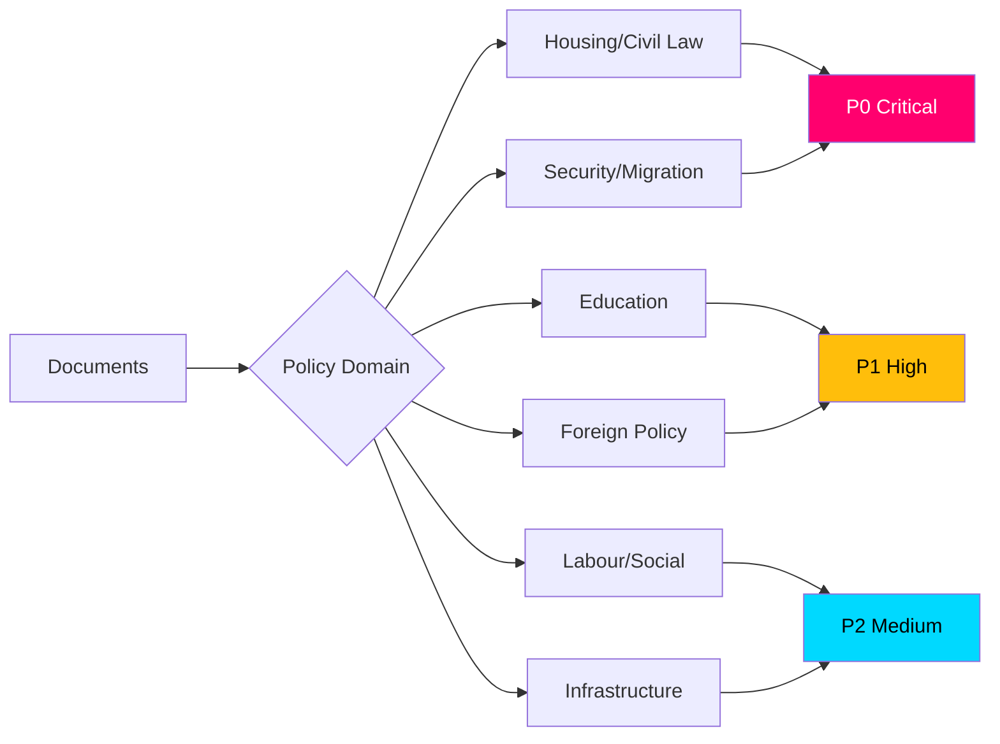

# Classification Results — Monthly Review, May 2026

**Date**: 2026-05-09 | **Method**: Political Classification Guide + DIW Significance  

---

## Classification Framework

---

## Priority Classification

### P0 — Critical (Immediate Electoral/Constitutional Impact)

| dok_id | Title | Domain | Basis |
|--------|-------|--------|-------|
| HD01CU31 | En mer flexibel hyresmarknad | Housing | DIW 12.0 — highest salience; direct voter impact; 600k queue; HD01CU31 |
| HD03267 | Säkerhetshot/utlänningar | Security/Migration | DIW 12.0 — ECHR risk; SD electoral core; HD03267 |
| HD03250 | Statlig e-legitimation | Digitalisation/Security | DIW 9.6 — sovereign infrastructure; privacy dimension; HD03250 |

### P1 — High (Significant Legislative Consequence)

| dok_id | Title | Domain | Basis |
|--------|-------|--------|-------|
| HD01UbU28 | Legitimation i tioåriga grundskolan | Education | DIW 7.2 — 30-year reform completion; teacher shortage risk |
| HD03261 | Skatteverket folkbokföring | Data/Administration | DIW 7.2 — surveillance expansion; data quality |
| HD11803 | Israel flotilla / svenska medborgare | Foreign Policy | Consular dimension; S/Johan Büser; escalation risk |

### P2 — Medium (Targeted Electoral Mobilisation)

| dok_id | Title | Domain | Basis |
|--------|-------|--------|-------|
| HD01SoU36 | Sändning av statlig personal | Defence/NATO | NATO preparedness; broad consensus |
| HD11802 | Förbud mot heltäckande slöja | Integration | SD mobilisation; L/Mohamsson under pressure |
| HD11801 | Nedsläckning av lands- och glesbygd | Infrastructure/Rural | V rural mobilisation; Trafikverket data |
| HD01UbU20 | Offentlighetsprincipen fristående skolor | Education/Transparency | S opposition to carve-out |

### P3 — Low (Technical/Administrative)

| dok_id | Title | Domain | Basis |
|--------|-------|--------|-------|
| HD10480 | Stadigvarande vistelse | Tax | Residency/fiscal; S probe |
| HD11800 | Småföretagares trygghet | Crime/Business | Local; limited national significance |
| HD01CU34 | Utmätningsregler | Civil Law | Technical enforcement reform |
| HD01UU13 | Interparlamentariska unionen | International/Admin | Institutional |

---

## Policy Domain Classification

| Domain | Count | Key documents | Electoral salience |
|--------|-------|--------------|-------------------|
| Housing/Civil Law | 2 | HD01CU31, HD01CU34 | CRITICAL |
| Security/Digital/Migration | 3 | HD03250, HD03261, HD03267 | CRITICAL |
| Education | 2 | HD01UbU20, HD01UbU28 | HIGH |
| Foreign Policy | 3 | HD10479, HD11803, HD01UU13 | HIGH-MEDIUM |
| Infrastructure/Rural | 1 | HD11801 | MEDIUM |
| Defence/NATO | 1 | HD01SoU36 | MEDIUM |
| Integration/Identity | 1 | HD11802 | MEDIUM |
| Tax/Administrative | 2 | HD10480, HD11800 | LOW |
