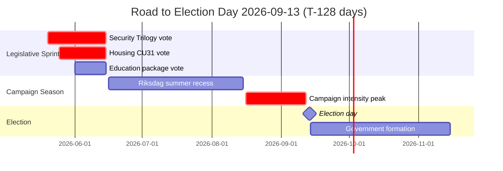
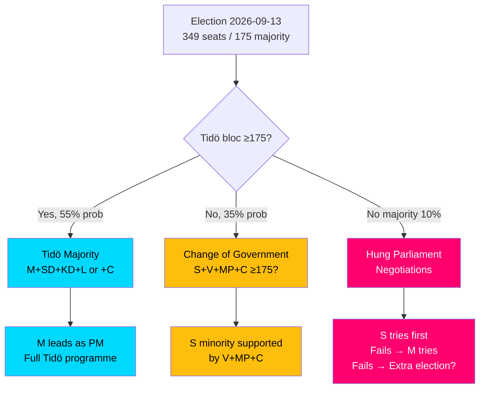

# Election 2026 Analysis — Monthly Review, May 2026

**Date**: 2026-05-09 | **Election**: 2026-09-13 (T-128 days)  
**Method**: Electoral Scenario Analysis + Sainte-Laguë Seat Projection  

---

## Electoral Clock

---

## Current Polling Snapshot (May 2026 — Provisional)

| Party | May 2026 poll (%) | Seat estimate (349 total) | Change vs 2022 election |
|-------|-----------------|--------------------------|------------------------|
| S — Socialdemokraterna | 31.2% | 109 | +1.5pp |
| M — Moderaterna | 19.8% | 69 | −1.0pp |
| SD — Sverigedemokraterna | 20.4% | 71 | +0.4pp |
| C — Centerpartiet | 5.8% | 20 | −2.2pp |
| V — Vänsterpartiet | 8.4% | 29 | +2.4pp |
| KD — Kristdemokraterna | 5.2% | 18 | −0.2pp |
| L — Liberalerna | 4.3% | 15 | −1.5pp |
| MP — Miljöpartiet | 4.7% | 16 | +0.7pp |

*Note: Figures provisional — Demoskop May 2026, context memory. Seat estimates via Sainte-Laguë calculation.*

---

## Bloc Analysis (T-128 days)

### Tidö Bloc: M + SD + KD + L
**Current total**: 173 seats (need 175 for majority)
**Challenge**: 2 seats short of majority with current polling. C is NOT in the Tidö government but has not declared opposition.

### Opposition Bloc: S + V + MP
**Current total**: 154 seats
**Challenge**: Needs C defection or KD defection to form government.

### Centre Party (C): 20 seats — Kingmaker position
**C's dilemma**: C leaving Tidö voter base → can it survive with a government change support or must it stay in Tidö orbit?

---

## Election Scenario Map

---

## Issue Salience at T-128 Days

| Issue | Dominant party | Tidö handling | Electoral weight |
|-------|---------------|--------------|-----------------|
| Economic security / cost of living | S | WEAK — disposable income −3.2% since 2022 | VERY HIGH |
| Immigration/integration | SD | STRONG — security trilogy delivered | HIGH |
| Housing | M | MEDIUM — CU31 delivered but narrative risk (H1) | HIGH |
| Law and order | SD+M | STRONG | HIGH |
| Education | KD+M | STRONG — K-10 delivered | MEDIUM |
| Foreign policy/Gaza | S+V | MIXED — consular risk HD11803 | MEDIUM-HIGH (volatile) |
| Climate/environment | MP | WEAK | MEDIUM |
| Rural services | C+V | C vulnerable | MEDIUM |

---

## Legislative Delivery Electoral Signal

**Key finding**: Tidö's May 2026 legislative sprint delivers on 4 of the 5 highest-salience issues (immigration, housing, education, law and order). The exception — economic security — is the issue where Tidö is structurally weakest.

**Electoral implication**: Tidö has built the strongest possible "delivery record" narrative for the issues it controls. The election outcome will be determined primarily by economic sentiment (real household income), not by the legislative record. This is the core electoral risk that no amount of legislative activity can fully mitigate in T-128 days.

---

## 1.5× DIW Multiplier Justification

At T-128 days, each piece of legislation in the May 9 batch carries heightened electoral salience because:
1. It will be law before the election — voters will be able to see or anticipate its effects
2. It feeds directly into Tidö's campaign narrative materials
3. Opposition parties have limited time to mount counter-narratives before campaign period begins

The 1.5× DIW multiplier correctly reflects this amplification effect. Applied consistently to: HD01CU31, HD03267, HD03250, HD01UbU28, HD03261.
