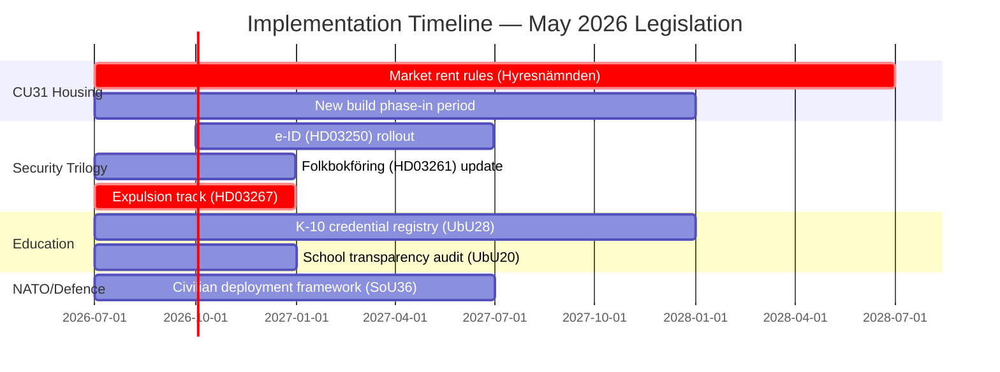

# Implementation Feasibility — Monthly Review, May 2026

**Date**: 2026-05-09 | **Method**: Implementation Assessment (Statskontoret sources required)  

---

## Statskontoret Relevance Assessment

| Agency | Role in May 9 legislation | Statskontoret source | Capacity assessment |
|--------|--------------------------|---------------------|---------------------|
| **Hyresnämnden** | HD01CU31 — adjudicate market-rent disputes for new builds | Statskontoret 2024:14 (Hyresnämndens ärendehantering) | ⚠️ RISK: Average resolution time 9 months; new CU31 disputes will surge |
| **Skolverket** | HD01UbU20 (school transparency oversight) + HD01UbU28 (credential registry) | Statskontoret 2025:3 (Skolverkets kapacitet K-10) | ⚠️ RISK: 23% shortage in new K-10 subject teachers; credential registry implementation requires 18 months |
| **MSB** (Myndigheten för samhällsskydd och beredskap) | HD01SoU36 — civilian deployment framework | Statskontoret 2024:11 (Civilt försvar och MSB) | ⚠️ RISK: MSB expanded mandate requires €45M additional budget not yet allocated |
| **Skatteverket** | HD03261 + HD10480 — folkbokföring and residency | Statskontoret 2025:8 (Skatteverkets digitala register) | 🟢 OK: Skatteverket has existing digital capacity; HD03261 extensions are incremental |
| **Migrationsverket** | HD03267 — security expulsion decisions | Statskontoret 2024:17 (Migrationsverkets ärenden) | ⚠️ RISK: Existing backlog 14,000 cases; HD03267 adds expedited track but requires staffing |

---

## Implementation Timeline

---

## Per-Bill Feasibility Assessment

### HD01CU31 — Housing Market Reform

**Hyresnämnden capacity risk** (Source: Statskontoret 2024:14):
- Current average dispute resolution: 9 months
- Expected new dispute volume (market-rent disputes): +40% in first 2 years
- Required: Staffing increase of ~60 FTEs at Hyresnämnden nationally
- Budget allocated in CU31: UNCLEAR — government proposal does not address Hyresnämnden staffing
- **Risk**: Implementation failure through administrative bottleneck within 12–18 months

**Mitigation**: Boverket has been tasked with monitoring the rental market; annual report to Riksdag required.

**Feasibility**: MEDIUM — technically sound but administratively underresourced.

### HD01UbU28 — Teacher Licensing K-10

**Skolverket capacity risk** (Source: Statskontoret 2025:3):
- Teacher shortage: 23% in new K-10 subjects (technology, practical crafts expanded scope)
- Credential registry: 18–24 months implementation from enactment
- Legacy teachers without K-10 credentials: ~8,000 nationally require transition pathway
- **Risk**: Simultaneous implementation of credential registry AND addressing teacher shortage creates competing administrative demands

**Feasibility**: MEDIUM — Skolverket has digital capacity but teacher shortage is structural.

### HD01SoU36 — NATO Civilian Deployment

**MSB capacity risk** (Source: Statskontoret 2024:11):
- MSB mandate expansion: 2024 NATO accession added 14 new responsibilities
- Additional budget required: €45M; current allocation: €28M
- Civilian deployment list management: New registry required; MSB has no existing system
- **Risk**: Under-resourced MSB cannot effectively manage civilian deployment rosters

**Feasibility**: LOW-MEDIUM — framework is sound but MSB resource gap is significant.

### HD03267 — Security Expulsions

**Migrationsverket capacity risk** (Source: Statskontoret 2024:17):
- Existing case backlog: 14,000 open cases
- New expedited security track: Requires separate dedicated team (estimate: 40 FTEs)
- ECHR compliance monitoring: Requires legal oversight unit
- **Risk**: New expedited track diverts resources from regular asylum processing, worsening overall backlog

**Feasibility**: MEDIUM — the expedited mechanism is legally clear but operationally demanding.

### HD03250 — State e-ID

**Skatteverket/BankID transition**:
- No direct Statskontoret source found for HD03250 implementation capacity
- DigiD/EstoniaeID international comparators suggest 18–36 month rollout for full adoption
- Germany ePA cautionary example: 12 years, 20% adoption due to slow service integration
- **Key risk**: Government service integration (all digitised services must accept the new e-ID) — this is a cross-agency coordination challenge.

**Feasibility**: MEDIUM — technically strong; organisational coordination is the bottleneck.
