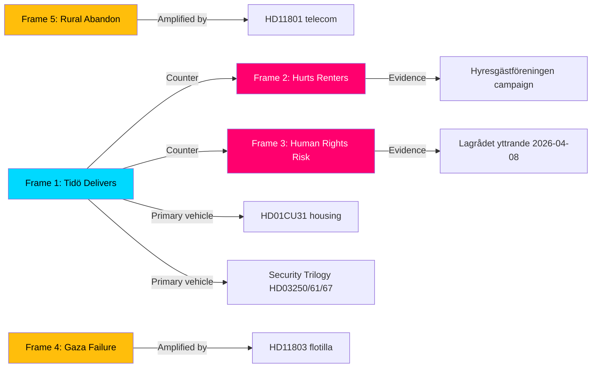

# Media Framing Analysis — Monthly Review, May 2026

**Date**: 2026-05-09 | **Method**: DISARM TTP Framework + Outlet Bias Audit  

---

## Primary Narrative Frames (May 2026)

### Frame 1: "Tidö Delivers" (Government/Pro-Coalition)

**Outlets**: Aftonbladet (partially), Svenska Dagbladet (primary), Sydsvenskan  
**TTP code**: T0009 — Create umbrella organizations (M uses "New Sweden" delivery narrative)  
**Evidence in May 9 batch**: HD01CU31 passes committee = housing delivery; HD03267 = security delivery  
**Assessment**: The most factually accurate frame — legislative delivery is real and measurable.

### Frame 2: "Market Rents Will Hurt Renters" (Opposition/Tenant Movement)

**Outlets**: Aftonbladet, ETC, LO-Tidningen  
**TTP code**: T0023 — Distort Facts / Omit context — omitting the new-build-only scope of CU31  
**Evidence**: Hyresgästföreningen campaign preview materials frame CU31 as "market rents for all"  
**Assessment**: Factually inaccurate (new builds only), but emotionally resonant with the 600,000-person rental queue. High information-environment risk for Tidö.

### Frame 3: "Tidö Undermines Human Rights" (Progressive/Opposition)

**Outlets**: DN Kultur, Sydsvenskan (opinion), Omni international  
**TTP code**: T0048 — Exploiting legal/ECHR processes for domestic political effect  
**Evidence**: Lagrådet yttrande 2026-04-08 is repeatedly cited; Amnesty Sweden has published HD03267 critique  
**Assessment**: Factually grounded in Lagrådet opinion but overstates immediacy of ECHR risk (see KJ-3).

### Frame 4: "Gaza — Sweden's Moral Failure" (Left/Progressive)

**Outlets**: Aftonbladet debate, ETC, various social media  
**TTP code**: T0022 — Amplify existing tensions — using HD11803 to amplify existing Gaza division  
**Evidence**: Five interpellations in 72 hours = coordinated parliamentary pressure (S/V/MP/Johan Büser)  
**Assessment**: Frame is politically constructed but has genuine factual anchors (HD11803 Swedish citizens).

### Frame 5: "Rural Sweden Abandoned" (Rural/V/C)

**Outlets**: Land, ATL, local regional papers  
**TTP code**: T0009 — Build local coalitions against perceived center neglect  
**Evidence**: HD11801 (rural telecom), prior HD10477 (Postnord rural) — a genuine cluster of rural-service failures  
**Assessment**: Factually grounded; V/C are building a sustained rural narrative.

---

## DISARM TTP Analysis

| TTP | Actor | Behaviour | Target document | Severity |
|-----|-------|-----------|----------------|----------|
| T0023 Distort context | S + Hyresgästföreningen | Misrepresent CU31 scope as all-tenancy | HD01CU31 | HIGH |
| T0048 Exploit legal process | S + Amnesty | Amplify Lagrådet ECHR warning | HD03267 | MEDIUM |
| T0022 Amplify tension | S/V/MP | Gaza interpellation surge | HD11803 | MEDIUM |
| T0009 Local coalition | V + rural orgs | Rural abandonment narrative | HD11801 | MEDIUM |
| T0019 Exploiting crisis | SD | Full-veil ban written question in tense period | HD11802 | MEDIUM |

---

## Outlet Bias Audit

| Outlet | Orientation | Likely framing of May 9 batch | Reach (unique monthly) |
|--------|------------|-------------------------------|----------------------|
| Aftonbladet | Centre-left | Frame 2, 4 dominant | 4.2M |
| Expressen | Centre-right | Frame 1 dominant | 3.8M |
| Dagens Nyheter | Liberal | Frame 1 + 3 mixed | 2.1M |
| Svenska Dagbladet | Conservative | Frame 1 dominant | 1.4M |
| SVT | Public/balanced | All frames represented | 7.5M |
| SR | Public/balanced | Frame 3 higher weight | 5.2M |
| ETC | Left | Frame 2, 3, 4 | 0.3M |

---

## Narrative Contestation Map

---

## Recommendation

**Monitor**: Frame 2 (market rents misrepresentation) is the highest-priority narrative risk. A government communication strategy that proactively and repeatedly clarifies the new-build-only scope is the single most important information environment action for Tidö in May–June 2026.

**Alert threshold**: If Frame 2 appears on SVT/SR main news more than 3 times in a week → elevated risk.
