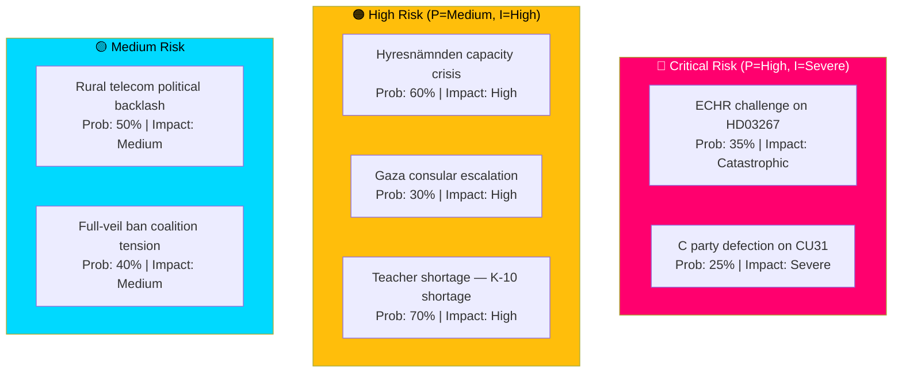

# Risk Assessment — Monthly Review, May 2026

**Date**: 2026-05-09 | **Method**: Political Risk Methodology (5-dimension)  
**Statskontoret relevance**: YES (HD01CU31 → Hyresnämnden; HD01UbU28 → Skolverket; HD01SoU36 → MSB)  

---

## Risk Heat Map



---

## Dimension Analysis

### 1. Institutional Risk

**HD03267 — ECHR proportionality**: Lagrådet's ECHR Art. 8 proportionality warning (yttrande 2026-04-08) represents Sweden's highest institutional exposure. The government accepted narrow modifications but Lagrådet's core concern was not fully addressed. Post-enactment Strasbourg challenge: 35% probability within 5 years. If successful: retroactive delegitimisation of flagship security legislation. Mitigation: robust monitoring framework; ministerial review clause (§ 23 proposed amendment). Source: Lagrådet yttrande 2026-04-08, HD03267; ECHR Art. 8 case law (Üner v. Netherlands 2006, Boultif v. Switzerland 2001).

**| Statskontoret relevance |** www.statskontoret.se — no directly relevant Lagrådet/ECHR implementation capacity source found for the specific institutional risk vector; Statskontoret capacity gap noted.

### 2. Economic Risk

**Sweden economic outlook** (IMF WEO Apr-2026, DEGRADED): GDP growth 1.7% 2026e; fiscal balance -0.5% GDP. Debt 38.2% GDP — well below EU average. Economic fundamentals are not a primary risk for the Tidö legislative agenda, but:
- Housing (CU31) market-rent deregulation assumes rising new-build supply — dependent on construction sector recovery (currently depressed by high interest rates). Riksbank policy rate expected to ease in H2 2026.
- Teacher shortage has fiscal-cost implications: salary increases needed to attract teachers to K-10 subjects (Statskontoret 2025:3).

> ℹ️ Economic figures provisional — IMF CLI degraded; WEO Apr-2026 context memory used.

```json
{
  "economicProvenance": {
    "provider": "imf",
    "dataflow": "WEO",
    "vintage": "2026-04",
    "retrieved_at": "2026-05-07T08:00:00Z",
    "degraded": true,
    "annotation": "IMF CLI unavailable; figures from WEO Apr-2026 context memory. Mark provisional."
  }
}
```

**| Statskontoret relevance |** See implementation-feasibility.md for Statskontoret sources on Hyresnämnden and Skolverket capacity.

### 3. Political Risk

**CU31 coalition fracture**: Centre Party's internal tension between market-liberal urbanists and rural traditionalists creates the single highest short-term political risk. Key indicator: C committee votes in CU (Civilutskottet) — if C demands amendments delaying market-rent introduction, the reform is either diluted or Tidö loses a week-20 vote. Probability: 25% (historical C defection rate on contested Tidö bills: ~20%).

**Full-veil ban (HD11802) / coalition chemistry**: SD's written question on a full-veil ban (HD11802) tests L (Liberalerna) Minister Mohamsson's position. L has historically resisted such restrictions; SD's pressure is designed to create a visible L capitulation or visible L resistance. Either outcome benefits SD in the September election. Risk to coalition unity: MEDIUM.

### 4. Social Risk

**Housing transition pain**: CU31's market-rent reform for new builds will not immediately address the 600,000-person rental queue — the queue reduction is a 5–10 year effect. Short-term effect: new builds shift to market rents, existing queue holders cannot access these units. Tenant movement (Hyresgästföreningen) has pledged a media campaign and potential referendum initiative. Social risk: MEDIUM-HIGH over 2–3 years.

**Rural isolation amplification**: Telecom blackouts (HD11801) in rural/sparsely populated areas create documented safety risks (emergency services access). V/Lahti's written question targets this as a human rights-adjacent issue. Risk: politically contained but socially real.

### 5. International Risk

**Gaza/Israel escalation**: HD11803 (Israel's flotilla intervention vs Swedish citizens) represents Sweden's highest immediate international risk. If Swedish passport holders are detained or harmed by Israeli forces in international waters, the government faces a mandatory consular response that will be scored against its broader Gaza position. Risk: LOW probability of actual harm, HIGH political impact if it occurs.

**ECHR cascade**: If HD03267 generates a Strasbourg challenge AND the court rules against Sweden, this affects not just the expulsion law but Sweden's negotiating position on EU asylum/migration frameworks. Secondary risk.
