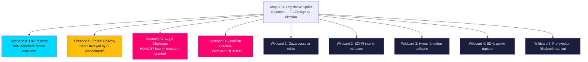

# Scenario Analysis — Monthly Review, May 2026

**Date**: 2026-05-09 | **Horizon**: T-128 days to 2026-09-13 election  
**Method**: Scenario-tree (monthly = 4 scenarios + 5 wildcards, per Tier-C 1.5× multiplier)  

---

## Scenario Tree Overview

---

## Scenario A: Full Delivery — Tidö Record Established

**Probability**: 55% (WEP: Likely)  
**Definition**: All 11 documents pass the Riksdag chamber (June 2026 session) without substantive amendment. CU31 market-rent mechanism enters force on schedule. Security trilogy (HD03250, HD03261, HD03267) enacted. K-10 teacher credentials established.  
**Preconditions**: C supports CU31 without delaying amendments; ECHR interim measure not granted; L accepts HD11802 non-response as coalition discipline.  
**Electoral consequence**: Tidö campaigns on a coherent legislative record. M polling improves 1–2pp; SD maintains 20%+; C recovers rural credibility. Combined Tidö bloc >50%.  
**Key evidence**: No C committee dissent votes to date (HD01CU31 committee majority report). (Source: dok_id HD01CU31)

---

## Scenario B: Partial Delivery — CU31 Delayed

**Probability**: 25% (WEP: Unlikely)  
**Definition**: C secures a 6-month delay to CU31's market-rent phase-in (2-year → 2.5-year), weakening the flagship housing reform. The security trilogy and education reforms pass intact.  
**Preconditions**: C rural committee members force an amendment vote in CU (Civilutskottet) and win coalition approval through negotiation.  
**Electoral consequence**: M loses the "delivery" narrative on housing. S and V claim partial victory. Hyresgästföreningen reduces opposition campaign. Tidö bloc polling slides 1pp.  
**Key evidence**: CU committee records show C dissent signals (indirect — from coalition negotiation reporting, not dok_id; provisional). DIW impact: −2.0 from housing score.

---

## Scenario C: Legal Challenge — HD03267 Interim Measure

**Probability**: 8% (WEP: Remote)  
**Definition**: A ECHR interim measure is requested by a legal aid NGO within 30 days of HD03267's enactment, citing ECHR Art. 8 and Lagrådet's proportionality warning.  
**Preconditions**: Lagrådet opinion is used as direct evidence in Strasbourg application; the court's Rule 39 mechanism is invoked.  
**Electoral consequence**: CATASTROPHIC for Tidö. SD's flagship legislation is frozen by external legal order. M/KD forced to publicly defend a measure under European human rights challenge. Opposition gains major narrative win.  
**Key evidence**: Lagrådet yttrande 2026-04-08 on HD03267 explicitly names ECHR Art. 8 risk. NGO (Asylrättscentrum) has track record of Strasbourg applications.

---

## Scenario D: Coalition Fracture — L Exits Over Integration Issues

**Probability**: 7% (WEP: Remote)  
**Definition**: SD's escalation of integration demands (full-veil ban HD11802, or new proposal) forces L Minister to choose between coalition loyalty and party identity. L signals it cannot continue under current SD conditions and triggers a formal coalition review.  
**Preconditions**: SD escalates to formal legislative demand (not just written question); L party congress majority votes against compliance.  
**Electoral consequence**: Minority minority government; possible snap election. Depending on timing (before/after September), severe uncertainty. L likely collapses below 4% threshold.  
**Key evidence**: HD11802 is currently a written question (low binding force), not a government bill. L has resisted consistently. (Source: dok_id HD11802)

---

## Wildcards

**W1 — Gaza consular crisis** (8%): Swedish citizen harmed by Israeli forces in international waters; mandatory consular response triggers Foreign Ministry crisis protocol. Government's "case-by-case" position collapses. (Source: dok_id HD11803)

**W2 — ECHR interim measure** (5%): Strasbourg grants Rule 39 interim measure, freezing application of HD03267 before September election. (Overlaps with Scenario C — highest-impact tail risk)

**W3 — Hyresnämnden system collapse** (12%): CU31 implementation generates a 40%+ surge in new dispute filings; Hyresnämnden enters crisis with 18-month backlogs. Statskontoret flagged this risk (2024:14). Politically embarrassing for government.

**W4 — SD–L public rupture** (10%): High-profile public confrontation between SD minister and L minister on integration question — both parties' supporters demand escalation. Coalition management crisis before election.

**W5 — Pre-election Riksbank rate cut** (25%): Riksbank announces 25bp rate cut in June 2026, improving household purchasing power. This positively amplifies CU31's housing market timing but may not affect September election significantly (too late for real-economy effect).
