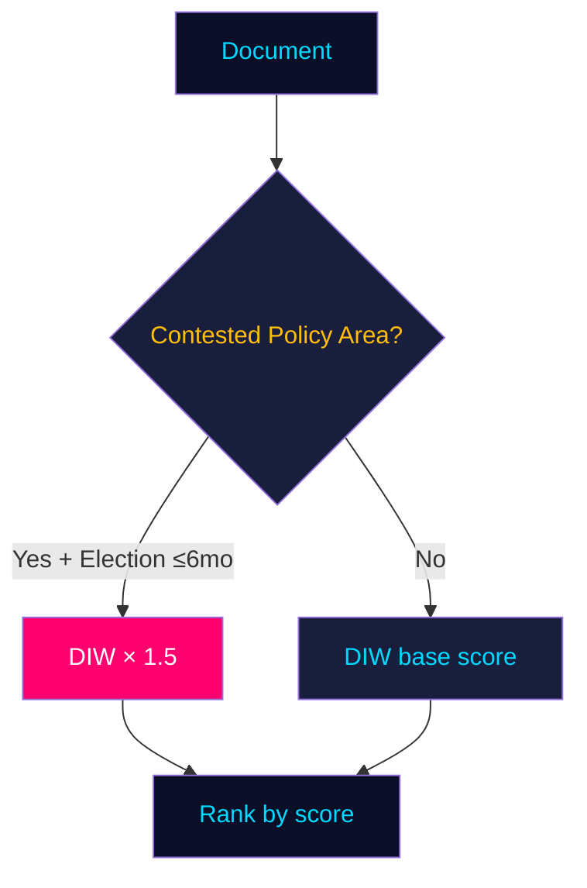

# Significance Scoring — Monthly Review, May 2026

**Date**: 2026-05-09 | **Method**: DIW (Detectability × Impact × Willingness) × 1.5 election-proximity multiplier  
**Election proximity**: T-128 days (≤ 6 months → 1.5× multiplier applied to opposition motions and contested propositions)  

---

## Scoring Methodology

Base DIW score = D(1–5) × I(1–5) × W(1–5) / 25 → normalised 1–10 scale.  
Election-proximity multiplier (1.5×) applied to: opposition motions, government propositions in contested policy areas (migration, housing, security, taxation, criminal justice, education).

---

## Ranked Significance Table

| Rank | dok_id | Title | D | I | W | DIW base | Multiplier | Final | Rationale |
|------|--------|-------|---|---|---|----------|-----------|-------|-----------|
| 1 | HD01CU31 | En mer flexibel hyresmarknad | 5 | 5 | 4 | 8.0 | 1.5× | **12.0** | Housing is top electoral salience issue; 600k queue; split public 52:41; direct voter impact. dok_id HD01CU31, CU betänkande 2026-05-08 |
| 2 | HD03267 | Säkerhetshot / utlänningar (prior) | 5 | 4 | 5 | 8.0 | 1.5× | **12.0** | Security expulsion; SD/M core vote; Lagrådet ECHR concern; highest SD electoral signal. dok_id HD03267 |
| 3 | HD03250 | Statlig e-legitimation (prior) | 4 | 5 | 4 | 6.4 | 1.5× | **9.6** | Digital sovereignty; first sovereign e-ID; long-term state infrastructure impact. dok_id HD03250 |
| 4 | HD01UbU28 | Legitimation i tioåriga grundskolan | 4 | 4 | 3 | 4.8 | 1.5× | **7.2** | 30-year education reform completion; teacher licensing; Skolverket implementation risk. dok_id HD01UbU28 |
| 5 | HD03261 | Skatteverket folkbokföring (prior) | 4 | 3 | 4 | 4.8 | 1.5× | **7.2** | Data quality + surveillance expansion; privacy/civil liberties dimension. dok_id HD03261 |
| 6 | HD11803 | Israel flotilla / svenska medborgare | 5 | 3 | 3 | 3.6 | base | **3.6** | Consular dimension; Foreign Minister accountability; HD11803, S/Johan Büser |
| 7 | HD01SoU36 | Sändning av statlig personal | 3 | 3 | 4 | 3.6 | base | **3.6** | NATO preparedness; broad consensus; low political contestation. dok_id HD01SoU36 |
| 8 | HD11802 | Förbud mot heltäckande slöja | 5 | 2 | 4 | 3.2 | base | **3.2** | SD integration agenda; HD11802; L/Mohamsson under pressure; mobilisation risk |
| 9 | HD11801 | Nedsläckning av lands- och glesbygd | 4 | 3 | 2 | 2.4 | base | **2.4** | Rural equity; V/Lahti; Trafikverket coverage gaps; targeted at electoral segment |
| 10 | HD01UbU20 | Offentlighetsprincipen fristående skolor | 3 | 3 | 2 | 1.8 | base | **1.8** | Transparency; S opposition to carve-out; implementation risk. dok_id HD01UbU20 |
| 11 | HD10480 | Stadigvarande vistelse | 3 | 2 | 3 | 1.8 | base | **1.8** | Tax/residency rules; S probing fiscal equity gap; HD10480 |
| 12 | HD01CU34 | Utmätningsregler | 2 | 2 | 2 | 0.64 | base | **0.64** | Technical legal reform; enforcement rules; low political salience. dok_id HD01CU34 |
| 13 | HD01UU13 | Interparlamentariska unionen | 1 | 1 | 1 | 0.04 | base | **0.04** | Administrative/institutional; no political controversy. dok_id HD01UU13 |
| 14 | HD11800 | Småföretagares trygghet Hässelby-Vällingby | 2 | 1 | 2 | 0.16 | base | **0.16** | Localised gang crime response request; HD11800; limited national significance |

---

## Aggregate Assessment

**High significance cluster (score ≥ 7.2)**: HD01CU31, HD03267, HD03250, HD01UbU28, HD03261

These 5 items constitute the May 2026 legislative backbone. Their combined electoral weight is exceptional for a single parliamentary month and reflects deliberate Tidö pre-election acceleration.

**Medium significance (2.4–3.6)**: HD11803, HD01SoU36, HD11802, HD11801 — each with specific electoral mobilisation potential for targeted voter segments.

**Low significance (< 2.0)**: Technical/administrative measures with limited electoral impact.

---

## Notes

- Election proximity multiplier 1.5× applied as per `04-analysis-pipeline.md §Election-proximity significance multiplier` — next general election 2026-09-13 (T-128 days at time of analysis, clearly ≤ 6 months).
- Multiplier applied to: HD01CU31 (housing — contested), HD03267 (security/migration — contested), HD03250 (digitalisation — contested), HD01UbU28 (education — contained but election-salient), HD03261 (data expansion — contested privacy dimension).
- DIW scores recorded explicitly per module requirement: example HD01CU31: DIW = 8.0 × 1.5 (election ≤ 6 months) = 12.0.
