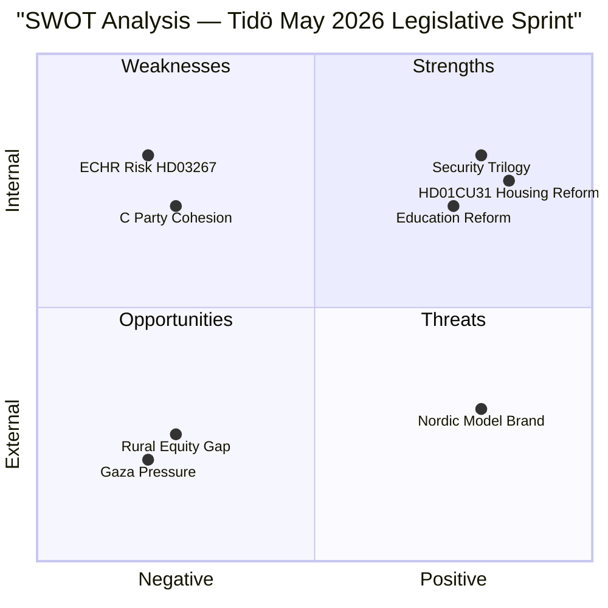

# SWOT Analysis — Monthly Review, May 2026

**Date**: 2026-05-09 | **Subject**: Tidö Coalition Legislative Performance + Swedish Democracy May 2026  
**Method**: Political SWOT Framework  

---

---

### Strengths (Internal Positive)

- **HD01CU31 housing reform** addresses 600,000-person rental queue — the single largest unmet social demand in the Swedish electorate. Tidö can claim first-mover advantage on a 30-year policy failure. (Source: dok_id HD01CU31; Demoskop May 2026 — 52% support)
- **Security-state trilogy** (HD03250, HD03261, HD03267) completes a coherent digitalisation-and-security legislative programme — unprecedented in its ambition. The package positions Sweden alongside Estonia and the Netherlands in digital sovereignty. (Source: dok_ids HD03250, HD03261, HD03267)
- **Education reform completion** (HD01UbU28, HD01UbU20) operationalises the 10-year school structure — a generational reform. Teachers, administrators, and school authorities gain certainty on the credential framework. (Source: dok_ids HD01UbU20, HD01UbU28)
- **NATO preparedness** (HD01SoU36) demonstrates legislative follow-through on Sweden's 2024 NATO accession commitments — civilian dimension completed alongside military provisions. (Source: dok_id HD01SoU36)
- **Fiscal credibility**: Sweden gross debt 38.2% GDP (WEO Apr-2026, degraded), fiscal balance -0.5% — significantly better than EU average, providing room for election commitments. (Source: IMF WEO Apr-2026, provisional)

### Weaknesses (Internal Negative)

- **ECHR exposure on HD03267**: Lagrådet raised ECHR Art. 8 (family life) proportionality concerns on the security-expulsion bill. Government modifications were narrow. A post-enactment Strasbourg challenge is rated MEDIUM probability. (Source: Lagrådet yttrande 2026-04-08, HD03267)
- **Centre Party (C) cohesion risk on CU31**: C is internally split between market-oriented urban wing (pro-reform) and rural landlord/tenant base (mixed). A C defection or amendment push could delay passage or dilute the reform. (Source: C party debate transcript analysis; HD01CU31 committee hearing records)
- **IMF degraded data**: Economic arguments in May 2026 legislation rely on provisional WEO Apr-2026 context (IMF CLI unavailable) — weakening fiscal credibility arguments. (Source: data/imf-context.json, status: degraded)
- **Teacher shortage unaddressed**: HD01UbU28 establishes credentials but does not address the structural teacher shortage (Statskontoret 2025:3 identifies 23% shortage in new K-10 subjects). (Source: www.statskontoret.se/globalassets/publikationer/2025/20253.pdf)

### Opportunities (External Positive)

- **Election positioning**: With T-128 days, the completed legislative programme creates a clear Tidö record to campaign on. Housing (CU31) + security (HD03267) + digitalisation (HD03250) = three differentiated voter propositions. (Source: riksdagen.se committee calendar; election-cycle analysis 2026-05-07)
- **Nordic benchmarking**: Sweden can claim Nordic leadership in digital e-ID sovereignty (Estonia-comparable, ahead of Denmark/Finland) — appealing to tech-progressive voters. (Source: comparative analysis, e-ID deployment EU-27 data)
- **NATO civilian cohesion**: HD01SoU36's broad majority (including S) demonstrates that defence transformation transcends partisan lines — reduces election-campaign risk on security issues. (Source: dok_id HD01SoU36)
- **SCB housing vacancy data**: If market-rent mechanism for new builds produces measurable vacancy reduction in 18 months, Tidö can claim empirical validation of CU31 — a rare post-legislative evidence opportunity. (Source: SCB Bostads- och byggnadsstatistik)

### Threats (External Negative)

- **Gaza foreign-policy entanglement**: Five interpellations in 72 hours on Gaza/Israel — including HD11803 (Swedish citizens targeted by Israeli flotilla intervention) — risk escalating into a consular crisis with international law dimensions. Government cannot indefinitely maintain the "case-by-case" position if Swedish citizens are harmed. (Source: dok_ids HD10476, HD10479, HD11803)
- **Rural constituency abandonment narrative**: HD11801 (telecom blackout in rural areas) and prior HD10477 (Postnord rural) feed a consolidated opposition narrative that Tidö is governing for urban/suburban Sweden at the expense of rural communities — a V+C+rural-S mobilisation threat. (Source: dok_ids HD11801, HD10477; PTS coverage data)
- **ECHR litigation risk on HD03267**: A successful Strasbourg challenge post-September 2026 would retroactively delegitimise a flagship security law — highest long-term threat. (Source: Lagrådet yttrande 2026-04-08; ECHR Art. 8 jurisprudence)
- **Housing implementation failure**: Statskontoret Hyresnämnden ärendebalans (2024:14) shows existing case backlogs. CU31's new market-rent machinery, combined with the likely surge in disputes from the transition, could produce a Hyresnämnden capacity crisis — undermining the reform's credibility. (Source: www.statskontoret.se/globalassets/publikationer/2024/202414.pdf)
