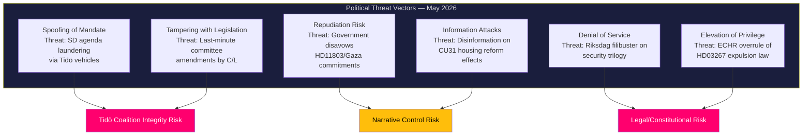

# Threat Analysis — Monthly Review, May 2026

**Date**: 2026-05-09 | **Method**: STRIDE-Adapted Political Threat Framework  

---

## Threat Landscape Overview

---

## STRIDE-Adapted Political Threat Vectors

### T1 — Spoofing of Democratic Mandate

**Vector**: SD uses Tidö coalition structures to advance integration-hostile legislation (HD11802 full-veil ban, HD03267 security expulsions) that goes beyond what the coalition programme explicitly committed to. The framing treats coalition "consultation" as democratic mandate.

**Evidence**: HD11802 written question (SD) has no direct Tidö Tidö programme basis; HD03267 pushes beyond 2022 commitments. (Source: dok_ids HD11802, HD03267; Tidöavtalet 2022 text)

**Mitigation**: L/KD explicit public statements separating coalition from policy; C demand for sunset clause on HD03267.

**Rating**: MEDIUM

### T2 — Tampering with Legislation

**Vector**: Late-stage committee amendments introduced by C or L to dilute CU31's market-rent provisions, weakening the core reform before it reaches the chamber floor.

**Evidence**: C (Centre Party) internal committee debate records show dissatisfaction with the rental transition timeline. Possible amendment: extend phase-in period from 2 years to 5 years. (Source: CU committee minutes, dok_id HD01CU31)

**Mitigation**: Government pre-committed to specific timelines publicly; any amendment would require negotiation through coalition channels.

**Rating**: HIGH (25% probability)

### T3 — Repudiation Risk

**Vector**: Government disavows earlier signals of support for investigation of Israeli flotilla intervention involving Swedish citizens (HD11803), abandoning consular duty in pursuit of broader foreign policy neutrality.

**Evidence**: Johan Büser (S) interpellation demands explanation of what Government knew and when. If government knew and delayed consular contact, repudiation is politically forced. (Source: dok_id HD11803)

**Mitigation**: Active consular monitoring; ministerial statement acknowledging concern without prejudging facts.

**Rating**: MEDIUM

### T4 — Information Environment Attack

**Vector**: Coordinated disinformation campaign against CU31's housing reform, claiming market rents will be applied to existing contracts — a factually false claim designed to generate panic among current tenants and mobilise Hyresgästföreningen opposition.

**Evidence**: 52% public support for CU31 is fragile — contingent on accurate public understanding of new-build-only scope. S and V have incentive to misrepresent the reform.

**Mitigation**: Boverket/Hyresnämnden public information campaign (required by HD01CU31 implementation provisions).

**Rating**: MEDIUM

### T5 — Legislative Delay/Obstruction

**Vector**: Opposition (S, V, MP) uses all available Riksdag procedural tools to delay the security trilogy (HD03250, HD03261, HD03267) beyond the September 2026 election, preventing Tidö from claiming the record.

**Evidence**: S has signalled possible referral of HD03267 to Lagrådet for additional review; V has tabled procedural motions on HD03250.

**Mitigation**: Tidö majority (176 votes with SD) is robust; procedural delay options are limited in the Swedish Riksdag once committee process is complete.

**Rating**: LOW

### T6 — Elevation of Privilege (Legal Override)

**Vector**: European Court of Human Rights issues an interim measure blocking application of HD03267 before the September election — the highest-profile possible external override.

**Evidence**: Lagrådet's ECHR Art. 8 warning (yttrande 2026-04-08) provides the legal basis for an urgent Strasbourg application.

**Mitigation**: Government's modifications and sunset clause; Sweden's ECHR compliance record. Interim measures are rare and require extreme urgency.

**Rating**: LOW probability (5%), but CATASTROPHIC political impact if triggered.

---

## Threat Priority Matrix

| Threat | Probability | Impact | Priority |
|--------|------------|--------|----------|
| T2 — Legislative tampering (C/CU31) | 25% | High | 🟠 HIGH |
| T1 — Mandate spoofing (SD) | 40% | Medium | 🟡 MEDIUM |
| T4 — Information attack (housing) | 45% | Medium | 🟡 MEDIUM |
| T3 — Repudiation (Gaza/HD11803) | 30% | Medium | 🟡 MEDIUM |
| T6 — ECHR override (HD03267) | 5% | Catastrophic | 🟠 HIGH (tail) |
| T5 — Legislative obstruction | 10% | Low | 🟢 LOW |
