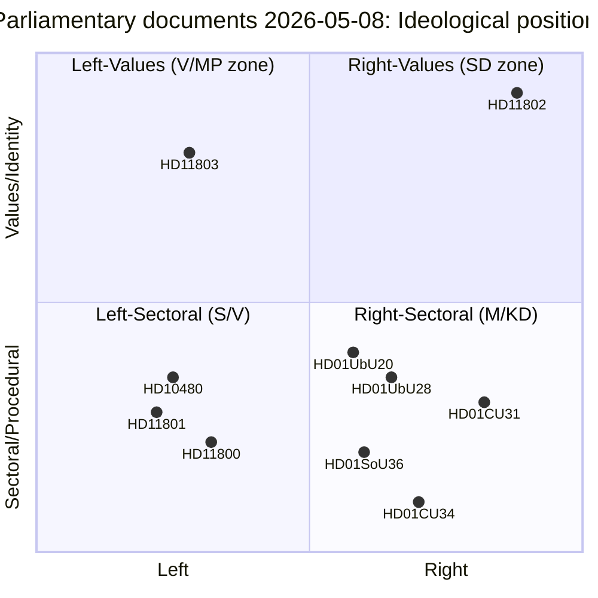

# Classification Results — Parliamentary Pulse 2026-05-09

## Political Classification Framework

| dok_id | Title | Policy Domain | Government/Opposition | Party | Bill Stage | Electoral Risk |
|--------|-------|--------------|----------------------|-------|------------|----------------|
| HD01CU31 | En mer flexibel hyresmarknad | Housing | Government (majority) | M/KD/SD/L | Betänkande (chamber-ready) | HIGH — rental market is election battleground |
| HD01CU34 | Ändamålsenliga utmätningsregler | Justice/Civil | Government | Coalition | Betänkande | LOW |
| HD01SoU36 | Bättre förutsättningar att sända ut statlig personal | Social/Labour | Government | Coalition | Betänkande | LOW |
| HD01UbU20 | Offentlighetsprincipen i skolväsendet | Education | Government | Coalition | Betänkande | MEDIUM — school transparency, parent vote |
| HD01UbU28 | Legitimation i den tioåriga grundskolan | Education | Government | Coalition | Betänkande | MEDIUM — teacher quality, school policy |
| HD01UU13 | Interparlamentariska unionen | Foreign Affairs | Government | Coalition | Betänkande | LOW |
| HD10480 | Stadigvarande vistelse | Taxation | Opposition | S | Interpellation | MEDIUM — fiscal inequality |
| HD11800 | Småföretagares trygghet | SME Policy | Opposition | S | Skriftlig fråga | LOW |
| HD11801 | Nedsläckning av lands- och glesbygd | Telecom/Rural | Opposition | V | Skriftlig fråga | MEDIUM — rural SD-V overlap |
| HD11802 | Förbud mot heltäckande slöja | Identity/Values | Opposition | SD | Skriftlig fråga | HIGH — identity-politics campaign signal |
| HD11803 | Israels ingripande mot svenska medborgare | Foreign Policy | Opposition | S | Skriftlig fråga | HIGH — foreign-policy accountability |

## Ideological Position Matrix

## GDPR Classification Note

All classified documents are derived from publicly available parliamentary records under GDPR Art. 9(2)(e) (political opinions manifestly made public) and 9(2)(g) (substantial public interest in democratic transparency). No private personal data processed. Data minimisation applied: only names/parties of elected officials in their official capacity are retained.

