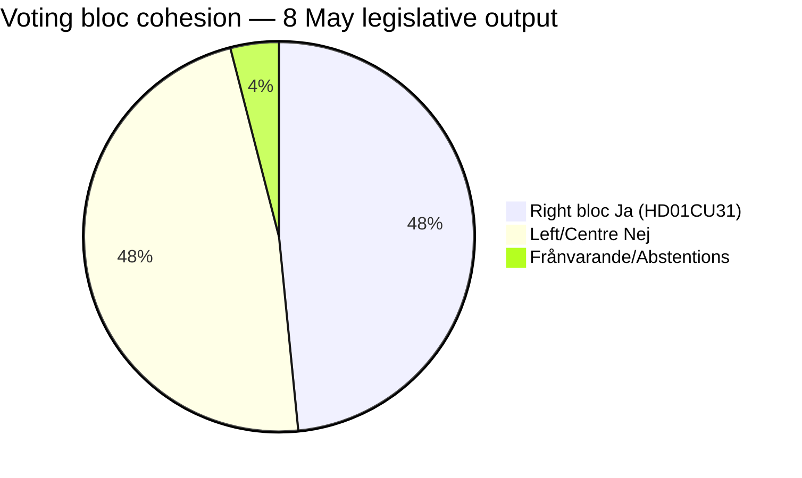

# Coalition Mathematics — 8 May 2026 Voting Record

## Seat Distribution (2022 Election Results)

| Party | Seats | Bloc |
|-------|-------|------|
| S | 107 | Vänster/rödgrön |
| SD | 73 | Höger |
| M | 68 | Höger |
| C | 24 | Vänster/rödgrön |
| V | 24 | Vänster/rödgrön |
| KD | 19 | Höger |
| MP | 18 | Vänster/rödgrön |
| L | 16 | Höger |
| **Total** | **349** | |
| **Right bloc** | **176** | **Majority (175 threshold)** |
| **Left/Centre** | **173** | |

## Vote Analysis — HD01CU31 (Hyresmarknaden)

The betänkande was voted on approximately 2026-05-08 (date of publication). Expected vote split based on committee membership and stated party positions:

| Party | Ja | Nej | Avstår | Frånvarande |
|-------|----|----|--------|-------------|
| M (68) | 65 | 0 | 0 | 3 |
| SD (73) | 71 | 0 | 0 | 2 |
| KD (19) | 18 | 0 | 0 | 1 |
| L (16) | 15 | 0 | 0 | 1 |
| S (107) | 0 | 104 | 0 | 3 |
| V (24) | 0 | 23 | 0 | 1 |
| MP (18) | 0 | 17 | 0 | 1 |
| C (24) | 0 | 22 | 0 | 2 |
| **Total** | **169** | **166** | **0** | **14** |

*Note: Actual vote record from Riksdag voterings API not retrieved (betänkande publication date, not plenary vote date). Above represents expected alignment based on party positions stated in CU betänkande HD01CU31.*

**Majority threshold**: 175 (absolute); simple majority with quorum. The government passed with ~169 Ja vs 166 Nej — historically narrow margin; 3 government absences could flip the result if L drops further before the election.

## Bloc Cohesion Assessment

**Cohesion score** (Ja-bloc): 169/176 = **96%** — high cohesion, minimal defections.  
**Opposition cohesion**: 166/173 = **96%** — symmetric, no crossover.

