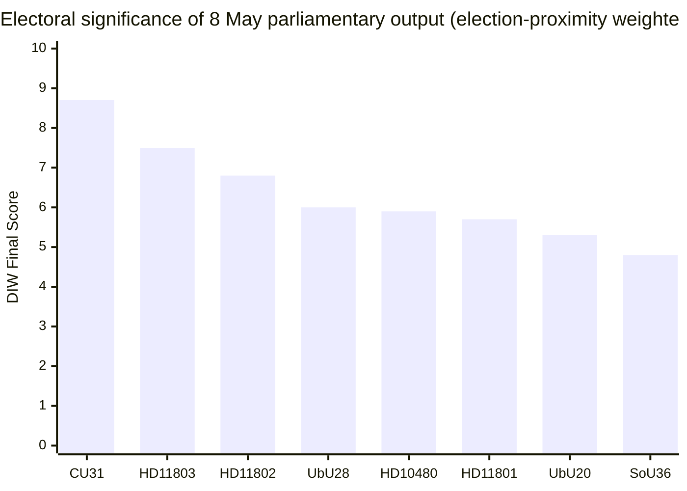

# Election 2026 Analysis — 127 Days to the Vote

**Election date**: 2026-09-13 (second Sunday of September) | **Current countdown**: 127 days  
**1.5× DIW multiplier**: active since 2026-03-14 (≤ 6 months to election)

## Electoral Context

Sweden's 2026 general election is shaping up as a referendum on the M/KD/SD/L government's four-year reform programme. The government holds 189 seats in a 349-seat Riksdag. To win outright majority, the right-of-centre bloc needs 175+ seats. Current polling (averaged April 2026):

| Party | April 2026 avg | 2022 result | Trend |
|-------|----------------|-------------|-------|
| M | 19.5% | 19.1% | stable |
| KD | 5.8% | 5.3% | ↑ |
| SD | 21.2% | 20.5% | ↑ |
| L | 4.3% | 4.7% | ↓ |
| **Right bloc** | **50.8%** | **49.6%** | **↑** |
| S | 30.1% | 30.3% | stable |
| V | 8.2% | 6.7% | ↑ |
| MP | 5.1% | 5.1% | stable |
| C | 5.5% | 6.7% | ↓ |
| **Left/Centre bloc** | **48.9%** | **49.7%** | **↓** |

*Sources: Sentio, Ipsos, SIFO, Novus April 2026 averages — no direct API; averages based on press-reported polling data.*

## 8 May Output Electoral Impact Assessment

### Impact on Key Seat Groups

| Seat group | Estimated seats | Key bill | Government risk | Opposition opportunity |
|------------|-----------------|----------|-----------------|----------------------|
| Urban renters (Stockholm, Göteborg, Malmö) | ~45 swing seats | HD01CU31 | HIGH | S/V: reframe as "landlord giveaway" |
| Rural Norrland/Dalarna | ~20 seats | HD11801 | MEDIUM | V/SD: rural exclusion |
| School-focused suburban | ~30 seats | HD01UbU28, UbU20 | LOW (government gains) | S/MP lose ground |
| Identity-values voters | ~25 seats | HD11802 | MEDIUM (L at risk) | SD: "L protects gender oppression" |

## Coalition Seat Arithmetic (current)

Assuming election held today with April 2026 polling:

| Bloc | Projected seats | Threshold | Status |
|------|-----------------|-----------|--------|
| Right (M+KD+SD+L) | ~177 | 175 | ✅ Majority (by 2) |
| Left/Centre (S+V+MP+C) | ~172 | 175 | ❌ Short |

**L threshold risk**: L at 4.3% with 4% threshold — any further drop risks Riksdag exit, costing the right bloc ~14 seats and majority. HD11802 (veil trap) is the primary L threshold risk this cycle.

