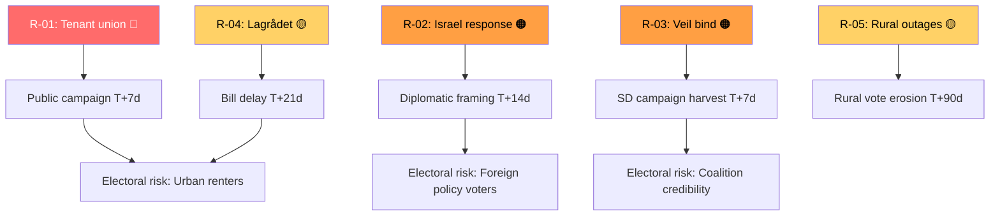

# Risk Assessment — Parliamentary Pulse 2026-05-09

**Framework**: Political Risk Methodology (Riksdagsmonitor), election-proximity adjusted.  
**Horizon**: T+30 days / T+90 days / T+127 days (election)

## Risk Register

| ID | Risk | Dimension | Probability | Impact | Severity | Horizon |
|----|------|-----------|-------------|--------|----------|---------|
| R-01 | Tenant union mobilisation derails HD01CU31 public support | Political | HIGH | HIGH | 🔴 Critical | T+14d |
| R-02 | Government gives equivocal answer on HD11803 (Israel), amplified as consular failure | Diplomatic/Political | MEDIUM | HIGH | 🟠 High | T+14d |
| R-03 | SD campaign exploit: L minister refuses veil ban (HD11802) → "L blocks action" | Coalition/Electoral | HIGH | MEDIUM | 🟠 High | T+7d |
| R-04 | Lagrådet critical yttrande delays HD01CU31 → opposition exploits procedural failure | Legal/Institutional | MEDIUM | MEDIUM | �� Medium | T+21d |
| R-05 | Rural broadband crisis (HD11801) escalates with summer outages → SD/V electoral surge in rural constituencies | Infrastructure/Political | LOW | HIGH | 🟡 Medium | T+90d |
| R-06 | Fiscal domicile interpellation (HD10480) reveals implementation gap in ISL → S tax-fairness campaign | Legal/Fiscal | MEDIUM | LOW | 🟡 Medium | T+21d |
| R-07 | IMF IFS SDMX outage prolonged — WEO/FM still OK but monthly CPI claim reliant on SCB flash | Data/Epistemic | LOW | LOW | 🟢 Low | T+72h |
| R-08 | Teacher credential reform (HD01UbU28) encounters school-union resistance during implementation | Labour/Education | LOW | MEDIUM | 🟢 Low | T+90d |

## Dimensional Risk Map

### Political
- **R-01** (rental reform backlash): Hyresgästföreningen will mobilise a sustained public campaign. Risk timeline: petitions within 7 days, protest demonstrations within 14 days, legal challenges within 30 days. Source: HD01CU31 + historical tenant-union activation patterns (2013 Swedish rental reform debate).

### Diplomatic/Institutional
- **R-02** (Israel maritime incident): International law exposure is HIGH — Swedish citizens in international waters enjoy full consular protection. The government's margin for ambiguity is narrow. Foreign Minister Maria Malmer Stenergard's response (due within 14 days) will determine risk trajectory.

### Coalition/Electoral
- **R-03** (veil ban): SD's framing is designed to force a choice between governing-coalition unity and SD's electoral base. L minister Mohamsson's response options: (a) commit to legislation timeline [risks L liberal wing], (b) refuse legislative action [gives SD "blocking" narrative], (c) delay/refer to investigation [buys time but signals weakness].

### Institutional/Legal
- **R-04** (Lagrådet): HD01CU31 touches rental law principals and potentially RF property provisions. If a Lagrådet referral occurs and the yttrande is critical, government faces a 30–60 day delay that compresses the legislative window before the September election.

## Residual Risk

The aggregate risk picture for the coalition is manageable but non-trivial: R-01 + R-03 in combination produce a narrative that the government governs for landlords (R-01) while failing on cultural identity (R-03) — creating a two-front squeeze between urban-left and populist-right voters. The mitigant is coalition discipline and the strong UbU education output.

