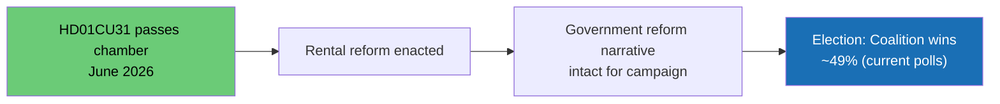

# Scenario Analysis — Parliamentary Pulse 2026-05-09

**Base date**: 2026-05-09 | **Horizon**: T+127 days (2026-09-13 election)

## Scenario 1: Government Reform Momentum — Controlled Passage (Baseline, WEP 45%)

**Trigger**: HD01CU31 passes the chamber in June with no major public backlash; government manages tenant-union opposition through communication campaign; Israel response (HD11803) is measured and sufficient; L avoids veil-ban trap.

**Outcome**: Government coalition enters election campaign with completed reform legacy (housing, education, enforcement) and intact coalition cohesion. SD maintains dual-track without major rupture. S/V narrative does not achieve public traction. Polling remains within 3% of current.

**Evidence**: HD01CU31 majority stable (M/KD/SD/L = 189+); UbU reforms popular with school-focused middle-class voters; IMF WEO Apr-2026 macro-backdrop stable (GDP 1.8%, debt 36.2%). Source: HD01CU31 (riksdagen.se), IMF WEO Apr-2026 SWE.

## Scenario 2: Tenant Revolt + Foreign Policy Crisis (Adverse, WEP 30%)

**Trigger**: HD01CU31 triggers sustained Hyresgästföreningen mobilisation that dominates news cycle through June; simultaneously, government's response to HD11803 (Israel) is perceived as insufficient; S doubles down; L is caught in veil trap.

**Outcome**: Opposition narrative converges: "government governs for landlords and foreign interests, not Swedish citizens." Coalition loses 2–4% in polling among urban renters and young voters. S narrows the gap.

**Evidence**: Historical precedent — 2014 pre-election period saw government lose momentum on housing after tenant protests; HD11803 + HD11802 + HD01CU31 combination creates three-front electoral stress. Source: HD01CU31, HD11803, HD11802 (all riksdagen.se); historical Swedish polling data.

## Scenario 3: SD Exploits Coalition Fracture (Escalation, WEP 15%)

**Trigger**: L minister Mohamsson gives a firm "no" to veil ban (HD11802); SD amplifies this as "L blocking Swedish identity"; M/KD remain silent; SD begins running independent anti-L campaign while nominally staying in coalition.

**Outcome**: Coalition cohesion is visibly under stress. SD starts polling above 20% independently; L falls below 4% threshold. Government enters election campaign with a fractured internal message.

**Evidence**: HD11802 (SD pressure on L); historical SD–L tension on identity politics (2023–2025 coalition negotiations). Source: HD11802 (riksdagen.se), coalition agreement 2022.

## Scenario 4: Rapid De-escalation + Consensus (Optimistic, WEP 10%)

**Trigger**: Government responds decisively to HD11803 (condemns Israeli maritime action); L announces a cross-party working group on HD11802 (defusing SD attack); HD01CU31 passes quietly with Hyresgästföreningen accepting phased implementation.

**Outcome**: All three opposition attack lines are neutralised within 14 days. Government retains full reform narrative. Election campaign begins from a position of strength.

**Evidence**: Government has tools to de-escalate all three issues; requires coordination speed and political will. Lower probability (10%) given the structural electoral incentives for opposition to maintain pressure.

