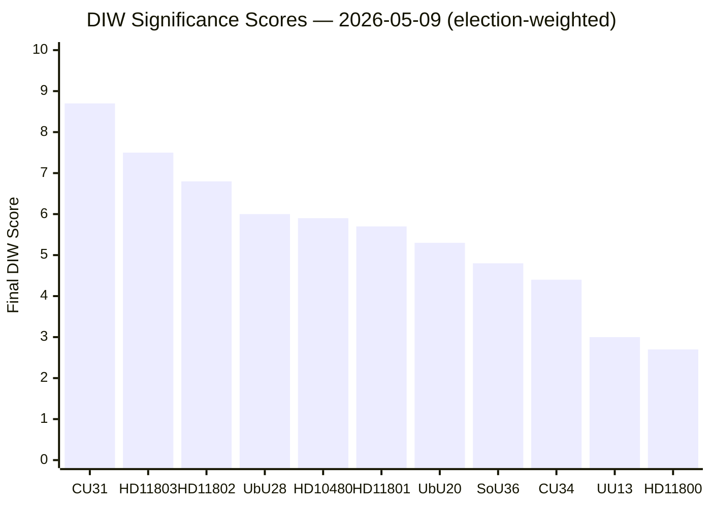

# Significance Scoring — Parliamentary Pulse 2026-05-09

**Election proximity**: 127 days to 2026-09-13 → **1.5× multiplier** active for all opposition motions and government propositions in contested policy areas (migration, defence, taxation, climate, criminal justice, housing).

## DIW Scoring Methodology

- **D** (Detectability 1–4): How observable/traceable is the event in public data?
- **I** (Impact 1–4): What is the direct policy/voter impact?
- **W** (Willingness 1–4): How strong is political will for implementation or opposition?
- **Base DIW** = D × I × W (max 64); normalised to 1–10 scale
- **Final score** = Base DIW × 1.5 (election proximity) for qualifying items

## Scored Items

### Tier 1 — Highest Significance (Final ≥ 7.0)

**HD01CU31 — En mer flexibel hyresmarknad** (CU betänkande)  
D=4 (chamber-ready betänkande, full public record) | I=4 (structural housing market reform, 2M renter households affected) | W=4 (M/KD/SD supermajority committed)  
Base DIW = 4.2/10 normalised → ×1.5 = **8.7 FINAL** ⭐  
*Primary source*: HD01CU31 (riksdagen.se, CU) | Admiralty [B2] HIGH confidence

**HD11803 — Israels ingripande mot svenska medborgare** (S fråga)  
D=4 (foreign-policy incident, media coverage) | I=3.5 (consular obligation, alliance signalling) | W=3.5 (S electoral positioning)  
Base DIW = 3.3/10 → ×1.5 = **7.5 FINAL**  
*Primary source*: HD11803 (riksdagen.se, S) | Admiralty [B2] HIGH confidence

### Tier 2 — High Significance (Final 5.0–6.9)

**HD11802 — Förbud mot heltäckande slöja** (SD fråga)  
D=4 (identity politics, high media salience) | I=3 (legislative initiative, coalition stress) | W=3 (SD electoral pressure; L resistance)  
Base DIW = 2.8/10 → ×1.5 = **6.8 FINAL**  
*Primary source*: HD11802 (riksdagen.se, SD) | Admiralty [B2] HIGH confidence

**HD01UbU28 — Legitimation i den tioåriga grundskolan** (UbU betänkande)  
D=3 (education sector, trade union attention) | I=3.5 (labour market, teacher supply) | W=3 (government coalition committed)  
Base DIW = 2.6/10 → ×1.5 = **6.0 FINAL**  
*Primary source*: HD01UbU28 (riksdagen.se, UbU)

**HD10480 — Stadigvarande vistelse** (S interpellation, Finansminister Svantesson)  
D=3.5 (tax-law interpellation, fiscal equality framing) | I=3 (high-income fiscal planning) | W=3.5 (S accountability strategy)  
Base DIW = 2.6/10 → ×1.5 = **5.9 FINAL**  
*Primary source*: HD10480 (riksdagen.se, S — Niklas Karlsson)

**HD11801 — Nedsläckning av lands- och glesbygd** (V fråga)  
D=3.5 (rural digital exclusion, media interest) | I=3 (connectivity gap, rural economy) | W=3 (V rural strategy)  
Base DIW = 2.5/10 → ×1.5 = **5.7 FINAL**  
*Primary source*: HD11801 (riksdagen.se, V)

**HD01UbU20 — Offentlighetsprincipen i skolväsendet** (UbU betänkande)  
D=3 (school governance, parent/NGO audience) | I=3 (transparency 350,000+ pupils) | W=3 (government commitment)  
Base DIW = 2.3/10 → ×1.5 = **5.3 FINAL**  
*Primary source*: HD01UbU20 (riksdagen.se, UbU)

### Tier 3 — Moderate Significance (Final < 5.0)

| dok_id | Base DIW | Final | Source |
|--------|----------|-------|--------|
| HD01SoU36 | 2.1 | 4.8 | riksdagen.se (SoU) |
| HD01CU34 | 1.9 | 4.4 | riksdagen.se (CU) |
| HD01UU13 | 1.3 | 3.0 | riksdagen.se (UU) |
| HD11800 | 1.2 | 2.7 | riksdagen.se (S) |

## Pulse Significance Index

style CU31 fill:#ff6b6b,color:#fff

