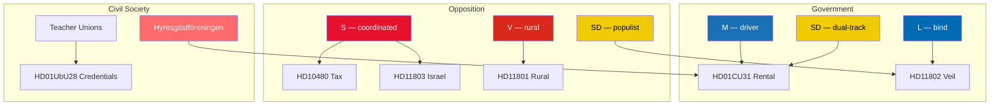

# Stakeholder Perspectives — Parliamentary Pulse 2026-05-09

## Key Stakeholder Map

### Government Coalition Actors

**Moderaterna (M)**  
Position: Strong driver of HD01CU31 rental reform; politically committed to "flexibel hyresmarknad" since 2021 manifesto. Benefits from UbU education outputs as school-quality legacy.  
Risk: Urban renters — a growing M demographic — may defect over rental reform perception.  
Evidence: HD01CU31 (riksdagen.se, CU — M majority committee position)

**Kristdemokraterna (KD)**  
Position: Supports HD01CU31 as part of "äganderättspolitik" (property rights narrative); supports UbU education bills as part of values-school agenda.  
Risk: Low differentiation from M on this day's output.

**Sverigedemokraterna (SD)**  
Position: Supports rental reform and school credentials; uses HD11802 to independently signal to their base that L is blocking action on cultural identity. Dual-track strategy: governing partner + populist challenger.  
Risk: HD11802 may backfire if L minister gives a surprisingly firm answer.  
Evidence: HD11802 (riksdagen.se, SD — Nima Gholam Ali Pour)

**Liberalerna (L)**  
Position: Uncomfortably positioned between HD11802 (pressure from SD partner) and L's liberal values. Education bills (UbU) align well with L's traditional voter base.  
Risk: Full-face veil question is existentially difficult — L's identity is built on civic liberalism; a ban contradicts core L doctrine.  
Evidence: HD11802 — minister is L's Simona Mohamsson

### Opposition Actors

**Socialdemokraterna (S)**  
Position: Running a coordinated double-question strategy (HD10480 tax domicile + HD11803 Israel maritime) designed to expose fiscal inequality AND foreign-policy weakness simultaneously.  
Likely response to HD01CU31: File joint reservation motion with V and MP; escalate to public campaign.  
Evidence: HD10480, HD11803, HD11800 (riksdagen.se, S — Niklas Karlsson)

**Vänsterpartiet (V)**  
Position: HD11801 rural broadband targets V's class-politics framing ("landsbygd vs. storstäder") in a constituency zone where SD is making gains. V seeks to reclaim the rural-exclusion narrative from SD.  
Evidence: HD11801 (riksdagen.se, V)

**Sverigedemokraterna (SD) — opposition-line**  
SD simultaneously supports government bills while using HD11802 to maintain independent populist positioning. This dual-track is characteristic of SD's governing-party transition challenge.

**Miljöpartiet (MP)**  
Not directly active in today's filings; likely to support S reservation on HD01CU31 and HD11803 Israel question.

### Civil Society Stakeholders

**Hyresgästföreningen (Tenant Union, 550,000 members)**  
Threat: Will mount public opposition to HD01CU31. Campaign tools: member mobilisation, media outreach, possible legal challenge via Lagrådet route.  
Evidence: HD01CU31 + historical tenant-union activism.

**Lärarförbundet / Lärarnas Riksförbund (Teacher Unions)**  
Position: Cautiously supportive of HD01UbU28 teacher credentials if implementation timeline is realistic; opposed if it means unqualified substitutes continue.

**Swedish citizens (HD11803 context)**  
Direct stakeholder: Swedish citizens reportedly intercepted by Israeli forces in international waters. Government has a consular and diplomatic obligation that creates reputational risk if not addressed.

## Stakeholder Influence Map

