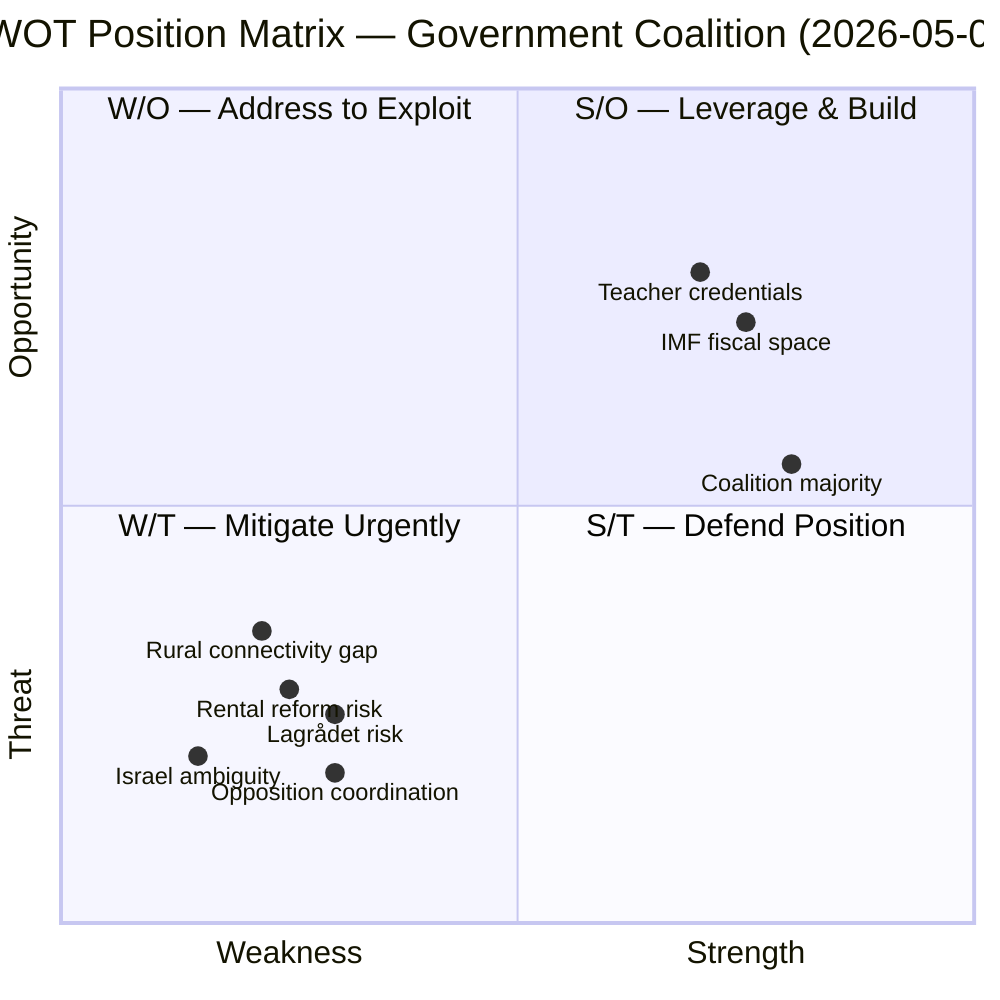

# SWOT Analysis — Parliamentary Pulse 2026-05-09

**Analytical frame**: Swedish government coalition (M/KD/SD/L) with 127 days to election.

## Strengths

- **Stable majority for key reform (HD01CU31)**: M/KD/SD control 189+ seats; rental reform has full coalition support without reported reservation motions. Source: HD01CU31 (riksdagen.se, CU).
- **Education reform legacy**: HD01UbU28 teacher credentials + HD01UbU20 school transparency deliver two "quality of schools" wins to voters who prioritise Skolpolitik — partially neutralising a traditional S/MP attack line. Source: HD01UbU28, HD01UbU20 (riksdagen.se, UbU).
- **IMF fiscal space**: Sweden debt-to-GDP 36.2% (WEO Apr-2026, GGXWDG_NGDP) — well below EU average — provides credibility for government's responsible-finance narrative.
- **Coalition discipline**: No defection signals in Friday's committee output; SoU and CU reports moved without reported dissent.

## Weaknesses

- **Rental reform backlash risk**: Hyresgästföreningen (550,000 members) will mobilise; 2M urban renters may perceive HD01CU31 as an asset transfer from tenants to landlords. Vulnerable to S/V framing of "housing for the rich." Source: HD01CU31; historical tenant-union activism in Swedish housing policy.
- **Israel diplomatic ambiguity (HD11803)**: Government's stance on Israeli maritime interception of Swedish citizens is undefined as of this pulse. Silence or equivocation will be amplified as consular failure. Source: HD11803 (riksdagen.se, S).
- **L's coalition bind on values (HD11802)**: L minister Mohamsson faces conflicting demands from SD (veil ban) and L's liberal base (freedom of religion). Any answer will alienate one constituency. Source: HD11802 (riksdagen.se, SD).
- **Rural connectivity gap (HD11801)**: Government has no visible response to rural broadband blackouts; V's question targets a real infrastructure failure the government has not addressed in visible legislative output. Source: HD11801 (riksdagen.se, V).

## Opportunities

- **HD01UbU28 teacher credentials**: If government frames successfully as "raising school quality," this preempts S/MP attack on teacher shortages.
- **Enforcement law reform (HD01CU34)**: Distansutmätning (remote enforcement) is a modernisation measure with bipartisan appeal; could build cross-party legitimacy.
- **IMF growth forecast**: Sweden 2026F GDP growth 1.8% (WEO Apr-2026, NGDP_RPCH) provides a stable backdrop for a "responsible stewardship" election message.
- **State personnel deployment (HD01SoU36)**: If framed as "Sweden serving internationally," supports government's active foreign policy positioning against S/V isolationist tendencies.

## Threats

- **Coordinated opposition narrative**: S (HD11803, HD10480), V (HD11801), SD (HD11802) are all using the same parliamentary day to file questions that, in aggregate, paint the government as serving urban asset-owners (HD01CU31), protecting fiscal advantages (HD10480), abandoning rural areas (HD11801), refusing to act on Swedish identity (HD11802), and failing Swedish citizens abroad (HD11803). The cumulative frame may be more damaging than any single item.
- **Lagrådet risk on HD01CU31**: If Lagrådet issues a critical yttrande on constitutional or property-rights grounds, it creates delay and hands the opposition a legitimacy attack. Source: HD01CU31; Lagrådet referral status pending.
- **Election proximity**: 127 days leaves limited time for government to recover from any major controversy — each week carries outsized electoral weight.

