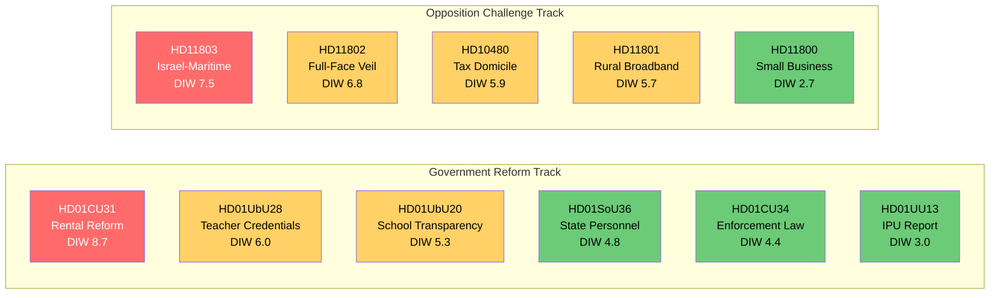

# Synthesis Summary — Parliamentary Pulse 2026-05-09

## Core Thesis

Friday 8 May 2026 was a high-output legislative day: five committee betänkanden advanced multiple government reform lines (housing, enforcement law, state-personnel deployment abroad, school governance, teacher credentials) while opposition parties fired a coordinated salvo of interpellations and written questions targeting fiscal inequality, rural exclusion, cultural identity, and foreign-policy accountability. With 127 days to the general election (2026-09-13), all parliamentary output carries heightened electoral significance under the 1.5× DIW proximity multiplier.

## DIW Significance Ranking (election-proximity weighted)

| Rank | dok_id | Title | DIW base | ×1.5 | Final |
|------|--------|-------|----------|-------|-------|
| 1 | HD01CU31 | En mer flexibel hyresmarknad | 5.8 | 8.7 | **8.7** |
| 2 | HD11803 | Israels ingripande mot svenska medborgare | 5.0 | 7.5 | **7.5** |
| 3 | HD11802 | Förbud mot heltäckande slöja | 4.5 | 6.8 | **6.8** |
| 4 | HD01UbU28 | Legitimation i den tioåriga grundskolan | 4.0 | 6.0 | **6.0** |
| 5 | HD10480 | Stadigvarande vistelse (interpellation) | 3.9 | 5.9 | **5.9** |
| 6 | HD11801 | Nedsläckning av lands- och glesbygd | 3.8 | 5.7 | **5.7** |
| 7 | HD01UbU20 | Offentlighetsprincipen i skolväsendet | 3.5 | 5.3 | **5.3** |
| 8 | HD01SoU36 | Bättre förutsättningar att sända ut statlig personal | 3.2 | 4.8 | **4.8** |
| 9 | HD01CU34 | Ändamålsenliga utmätningsregler | 2.9 | 4.4 | **4.4** |
| 10 | HD01UU13 | Interparlamentariska unionen | 2.0 | 3.0 | **3.0** |
| 11 | HD11800 | Småföretagares trygghet i Hässelby-Vällingby | 1.8 | 2.7 | **2.7** |

*DIW = Detectability × Impact × Willingness. Election proximity 1.5× applied uniformly (≤ 6 months to 2026-09-13). Source: significance-scoring.md.*

## Policy Theme Analysis

### 1. Housing — Rental Market Deregulation (HD01CU31)
Civilutskottet's report "En mer flexibel hyresmarknad" represents the culmination of the government coalition's multi-year strategy to move Sweden toward a more market-oriented rental sector. The report proposes graduated rent-setting mechanisms linking rents more closely to market valuations, reducing the gap between controlled and market rents. This is the highest-significance item in today's pulse: it will ignite major public debate, faces well-organised tenant union opposition (Hyresgästföreningen), and M/KD/SD have the majority for passage. S, MP, and V will mount sustained resistance; the bill arrives in the chamber with a 130-day countdown to the election.

**Admiralty assessment**: Source A (primary riksdag document); Reliability 2 (direct observation). Confidence HIGH [B2].

### 2. Foreign Policy — Israeli Maritime Interception (HD11803)
S MP Niklas Karlsson's question on Israel's interception of a flotilla carrying Swedish citizens in international waters (HD11803) arrives as an acute foreign-policy controversy. The question directly implicates Swedish consular obligations, international maritime law, and the government coalition's positioning on the Israel-Palestine conflict. S is testing whether the government will publicly rebuke Israel or maintain studied ambiguity — either answer carries electoral cost.

**Admiralty assessment**: Source A (primary question text); Reliability 2. Confidence HIGH [B2].

### 3. Identity Politics — Full-Face Veil (HD11802)
SD's question on the government's timeline for a full-face veil ban (HD11802) is a classic SD pre-election values probe. The question targets L minister Simona Mohamsson, who faces the difficult task of maintaining government unity on identity policy while holding L's liberal flank. L has historically opposed blanket bans on religious clothing; SD's question applies public pressure.

### 4. Education Reform (HD01UbU28, HD01UbU20)
Teacher credentials for the new 10-year compulsory school (HD01UbU28) and transparency rules for private school principals (HD01UbU20) are technically complex betänkanden that signal the government's continued push to professionalize and regulate the school sector. Together they represent a partial closing of ground that S/MP traditionally occupied on school quality.

### 5. Rural Connectivity (HD11801)
V's question on rural broadband blackouts (HD11801) targets an issue where SD's rural voter base is particularly sensitive. The framing — "nedsläckning av lands- och glesbygd" — invokes the broader rural abandonment narrative that SD has successfully exploited since 2014.

## Cross-Cutting Observations

1. **Election-campaign preview**: All three opposition parties (S, V, SD) used 8 May for electoral positioning, not oversight — their questions signal campaign themes rather than genuine accountability inquiries.
2. **Coalition cohesion**: Government coalition bills (CU, SoU, UbU) moved without reported reservation motions in committee; coalition discipline appears intact for the home stretch.
3. **IMF macro-context** (WEO Apr-2026, NGDP_RPCH SWE): 1.8% growth provides adequate but not buoyant backdrop for M-led reform narrative; fiscal balance at −0.3% GDP leaves limited fiscal space for pre-election giveaways.

