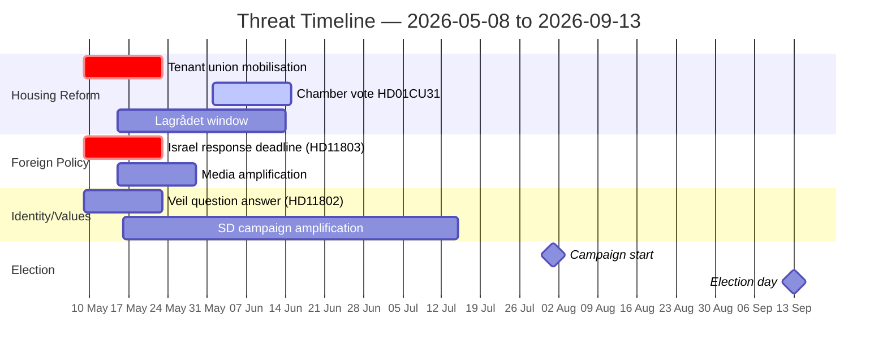

# Threat Analysis — Parliamentary Pulse 2026-05-09

**Framework**: STRIDE-Political adapted for democratic accountability  
**Scope**: Parliamentary output 2026-05-08; election proximity 127 days

## Threat Actors

| Actor | Capability | Intent | Primary Target |
|-------|-----------|--------|----------------|
| Hyresgästföreningen | HIGH (organisation, media, legal) | Oppose HD01CU31 | Public opinion + Lagrådet |
| S parliamentary group | HIGH (media strategy, question arsenal) | Electoral accountability | Government coalition credibility |
| SD parliamentary group | HIGH (social media amplification) | Values-campaign positioning | L minister, coalition identity |
| V parliamentary group | MEDIUM (niche appeal) | Rural/class mobilisation | SD rural voters |
| Foreign state actors (implicit in HD11803) | N/A per this brief | N/A (state action observed, not analysed) | Swedish consular standing |

## STRIDE Political Threat Assessment

### Spoofing (false framing)
**Threat**: S may frame HD01CU31 as a "landlord giveaway" regardless of technical content.  
**Evidence**: HD01CU31 (riksdagen.se, CU) — reform does not eliminate tenant protections but modifies rent-setting procedure.  
**Likelihood**: HIGH [B2] | **Impact**: MEDIUM — voter perception risk for urban seats.  
**Mitigation**: Government communication emphasising "balanced market" and "more housing" frames.

### Tampering (procedural attack)
**Threat**: If Lagrådet referral for HD01CU31 is filed by opposition complaint, delay is possible.  
**Evidence**: Lagrådet referral status pending as of 2026-05-09T20:39Z (lagradet.se — site not assessed this cycle; forward indicator added).  
**Likelihood**: MEDIUM [C2] | **Impact**: HIGH — any delay beyond June compresses implementation window before election.

### Repudiation (accountability denial)
**Threat**: Government could deny consular obligation in HD11803 Israel case, creating a "diplomatic gaslighting" attack surface.  
**Evidence**: HD11803 (riksdagen.se, S — Niklas Karlsson) — question explicitly cites "internationellt vatten" (international waters).  
**Likelihood**: LOW [B4] — government response likely measured but may be insufficiently specific.

### Information (narrative warfare)
**Threat**: SD's HD11802 veil question is an information operation designed to frame L as protecting gender oppression.  
**Evidence**: HD11802 (riksdagen.se, SD — Nima Gholam Ali Pour); historical SD question-filing pattern around identity issues in final 6 months of mandate.  
**Likelihood**: HIGH [B2] | **Impact**: MEDIUM — L's vote share at risk in mixed-demographics constituencies.

### Denial (exclusion framing)
**Threat**: V's HD11801 rural broadband question, if unanswered, enables "nedsläckning av glesbygd" (rural switch-off) framing that denies rural voters economic inclusion.  
**Evidence**: HD11801 (riksdagen.se, V).  
**Likelihood**: MEDIUM [C2] | **Impact**: MEDIUM — rural constituencies in Norrland/Dalarna where M/SD compete.

### Elevation (coalition stress)
**Threat**: The combination of HD11802 (SD pressuring L) + HD11803 (S pressuring coalition on foreign policy) + HD01CU31 (tenant backlash) simultaneously elevates pressure on the coalition from three directions.  
**Evidence**: Cross-reference: HD11802, HD11803, HD01CU31 (all riksdagen.se).  
**Likelihood**: HIGH [B2] | **Impact**: MEDIUM-HIGH — cumulative coalition-stress effect.

## Threat Timeline

