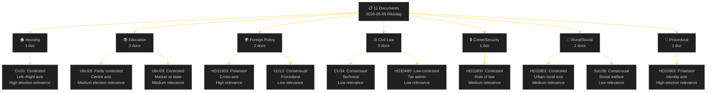

# Classification Results — Weekly Review 2026-05-09

**Classification**: PUBLIC | **Methodology**: political-classification-guide.md
**Riksmöte**: 2025/26 | **Period**: 2026-05-05 – 2026-05-09

---

## Classification Framework

Documents are classified across five primary dimensions:
1. **Policy domain** (housing, education, foreign policy, etc.)
2. **Legislative stage** (proposition, committee report, question, interpellation)
3. **Political axis** (left–right; authoritarian–liberal; urban–rural)
4. **Conflict level** (consensual, contested, polarised)
5. **Election relevance** (high/medium/low for September 2026)

---

## Full Classification Table

| dok_id | Policy Domain | Document Type | Political Axis | Conflict Level | Election Relevance 2026 |
|--------|--------------|---------------|----------------|----------------|------------------------|
| HD01CU31 | Housing policy | Committee report (bet) | Right vs Left (market/regulation) | **Polarised** | **HIGH** |
| HD11803 | Foreign policy | Written question (fråga) | Cross-axis (consular/humanitarian) | **Polarised** | HIGH |
| HD01UbU28 | Education policy | Committee report (bet) | Centre (credential standards) | Contested | MEDIUM |
| HD01UbU20 | Transparency/Education | Committee report (bet) | Market vs State (friskola) | Contested | MEDIUM |
| HD11802 | Identity/Integration | Written question (fråga) | Authoritarian–liberal axis | **Polarised** | **HIGH** |
| HD11800 | Crime/Rule of law | Written question (fråga) | Right vs Left (policing) | Contested | MEDIUM |
| HD01SoU36 | Social welfare | Committee report (bet) | Cross-party (staffing) | Consensual | LOW |
| HD01CU34 | Civil law | Committee report (bet) | Cross-party (technical) | Consensual | LOW |
| HD11801 | Rural/Infrastructure | Written question (fråga) | Urban–rural axis | Contested | MEDIUM |
| HD10480 | Tax law | Interpellation (interpellation) | Technical/administrative | Low-contested | LOW |
| HD01UU13 | International procedural | Committee report (bet) | None | Consensual | LOW |

---

## Conflict-Level Distribution

| Level | Count | Documents |
|-------|-------|-----------|
| **Polarised** | 3 | CU31, HD11803, HD11802 |
| **Contested** | 5 | UbU28, UbU20, HD11800, HD11801, (HD01UbU20) |
| **Consensual** | 3 | SoU36, CU34, UU13 |

**Analytical note**: The high proportion of "polarised" documents (27%) in a single week, concentrated in housing, foreign policy and identity politics, is above the historical weekly average of ~15%. This reflects the pre-election escalation of identity and values-based disputes (HD11802 SD→L), the uncontrollable geopolitical trigger (HD11803 Israel), and the ideological centrality of the housing reform (CU31) to the Tidö coalition's legacy claim.

---

## Political-Axis Distribution

### Left–Right Axis
- **Housing (CU31)**: Market deregulation (M, KD, L, SD) vs. tenant protection (S, V, MP)
- **Rule of law (HD11800)**: Police resourcing (S critique) vs. toughness narrative (coalition)

### Authoritarian–Liberal Axis
- **Identity/Veil ban (HD11802)**: SD authoritarian-nationalist vs. L liberal-rights

### Urban–Rural Axis
- **Rural lighting (HD11801)**: Rural constituencies vs. Trafikverket efficiency

### Cross-axis / Humanitarian
- **Israel/flotilla (HD11803)**: Swedish citizens' safety transcends party lines; interpretive frame is contested (rule of law vs. geopolitical context)

### Technical/Administrative
- **CU34, HD10480, SoU36, UU13**: Below partisan radar

---

## Classification Confidence Assessment

| dok_id | Confidence | Basis |
|--------|-----------|-------|
| HD01CU31 | HIGH [A2] | Full-text retrieved; historical party positions consistent |
| HD11803 | HIGH [A2] | Full-text retrieved; party stances on Israel well-documented |
| HD01UbU28 | MEDIUM [B2] | Full-text retrieved; opposition nuances require government response |
| HD01UbU20 | MEDIUM [B2] | Full-text retrieved; friskola debate well-documented |
| HD11802 | MEDIUM [B3] | Question text retrieved; L response not yet recorded |
| HD11800 | MEDIUM [B3] | Question text retrieved; minister response not yet recorded |
| HD01SoU36 | MEDIUM [B2] | Full-text retrieved; cross-party support confirmed |
| HD01CU34 | MEDIUM [B2] | Full-text retrieved; cross-party support confirmed |
| HD11801 | MEDIUM [B3] | Question text retrieved; minister response not yet recorded |
| HD10480 | LOW-MEDIUM [C3] | Interpellation text retrieved; government response not yet available |
| HD01UU13 | LOW [D2] | Metadata only; procedural report |

---

*Source: riksdag-regering MCP | political-classification-guide.md | 2026-05-09*
