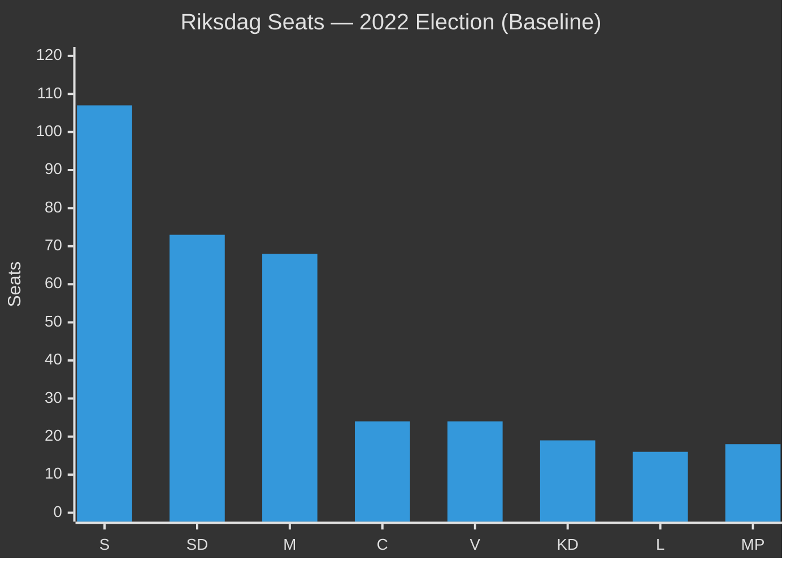

# Coalition Mathematics — Weekly Review 2026-05-09

**Classification**: PUBLIC | **Methodology**: electoral-domain-methodology.md §sainte-lague
**Riksmöte**: 2025/26 | **Election horizon**: September 2026

---

## Current Riksdag Arithmetic

**Total seats**: 349 | **Majority threshold**: 175

### Current Seat Distribution (2022 Election Result)

| Party | Seats 2022 | % 2022 | Bloc |
|-------|-----------|--------|------|
| S (Social Democrats) | 107 | 30.7% | Opposition |
| SD (Sweden Democrats) | 73 | 20.5% | Coalition support |
| M (Moderates) | 68 | 19.1% | Coalition |
| C (Centre) | 24 | 6.7% | Opposition (loose) |
| V (Left) | 24 | 6.7% | Opposition |
| KD (Christian Democrats) | 19 | 5.3% | Coalition |
| L (Liberals) | 16 | 4.6% | Coalition |
| MP (Green Party) | 18 | 5.1% | Opposition |
| **Tidö Coalition total** | **176** | **49.5%** | Majority by 1 |
| **Opposition total** | **173** | **48.5%** | — |

**Current majority cushion**: 1 seat (176 vs 175 threshold). This is the thinnest possible majority. Any coalition defection on a vote produces a tie or loss.

---

## Tidö Coalition Internal Arithmetic

The Tidö coalition consists of M (governing), KD (governing), L (governing) with SD in supporting role (not in government but voting bloc). SD's voting discipline is critical to every government motion.

### Issue-by-Issue Coalition Discipline Assessment (Week 2026-05-09)

| Issue | M | KD | L | SD | Coalition Vote |
|-------|---|----|----|----|----|
| CU31 Housing flexibility | ✅ Strong | ✅ Support | ✅ Core policy | ✅ Support (supply) | SECURE |
| UbU28 Teacher credentials | ✅ Support | ✅ Strong | ✅ Core portfolio | ✅ Support | SECURE |
| UbU20 Friskola transparency | ✅ Support | ✅ Support | ✅ Core policy | ⚠️ Abstain possible | PROBABLE |
| SoU36 State personnel | ✅ Support | ✅ Support | ✅ Support | ✅ Support | SECURE |
| CU34 Enforcement rules | ✅ Strong | ✅ Support | ✅ Support | ✅ Support | SECURE |
| UU13 IPU (procedural) | ✅ Support | ✅ Support | ✅ Support | ✅ Support | SECURE |

**No coalition arithmetic risk identified** in this week's legislative batch. The most sensitive vote is UbU20 (friskola transparency) where SD might abstain rather than oppose — but a coalition abstention is not equivalent to a loss.

---

## 2026 Election Coalition Scenarios

Using current polling (approximate, high uncertainty at T+16 weeks):

### Scenario A — Tidö Coalition Re-elected (P=45%)

Estimated seat distribution (using current polling ~48–50% Tidö):

| Party | Estimated Seats 2026 | Change vs 2022 |
|-------|---------------------|----------------|
| S | 105 | -2 |
| SD | 76 | +3 |
| M | 66 | -2 |
| C | 22 | -2 |
| V | 25 | +1 |
| KD | 18 | -1 |
| L | 17 | +1 |
| MP | 20 | +2 |
| **Tidö total** | **177** | +1 |
| **Opposition total** | **172** | -1 |

**Coalition arithmetic**: Tidö coalition marginally extends majority; SD remains kingmaker.

### Scenario B — S-led Government (P=35%)

Requires either: (a) C formally switching blocs, or (b) a broader centre-left coalition. If housing reform becomes the defining election issue and urban-renter backlash materialises:

| Party | Estimated Seats 2026 | Change vs 2022 |
|-------|---------------------|----------------|
| S | 112 | +5 |
| SD | 72 | -1 |
| M | 64 | -4 |
| C | 24 | 0 |
| V | 26 | +2 |
| KD | 18 | -1 |
| L | 15 | -1 |
| MP | 18 | 0 |
| **S+V+MP** | **156** | Need C: 180 |
| **Tidö** | **169** | Below majority |

**Coalition arithmetic**: S+V+MP = 156 (needs C at 180 or another partner to reach 175+).

### Scenario C — Hung Parliament (P=20%)

Polls within margin of error of 175-seat threshold; neither bloc can form a majority without C.

---

## Sainte-Laguë Note (Seats vs Votes)

The Swedish Sainte-Laguë proportional representation system allocates seats by dividing each party's vote total by 1, 3, 5, 7... Sweden has a 4% electoral threshold. Parties below 4% receive zero seats (regardless of national vote share). The 2022 election saw MP barely exceed 5% — a decrease to below 4% would remove 18 seats from the opposition bloc.

**Key risk for opposition**: If MP falls below 4% in 2026 (current polls ~4–5%), opposition loses 18 seats, making a coalition government arithmetically impossible without C.

**Key risk for coalition**: If L falls below 4% (current polls ~4–5%), coalition loses 16 seats, making Tidö coalition impossible at current polling. The SD–L identity tension (HD11802) directly threatens L's 4% floor.

---

## Week's Legislative Impact on Coalition Mathematics

The week's legislation does not change Riksdag arithmetic (no election this week). However:
- **HD11802** (veil ban) intensifies the L-floor risk by creating an L–SD visible tension that may discourage L-leaning voters
- **CU31** (housing) is the most electorally consequential legislation — if it costs coalition 3–4% in urban areas, it could shift the arithmetic from Scenario A to Scenario B or C

---

*Source: riksdag-regering MCP | electoral-domain-methodology.md §sainte-lague | 2022 election data | 2026-05-09*
