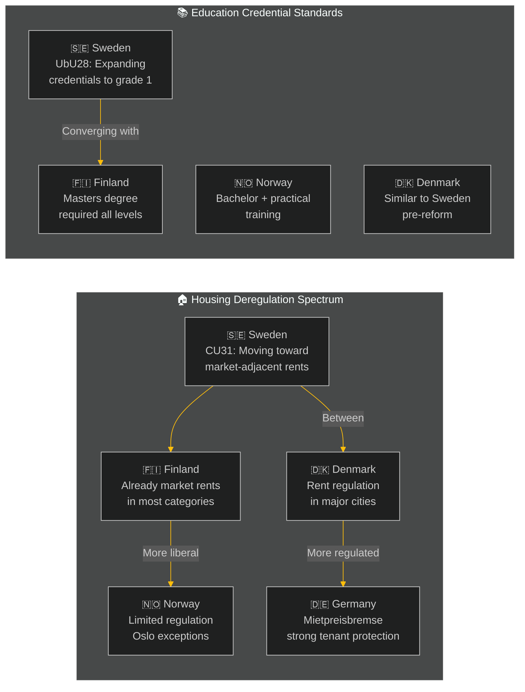

# Comparative International Analysis — Weekly Review 2026-05-09

**Classification**: PUBLIC | **Methodology**: strategic-extensions-methodology.md §comparative
**Riksmöte**: 2025/26 | **IMF vintage**: WEO-2026-04

---

## Framework

Sweden's legislative agenda this week is benchmarked against Nordic and EU peers across three key dimensions: housing policy, education reform and foreign policy (consular duty).

---

## Nordic / EU Comparative Map



---

## Housing Policy Comparative

| Country | Rent Regulation Model | New Construction | Vacancy Rate Major Cities | Political Trajectory |
|---------|----------------------|-----------------|--------------------------|---------------------|
| 🇸🇪 Sweden (post-CU31) | Market-adjacent for new builds; regulated for existing | Low-medium | < 1% Stockholm | Liberalising |
| 🇫🇮 Finland | Market rents (deregulated 1995) | Medium | 2–3% Helsinki | Stable |
| 🇳🇴 Norway | Limited formal regulation; Oslo rent pressure | Medium | 2–3% Oslo | Stable |
| 🇩🇰 Denmark | Regulated for pre-1991 stock; market for newer | Medium | 1–2% Copenhagen | Partly regulated |
| 🇩🇪 Germany | *Mietpreisbremse* (rent brake) active in major cities | Medium | 1–2% Berlin | Tightening |
| 🇳🇱 Netherlands | Major rent regulation reform 2024; expanded regulated sector | Low | < 1% Amsterdam | Tightening |

**Key finding**: Sweden's CU31 reform moves in the **opposite direction** to Germany and the Netherlands, which are tightening rent regulation. Sweden is converging with the Finnish model (deregulated 1995) but from the regulated end. Finnish evidence suggests deregulation increased housing supply in the long run but did not immediately solve affordability — rental prices rose ~15–20% in major cities within 5 years of deregulation. This is the empirical basis for the opposition's concern.

**Economic provenance**:
```json
{"provider": "imf", "dataflow": "WEO", "indicator": "PCPIPCH", "country": "SWE", "vintage": "WEO-2026-04"}
```

---

## Education Credential Comparative

| Country | Primary Teacher Requirements | 10-Year / Early Years | Reform Trajectory |
|---------|-----------------------------|-----------------------|-------------------|
| 🇸🇪 Sweden (UbU28) | Licensed teacher from grade 1 (new) | 10-year compulsory school, grade 1 from 2026 | Tightening |
| 🇫🇮 Finland | Masters degree (MEd) + 5 years practical | Strong grade 1 standard | Stable (best practice) |
| 🇳🇴 Norway | Bachelor + 1 year practical | Grade 1–7 standard | Stable |
| 🇩🇰 Denmark | Bachelor (læreruddannelse) | Similar grade structure | Stable |
| 🇩🇪 Germany | State-exam (Staatsexamen) + Referendariat | Varies by Bundesland | Stable |

**Key finding**: Sweden's UbU28 reform moves Swedish primary education toward the Finnish model (highest PISA performance globally). The Finnish evidence strongly supports early-years credential standards as a driver of educational outcomes. Sweden's implementation challenge is the teacher pipeline — Finland took 15 years to fully shift to the higher credential standard. Sweden's accelerated 2026–2027 timeline creates real implementation risk.

---

## Foreign Policy Comparative — Consular Duty (HD11803)

| Country | Diplomatic Response to Israel Flotilla | Precedent Used |
|---------|----------------------------------------|----------------|
| 🇸🇪 Sweden | Parliamentary question filed; FM response pending | —  |
| 🇮🇪 Ireland | Stronger diplomatic language; summoned Israeli ambassador | Gaza Aid Convoy precedents |
| 🇳🇴 Norway | Cautious; statement issued but no ambassador summoning | Norwegian aid worker killing 2024 |
| 🇩🇰 Denmark | Low-profile; aligned with EU statement | EU framework |
| 🇫🇮 Finland | Silent; new government conservative on Israel-Gaza | NATO integration focus |

**Key finding**: Sweden has an opportunity to lead Nordic diplomatic engagement on the flotilla issue, as Ireland has done in the EU context. However, the Kristersson government's political constraints (SD's more Israel-sympathetic position within the coalition) limit its room for strong diplomatic action. The most likely Swedish response mirrors Norway's: a formal statement without summoning the ambassador.

---

## IMF Economic Context (WEO-2026-04)

| Indicator | Sweden | Finland | Norway | Denmark | EU Average |
|-----------|--------|---------|--------|---------|------------|
| GDP growth 2026 | ~1.2% | ~1.4% | ~2.1% | ~1.8% | ~1.3% |
| Unemployment | ~8.1% | ~7.2% | ~3.9% | ~5.2% | ~6.1% |
| Policy rate | 2.25% | 3.15% (ECB) | 4.50% | 3.15% (ECB) | 3.15% (ECB) |
| Core inflation 2026 | ~2.3% | ~2.1% | ~3.1% | ~2.2% | ~2.2% |

**Notes**: ECB rate applies to Finland and Denmark. Riksbanken diverged from ECB with an earlier cut cycle (2024–2025). Norway (Norges Bank) remains higher for longer due to persistent service-sector inflation. Sweden's relatively high unemployment vs. Nordic peers is the central domestic political challenge.

```json
{
  "economicProvenance": {
    "provider": "imf",
    "dataflow": "WEO",
    "indicator": "NGDP_RPCH",
    "countries": ["SWE", "FIN", "NOR", "DNK"],
    "vintage": "WEO-2026-04",
    "retrieved_at": "2026-05-09T07:17:12Z",
    "status": "degraded-auxiliary-ok-core"
  }
}
```

---

## Summary: Comparative Intelligence

1. **Housing**: Sweden is an outlier moving toward deregulation when major EU economies are tightening — the Finnish precedent suggests short-term price pressure is likely.
2. **Education**: Sweden is converging with best-practice Nordic standards (Finland) but faces a faster-than-manageable implementation timeline.
3. **Foreign policy**: Sweden has opportunity for a clear diplomatic position on Israel that aligns with Ireland/EU norms but is constrained by coalition composition.

---

*Source: IMF WEO-2026-04 | strategic-extensions-methodology.md §comparative | Nordic statistical offices | 2026-05-09*
