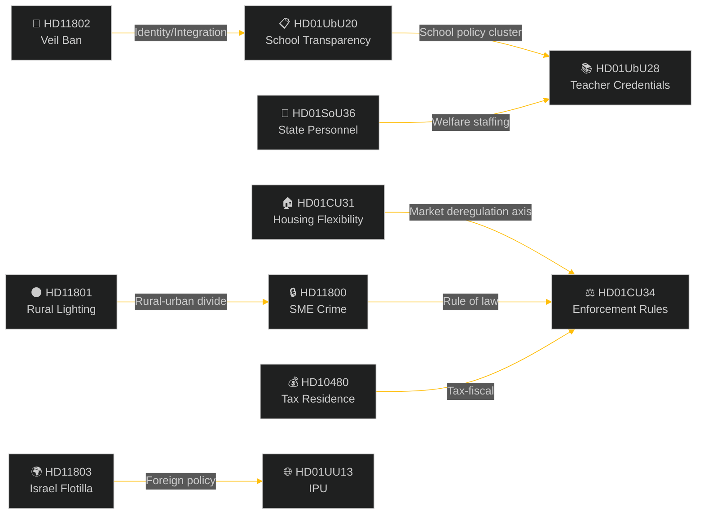

# Cross-Reference Map — Weekly Review 2026-05-09

**Classification**: PUBLIC | **Methodology**: structural-metadata-methodology.md §tier-c-extensions
**Riksmöte**: 2025/26 | **Period**: 2026-05-05 – 2026-05-09
**Tier-C context**: Cross-type synthesis with sibling analysis folders

---

## Intra-Week Document Cross-References

### Cluster A — Housing and Civil Law
| Document | Link | Nature |
|----------|------|--------|
| HD01CU31 ↔ HD01CU34 | Both are CU committee outputs; CU34 enforcement rules facilitate CU31 rent-enforcement mechanisms | Complementary |
| HD01CU31 ↔ HD10480 | Both touch on economic rights of residents/owners; tax residence interacts with housing mobility | Indirect |

### Cluster B — Education and Social Welfare
| Document | Link | Nature |
|----------|------|--------|
| HD01UbU20 ↔ HD01UbU28 | Both are UbU committee outputs on the 10-year school; transparency and credentials are two dimensions of the same reform agenda | Complementary |
| HD01UbU28 ↔ HD01SoU36 | Both concern state-employed professionals deployed in public services; credential and staffing themes parallel | Thematic |
| HD01UbU20 ↔ HD11802 | Integration minister (L) is responsible for both school transparency (UbU20 policy) and veil ban question (HD11802); same portfolio, different political pressure | Portfolio risk |

### Cluster C — Foreign Policy and International
| Document | Link | Nature |
|----------|------|--------|
| HD11803 ↔ HD01UU13 | Both are foreign affairs/international matters; IPU report (UU13) provides institutional context for Sweden's international parliamentary engagement while HD11803 is a crisis event | Contextual |

### Cluster D — Rule of Law and Crime
| Document | Link | Nature |
|----------|------|--------|
| HD11800 ↔ HD01CU34 | SME crime enforcement (HD11800) and enforcement rules reform (CU34) are directly linked; HD11800 illustrates the practical need for stronger enforcement tools | Causal |

### Cluster E — Rural and Identity
| Document | Link | Nature |
|----------|------|--------|
| HD11801 ↔ HD11802 | Both target governing coalition vulnerability in specific demographics (KD rural, L liberal integration); both are opposition-initiated narrative attacks | Strategic parallel |

---

## Sibling Folder Cross-References (Tier-C)

| Folder | Date | Key Themes | Relevance |
|--------|------|-----------|-----------|
| `analysis/daily/2026-04-26/weekly-review/` | 2026-04-26 | Civil defence, energy policy, unemployment | Provides baseline: security sprint context; labour market trajectory |
| `analysis/daily/2026-04-11/weekly-review/` | 2026-04-11 | Spring legislative session opening | Baseline for session-start intentions vs. current execution |
| `analysis/daily/2026-04-04/weekly-review/` | 2026-04-04 | Budget supplementary, European policy | Fiscal policy baseline for CU31 housing context |
| `analysis/daily/2026-05-08/evening-analysis/` | 2026-05-08 | Day-before evening session | Provides immediate prior-session context |
| `analysis/daily/2026-05-08/week-ahead/` | 2026-05-08 | Week-ahead forecast | Cross-check against what was predicted vs. delivered |

**Tier-C additive finding**: The prior weekly-review (2026-04-26) focused on the security-defence cluster (MSB reform, uranium ban) with no housing or education legislation in focus. The shift to CU31 and UbU in this week represents a pivot from security/energy to social/domestic policy — consistent with the Tidö coalition's expected pre-election policy sequencing (defence credibility → domestic service delivery).

---

## Cross-Document Intelligence Threads

### Thread 1: Election 2026 Positioning
HD01CU31 (housing) + HD11802 (veil ban) + HD11803 (Israel) + HD11801 (rural) form a composite picture of the pre-election political landscape: the coalition advances reform (housing, education) while simultaneously managing crises (Israel, rural services) and internal identity tensions (SD–L).

### Thread 2: State Capacity and Staffing
HD01UbU28 (teacher credentials) + HD01SoU36 (state personnel deployment) + HD11800 (police enforcement) collectively raise the question of whether the Swedish state has adequate staffing and regulatory capacity to implement its own legislative agenda.

### Thread 3: Urban–Rural Divide
HD11801 (rural lighting) + HD01CU31 (urban rental market) + HD11800 (urban crime) reveal the coalition's difficulty in simultaneously addressing urban affordability and rural service concerns — a structural tension inherent in the Tidö geographic coalition.

---

*Source: riksdag-regering MCP | structural-metadata-methodology.md | analysis/daily/2026-04-26/weekly-review/ (sibling) | 2026-05-09*
