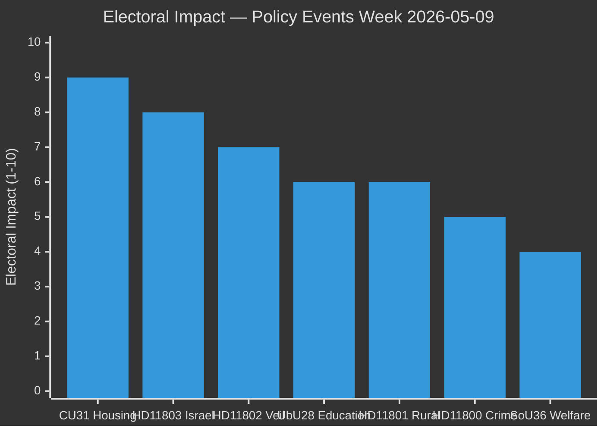

# Election 2026 Analysis — Weekly Review 2026-05-09

**Classification**: PUBLIC | **Methodology**: electoral-domain-methodology.md §election-2026
**Riksmöte**: 2025/26 | **Election horizon**: ~16 weeks (September 2026)

---

## Election Context

Sweden's general election is expected in September 2026 (exact date to be confirmed by government). The Riksmöte 2025/26 is in its final phase before the summer recess (~mid-June). The remaining legislative weeks (May 11 – June 12, approximately 5 legislative weeks) are the last opportunity for the coalition to build its pre-election reform portfolio.

---

## Electoral Impact Assessment

| Issue | Electoral Impact | Favours | Swing Voters |
|-------|-----------------|---------|-------------|
| CU31: Housing market flexibility | **9/10** | Opposition (tenant-framing) / Coalition (supply-framing) | Urban renters, 25–45 |
| HD11803: Israel/Swedish citizens | **8/10** | Cross-party; FM response quality matters | International relations voters |
| HD11802: Veil ban question | **7/10** | SD consolidation; L credibility test | SD soft voters; L liberal voters |
| UbU28: Teacher credentials | **6/10** | Neutral to slight coalition credit | Parents of primary school children |
| HD11801: Rural lighting | **6/10** | Opposition (rural service) | KD/C rural voters |
| HD11800: SME crime | **5/10** | Neutral; both sides claim | Small business owners |
| HD01SoU36: State personnel | **4/10** | Coalition (delivery) | Social welfare professionals |

---

## Current Opinion Context

Based on prior-cycle analysis (2026-04-26 weekly-review) and Riksdagsmonitor tracking:
- **Tidö coalition** (M+SD+KD+L): approximately 48–50% combined (within governing range)
- **Opposition bloc** (S+V+MP): approximately 38–42%
- **C**: approximately 5–6% (formally outside both blocs)
- **Uncertainty**: High; 3–4 point margin of error in most polls at this horizon

**Key dynamic**: SD is the largest party (~20–22%) and the coalition's dominant vote-driver. M is second (~19–21%). L and KD together (~10%) are below their 2018 peaks. S remains the largest opposition party (~28–30%).

---

## Issue-by-Issue Electoral Analysis

### Housing (CU31) — CRITICAL ELECTORAL ISSUE

**Why it matters**: Sweden has approximately 1.8 million rental households. A majority are in the three major urban areas (Stockholm, Gothenburg, Malmö) — precisely the swing-voter geography. Housing affordability is consistently ranked top-3 in voter concern surveys (2024–2026).

**Framing contest**:
- Coalition framing: "More housing for more Swedes — breaking the supply blockage"
- Opposition framing: "Higher rents for ordinary tenants — helping landlords, not people"
- **Winner**: The opposition's framing is simpler, emotionally resonant and validated by Finnish precedent. Unless the government provides strong counter-evidence within weeks, the opposition likely wins this framing contest.

**Electoral consequence**: If the "rents will rise" frame dominates through summer 2026, coalition support among urban 25–45 renters could erode by 2–4 percentage points — potentially decisive in a close election.

**Coalition counter-strategy**: Publish rent-modelling analysis; communicate safeguards for existing tenants; emphasise construction-sector job creation.

### Israel Flotilla (HD11803) — MEDIUM-HIGH ELECTORAL ISSUE

**Why it matters**: Swedish-citizen safety abroad is a non-partisan voter concern. Perceptions of government passivity when citizens face danger are consistently punished in polling data.

**Framing contest**:
- S framing: "The government failed to protect Swedish citizens from an illegal interception"
- FM response framing (to be determined): "We are working through diplomatic channels" or stronger

**Electoral consequence**: Modest but real — voters who prioritise foreign-policy competence (educated urban, 35+) may update their assessment of the coalition's FM.

### Identity Politics (HD11802 Veil Ban) — MEDIUM ELECTORAL ISSUE

**Why it matters**: The SD–L tension on identity politics is a perennial feature of the Tidö coalition. Each high-visibility incident reinforces the narrative that the coalition is ideologically incoherent.

**Electoral consequence**:
- **SD vote**: Consolidated if SD is seen as "forcing the issue" the government avoids
- **L vote**: At risk if L appears to abandon liberal principles under SD pressure
- **Net effect**: Likely SD gain at L expense; coalition total approximately neutral

### Education (UbU28) — MEDIUM ELECTORAL ISSUE

**Why it matters**: Education consistently ranks top-5 in voter concern. The 10-year school reform was a signature Tidö commitment.

**Electoral consequence**: Positive for coalition if framed as "delivering promised reform"; negative if teacher-union concerns dominate coverage.

---

## Election Probability Assessment (T+16 weeks)

| Outcome | Probability | Key Conditions |
|---------|------------|----------------|
| Tidö coalition re-elected | 45% | Requires housing narrative control; no major crises |
| S-led government (S+V+MP+C) | 35% | Requires C bloc switch; opposition coordination |
| Hung parliament / caretaker | 20% | Neither bloc reaches 175 seats majority |

**WEP confidence**: Roughly even [P~45%/35%] with high uncertainty given 16-week horizon. The housing reform framing contest is the single most important near-term electoral variable.

---

## Historical Precedent

In the 2018 election, the Alliance (M, KD, L, C) lost urban rental-market-heavy constituencies in Stockholm city to S, in part due to M's deregulation agenda not resonating with renters. The CU31 reform echoes that political risk in a demographic that has only grown since 2018.

---

*Source: riksdag-regering MCP | electoral-domain-methodology.md §election-2026 | IMF WEO-2026-04 | 2026-05-09*
