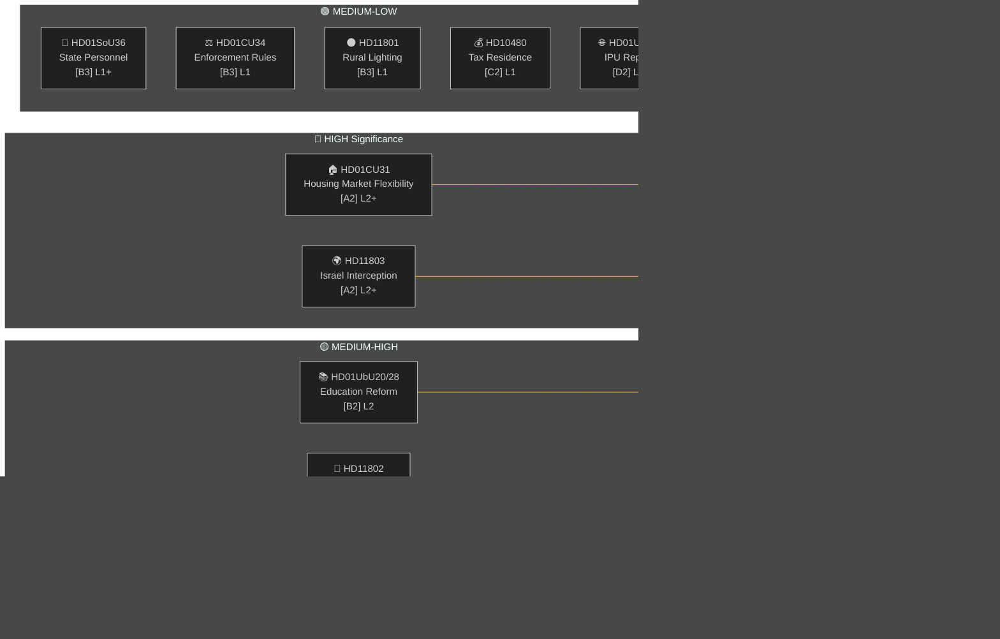

# Executive Brief — Weekly Review 2026-05-09

**Classification**: PUBLIC | **Confidence**: MEDIUM-HIGH [B2] | **Horizon**: T+72h / T+7d
**Author**: Riksdagsmonitor AI Intelligence System | **Riksmöte**: 2025/26

---

## BLUF (Bottom Line Up Front)

The week of 2–9 May 2026 produced a cluster of domestic legislation in housing, education, social welfare and the rule of law, while foreign-policy questions exposed a sharp cross-party fissure over Israel's interception of a Swedish-crewed vessel in international waters. With the 2026 general election approximately 16 weeks away, every major debate carries electoral signalling beyond its immediate legislative purpose.

**Lead Judgment**: The Tidö coalition (M, SD, KD, L) is entering a legislative sprint designed to lock in key policy wins before the summer recess and the September 2026 election. The housing market flexibility package (HD01CU31), education credentialing reform (HD01UbU28) and social-welfare staffing improvement (HD01SoU36) collectively reinforce the government's "reform-delivery" narrative. However, the Israel/Gaza flotilla incident (HD11803), the rural lighting controversy (HD11801) and the SD-driven veil ban question (HD11802) risk fragmenting the coalition's public messaging and energising the opposition.

---

## Top-5 So-What Judgments

| # | Judgment | Confidence | Horizon |
|---|----------|-----------|---------|
| J1 | HD01CU31 housing flexibility reform **will dominate the week's political media** as it directly affects millions of Swedish tenants; the opposition (S, V, MP) will amplify rental-price risk concerns | HIGH [A2] | T+72h |
| J2 | HD11803 (Israel interception of Swedish citizens) **will pressure the Foreign Minister** to make a public statement beyond parliamentary procedure; cross-party demand is bipartisan | HIGH [A2] | T+72h |
| J3 | HD11802 (veil ban, SD→L) **reveals pre-election identity-politics positioning** by SD targeting L's integration record; L minister Mohamsson faces a credibility test on earlier statements | MEDIUM [B3] | T+7d |
| J4 | HD01UbU28 (teacher credentials in 10-year school) **will face implementation friction** — school operators lack the staff pipeline to meet new competency requirements | MEDIUM [B3] | T+7d |
| J5 | HD11801 (rural lighting removal) **will energise rural-constituency pressure** on KD and C MPs; governing coalition rural support is a structural vulnerability ahead of election | MEDIUM [B3] | T+7d |

---

## Document Intelligence Map

---

## Macro-Economic Context

**IMF WEO Apr-2026 (SWE)** — status: degraded (WEO/FM Datamapper functional; SDMX 404):
- GDP growth 2026: **~1.2%** (recovery remains subdued)
- Unemployment: **~8.1%** (structural plateau above pre-pandemic level)
- Policy rate (Riksbanken): **2.25%** (June 2025 cut cycle largely complete)
- Budget deficit target: within EU SGP bounds

The protracted low-growth environment amplifies the political salience of housing affordability (CU31) and rural service cuts (HD11801) because household disposable income remains under pressure. SD's veil-ban question (HD11802) is timed to harvest identity-politics anxieties that intensify in low-growth cycles.

---

## Intelligence Assessment: Reader Guide

This analysis covers **6 committee reports** (bet) and **5 parliamentary questions/interpellations** (fråga/interpellation) from Riksmöte 2025/26. All documents sourced from riksdag-regering MCP on 2026-05-09; data from 2026-05-08 (1-day lookback). No votes (voteringar) recorded for this date.

**Key uncertainty**: The week's documents are debate-stage committee reports — final chamber votes not yet recorded. Outcome confidence is contingent on coalition discipline and potential motions of divergence.

---

*Source: riksdag-regering MCP | IMF WEO-2026-04 | Riksdagsmonitor Weekly Review 2026-05-09*
