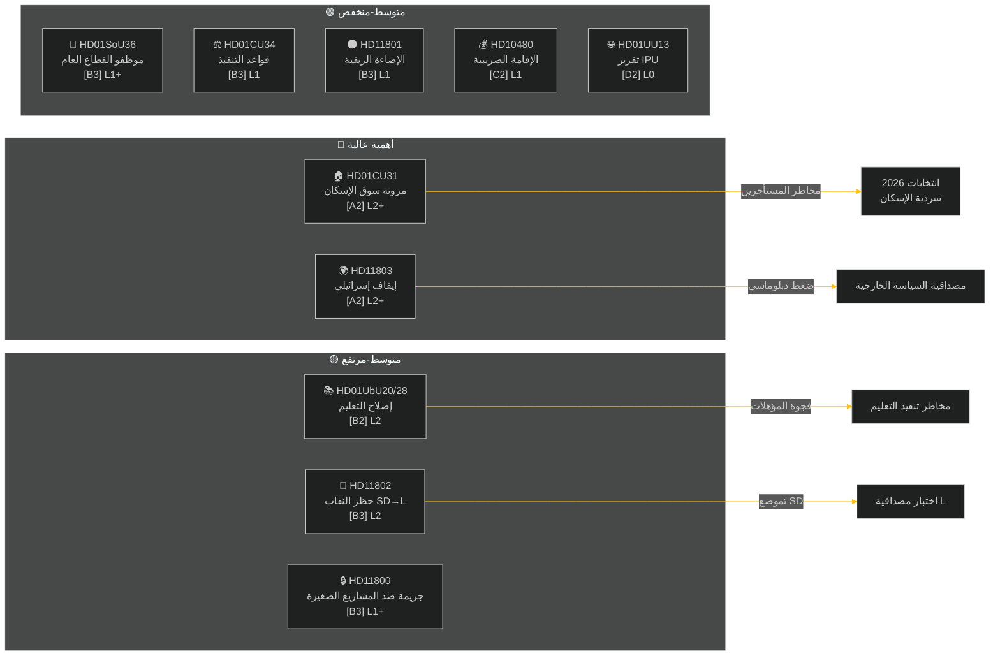

‏# ملخص تنفيذي — المراجعة الأسبوعية 2026-05-09

**التصنيف**: عام | **الموثوقية**: متوسط-مرتفع [B2] | **الأفق**: T+72h / T+7d
**المؤلف**: نظام استخبارات Riksdagsmonitor بالذكاء الاصطناعي | **الريكسموته**: 2025/26

---

## BLUF (الرسالة الجوهرية)

أنتجت الأسبوع الممتد من 2 إلى 9 مايو 2026 مجموعة من التشريعات الداخلية المتعلقة بالإسكان والتعليم والحماية الاجتماعية وسيادة القانون، فيما كشفت الاستجوابات في السياسة الخارجية عن هوة حادة بين الأحزاب حول مصادرة إسرائيل لسفينة ترفع العلم السويدي في المياه الدولية. مع اقتراب الانتخابات السويدية 2026 بنحو 16 أسبوعاً، يحمل كل نقاش رئيسي إشارات انتخابية تتجاوز الهدف التشريعي الآني.

**التقييم القيادي**: تخوض ائتلاف تيدو (M, SD, KD, L) سباقاً تشريعياً بهدف تثبيت إنجازات سياسية هامة قبل العطلة الصيفية وانتخابات سبتمبر 2026. تعزز حزمة مرونة سوق الإسكان (HD01CU31) وإصلاح مؤهلات المعلمين (HD01UbU28) وتحسين تخطيط القوى العاملة في الضمان الاجتماعي (HD01SoU36) مجتمعةً سردية الحكومة القائمة على «إنتاج الإصلاحات». غير أن حادثة الأسطول الإسرائيلي/غزة (HD11803) وجدل الإضاءة الريفية (HD11801) واستجواب SD بشأن النقاب (HD11802) تهدد بتشتيت التواصل العام للائتلاف وتحفيز المعارضة.

---

## أبرز 5 تقييمات «ماذا يعني هذا؟»

| # | التقييم | الثقة | الأفق |
|---|----------|-----------|---------|
| J1 | إصلاح مرونة الإسكان HD01CU31 **يهيمن على الإعلام السياسي للأسبوع** بتأثير مباشر على ملايين المستأجرين السويديين؛ المعارضة (S, V, MP) تضخّم مخاطر رفع الإيجارات | مرتفع [A2] | T+72h |
| J2 | HD11803 (الإسرائيليون يوقفون سويديين) **يضغط على وزيرة الخارجية** لتقديم تصريح علني خارج الإجراءات البرلمانية؛ المطالبة متعددة الأحزاب | مرتفع [A2] | T+72h |
| J3 | HD11802 (حظر النقاب، SD→L) **يكشف عن تموضع ما قبل الانتخابات في سياسة الهوية** من قِبَل SD تجاه سجل L في الاندماج؛ الوزيرة Mohamsson تواجه اختبار مصداقية بشأن تصريحاتها السابقة | متوسط [B3] | T+7d |
| J4 | HD01UbU28 (مؤهلات المعلمين في نظام المدارس العشري) **يصطدم بمقاومة التنفيذ** — مشغلو المدارس يفتقرون إلى مسار توظيف لتلبية متطلبات الكفاءة الجديدة | متوسط [B3] | T+7d |
| J5 | HD11801 (إزالة إضاءة الطرق الريفية) **يثير ضغطاً انتخابياً ريفياً** على نواب KD وC؛ الدعم الريفي للائتلاف ثغرة هيكلية قبيل الانتخابات | متوسط [B3] | T+7d |

---

## خريطة استخبارات الوثائق

---

## السياق الاقتصادي الكلي

**IMF WEO أبريل-2026 (SWE)** — الحالة: متراجعة (WEO/FM Datamapper يعمل؛ SDMX 404):
- نمو الناتج المحلي الإجمالي 2026: **~1.2%** (التعافي لا يزال خافتاً)
- البطالة: **~8.1%** (هضبة هيكلية تتجاوز الهدف ما قبل الجائحة)
- سعر الفائدة الرئيسي (Riksbanken): **2.25%** (دورة خفض الفائدة يونيو 2025 منتهية إلى حد بعيد)
- هدف رصيد الميزانية: ضمن حدود ميثاق الاستقرار الأوروبي

يبرز البيئة الاقتصادية الضعيفة الأهمية السياسية لتكافؤ فرص الإسكان (CU31) والتخفيضات في الخدمات الريفية (HD11801) في ظل استمرار الضغط على الدخل المتاح للأسر. يستهدف استجواب SD بشأن النقاب (HD11802) استثمار القلق المتعلق بسياسة الهوية الذي يتضخم في دورات النمو المنخفض.

---

## تحليل الاستخبارات: دليل القارئ

يغطي هذا التحليل **6 تقارير لجان** (bet) و**5 أسئلة/استجوابات برلمانية** (fråga/interpellation) من الريكسموته 2025/26. جُمعت جميع الوثائق عبر MCP riksdag-regering في 2026-05-09؛ البيانات من 2026-05-08 (استرجاع يوم واحد). لم تُسجَّل أي تصويتات (voteringar) لهذا التاريخ.

**الغموض الرئيسي**: وثائق الأسبوع عبارة عن تقارير لجان في مرحلة النقاش — التصويتات النهائية في الجلسة العامة لم تُسجَّل بعد. تعتمد موثوقية النتائج على الانضباط الائتلافي والمقترحات المعارضة المحتملة.

---

*المصدر: riksdag-regering MCP | IMF WEO-2026-04 | Riksdagsmonitor المراجعة الأسبوعية 2026-05-09*

<!-- source-sha: 3b789b190efe65d2af879b1da666d37f948938a3 -->
