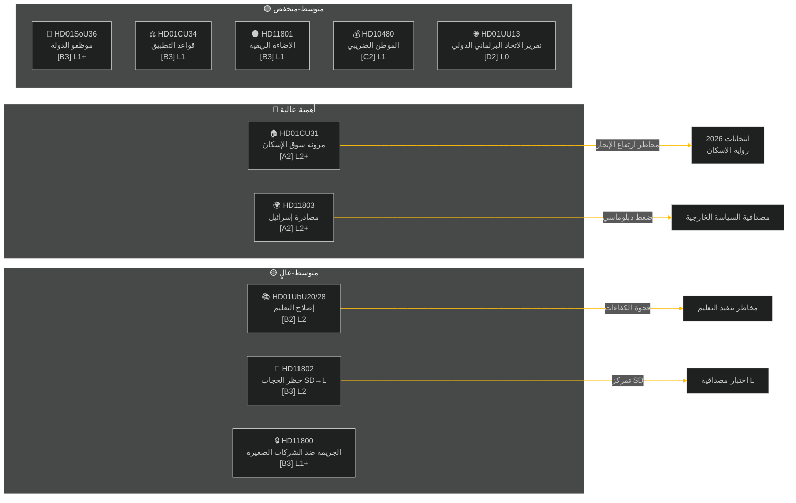

<!-- dir: rtl -->
---
title: "التقرير الأسبوعي — المراجعة الأسبوعية 2026-05-09"
date: 2026-05-09
subfolder: weekly-review
slug: weekly-review-2026-05-09
language: ar
classification: PUBLIC
konfidensgrad: MEDIUM-HIGH [B2]
author: James Pether Sörling
---

# التقرير الأسبوعي — المراجعة الأسبوعية 2026-05-09

**التصنيف**: PUBLIC | **مستوى الثقة**: MEDIUM-HIGH [B2] | **الأفق الزمني**: T+72h / T+7d
**المؤلف**: نظام الاستخبارات الاصطناعية Riksdagsmonitor | **Riksmöte**: 2025/26

---

## الملخص التنفيذي

أسفرت الفترة من 2 إلى 9 مايو 2026 عن حزمة من التشريعات المحلية في مجالات الإسكان والتعليم والرعاية الاجتماعية وسيادة القانون، فيما كشفت القضايا السياسية الخارجية عن انقسام حاد بين الأحزاب حول مصادرة إسرائيل لسفينة تحمل أفراداً من طاقم سويدي في المياه الدولية. مع اقتراب الانتخابات السويدية لعام 2026 بنحو 16 أسبوعاً، يحمل كل نقاش كبير إشارة حملة انتخابية تتجاوز غرضه التشريعي الفوري.

**التقييم الرئيسي**: تدخل تحالف Tidö (M, SD, KD, L) في سباق تشريعي مصمم لترسيخ المكاسب السياسية الرئيسية قبل عطلة الصيف وانتخابات سبتمبر 2026. تعزز حزمة مرونة سوق الإسكان (HD01CU31) وإصلاح مؤهلات التعليم (HD01UbU28) وتحسين موظفي الرعاية الاجتماعية (HD01SoU36) مجتمعةً رواية الحكومة عن "تقديم الإصلاحات". غير أن حادثة أسطول إسرائيل/غزة (HD11803) وجدل إزالة الإضاءة الريفية (HD11801) وقضية حظر الحجاب بقيادة SD (HD11802) تخاطر بتشتيت الرسائل العامة للتحالف وتحفيز المعارضة.

---

## أبرز 5 تقييمات

| # | التقييم | مستوى الثقة | الأفق |
|---|---------|-------------|-------|
| J1 | إصلاح مرونة الإسكان HD01CU31 **سيهيمن على وسائل الإعلام السياسية الأسبوعية** إذ يؤثر مباشرة على ملايين المستأجرين السويديين؛ ستضخم المعارضة (S, V, MP) مخاطر ارتفاع الإيجارات | HIGH [A2] | T+72h |
| J2 | HD11803 (إسرائيل تعتقل مواطنين سويديين) **سيضغط على وزير الخارجية** لإصدار تصريح علني يتجاوز الإجراءات البرلمانية؛ مطلب عابر للأحزاب | HIGH [A2] | T+72h |
| J3 | HD11802 (حظر الحجاب، SD→L) **يكشف التمركز السياسي للهوية** قبل الانتخابات من قِبل SD مستهدفاً سجل التكامل لدى L؛ تواجه الوزيرة L موهامسون اختباراً للمصداقية أمام تصريحاتها السابقة | MEDIUM [B3] | T+7d |
| J4 | HD01UbU28 (مؤهلات المعلمين في مدرسة السنوات العشر) **سيواجه احتكاكاً في التنفيذ** — يفتقر مديرو المدارس إلى مسار الموظفين لتلبية متطلبات الكفاءة الجديدة | MEDIUM [B3] | T+7d |
| J5 | HD11801 (إزالة إضاءة المناطق الريفية) **سيحفز ضغط الدوائر الريفية** على ممثلي KD و C؛ الدعم الريفي للتحالف هو ثغرة هيكلية قبيل الانتخابات | MEDIUM [B3] | T+7d |

---

## خريطة الاستخبارات الوثائقية

---

## السياق الاقتصادي الكلي

**صندوق النقد الدولي WEO أبريل-2026 (SWE)** — الحالة: متدهورة (WEO/FM Datamapper يعمل؛ SDMX 404):
- نمو الناتج المحلي الإجمالي 2026: **~1,2%** (يبقى التعافي خافتاً)
- معدل البطالة: **~8,1%** (هضبة هيكلية فوق المستوى السابق لجائحة كوفيد)
- سعر الفائدة (Riksbanken): **2,25%** (دورة خفض أسعار الفائدة يونيو 2025 اكتملت إلى حد بعيد)
- هدف عجز الموازنة: ضمن حدود ميثاق الاستقرار والنمو الأوروبي

يعزز بيئة النمو المنخفض المطولة الأهمية السياسية لقدرة الإسكان على تحمل التكاليف (CU31) وتخفيضات الخدمات الريفية (HD11801) لأن الدخل المتاح للأسر يبقى تحت الضغط. توقيت قضية حجاب SD (HD11802) مصمم للتحصيل على قلق سياسة الهوية الذي يتكثف في دورات النمو المنخفض.

---

## تقييم الاستخبارات: دليل القراءة

يغطي هذا التحليل **6 تقارير لجان** (bet) و**5 أسئلة برلمانية/استجوابات** (fråga/interpellation) من Riksmöte 2025/26. جميع الوثائق مستردة من riksdag-regering MCP بتاريخ 2026-05-09؛ البيانات من 2026-05-08 (استرجاع ليوم واحد). لم تُسجَّل أي تصويتات (voteringar) لهذا التاريخ.

**عدم اليقين المحوري**: وثائق الأسبوع في مرحلة النقاش — التصويتات النهائية في الغرفة غير مسجلة بعد. يعتمد مستوى ثقة النتيجة على انضباط التحالف والتحركات الانحرافية المحتملة.

---

*المصدر: riksdag-regering MCP | صندوق النقد الدولي WEO-2026-04 | Riksdagsmonitor المراجعة الأسبوعية 2026-05-09*

<!-- source-sha: 3b789b190efe65d2af879b1da666d37f948938a3 -->
