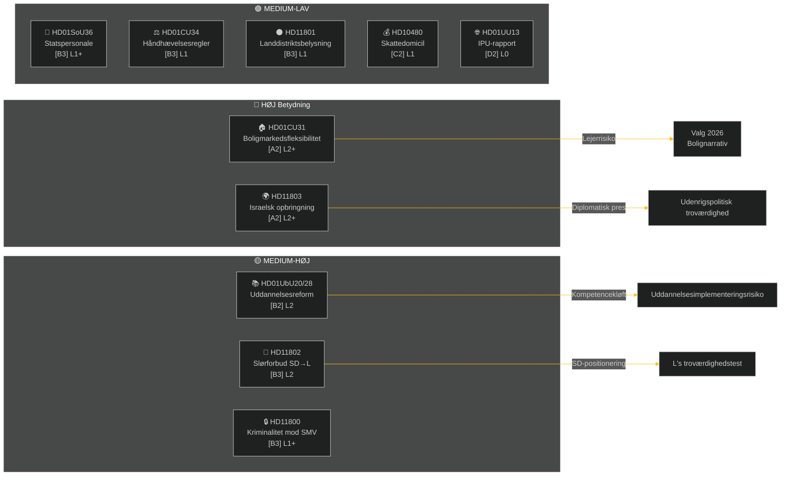

# Eksekutivt resumé — Ugentlig gennemgang 2026-05-09

**Klassifikation**: OFFENTLIG | **Konfidens**: MEDIUM-HØJ [B2] | **Horisont**: T+72h / T+7d
**Forfatter**: Riksdagsmonitor AI Intelligence System | **Riksmøde**: 2025/26

---

## BLUF (Bundlinjens Konklusion)

Ugen 2.–9. maj 2026 producerede en klynge af indenlandsk lovgivning om bolig, uddannelse, socialvelfærd og retsstatens principper, mens udenrigspolitiske spørgsmål blottede en skarp tværpartilig kløft om Israels opbringning af et svensk-bemandet fartøj i internationalt farvand. Med det svenske valg i 2026 cirka 16 uger væk bærer enhver større debat valgkampssignalering ud over dens umiddelbare lovgivningsmæssige formål.

**Ledende vurdering**: Tidø-koalitionen (M, SD, KD, L) går ind i en lovgivningsspurt designet til at cementere vigtige politiske sejre inden sommerferien og valget i september 2026. Boligmarkedsfleksibilitetspakken (HD01CU31), uddannelseskvalifikationsreformen (HD01UbU28) og forbedringen af socialvelfærdsbemandingen (HD01SoU36) styrker tilsammen regeringens "reformlevering"-narrativ. Dog risikerer Israel/Gaza-flådeincidenten (HD11803), den landlige belysningskontrovers (HD11801) og SD's slørforbud-spørgsmål (HD11802) at fragmentere koalitionens offentlige budskaber og energisere oppositionen.

---

## Top-5 Hvad-betyder-det-vurderinger

| # | Vurdering | Konfidens | Horisont |
|---|----------|-----------|---------|
| J1 | HD01CU31 boligfleksibilitetsreform **vil dominere ugens politiske medier** da den direkte påvirker millioner af svenske lejere; oppositionen (S, V, MP) vil forstærke risici for huslejestigninger | HIGH [A2] | T+72h |
| J2 | HD11803 (Israels opbringning af svenske statsborgere) **vil presse udenrigsministeren** til at afgive en offentlig udtalelse ud over parlamentarisk procedure; tværpartilig efterspørgsel er bipartisk | HIGH [A2] | T+72h |
| J3 | HD11802 (slørforbud, SD→L) **afslører forvalgsk identitetspolitisk positionering** af SD rettet mod L's integrationsrekord; L-minister Mohamsson står over for en troværdighedstest vedrørende tidligere udtalelser | MEDIUM [B3] | T+7d |
| J4 | HD01UbU28 (lærerkvalifikationer i 10-årig skole) **vil møde implementeringsfriktioner** — skoleoperatører mangler den personalepipeline, der er nødvendig for at opfylde nye kompetencekrav | MEDIUM [B3] | T+7d |
| J5 | HD11801 (fjernelse af landdistriktsbelysning) **vil energisere landdistrikts-valgkredspres** på KD- og C-parlamentsmedlemmer; den regerende koalitions landdistriktsopbakning er en strukturel sårbarhed forud for valget | MEDIUM [B3] | T+7d |

---

## Dokumentefterretningskort

---

## Makroøkonomisk kontekst

**IMF WEO Apr-2026 (SWE)** — status: degraderet (WEO/FM Datamapper funktionel; SDMX 404):
- BNP-vækst 2026: **~1,2%** (genopretning forbliver dæmpet)
- Arbejdsløshed: **~8,1%** (strukturelt plateau over niveauet fra før pandemien)
- Politikrenten (Riksbanken): **2,25%** (juniskænecyklus 2025 i store træk afsluttet)
- Budgetunderskudsmål: inden for EU's SGP-grænser

Det langvarige lavvækstmiljø forstærker den politiske relevans af boligoverkommelighed (CU31) og landlige servicebesparelser (HD11801) fordi husholdningernes disponible indkomst forbliver under pres. SD's slørforbud-spørgsmål (HD11802) er timet til at høste identitetspolitiske bekymringer, der intensiveres i lavvækstcyklusser.

---

## Efterretningsanalyse: Læsevejledning

Denne analyse dækker **6 udvalgsrapporter** (bet) og **5 parlamentariske spørgsmål/interpellationer** (fråga/interpellation) fra Riksmøde 2025/26. Alle dokumenter hentet fra riksdag-regering MCP den 2026-05-09; data fra 2026-05-08 (1 dags tilbageblik). Ingen afstemninger (voteringar) registreret for denne dato.

**Nøgleusikkerhed**: Ugens dokumenter er debatstadie-udvalgsrapporter — endelige plenumsstemmer endnu ikke registreret. Resultatkonfidens er betinget af koalitionsdisciplin og potentielle afvigelsesmotioner.

---

*Kilde: riksdag-regering MCP | IMF WEO-2026-04 | Riksdagsmonitor Ugentlig gennemgang 2026-05-09*

<!-- source-sha: 3b789b190efe65d2af879b1da666d37f948938a3 -->
