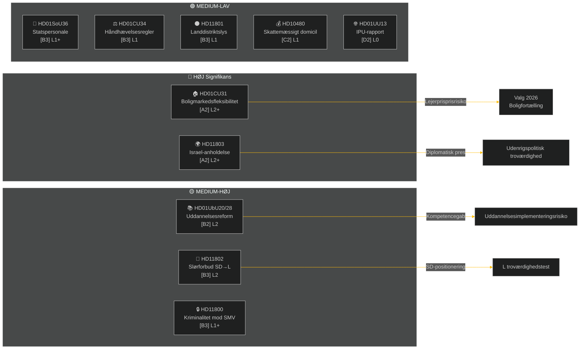

# Ugentlig Briefing — Ugentlig Gennemgang

**Klassificering**: PUBLIC | **Konfidensgrad**: MEDIUM-HIGH [B2] | **Horisont**: T+72h / T+7d
**Forfatter**: Riksdagsmonitor AI-efterretningssystem | **Riksmöte**: 2025/26

---

## Resumé

Ugen 2–9. maj 2026 producerede en klynge af indenlandsk lovgivning inden for bolig, uddannelse, social velfærd og retsstat, mens udenrigspolitiske spørgsmål afslørede en skarp tværpartipolitisk kløft om Israels anholdelse af et fartøj med svenske besætningsmedlemmer i internationalt farvand. Med det svenske valg 2026 cirka 16 uger væk bærer enhver større debat et valgkampssignal ud over sit umiddelbare lovgivningsmæssige formål.

**Ledende vurdering**: Tidö-koalitionen (M, SD, KD, L) indleder en lovgivningssprint designet til at låse centrale politiske gevinster fast inden sommerferien og valget i september 2026. Boligmarkedsfleksibilitetspakken (HD01CU31), uddannelseskvalificeringsreformen (HD01UbU28) og forbedringen af socialtjenestepersonale (HD01SoU36) understøtter samlet regeringens "reformleverance"-fortælling. Det israelske/Gazas flåtilleincident (HD11803), landdistriktslysningskontroversen (HD11801) og det SD-drevne slørspørgsmål (HD11802) risikerer dog at fragmentere koalitionens offentlige budskab og energisere oppositionen.

---

## Top-5 Konklusioner

| # | Vurdering | Konfidensgrad | Horisont |
|---|-----------|---------------|---------|
| J1 | HD01CU31 boligfleksibilitetsreform **vil dominere ugens politiske medier** da den direkte påvirker millioner af svenske lejere; oppositionen (S, V, MP) vil forstærke risikoen for huslejestigninger | HIGH [A2] | T+72h |
| J2 | HD11803 (Israel anholdelse af svenske borgere) **vil lægge pres på udenrigsministeren** for at give en offentlig erklæring ud over parlamentarisk procedure; tværpartistisk krav | HIGH [A2] | T+72h |
| J3 | HD11802 (slørforbud, SD→L) **afslører identitetspolitisk positionering** forud for valget af SD rettet mod L's integrationsrekord; L-minister Mohamsson møder en troværdighedstest mod tidligere udtalelser | MEDIUM [B3] | T+7d |
| J4 | HD01UbU28 (lærerkvalifikationer i 10-årig skole) **vil møde implementeringsfriktion** — skoleledere mangler personalpipeline til at opfylde nye kompetencekrav | MEDIUM [B3] | T+7d |
| J5 | HD11801 (fjernelse af landdistriktslys) **vil energisere pres fra landdistriktsvalgkredse** på KD- og C-parlamentarikere; koalitionens landdistriktsstøtte er en strukturel sårbarhed forud for valget | MEDIUM [B3] | T+7d |

---

## Dokumenteftretningskort

---

## Makroøkonomisk Kontekst

**IMF WEO apr-2026 (SWE)** — status: degraderet (WEO/FM Datamapper fungerer; SDMX 404):
- BNP-vækst 2026: **~1,2%** (genopretningen forbliver afdæmpet)
- Arbejdsløshed: **~8,1%** (strukturelt plateau over pre-pandemisk niveau)
- Rentesats (Riksbanken): **2,25%** (rentesænkningscyklus juni 2025 stort set afsluttet)
- Budgetunderskudsmål: inden for EU's SGP-grænser

Det forlængede lavvækstmiljø forstærker den politiske relevans af boligoverkommelighed (CU31) og nedskæringer i landdistriktserviceydelser (HD11801), da husholdningernes disponible indkomst forbliver under pres. SD's slørspørgsmål (HD11802) er tidsmæssigt afstemt til at høste identitetspolitiske angster, der intensiveres i lavvækstcyklusser.

---

## Efterretningsvurdering: Læseguide

Denne analyse dækker **6 udvalgsrapporter** (bet) og **5 parlamentariske spørgsmål/interpellationer** (fråga/interpellation) fra Riksmöte 2025/26. Alle dokumenter hentet fra riksdag-regering MCP den 2026-05-09; data fra 2026-05-08 (1-dags lookback). Ingen afstemninger (voteringar) registreret for denne dato.

**Central usikkerhed**: Ugens dokumenter er debatstadiet udvalgsrapporter — endelige kammerstemmer endnu ikke registreret. Udfaldskonfidens er betinget af koalitionsdisciplin og eventuelle afvigelsesmotioner.

---

*Kilde: riksdag-regering MCP | IMF WEO-2026-04 | Riksdagsmonitor Ugentlig Gennemgang 2026-05-09*

<!-- source-sha: 3b789b190efe65d2af879b1da666d37f948938a3 -->
